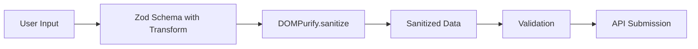

# Design Document

## Overview

Contact 폼의 XSS 공격 방지를 위한 입력 소독(sanitization) 기능을 설계합니다. 검증된 오픈소스 라이브러리 **DOMPurify**를 사용하여 사용자 입력에서 악성 스크립트를 제거합니다.

## Architecture



소독 로직은 Zod 스키마의 transform 단계에서 적용되어 검증 전에 입력을 정제합니다.

## Library Selection

### DOMPurify

- **npm**: `dompurify` (주간 다운로드 800만+)
- **특징**: XSS 공격 방지에 특화된 가장 널리 사용되는 sanitization 라이브러리
- **장점**:
  - 지속적인 보안 업데이트
  - 다양한 XSS 공격 벡터 대응
  - TypeScript 지원 (`@types/dompurify`)
  - 서버/클라이언트 모두 사용 가능

### 서버 사이드 사용

DOMPurify는 DOM API가 필요하므로 서버 환경에서는 `isomorphic-dompurify` 사용:

```typescript
import DOMPurify from 'isomorphic-dompurify';
```

## Components and Interfaces

### 1. Sanitizer Wrapper (`shared/util/sanitize.ts`)

```typescript
import DOMPurify from 'isomorphic-dompurify';

/**
 * DOMPurify를 사용한 HTML 소독
 * 모든 HTML 태그를 제거하고 텍스트만 반환
 */
export function sanitizeInput(input: string): string {
  return DOMPurify.sanitize(input, { ALLOWED_TAGS: [] });
}
```

### 2. Updated Contact Form Schema

기존 `ContactFormInputsSchema`에 sanitization transform 추가:

```typescript
import { sanitizeInput } from '@/shared/util/sanitize';

export const ContactFormInputsSchema = z.object({
  from: z.email('Invalid email'),
  subject: z
    .string()
    .min(1, 'Subject is required')
    .max(100, 'Subject length is over')
    .transform(sanitizeInput),
  message: z.string().min(1, 'Message is required').transform(sanitizeInput),
});
```

## Data Models

### DOMPurify Configuration

| Option         | Value            | Description                |
| -------------- | ---------------- | -------------------------- |
| `ALLOWED_TAGS` | `[]`             | 모든 HTML 태그 제거        |
| `KEEP_CONTENT` | `true` (default) | 태그 내 텍스트 콘텐츠 보존 |

## Correctness Properties

_A property is a characteristic or behavior that should hold true across all valid executions of a system-essentially, a formal statement about what the system should do. Properties serve as the bridge between human-readable specifications and machine-verifiable correctness guarantees._

### Property 1: HTML Tag Removal

_For any_ string containing HTML tags (including script, style, event handlers), sanitizing the string should produce output where no HTML tags remain.

**Validates: Requirements 1.1, 1.2, 1.3**

### Property 2: Safe Content Preservation

_For any_ string containing only alphanumeric characters, spaces, and common punctuation (no HTML tags), sanitizing the string should return the exact same string unchanged.

**Validates: Requirements 1.4, 2.2**

### Property 3: Idempotence

_For any_ string, sanitizing it once should produce the same result as sanitizing it multiple times: `sanitize(x) === sanitize(sanitize(x))`.

**Validates: Requirements 2.3**

## Error Handling

| Scenario             | Handling                               |
| -------------------- | -------------------------------------- |
| Empty string input   | Return empty string                    |
| Null/undefined input | Return empty string                    |
| Unicode characters   | Preserve as-is (only remove HTML tags) |
| Nested tags          | DOMPurify handles recursively          |

## Testing Strategy

### Property-Based Testing

- **Library**: fast-check (TypeScript PBT library)
- **Iterations**: 최소 100회 실행
- **Format**: 각 테스트에 `**Feature: contact-form-sanitization, Property {number}: {property_text}**` 주석 포함

### Unit Tests

- 특정 XSS 공격 패턴 테스트 (script 태그, event handlers 등)
- 빈 문자열 등 엣지 케이스
- Zod 스키마 통합 테스트

### Test File Location

- `blog/src/shared/util/sanitize.test.ts` - sanitizer 유닛 및 프로퍼티 테스트
- `blog/src/features/contact/model/contact-form.schema.test.ts` - 스키마 통합 테스트
