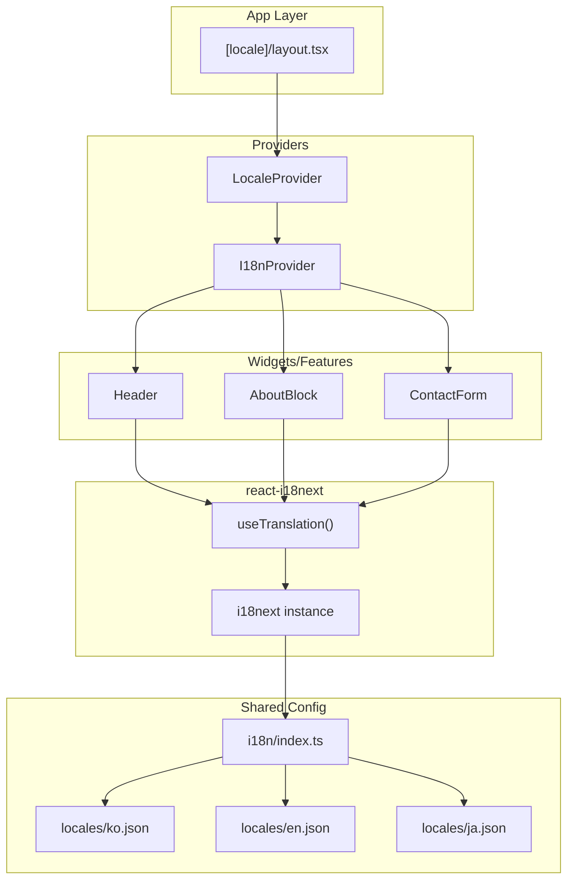

# 설계 문서

## 개요

이 설계는 react-i18next를 활용하여 블로그 애플리케이션의 UI 텍스트에 대한 다국어 지원을 구현합니다. 기존 URL 기반 locale 라우팅(`/ko`, `/en`, `/ja`)과 통합하여, 사용자가 언어를 전환할 때 모든 UI 텍스트가 해당 언어로 표시되도록 합니다.

### 핵심 설계 원칙

1. **기존 구조 활용**: 현재 `LocaleProvider`와 `useLocaleStore`를 확장하여 i18n 통합
2. **타입 안전성**: TypeScript를 활용한 번역 키 자동완성 및 오타 방지
3. **클라이언트 사이드 렌더링**: Next.js App Router의 클라이언트 컴포넌트에서 번역 처리
4. **중앙화된 번역 관리**: `shared/config/i18n` 디렉터리에 locale별 JSON 파일 구성

## 아키텍처



### 데이터 흐름

1. URL에서 locale 파라미터 추출 (`/ko`, `/en`, `/ja`)
2. `LocaleProvider`가 locale을 Zustand store에 저장
3. `I18nProvider`가 i18next 언어를 현재 locale로 동기화
4. 컴포넌트에서 `useTranslation()` 훅으로 번역 텍스트 접근
5. locale 변경 시 i18next가 자동으로 번역 업데이트

## 컴포넌트 및 인터페이스

### 1. LocaleProvider 확장

기존 `LocaleProvider`를 수정하여 i18next 인스턴스를 통합합니다. 새 파일을 만들지 않고 기존 파일을 확장하여 변경을 최소화합니다.

```typescript
// shared/providers/locale-provider.tsx (수정)
'use client';

import { I18nextProvider } from 'react-i18next';
import { useEffect } from 'react';
import i18n from '@/shared/config/i18n';
import { useLocaleStore } from '@/shared/stores/locale-store';

interface LocaleProviderProps {
  locale: LocaleType;
  children: React.ReactNode;
}

export function LocaleProvider({ locale, children }: LocaleProviderProps) {
  const setLocale = useLocaleStore((state) => state.setLocale);

  useEffect(() => {
    setLocale(locale);
    i18n.changeLanguage(locale);
  }, [locale, setLocale]);

  return <I18nextProvider i18n={i18n}>{children}</I18nextProvider>;
}
```

> **참고**: `decision-log.md`에 기록된 시행착오에 따라, 언어 설정은 URL + Zustand 조합을 유지하고 i18n 언어만 동기화합니다.

### 2. i18n 설정

```typescript
// shared/config/i18n/index.ts
import i18n from 'i18next';
import { initReactI18next } from 'react-i18next';
import ko from './locales/ko.json';
import en from './locales/en.json';
import ja from './locales/ja.json';

export const resources = { ko, en, ja } as const;

i18n.use(initReactI18next).init({
  resources: {
    ko: { translation: ko },
    en: { translation: en },
    ja: { translation: ja },
  },
  lng: 'ko',
  fallbackLng: 'ko',
  interpolation: {
    escapeValue: false,
  },
});

export default i18n;
```

### 3. 번역 키 타입 정의

```typescript
// shared/config/i18n/types.ts
import type ko from './locales/ko.json';

export type TranslationKeys = keyof typeof ko;
export type NestedTranslationKeys = FlattenKeys<typeof ko>;

// 중첩 키를 평탄화하는 유틸리티 타입
type FlattenKeys<T, Prefix extends string = ''> = T extends object
  ? {
      [K in keyof T]: T[K] extends object
        ? FlattenKeys<T[K], `${Prefix}${K & string}.`>
        : `${Prefix}${K & string}`;
    }[keyof T]
  : never;
```

## 데이터 모델

### Translation Resource 구조

```typescript
// shared/config/i18n/locales/ko.json
{
  "nav": {
    "about": "소개",
    "posts": "글",
    "contact": "연락"
  },
  "about": {
    "greeting": "안녕하세요! 👋",
    "introduction": "사용자 경험에 집중하는 프론트엔드 개발자입니다.\n직관적인 코드와 명확한 구조를 지향합니다.",
    "emailLabel": "이메일 보내기",
    "githubLabel": "GitHub 프로필 보기"
  },
  "contact": {
    "from": "보내는 분",
    "subject": "제목",
    "message": "내용",
    "placeholder": "메시지를 작성해주세요...",
    "checkRobot": "로봇 확인",
    "sending": "전송 중...",
    "submit": "보내기",
    "errors": {
      "required": "필수 항목입니다",
      "invalidEmail": "올바른 이메일 형식이 아닙니다"
    }
  }
}
```

### Zod 스키마 (검증용)

```typescript
// shared/config/i18n/schema.ts
import { z } from 'zod';

export const TranslationResourceSchema = z.object({
  nav: z.object({
    about: z.string(),
    posts: z.string(),
    contact: z.string(),
  }),
  about: z.object({
    greeting: z.string(),
    introduction: z.string(),
    emailLabel: z.string(),
    githubLabel: z.string(),
  }),
  contact: z.object({
    from: z.string(),
    subject: z.string(),
    message: z.string(),
    placeholder: z.string(),
    checkRobot: z.string(),
    sending: z.string(),
    submit: z.string(),
    errors: z.object({
      required: z.string(),
      invalidEmail: z.string(),
    }),
  }),
});

export type TranslationResource = z.infer<typeof TranslationResourceSchema>;
```

## 정확성 속성 (Correctness Properties)

_속성(property)은 시스템의 모든 유효한 실행에서 참이어야 하는 특성 또는 동작입니다. 속성은 사람이 읽을 수 있는 명세와 기계가 검증할 수 있는 정확성 보장 사이의 다리 역할을 합니다._

### Property 1: 번역 키 완전성

_모든_ 지원 locale(ko, en, ja)에 대해, 모든 필수 번역 키가 존재하고 비어있지 않은 문자열 값을 가진다.

**검증: 요구사항 1.1, 2.1, 3.1, 3.2, 3.3, 3.4**

### Property 2: 폴백 동작

_모든_ 번역 키에 대해, 특정 locale에 해당 키가 없으면 기본 locale(ko)의 값으로 폴백한다.

**검증: 요구사항 4.2**

### Property 3: 라운드트립 일관성

_모든_ 유효한 TranslationResource 객체에 대해, JSON으로 직렬화한 후 역직렬화하면 원본과 동등한 객체가 된다.

**검증: 요구사항 5.2**

## 에러 처리

### 번역 키 누락

- i18next의 `fallbackLng` 옵션으로 기본 locale(ko)로 폴백
- 개발 모드에서 콘솔 경고 출력

### 잘못된 Translation Resource

- Zod 스키마로 빌드 타임에 검증
- 필수 키 누락 시 타입 에러 발생

### 지원하지 않는 Locale

- 기존 `LocaleSchema`로 검증
- 지원하지 않는 locale은 기본값(ko)으로 리다이렉트

## 테스팅 전략

### 속성 기반 테스트 (Property-Based Testing)

- **라이브러리**: fast-check (Vitest와 통합)
- **최소 반복 횟수**: 100회

#### 테스트 대상 속성

1. **번역 키 완전성**: 모든 locale에 대해 스키마 검증 통과
2. **폴백 동작**: 누락된 키에 대해 기본 locale 값 반환
3. **라운드트립**: JSON 직렬화/역직렬화 일관성

### 유닛 테스트

- 각 locale별 번역 파일 스키마 검증
- `useTranslation` 훅 동작 확인
- locale 변경 시 번역 업데이트 확인

### 테스트 파일 위치

- `shared/config/i18n/__tests__/translation.test.ts` - 번역 리소스 테스트 (유닛 + 속성 기반)

### Property-Based 테스트 패턴

프로젝트의 기존 테스팅 컨벤션(`testing.md`)을 따릅니다:

```typescript
import fc from 'fast-check';
import { render } from '@testing-library/react';

// Arbitrary 정의
const localeArb = fc.constantFrom<LocaleType>('ko', 'en', 'ja');

// Property 테스트
fc.assert(
  fc.property(localeArb, (locale) => {
    const { unmount } = render(<Component locale={locale} />);
    // 검증 로직
    unmount(); // Property-Based 테스트에서는 명시적 unmount 필요
  }),
  { numRuns: 100 }
);
```

### 디렉터리 구조

```
shared/config/i18n/
├── index.ts              # i18n 초기화 및 설정
├── types.ts              # 번역 키 타입 정의
├── schema.ts             # Zod 스키마 (검증용)
├── locales/
│   ├── ko.json           # 한국어 번역
│   ├── en.json           # 영어 번역
│   └── ja.json           # 일본어 번역
└── __tests__/
    └── translation.test.ts
```
