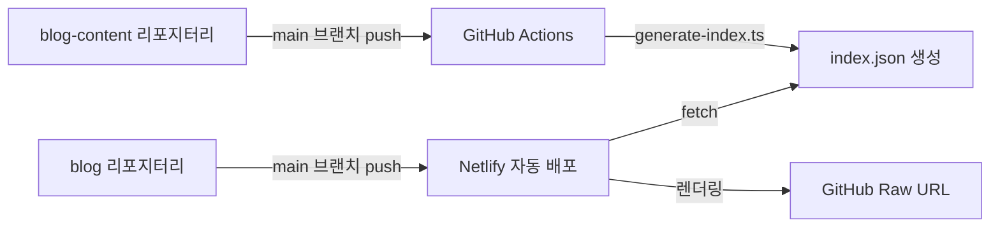

# Chanho's Dev Blog

[](https://app.netlify.com/projects/chanho-dev-blog/deploys)

## 프로젝트 소개

React 19와 TanStack Router 기반의 개인 개발 블로그입니다. **Feature-Sliced Design(FSD)** 아키텍처와 코드·콘텐츠를 분리하는 이중 리포지터리 구조를 채택하고 있습니다.

### 목적

- 개인 블로그 운영
- 모던 프론트엔드 기술스택 체득
- 기술 지식 공유 (한국어, 일본어, 영어)

### 기술 스택

| 항목       | 내용                                                   |
| ---------- | ------------------------------------------------------ |
| 프레임워크 | React 19 + TanStack Router v1 + Vite v7 + TypeScript 5 |
| 스타일링   | Tailwind CSS v4                                        |
| 국제화     | i18next                                                |
| 상태 관리  | Zustand                                                |
| 검증       | Zod v4                                                 |
| 콘텐츠     | MDX (gray-matter + rehype/remark)                      |
| 테스팅     | Vitest + Playwright + Storybook 10 + fast-check        |
| 배포       | Netlify                                                |

📖 [아키텍처 가이드](./docs/architecture.md)

## 아키텍처

- **[blog](https://github.com/chan-ok/blog)** (현재 리포지터리) — React + TanStack Router 기반 블로그 애플리케이션
- **[blog-content](https://github.com/chan-ok/blog-content)** — MDX 형식의 포스트 콘텐츠 저장소

소스 코드는 FSD 레이어 구조를 따릅니다:

```
pages → widgets → features → entities → shared
```



📖 [아키텍처 가이드](./docs/architecture.md) · [아키텍처 규칙](./docs/architecture-rules.md)

## 빠른 시작

### 사전 요구사항

| 항목    | 버전      |
| ------- | --------- |
| Node.js | 22.x 이상 |
| pnpm    | 10.x 이상 |

### 설치 및 실행

```bash
pnpm install
pnpm dev
pnpm dev:server
```

### 환경 변수 설정

아래 내용을 `.env.local` 파일로 생성하세요.

```bash
VITE_TURNSTILE_SITE_KEY="your_turnstile_site_key"
VITE_GISCUS_REPO="chan-ok/blog"
VITE_GISCUS_REPO_ID="your_repo_id"
VITE_GISCUS_CATEGORY="General"
VITE_GISCUS_CATEGORY_ID="your_category_id"
VITE_GISCUS_MAPPING="pathname"
VITE_GISCUS_REACTIONS_ENABLED="1"
VITE_GISCUS_EMIT_METADATA="0"
VITE_GISCUS_THEME="preferred_color_scheme"
VITE_GISCUS_LANG="ko"
```

> ⚠️ `.env.local`은 절대 Git에 커밋하지 마세요.

📖 [개발 가이드](./docs/development.md)

## 주요 명령어

```bash
# 개발
pnpm dev
pnpm dev:server

# 코드 품질
pnpm lint
pnpm lint:fix
pnpm format

# 테스팅
pnpm test
pnpm test:ui
pnpm e2e

# Storybook
pnpm storybook
pnpm storybook:build
```

📖 [명령어 레퍼런스](./docs/commands.md)

## 프로젝트 구조

```
blog/
├── src/
│   ├── 0-app/             # 앱 진입점 (main.tsx, globals.css)
│   ├── 1-entities/        # 비즈니스 엔티티
│   │   └── markdown/      # 마크다운 처리 (ui, util, model)
│   ├── 2-features/        # 비즈니스 기능
│   │   ├── about/         # About 페이지 기능
│   │   ├── contact/       # Contact 폼 기능
│   │   └── post/          # 포스트 목록/상세 기능
│   ├── 3-widgets/         # 복합 UI (header, footer)
│   ├── 4-pages/           # TanStack Router 페이지
│   │   ├── __root.tsx     # 루트 레이아웃
│   │   ├── index.tsx      # 홈 페이지
│   │   └── $locale/       # 다국어 라우팅
│   └── 5-shared/          # 공유 리소스
│       ├── components/    # UI 컴포넌트 (ui, toggle, turnstile, reply)
│       ├── config/        # 설정 (i18n, 환경변수 등)
│       ├── hooks/         # 커스텀 훅
│       ├── providers/     # Context Provider
│       ├── stores/        # Zustand 스토어
│       ├── types/         # 타입 정의
│       └── util/          # 유틸리티 함수
├── netlify/functions/     # 서버리스 함수 (Contact 폼 등)
├── e2e/                   # Playwright E2E 테스트
├── docs/                  # 개발 문서
└── .agents/               # AI 에이전트 설정
```

📖 [아키텍처 가이드](./docs/architecture.md)

## 개발 가이드

| 영역           | 핵심                                                    | 상세                                                  |
| -------------- | ------------------------------------------------------- | ----------------------------------------------------- |
| 코드 스타일    | Import 4단계, TypeScript strict, Tailwind 유틸리티 우선 | [code-style.md](./docs/code-style.md)                 |
| 아키텍처 규칙  | FSD 레이어 의존성, 역방향 import 금지, `@/` 경로 별칭   | [architecture-rules.md](./docs/architecture-rules.md) |
| 테스팅         | TDD (Red/Green/Refactor), Property-based, 커버리지 80%+ | [testing.md](./docs/testing.md)                       |
| 보안           | 환경변수 `VITE_*`, Zod 검증, XSS 방지, 입력 sanitize    | [security.md](./docs/security.md)                     |
| Git 워크플로우 | `main ← develop ← feature`, Worktree 병렬 작업          | [git-flow.md](./docs/git-flow.md)                     |
| 언어/커밋 규칙 | 한국어 문서·주석·커밋, 영어 코드, Conventional Commits  | [language-rules.md](./docs/language-rules.md)         |
| 안티패턴       | `any` 금지, FSD 위반, 테스트 하드코딩 금지              | [anti-patterns.md](./docs/anti-patterns.md)           |

📖 [개발 가이드](./docs/development.md)

## 기능 현황

- **Netlify 배포** — 자동 빌드 및 배포
- **다국어 지원** — URL 기반 (한국어, 일본어, 영어) + i18next UI 번역
- **MDX 렌더링** — 코드 하이라이팅 포함
- **About 페이지** — 마크다운 기반
- **Posts 페이지** — blog-content 리포지터리 연동
- **Contact 폼** — Zod 검증 + Cloudflare Turnstile + Resend 이메일
- **다크 모드** — Zustand + LocalStorage 지속성
- **언어 선택기** — URL 경로 기반 + Zustand
- **댓글 시스템** — Giscus (GitHub Discussions 기반)
- **포스트 페이지네이션** — 페이지 기반 포스트 목록
- **TanStack Query 캐싱** — API 응답 캐싱 및 재검증

## 에이전트 시스템

이 프로젝트는 멀티 에이전트 시스템을 사용하여 복잡한 기능을 개발합니다. 각 에이전트는 독립적인 Git Worktree에서 병렬로 작업하며, 결과를 안전하게 통합합니다.

| 에이전트                                                       | 역할                                |
| -------------------------------------------------------------- | ----------------------------------- |
| [master-orchestrator](./.agents/agents/master-orchestrator.md) | 작업 분석, 에이전트 조율, 결과 통합 |
| [feature-developer](./.agents/agents/feature-developer.md)     | 기능 구현 (테스트 코드 제외)        |
| [test-specialist](./.agents/agents/test-specialist.md)         | 테스트 코드 작성 및 검증            |
| [lint-formatter](./.agents/agents/lint-formatter.md)           | 코드 포맷팅 및 린트 수정            |
| [security-scanner](./.agents/agents/security-scanner.md)       | 보안 취약점 탐지 (읽기 전용)        |
| [doc-manager](./.agents/agents/doc-manager.md)                 | 문서 및 에이전트 프롬프트 관리      |
| [git-guardian](./.agents/agents/git-guardian.md)               | Git 워크플로우 관리                 |
| [github-helper](./.agents/agents/github-helper.md)             | GitHub PR/Issue 관리                |
| [tech-architect](./.agents/agents/tech-architect.md)           | 결과물 품질 검증 (읽기 전용)        |
| [retrospector](./.agents/agents/retrospector.md)               | 회고 분석 및 프롬프트 개선 제안     |

📖 [에이전트 시스템 상세](./docs/agent-system.md) · [에이전트 권한 가이드](./docs/agent-permissions.md)

## 문서

| 문서                                                          | 설명                            |
| ------------------------------------------------------------- | ------------------------------- |
| [agents.md](./docs/agents.md)                                 | AI 코딩 에이전트 가이드         |
| [agent-system.md](./docs/agent-system.md)                     | 에이전트 시스템 상세            |
| [agent-permissions.md](./docs/agent-permissions.md)           | 에이전트별 권한 분리 가이드     |
| [development.md](./docs/development.md)                       | 개발 환경 설정 및 워크플로우    |
| [architecture.md](./docs/architecture.md)                     | 프로젝트 구조 및 기술 선택 배경 |
| [architecture-rules.md](./docs/architecture-rules.md)         | FSD 아키텍처 규칙               |
| [code-style.md](./docs/code-style.md)                         | 코드 스타일 가이드              |
| [commands.md](./docs/commands.md)                             | 명령어 레퍼런스                 |
| [testing.md](./docs/testing.md)                               | 테스팅 가이드                   |
| [security.md](./docs/security.md)                             | 보안 가이드                     |
| [git-flow.md](./docs/git-flow.md)                             | Git Flow 가이드                 |
| [language-rules.md](./docs/language-rules.md)                 | 언어 및 커밋 규칙               |
| [anti-patterns.md](./docs/anti-patterns.md)                   | 안티패턴 목록                   |
| [retrospective/overview.md](./docs/retrospective/overview.md) | 프로젝트 회고 및 의사결정 로그  |

## 관련 리소스

- [Feature-Sliced Design](https://feature-sliced.design/) — 아키텍처 패턴
- [TanStack Router](https://tanstack.com/router/latest) — 라우팅
- [Vite](https://vite.dev/) — 빌드 도구
- [Tailwind CSS v4](https://tailwindcss.com/docs) — 스타일링

## License

MIT
