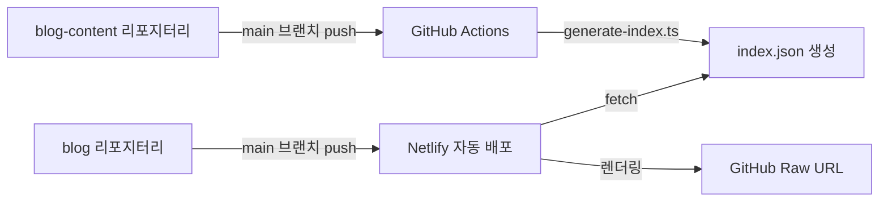

# Chanho's Dev Blog

[](https://app.netlify.com/projects/chanho-dev-blog/deploys)

## 프로젝트 소개

React 19와 TanStack Router 기반의 개인 개발 블로그로, **Feature-Sliced Design(FSD)** 아키텍처와 이중 리포지터리 구조를 특징으로 합니다.

| 항목       | 내용                                    |
| ---------- | --------------------------------------- |
| 프레임워크 | React 19 + TanStack Router v1 + Vite v7 |
| 스타일링   | Tailwind CSS v4                         |
| 국제화     | i18next                                 |
| 상태 관리  | Zustand                                 |
| 검증       | Zod v4                                  |
| 테스팅     | Vitest + Playwright + Storybook         |
| 배포       | Netlify                                 |

### 목적

- 개인용 개발 블로그 운영
- 모던한 프론트엔드 기술스택 체득
- 기술 지식 공유 (한국어, 일본어, 영어)

### 아키텍처

블로그는 두 개의 독립적인 리포지터리로 구성됩니다:

- **[blog](https://github.com/chan-ok/blog)** (현재 리포지터리) - React + TanStack Router 기반 블로그 애플리케이션
- **[blog-content](https://github.com/chan-ok/blog-content)** - MDX 형식의 포스트 콘텐츠 저장소



## 빠른 시작

### 사전 요구사항

| 도구    | 버전      | 확인 명령어 |
| ------- | --------- | ----------- |
| Node.js | 22.x 이상 | `node -v`   |
| pnpm    | 10.x 이상 | `pnpm -v`   |

### 설치 및 실행

```bash
# 의존성 설치
pnpm install

# 개발 서버 시작 (http://localhost:5173)
pnpm dev

# Netlify Functions와 함께 시작 (http://localhost:8888)
pnpm dev:server
```

### 환경 변수 설정

`.env.local` 파일을 생성하고 필요한 환경 변수를 설정합니다:

```bash
# 콘텐츠 리포지터리 (필수)
VITE_GIT_RAW_URL=https://raw.githubusercontent.com/chan-ok/blog-content/main

# Cloudflare Turnstile (Contact 폼용)
VITE_TURNSTILE_SITE_KEY=your_site_key
TURNSTILE_SECRET_KEY=your_secret_key

# Resend (이메일 발송용)
RESEND_API_KEY=re_xxxxxxxxxxxxxxxxxxxx
```

> `.env.local`은 절대 Git에 커밋하지 마세요!

## 주요 명령어

```bash
# 개발
pnpm dev              # 개발 서버 시작
pnpm dev:server       # Netlify Functions와 함께 시작
pnpm build            # 프로덕션 빌드
pnpm preview          # 프로덕션 빌드 미리보기

# 코드 품질
pnpm lint             # ESLint 실행
pnpm fmt              # Prettier 포맷팅
pnpm tsc --noEmit     # TypeScript 타입 체크

# 테스팅
pnpm test             # Vitest 테스트 실행
pnpm coverage         # 테스트 커버리지 확인
pnpm e2e:ui           # Playwright E2E 테스트 (UI 모드)

# Storybook
pnpm storybook        # Storybook 실행 (localhost:6006)
pnpm build-storybook  # Storybook 빌드
```

## 프로젝트 구조

```
blog/
├── src/
│   ├── 0-app/             # 앱 진입점
│   │   ├── main.tsx
│   │   └── globals.css
│   ├── 1-entities/        # 비즈니스 엔티티
│   │   └── markdown/
│   │       ├── ui/
│   │       ├── util/
│   │       └── model/
│   ├── 2-features/        # 비즈니스 기능
│   │   ├── about/
│   │   ├── contact/
│   │   └── post/
│   ├── 3-widgets/         # 복합 UI
│   │   ├── header.tsx
│   │   └── footer.tsx
│   ├── 4-pages/           # TanStack Router 페이지
│   │   ├── __root.tsx
│   │   ├── index.tsx
│   │   └── $locale/
│   └── 5-shared/          # 공유 리소스
│       ├── components/
│       │   ├── ui/          # 순수 UI (Button, Link, OptimizedImage)
│       │   ├── toggle/      # 토글 (locale, theme)
│       │   ├── turnstile/   # Cloudflare Turnstile
│       │   └── reply/       # Giscus 댓글
│       ├── config/
│       ├── hooks/
│       ├── providers/
│       ├── stores/
│       ├── types/
│       └── util/
├── netlify/functions/     # 서버리스 함수
├── e2e/                   # E2E 테스트
└── docs/                  # 개발 문서
```

## 문서

| 문서                                                    | 설명                                                     |
| ------------------------------------------------------- | -------------------------------------------------------- |
| **[agents.md](./docs/agents.md)**                       | AI 코딩 에이전트를 위한 필수 가이드 (코딩 규칙, 테스팅)  |
| **[agent-permissions.md](./docs/agent-permissions.md)** | 에이전트별 권한 분리 가이드                              |
| **[development.md](./docs/development.md)**             | 개발자를 위한 환경 설정 및 워크플로우 가이드             |
| **[architecture.md](./docs/architecture.md)**           | 프로젝트 구조 및 기술 선택 배경 (FSD, 콘텐츠 파이프라인) |
| **[project-log.md](./docs/project-log.md)**             | 프로젝트 이력 및 주요 의사결정 로그                      |

## 에이전트 시스템

이 프로젝트는 멀티 에이전트 시스템을 사용하여 복잡한 기능을 개발합니다. Git Worktree 기반 병렬 실행으로 안전하고 효율적인 AI 협업 개발이 가능합니다.

| 에이전트            | 역할                                |
| ------------------- | ----------------------------------- |
| master-orchestrator | 작업 분석, 에이전트 조율, 결과 통합 |
| feature-developer   | 기능 구현 (테스트 코드 제외)        |
| test-specialist     | 테스트 코드 작성 및 검증            |
| lint-formatter      | 코드 포맷팅 및 린트 수정            |
| security-scanner    | 보안 취약점 탐지 (읽기 전용)        |
| doc-manager         | 문서 및 에이전트 프롬프트 관리      |
| git-guardian        | Git 워크플로우 관리                 |
| github-helper       | GitHub PR/Issue 관리                |

자세한 내용은 [agents.md](./docs/agents.md)와 [agent-permissions.md](./docs/agent-permissions.md)를 참고하세요.

## 기능 현황

### 구현 완료

- Netlify 배포 - 자동 빌드 및 배포
- 다국어 지원 - URL 기반 (한국어, 일본어, 영어) + i18next UI 번역
- MDX 렌더링 - 코드 하이라이팅 포함
- About 페이지 - 마크다운 기반
- Posts 페이지 - blog-content 리포지터리 연동
- Contact 폼 - Zod 검증 + Turnstile + Resend
- 다크 모드 - Zustand + LocalStorage 지속성
- 언어 선택기 - URL 경로 기반 + Zustand
- 댓글 시스템 - Giscus (GitHub Discussions 기반)
- 멀티 에이전트 시스템 - Git Worktree 기반 병렬 AI 에이전트 개발
- 에이전트 권한 분리 - 최소 권한 원칙 적용

### 예정 기능

**우선순위: 높음**

- SEO 최적화 - Open Graph, Twitter Card, Sitemap
- 에러 페이지 - 404/500 커스텀 에러 페이지
- 페이지네이션 - 포스트 목록 페이지네이션 또는 무한 스크롤

**우선순위: 중간**

- 마크다운 고급화 - 코드 블록 개선 (복사, 라인넘버), TOC, Reading time
- 홈화면 디자인 개선 - Hero Section, 최신/인기 포스트
- 관련 포스트 추천 - 태그 기반
- 공유 버튼 - SNS 공유

**우선순위: 낮음**

- 검색 기능 - 클라이언트 사이드 또는 Algolia
- RSS/Atom 피드
- Analytics - Google Analytics 또는 Plausible

## 관련 리소스

### 외부 문서

- [Feature-Sliced Design](https://feature-sliced.design/) - 아키텍처 패턴
- [TanStack Router](https://tanstack.com/router/latest) - 라우팅
- [Vite](https://vite.dev/) - 빌드 도구
- [Tailwind CSS v4](https://tailwindcss.com/docs) - 스타일링

## License

MIT
