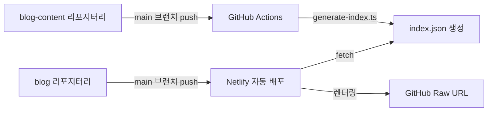

# Chanho's Dev Blog

[](https://app.netlify.com/projects/chanho-dev-blog/deploys)

## 📖 프로젝트 소개

Next.js 16 기반의 개인 개발 블로그로, **Feature-Sliced Design(FSD)** 아키텍처와 이중 리포지터리 구조를 특징으로 합니다.

| 항목       | 내용                            |
| ---------- | ------------------------------- |
| 프레임워크 | Next.js 16.0.7 + React 19.2.1   |
| 스타일링   | Tailwind CSS v4                 |
| 상태 관리  | Zustand                         |
| 테스팅     | Vitest + Playwright + Storybook |
| 배포       | Netlify                         |

### 목적

- 📚 **개인용 개발 블로그 운영**
- 🚀 **모던한 프론트엔드 기술스택 체득**
- 🌐 **기술 지식 공유** (한국어, 일본어, 영어)

### 아키텍처

블로그는 두 개의 독립적인 리포지터리로 구성됩니다:

- **[blog](https://github.com/chan-ok/blog)** (현재 리포지터리) - Next.js 16 기반 블로그 애플리케이션
- **[blog-content](https://github.com/chan-ok/blog-content)** - MDX 형식의 포스트 콘텐츠 저장소



## 🚀 빠른 시작

### 사전 요구사항

| 도구    | 버전      | 확인 명령어 |
| ------- | --------- | ----------- |
| Node.js | 20.x 이상 | `node -v`   |
| pnpm    | 9.x 이상  | `pnpm -v`   |

### 설치 및 실행

```bash
# 의존성 설치
pnpm install

# 개발 서버 시작 (http://localhost:3001)
pnpm dev

# Netlify Functions와 함께 시작 (http://localhost:8888)
pnpm dev:server
```

### 환경 변수 설정

`.env.local` 파일을 생성하고 필요한 환경 변수를 설정합니다:

```bash
# 콘텐츠 리포지터리 (필수)
NEXT_PUBLIC_GIT_RAW_URL=https://raw.githubusercontent.com/chan-ok/blog-content/main

# Cloudflare Turnstile (Contact 폼용)
NEXT_PUBLIC_TURNSTILE_SITE_KEY=your_site_key
TURNSTILE_SECRET_KEY=your_secret_key

# Resend (이메일 발송용)
RESEND_API_KEY=re_xxxxxxxxxxxxxxxxxxxx
```

> ⚠️ `.env.local`은 절대 Git에 커밋하지 마세요!

## 🛠️ 주요 명령어

```bash
# 개발
pnpm dev              # 개발 서버 시작
pnpm dev:server       # Netlify Functions와 함께 시작
pnpm build            # 프로덕션 빌드
pnpm start            # 프로덕션 서버 시작

# 코드 품질
pnpm lint             # ESLint 실행
pnpm fmt              # Prettier 포맷팅

# 테스팅
pnpm test             # Vitest 테스트 실행
pnpm coverage         # 테스트 커버리지 확인
pnpm e2e              # Playwright E2E 테스트

# Storybook
pnpm storybook        # Storybook 실행 (localhost:6006)
pnpm build-storybook  # Storybook 빌드
```

## 🗂️ 프로젝트 구조

```
blog/
├── src/
│   ├── app/           # Next.js App Router (라우팅)
│   ├── features/      # 비즈니스 기능 (about, contact, post)
│   ├── entities/      # 비즈니스 엔티티 (mdx)
│   ├── widgets/       # 복합 UI (header, footer)
│   └── shared/        # 공유 리소스 (hooks, components, config)
├── netlify/functions/ # 서버리스 함수
├── e2e/               # E2E 테스트
└── docs/              # 📚 개발 문서
```

## 📚 문서 가이드

### 필수 문서

| 문서                                          | 설명                          | 언제 읽나요?     |
| --------------------------------------------- | ----------------------------- | ---------------- |
| [빠른 시작 가이드](./docs/getting-started.md) | 개발 환경 설정 및 첫 기여     | 프로젝트 시작 시 |
| [개발 규칙](./docs/rule.md)                   | 핵심 개발 원칙 및 규칙        | 코드 작성 전     |
| [아키텍처](./docs/architecture.md)            | FSD 구조 및 콘텐츠 파이프라인 | 새 기능 개발 시  |

### 개발 가이드

| 문서                                       | 설명                                     | 언제 읽나요?      |
| ------------------------------------------ | ---------------------------------------- | ----------------- |
| [코드 스타일 가이드](./docs/code-style.md) | TypeScript, Tailwind, 컴포넌트 작성 규칙 | 코드 작성 시      |
| [테스팅 가이드](./docs/testing.md)         | Vitest, Playwright, Storybook 사용법     | 테스트 작성 시    |
| [보안 가이드](./docs/security.md)          | 환경 변수, XSS 방지, 봇 방지             | 보안 관련 작업 시 |
| [Git 가이드](./docs/git-guide.md)          | 커밋 메시지, 브랜치 전략                 | 커밋 전           |

### 운영 가이드

| 문서                                         | 설명                           | 언제 읽나요?    |
| -------------------------------------------- | ------------------------------ | --------------- |
| [배포 가이드](./docs/deployment.md)          | Netlify 배포 및 환경 변수 설정 | 배포 시         |
| [Kiro Hooks 가이드](./docs/hooks-guide.md)   | AI 자동화 훅 사용법            | Kiro 사용 시    |
| [AI 검증 체크리스트](./docs/ai-checklist.md) | AI 답변 검증 방법              | AI 코드 적용 전 |

### 프로젝트 관리

| 문서                                       | 설명                   |
| ------------------------------------------ | ---------------------- |
| [구현 계획](./docs/implementation-plan.md) | 기술 스택 및 진행 상황 |
| [변경 로그](./docs/changelog.md)           | 버전별 변경 내역       |
| [할 일 목록](./docs/todo.md)               | 남은 작업 목록         |

## 🌏 기능 현황

### ✅ 구현 완료

- 🚀 **Netlify 배포** - 자동 빌드 및 배포
- 🌐 **다국어 지원** - URL 기반 (한국어, 일본어, 영어)
- 🎨 **MDX 렌더링** - 코드 하이라이팅 포함
- 📝 **About 페이지** - 마크다운 기반
- 📰 **Posts 페이지** - blog-content 리포지터리 연동
- 💬 **Contact 폼** - Zod 검증 + Turnstile + Resend
- 🌙 **다크 모드** - Zustand + LocalStorage 지속성
- 🔍 **언어 선택기** - 쿠키 기반 (NEXT_LOCALE)

### 📋 예정 기능

- 📚 **마크다운 고급화** - 코드 블록 개선, TOC, Reading time
- 🏠 **홈화면 디자인 개선** - 최신/인기 포스트, 구독 폼
- 🔎 **검색 기능** - 클라이언트 사이드 또는 Algolia
- 💬 **댓글 시스템** - utterances/giscus

## 🤖 Kiro Agent Hooks

프로젝트에는 개발 워크플로우를 자동화하는 Agent Hooks가 설정되어 있습니다.

| 훅                    | 역할                      | 트리거                      |
| --------------------- | ------------------------- | --------------------------- |
| 🎨 Auto Storybook     | 컴포넌트 스토리 자동 생성 | `src/**/*.tsx` 파일 생성 시 |
| ✅ Code Quality Check | 포맷팅, 린트, 타입 체크   | 수동 실행 (커밋 전 권장)    |
| 📝 Auto Documentation | 문서 자동 업데이트        | 수동 실행 (기능 완성 후)    |

자세한 사용법은 [Kiro Hooks 가이드](./docs/hooks-guide.md)를 참고하세요.

## 🔗 관련 리소스

### 외부 문서

- [Feature-Sliced Design](https://feature-sliced.design/) - 아키텍처 패턴
- [Next.js 문서](https://nextjs.org/docs) - 프레임워크
- [Tailwind CSS v4](https://tailwindcss.com/docs) - 스타일링

## 📄 License

MIT
