# Chanho's Dev Blog

[](https://app.netlify.com/projects/chanho-dev-blog/deploys)

## 📖 프로젝트 소개

개인용 개발 블로그 운영을 위한 환경입니다.

### 목적

- 📚 **개인용 개발 블로그 운영**
- 🚀 **모던한 프론트엔드 기술스택 체득**
- 🌐 **기술 지식 공유**

### 아키텍처

블로그는 두 개의 독립적인 리포지터리로 구성됩니다:

- **[blog](https://github.com/chan-ok/blog)** (현재 리포지터리) - Next.js 16 기반 블로그 애플리케이션
- **[blog-content](https://github.com/chan-ok/blog-content)** - MDX 형식의 포스트 콘텐츠 저장소

#### 배포 및 포스팅 워크플로우

```mermaid
graph LR
    A[blog 리포지터리] -->|main 브랜치 push| B[Netlify 자동 배포]
    C[blog-content 리포지터리] -->|main 브랜치 push| D[GitHub Actions]
    D -->|generate-index.ts| E[index.json 생성]
    B -->|fetch| E
    B -->|렌더링| F[GitHub Raw URL]
```



1. **블로그 개발**: `blog` 리포지터리의 `main` 브랜치에 push 시 Netlify에 자동 배포
2. **포스트 작성**: `blog-content` 리포지터리의 `main` 브랜치에 push 시 GitHub Actions가 인덱싱 파일(`index.json`) 자동 생성
3. **콘텐츠 렌더링**: 블로그에서 `blog-content`의 인덱싱 파일을 참조하여:
   - 페이지네이션 처리
   - 태그 필터링
   - GitHub Raw URL을 통한 마크다운 렌더링

## 🚀 기술 스택

### Core

- **Next.js 16** - React 프레임워크
- **React 19** (+ React Compiler) - UI 라이브러리
- **TypeScript 5** - 타입 안전성

### Styling & UI

- **Tailwind CSS v4** - 유틸리티 CSS 프레임워크
- **Base UI Components** - HeadlessUI 컴포넌트

### Content

- **MDX** - 마크다운 + JSX
- **next-mdx-remote-client** - 원격 MDX 렌더링
- **rehype-highlight** - 코드 하이라이팅
- **remark-gfm** - GitHub Flavored Markdown

### Form & Validation

- **Zod v4** - 스키마 검증
- **Cloudflare Turnstile** - 봇 방지
- **Resend** - 이메일 전송

### Testing

- **Vitest** - 유닛 테스트
- **Playwright** - E2E 테스트
- **Testing Library** - 컴포넌트 테스트
- **Storybook** (+ Chromatic) - UI 컴포넌트 문서화

### Code Quality

- **ESLint 9** - 린터
- **Prettier** - 포맷터
- **Husky** - Git hooks
- **lint-staged** - Pre-commit 린팅

## 📦 Getting Started

의존성 설치:

```bash
pnpm install
```

개발 서버 실행:

```bash
# http://localhost:3000
pnpm dev
```

프론트엔드와 Netlify Functions를 함께 실행:

```bash
# http://localhost:8888
pnpm dev:server
```

## 🛠️ Available Scripts

```bash
pnpm dev              # 개발 서버 시작
pnpm dev:server       # Netlify Functions와 함께 개발 서버 시작
pnpm build            # 프로덕션 빌드
pnpm start            # 프로덕션 서버 시작
pnpm lint             # ESLint 실행
pnpm fmt              # Prettier 포맷팅
pnpm test             # Vitest 테스트 실행
pnpm coverage         # 테스트 커버리지 확인
pnpm e2e              # Playwright E2E 테스트
pnpm storybook        # Storybook 실행
pnpm build-storybook  # Storybook 빌드
```

## 🌏 기능 현황

### ✅ 구현 완료

- 🚀 **Netlify 배포**
- 🌐 **URL 기반 다국어 지원** (한국어, 일본어, 영어)
- 🎨 **MDX 렌더링** (코드 하이라이팅 포함)
- 🔗 **콘텐츠 파이프라인** (GitHub Raw URL 기반 원격 MDX 렌더링)
- 📝 **About 페이지** (마크다운 기반)
- 📰 **Posts 페이지** (blog-content 리포지터리 연동)
- 💬 **Contact 폼** (Zod 검증 + Turnstile + Resend)

### 📋 예정 기능

- 🌙 **다크 모드**
  - 최초 시스템 설정 기반 인식
  - SessionStorage에 사용자 선택 보존
  - Zustand를 활용한 상태 관리
- 📚 **마크다운 고급화**
  - 코드 블록 개선
  - TOC (Table of Contents)
  - Reading time 표시
- 🔍 **언어 선택기**
  - 최초 브라우저 설정 기반 인식
  - LocalStorage에 사용자 선택 보존
  - Zustand를 활용한 상태 관리
- 🏠 **홈화면 디자인 개선**
  - 최신 포스트 카드
  - 인기 포스트
  - 구독 폼

## 📚 Documentation

### 핵심 문서

- [아키텍처 가이드](./docs/ARCHITECTURE.md) - 프로젝트 구조와 설계 결정
- [배포 가이드](./docs/DEPLOYMENT.md) - 배포 프로세스 및 환경 설정
- [테스팅 가이드](./docs/TESTING.md) - 테스트 전략 및 베스트 프랙티스

### 개발 문서

- [절대 규칙](./docs/ABSOLUTE-RULE.md)
- [기술 스택 및 구현 계획](./docs/IMPLEMENTATION-PLAN.md)
- [AI 에이전트 체크리스트](./docs/AI-VALIDATION-CHECKLIST.md)
- [개발 TODO](./docs/TODO.md)
- [변경 이력](./docs/CHANGELOG.md)

## 📄 License

MIT
