```mermaid
graph LR
    A[blog 리포지터리] -->|main 브랜치 push| B[Netlify 자동 배포]
    C[blog-content 리포지터리] -->|main 브랜치 push| D[GitHub Actions]
    D -->|generate-index.ts| E[index.json 생성]
    B -->|fetch| E
    B -->|렌더링| F[GitHub Raw URL]
```

# Chanho's Dev Blog

[](https://app.netlify.com/projects/chanho-dev-blog/deploys)

## 📖 프로젝트 소개

Next.js 16 기반의 개인 개발 블로그로, **Feature-Sliced Design(FSD)** 아키텍처와 이중 리포지터리 구조를 특징으로 합니다.

| 항목       | 내용                            |
| ---------- | ------------------------------- |
| 프레임워크 | Next.js 16.0.10 + React 19.2.3  |
| 스타일링   | Tailwind CSS v4                 |
| 상태 관리  | Zustand                         |
| 테스팅     | Vitest + Playwright + Storybook |
| 배포       | Netlify                         |

### 목적

- 📚 **개인용 개발 블로그 운영**
- 🚀 **모던한 프론트엔드 기술스택 체득**
- 🌐 **기술 지식 공유** (한국어, 일본어, 영어)

### 아키텍처

블로그는 두 개의 독립적인 리포지터리로 구성됩니다:

- **[blog](https://github.com/chan-ok/blog)** (현재 리포지터리) - Next.js 16 기반 블로그 애플리케이션
- **[blog-content](https://github.com/chan-ok/blog-content)** - MDX 형식의 포스트 콘텐츠 저장소



## 🚀 빠른 시작

### 사전 요구사항

| 도구    | 버전      | 확인 명령어 |
| ------- | --------- | ----------- |
| Node.js | 22.x 이상 | `node -v`   |
| pnpm    | 10.x 이상 | `pnpm -v`   |

### 설치 및 실행

```bash
# 의존성 설치
pnpm install

# 개발 서버 시작 (http://localhost:3000)
pnpm dev

# Netlify Functions와 함께 시작 (http://localhost:8888)
pnpm dev:server
```

### 환경 변수 설정

`.env.local` 파일을 생성하고 필요한 환경 변수를 설정합니다:

```bash
# 콘텐츠 리포지터리 (필수)
NEXT_PUBLIC_GIT_RAW_URL=https://raw.githubusercontent.com/chan-ok/blog-content/main

# Cloudflare Turnstile (Contact 폼용)
NEXT_PUBLIC_TURNSTILE_SITE_KEY=your_site_key
TURNSTILE_SECRET_KEY=your_secret_key

# Resend (이메일 발송용)
RESEND_API_KEY=re_xxxxxxxxxxxxxxxxxxxx
```

> ⚠️ `.env.local`은 절대 Git에 커밋하지 마세요!

## 🛠️ 주요 명령어

```bash
# 개발
pnpm dev              # 개발 서버 시작
pnpm dev:server       # Netlify Functions와 함께 시작
pnpm build            # 프로덕션 빌드
pnpm start            # 프로덕션 서버 시작

# 코드 품질
pnpm lint             # ESLint 실행
pnpm fmt              # Prettier 포맷팅

# 테스팅
pnpm test             # Vitest 테스트 실행
pnpm coverage         # 테스트 커버리지 확인
pnpm e2e              # Playwright E2E 테스트

# Storybook
pnpm storybook        # Storybook 실행 (localhost:6006)
pnpm build-storybook  # Storybook 빌드
```

## 🗂️ 프로젝트 구조

```
blog/
├── src/
│   ├── app/           # Next.js App Router (라우팅)
│   ├── features/      # 비즈니스 기능 (about, contact, post)
│   ├── entities/      # 비즈니스 엔티티 (markdown)
│   ├── widgets/       # 복합 UI (header, footer)
│   └── shared/        # 공유 리소스
│       ├── components/  # 복합 컴포넌트 (유기체 이상)
│       │   ├── toggle/    # 토글 (locale, theme)
│       │   ├── turnstile/ # Cloudflare Turnstile
│       │   └── ui/        # 순수 UI (원자, 분자)
│       ├── config/      # 설정 (API 등)
│       ├── hooks/       # 커스텀 훅
│       ├── providers/   # Context providers
│       ├── stores/      # Zustand stores
│       └── types/       # TypeScript 타입
├── netlify/functions/ # 서버리스 함수
├── e2e/               # E2E 테스트
└── docs/              # 📚 개발 문서
```

## 📚 문서

| 문서                                          | 설명                                                     |
| --------------------------------------------- | -------------------------------------------------------- |
| **[agents.md](./docs/agents.md)**             | AI 코딩 에이전트를 위한 필수 가이드 (코딩 규칙, 테스팅)  |
| **[development.md](./docs/development.md)**   | 개발자를 위한 환경 설정 및 워크플로우 가이드             |
| **[architecture.md](./docs/architecture.md)** | 프로젝트 구조 및 기술 선택 배경 (FSD, 콘텐츠 파이프라인) |
| **[project-log.md](./docs/project-log.md)**   | 프로젝트 이력 및 주요 의사결정 로그                      |

## 🌏 기능 현황

### ✅ 구현 완료

- 🚀 **Netlify 배포** - 자동 빌드 및 배포
- 🌐 **다국어 지원** - URL 기반 (한국어, 일본어, 영어) + i18next UI 번역
- 🎨 **MDX 렌더링** - 코드 하이라이팅 포함
- 📝 **About 페이지** - 마크다운 기반
- 📰 **Posts 페이지** - blog-content 리포지터리 연동
- 💬 **Contact 폼** - Zod 검증 + Turnstile + Resend
- 🌙 **다크 모드** - Zustand + LocalStorage 지속성
- 🔍 **언어 선택기** - URL 경로 기반 + Zustand
- 💬 **댓글 시스템** - Giscus (GitHub Discussions 기반)

### 📋 예정 기능

- 📚 **마크다운 고급화** - 코드 블록 개선, TOC, Reading time
- 🏠 **홈화면 디자인 개선** - 최신/인기 포스트, 구독 폼
- 🔎 **검색 기능** - 클라이언트 사이드 또는 Algolia

## 🔗 관련 리소스

### 외부 문서

- [Feature-Sliced Design](https://feature-sliced.design/) - 아키텍처 패턴
- [Next.js 문서](https://nextjs.org/docs) - 프레임워크
- [Tailwind CSS v4](https://tailwindcss.com/docs) - 스타일링

## 📄 License

MIT
