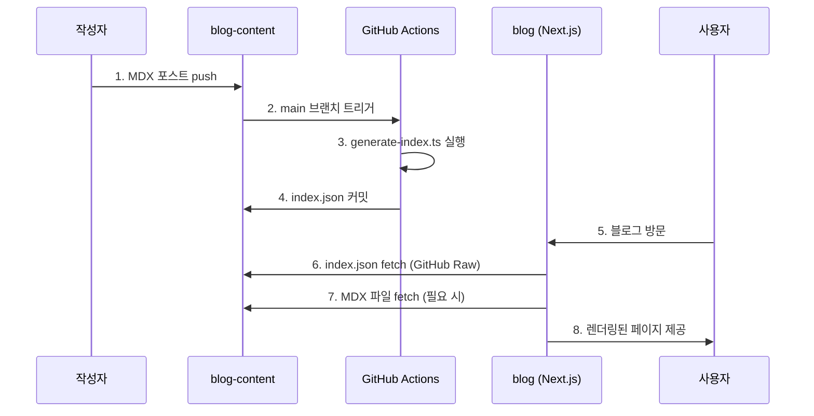
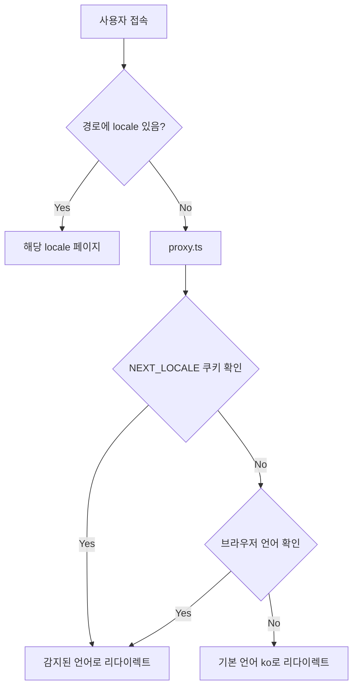

# 아키텍처 문서

## 개요

이 프로젝트는 Next.js 16 기반의 개인 개발 블로그로, **Feature-Sliced Design(FSD)** 아키텍처 패턴을 따릅니다. 콘텐츠와 코드를 분리하여 관리하는 독립적인 리포지터리 구조를 채택하고 있습니다.

## 리포지터리 구조

### 분리된 리포지터리 전략

```
┌─────────────────────┐         ┌──────────────────────┐
│   blog              │         │  blog-content        │
│   (Next.js App)     │ ◄─────  │  (MDX Contents)      │
│                     │  fetch  │                      │
│   - UI/UX           │         │  - Posts (ko/ja/en)  │
│   - 렌더링           │         │  - About pages       │
│   - 배포             │         │  - index.json        │
└─────────────────────┘         └──────────────────────┘
         │                                │
         │ push to main                   │ push to main
         ▼                                ▼
  ┌─────────────┐                 ┌──────────────────┐
  │  Netlify    │                 │  GitHub Actions  │
  │  배포        │                 │  인덱싱 생성      │
  └─────────────┘                 └──────────────────┘
```

### 리포지터리 역할

#### blog (현재 리포지터리)

- **역할**: 블로그 애플리케이션 (UI, 렌더링, 비즈니스 로직)
- **기술**: Next.js 16.0.10, React 19.2.3, TypeScript, Tailwind CSS
- **배포**: Netlify (main 브랜치 자동 배포)

#### blog-content (콘텐츠 리포지터리)

- **역할**: MDX 포스트 및 정적 콘텐츠 저장
- **구조**: 다국어 콘텐츠 (ko, ja, en) 폴더별 관리
- **자동화**: GitHub Actions로 `index.json` 자동 생성

## 프로젝트 디렉토리 구조

### Feature-Sliced Design (FSD) 레이어

```
src/
├── app/                    # 🗂️ Next.js App Router (라우팅)
│   ├── [locale]/          # 다국어 라우팅
│   ├── globals.css
│   └── layout.tsx
│
├── features/              # 🎯 비즈니스 기능 (Feature Layer)
│   ├── about/            # About 페이지 관련 로직
│   │   ├── model/        # 데이터 모델
│   │   ├── ui/           # UI 컴포넌트
│   │   └── util/         # 유틸리티
│   ├── contact/          # Contact 폼 기능
│   │   ├── model/        # 데이터 모델
│   │   ├── ui/           # UI 컴포넌트
│   │   └── util/         # 유틸리티
│   └── post/             # 포스트 관련 기능
│       ├── ui/           # 포스트 UI 컴포넌트
│       └── util/         # 포스트 유틸리티
│
├── entities/              # 📦 비즈니스 엔티티 (Entity Layer)
│   └── markdown/         # 마크다운 렌더링 엔티티
│
├── widgets/               # 🧩 복합 UI 컴포넌트 (Widget Layer)
│   ├── footer.tsx        # 푸터
│   └── header.tsx        # 헤더
│
├── shared/                # 🛠️ 공유 리소스 (Shared Layer)
│   ├── components/       # 독립적인 복합 컴포넌트 (Atomic Design: 유기체 이상)
│   │   ├── toggle/       # 토글 컴포넌트 (locale, theme) - 상태/로직 포함
│   │   ├── turnstile/    # Cloudflare Turnstile - 외부 서비스 연동
│   │   └── ui/           # 순수 UI 컴포넌트 (Atomic Design: 원자, 분자)
│   │       └── button.tsx  # Button - 기능 없는 프레젠테이션 컴포넌트
│   ├── config/           # 설정 (API 등)
│   │   └── api/          # API 설정
│   ├── hooks/            # 커스텀 훅 (useBreakpoint, useResize 등)
│   ├── providers/        # Context providers (theme-provider, locale-provider)
│   ├── stores/           # Zustand stores (theme-store, locale-store)
│   └── types/            # 공통 타입 정의
│
└── proxy.ts              # 언어 감지 프록시
```

### FSD 레이어 규칙

#### 1️⃣ App Layer (라우팅)

- Next.js의 파일 기반 라우팅
- 페이지 컴포넌트는 최소한의 로직만 포함
- 비즈니스 로직은 하위 레이어에 위임

#### 2️⃣ Features Layer (기능)

- 독립적인 비즈니스 기능 단위
- `api/`, `ui/`, `util/` 서브 디렉토리 구조
- 다른 feature에 의존하지 않음
- entities와 shared만 import 가능

#### 3️⃣ Entities Layer (엔티티)

- 비즈니스 도메인 엔티티
- 재사용 가능한 도메인 로직
- shared만 import 가능

#### 4️⃣ Widgets Layer (위젯)

- 복합 UI 컴포넌트 (여러 features 조합)
- Header, Footer 같은 레이아웃 컴포넌트
- features, entities, shared import 가능

#### 5️⃣ Shared Layer (공유)

- 어디서든 사용 가능한 공통 코드
- 다른 레이어에 의존하지 않음
- 유틸리티, 타입, 기본 UI 컴포넌트

**components 디렉토리 구조 (Atomic Design 기반)**:

| 디렉토리         | 설명                                    | 예시                 |
| ---------------- | --------------------------------------- | -------------------- |
| `components/`    | 독립적인 복합 컴포넌트 (유기체 이상)    | toggle, turnstile    |
| `components/ui/` | 순수 프레젠테이션 컴포넌트 (원자, 분자) | Button, Input, Badge |

- **components/**: 상태 관리, 외부 서비스 연동 등 로직을 포함하는 컴포넌트
- **components/ui/**: 기능이 없는 순수 UI 컴포넌트 (props만으로 렌더링)

## 콘텐츠 파이프라인

### 데이터 흐름



### index.json 구조

```json
[
  {
    "id": "post-slug",
    "title": "포스트 제목",
    "createdAt": "2025-12-06T00:00:00.000Z",
    "updatedAt": "2025-12-06T00:00:00.000Z",
    "tags": ["tag1", "tag2"],
    "published": true,
    "path": "/posts/post-slug"
  }
]
```

### MDX 렌더링 전략

1. **목록 페이지**: `index.json`만 fetch하여 메타데이터 표시
2. **상세 페이지**: GitHub Raw URL로 MDX 파일 fetch
3. **렌더링**: `next-mdx-remote-client`로 런타임 렌더링
4. **캐싱**: Next.js의 fetch cache 활용

## 국제화 (i18n)

### URL 기반 라우팅

```
/ko/posts/example    # 한국어
/ja/posts/example    # 일본어
/en/posts/example    # 영어
```

### 언어 감지 프로세스



### 콘텐츠 구조 (blog-content)

```
blog-content/
├── ko/
│   ├── posts/
│   ├── about.md
│   └── index.json (자동 생성)
├── ja/
│   ├── posts/
│   ├── about.md
│   └── index.json (자동 생성)
└── en/
    ├── posts/
    ├── about.md
    └── index.json (자동 생성)
```

## 주요 기술 결정

### 1. 리포지터리 분리

**결정**: blog와 blog-content 분리

**이유**:

- 콘텐츠 작성과 코드 개발의 독립성
- 배포 파이프라인 분리 (콘텐츠 수정 시 전체 재배포 불필요)
- Git 히스토리 분리로 관리 용이성 증대

### 2. next-mdx-remote-client 채택

**결정**: 빌드 타임 MDX 대신 런타임 렌더링

**이유**:

- 콘텐츠가 외부 리포지터리에 있어 빌드 타임 접근 불가
- 동적 콘텐츠 로딩 가능
- 캐싱 전략으로 성능 보완

### 3. FSD 아키텍처

**결정**: Feature-Sliced Design 패턴 채택

**이유**:

- 확장 가능한 구조
- 명확한 의존성 방향
- 팀 협업 시 충돌 최소화
- 기능 단위 재사용 용이

### 4. URL 기반 i18n

**결정**: 쿠키/세션 대신 URL 경로로 언어 관리

**이유**:

- SEO 친화적
- 링크 공유 시 언어 유지
- CDN 캐싱 효율적
- 명확한 언어 컨텍스트
- `NEXT_LOCALE` 쿠키를 통한 언어 설정 영속성 (proxy.ts에서 처리)

## 성능 최적화 전략

### 1. React Compiler

- React 19의 자동 최적화 활용
- 수동 메모이제이션 최소화

### 2. 폰트 최적화

- Google Fonts의 `preload: true` 설정
- 서브셋 로딩 (필요한 문자만)

### 3. 이미지 최적화

- `next/image` 사용
- WebP/AVIF 자동 변환
- Lazy loading

### 4. 코드 스플리팅

- 라우트 기반 자동 분할
- 동적 import로 초기 번들 최소화

### 5. 데이터 캐싱

- Next.js fetch cache
- index.json 캐싱으로 빌드 시간 단축

## 보안 고려사항

### 1. XSS 방지

- MDX 렌더링 시 sanitization
- Contact 폼 입력 검증 (Zod)

### 2. 봇 방지

- Cloudflare Turnstile 통합
- Rate limiting (Netlify Functions)

### 3. 환경 변수 관리

- 민감 정보는 서버 사이드만 접근
- `NEXT_PUBLIC_*` 프리픽스 최소화

## 확장성 고려사항

### 향후 확장 가능 영역

1. **다크 모드**: Tailwind 전략 (완료)
2. **검색 기능**: 클라이언트 사이드 검색 또는 Algolia 연동
3. **댓글 시스템**: giscus 통합
4. **Analytics**: Google Analytics 또는 Plausible
5. **AI 기능**: Gemini API 연동 (썸네일, 요약, 태그 생성)

### 스케일링 전략

- **CDN**: Netlify의 글로벌 CDN 활용
- **ISR**: 필요 시 Incremental Static Regeneration 도입
- **DB**: 필요 시 조회수, 좋아요 등을 위한 경량 DB 추가 (Supabase, PlanetScale)

## Kiro Steering 규칙

프로젝트의 AI 협업을 위한 steering 규칙이 `.kiro/steering/` 디렉토리에 정의되어 있습니다.

| 파일           | 역할                                          |
| -------------- | --------------------------------------------- |
| `product.md`   | 제품 개요, 아키텍처, 주요 기능, 과거 시행착오 |
| `structure.md` | FSD 아키텍처, 디렉토리 구조, 파일 명명 규칙   |
| `tech.md`      | 기술 스택, 주요 명령어, 기술 선택 시 주의사항 |

각 steering 파일에는 **과거 시행착오** 섹션이 포함되어 있어, AI가 동일한 실수를 반복하지 않도록 가이드합니다.

## 관련 문서

- [의사결정 로그](./decision-log.md) - 인간-AI 협업 의사결정 추적
- [개발 규칙](./rule.md) - 핵심 개발 원칙
- [코드 스타일 가이드](./code-style.md) - 코드 작성 규칙
- [배포 가이드](./deployment.md) - Netlify 배포 설정

---

> 📖 전체 문서 목록은 [문서 홈](../README.md)을 참고하세요.
