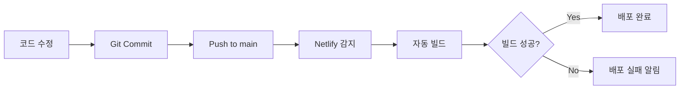

# 배포 가이드

## 개요

이 문서는 블로그 프로젝트의 배포 프로세스, 환경 설정, 그리고 운영 가이드를 다룹니다.

## 배포 플랫폼

### Netlify

프로젝트는 [Netlify](https://www.netlify.com/)를 통해 배포됩니다.

- **배포 URL**: https://chanho.dev (또는 커스텀 도메인)
- **배포 트리거**: `blog` 리포지터리의 `main` 브랜치 push
- **빌드 플러그인**: [@netlify/plugin-nextjs](https://github.com/netlify/next-runtime)

## 환경 변수

### 필수 환경 변수

프로젝트가 정상적으로 작동하려면 다음 환경 변수들이 설정되어야 합니다:

#### 1. Cloudflare Turnstile (봇 방지)

```bash
# 클라이언트 사이드 (공개)
NEXT_PUBLIC_TURNSTILE_SITE_KEY=your_site_key_here

# 서버 사이드 (비공개)
TURNSTILE_SECRET_KEY=your_secret_key_here
```

**획득 방법**:

1. [Cloudflare Dashboard](https://dash.cloudflare.com/)에서 Turnstile 섹션으로 이동
2. 새 사이트 생성
3. Site Key와 Secret Key를 복사

#### 2. Resend (이메일 발송)

```bash
# 서버 사이드 (비공개)
RESEND_API_KEY=re_xxxxxxxxxxxxxxxxxxxx
```

**획득 방법**:

1. [Resend](https://resend.com/)에 가입
2. API Keys 섹션에서 새 키 생성
3. 키를 복사

**추가 설정**:

- Resend에서 발신자 이메일 도메인 검증 필요
- `netlify/functions/mail.mts`의 `from` 필드를 검증된 이메일로 수정

#### 3. 콘텐츠 리포지터리 URL

```bash
# 클라이언트 사이드 (공개)
NEXT_PUBLIC_GIT_RAW_URL=https://raw.githubusercontent.com/chan-ok/blog-content/main
```

**설정 방법**:

- `blog-content` 리포지터리의 GitHub Raw URL
- 기본값: `https://raw.githubusercontent.com/chan-ok/blog-content/main`

#### 4. Netlify 자동 환경 변수

다음 변수들은 Netlify가 자동으로 제공합니다:

```bash
URL                    # 프로덕션 URL (예: https://chanho-dev-blog.netlify.app)
DEPLOY_URL             # 현재 배포의 URL (preview 포함)
API_BASE_URL           # (선택) 커스텀 API 베이스 URL
```

### 환경 변수 설정 방법

#### Netlify Dashboard에서 설정

1. Netlify 사이트 대시보드로 이동
2. **Site settings** → **Environment variables** 클릭
3. **Add a variable** 클릭
4. Key와 Value 입력
5. **Save** 클릭

#### Netlify CLI로 설정

```bash
# 환경 변수 설정
netlify env:set VARIABLE_NAME "value"

# 환경 변수 목록 확인
netlify env:list

# 특정 환경 변수 확인
netlify env:get VARIABLE_NAME
```

#### 로컬 개발용 .env.local

로컬 개발 시에는 `.env.local` 파일을 생성하여 환경 변수를 설정합니다:

```bash
# .env.local (Git에 커밋하지 말 것!)

# Cloudflare Turnstile
NEXT_PUBLIC_TURNSTILE_SITE_KEY=your_site_key
TURNSTILE_SECRET_KEY=your_secret_key

# Resend
RESEND_API_KEY=re_xxxxxxxxxxxxxxxxxxxx

# 콘텐츠 리포지터리
NEXT_PUBLIC_GIT_RAW_URL=https://raw.githubusercontent.com/사용자명/blog-content/main
```

> **⚠️ 주의**: `.env.local` 파일은 절대 Git에 커밋하지 마세요! `.gitignore`에 이미 포함되어 있습니다.

## 배포 설정 (netlify.toml)

### 현재 설정

```toml
[dev]
  port = 8888
  targetPort = 3001
  functions = "netlify/functions"

[build]
  command = "pnpm build"
  publish = ".next"

[[redirects]]
  from   = "/api/*"
  to     = "/.netlify/functions/:splat"
  status = 200

[[plugins]]
  package = "@netlify/plugin-nextjs"
```

### 설정 설명

#### [dev]

- **port**: Netlify Dev 로컬 서버 포트 (8888)
- **targetPort**: Next.js 개발 서버 포트 (3001)
- **functions**: Netlify Functions 디렉토리

#### [build]

- **command**: 빌드 명령어 (`pnpm build`)
- **publish**: 빌드 결과물 디렉토리 (`.next`)

#### [[redirects]]

- `/api/*` 요청을 Netlify Functions로 리다이렉트
- Contact 폼의 이메일 전송에 사용

#### [[plugins]]

- Next.js 애플리케이션을 위한 Netlify 플러그인

## 배포 프로세스

### 자동 배포 (권장)



**단계**:

1. 로컬에서 코드 수정 및 테스트
2. `git commit -m "설명"`
3. `git push origin main`
4. Netlify가 자동으로 감지하여 빌드 및 배포

### 수동 배포

```bash
# Netlify CLI로 수동 배포
pnpm build
netlify deploy --prod
```

### Preview 배포

PR(Pull Request) 생성 시 자동으로 preview 배포가 생성됩니다:

- PR마다 고유한 preview URL 발급
- `main`에 머지 전 테스트 가능
- 코멘트에 자동으로 preview URL 링크

## Netlify Functions

### 배포된 Functions

#### `mail` Function

- **경로**: `/.netlify/functions/mail`
- **API 엔드포인트**: `/api/mail` (redirect 설정)
- **역할**: Contact 폼 이메일 발송
- **소스**: `netlify/functions/mail.mts`

**요청 형식**:

```typescript
POST /api/mail
Content-Type: application/json

{
  "from": "사용자 이메일",
  "subject": "제목",
  "message": "메시지 내용",
  "turnstileToken": "Turnstile 토큰"
}
```

**응답**:

```typescript
// 성공
{
  "status": "sent",
  "resendId": "resend_id"
}

// 실패
{
  "error": "에러 메시지"
}
```

### Functions 로컬 테스트

```bash
# Netlify Dev로 Functions 함께 실행
pnpm dev:server

# 또는
netlify dev
```

로컬에서 `http://localhost:8888/api/mail`로 테스트 가능합니다.

## 빌드 최적화

### 빌드 시간 단축

1. **캐싱 활용**
   - Netlify는 자동으로 `node_modules` 캐싱
   - Next.js 빌드 캐시 활용

2. **의존성 최적화**

   ```bash
   # 불필요한 의존성 제거
   pnpm prune
   ```

3. **빌드 로그 확인**
   - Netlify Dashboard에서 빌드 로그 확인
   - 느린 빌드 단계 식별 및 최적화

## 모니터링 및 로그

### Netlify Dashboard

1. **배포 상태 확인**
   - Site overview에서 최근 배포 목록
   - 각 배포의 로그 및 상태 확인

2. **Functions 로그**
   - Functions 탭에서 실행 로그 확인
   - 에러 및 성능 모니터링

3. **Analytics** (옵션)
   - Netlify Analytics 활성화 시 트래픽 분석
   - 또는 Google Analytics 연동

### 에러 추적

#### 빌드 에러

- Netlify 대시보드에서 빌드 로그 확인
- 일반적인 원인:
  - 환경 변수 누락
  - TypeScript 타입 에러
  - 의존성 문제

#### 런타임 에러

- Functions 로그 확인
- 브라우저 개발자 도구 Console
- Sentry 같은 에러 트래킹 도구 연동 고려

## 배포 전 체크리스트

### 코드 변경 후

- [ ] 로컬에서 테스트 완료 (`pnpm dev`)
- [ ] 빌드 성공 확인 (`pnpm build`)
- [ ] Lint 통과 (`pnpm lint`)
- [ ] 포맷팅 적용 (`pnpm fmt`)
- [ ] 테스트 통과 (`pnpm test`)

### 환경 변수 변경 시

- [ ] Netlify Dashboard에서 환경 변수 업데이트
- [ ] 배포 후 기능 테스트 (특히 Contact 폼)

### 주요 기능 변경 시

- [ ] Preview 배포로 먼저 테스트
- [ ] E2E 테스트 실행 (`pnpm e2e`)
- [ ] 다국어 페이지 모두 확인

## 롤백 절차

### Netlify Dashboard에서 롤백

1. Site overview → Deploys
2. 이전 정상 배포 선택
3. **Options** → **Publish deploy** 클릭
4. 확인

### Git으로 롤백

```bash
# 이전 커밋으로 롤백
git revert HEAD
git push origin main

# 또는 특정 커밋으로
git revert <commit-hash>
git push origin main
```

## 커스텀 도메인 설정

### 도메인 연결

1. Netlify Dashboard → **Domain management**
2. **Add custom domain** 클릭
3. 도메인 입력 (예: `chanho.dev`)
4. DNS 설정 (A 레코드 또는 CNAME)

### SSL/TLS 인증서

- Netlify가 자동으로 Let's Encrypt 인증서 발급
- HTTPS 자동 활성화

## blog-content 리포지터리 연동

### GitHub Actions 설정

`blog-content` 리포지터리에서 포스트 push 시 자동으로 `index.json` 생성:

**파일**: `.github/workflows/generate-index.yml`

```yaml
name: Generate Index
on:
  push:
    branches: [main]
jobs:
  generate:
    runs-on: ubuntu-latest
    steps:
      - uses: actions/checkout@v3
      - uses: actions/setup-node@v3
      - run: npm install
      - run: npm run generate-index
      - run: |
          git config user.name github-actions
          git config user.email github-actions@github.com
          git add .
          git commit -m "[skip ci] Update index.json" || exit 0
          git push
```

### 연동 확인

1. `blog-content`에 새 포스트 추가
2. `main` 브랜치에 push
3. GitHub Actions 실행 확인
4. `index.json` 업데이트 확인
5. 블로그에서 새 포스트 표시 확인

## 트러블슈팅

### 빌드 실패

**증상**: Netlify 빌드가 실패함

**해결**:

1. 빌드 로그에서 에러 메시지 확인
2. 로컬에서 `pnpm build` 실행하여 재현
3. 환경 변수 누락 확인
4. 의존성 문제 확인 (`pnpm install`)

### Functions 에러

**증상**: Contact 폼이 작동하지 않음

**해결**:

1. Netlify Functions 로그 확인
2. 환경 변수 확인 (RESEND_API_KEY, TURNSTILE_SECRET_KEY)
3. Resend 도메인 검증 확인
4. 로컬에서 `netlify dev`로 테스트

### 콘텐츠 로딩 실패

**증상**: 포스트가 표시되지 않음

**해결**:

1. `NEXT_PUBLIC_GIT_RAW_URL` 확인
2. `blog-content` 리포지터리 public 설정 확인
3. `index.json` 파일 존재 확인
4. 브라우저 Network 탭에서 요청 확인

## 성능 최적화

### CDN 캐싱

- Netlify의 글로벌 CDN 자동 활용
- 정적 파일은 자동으로 캐싱
- API 응답도 캐시 헤더 설정 가능

### 빌드 최적화

```bash
# 프로덕션 빌드 분석
ANALYZE=true pnpm build
```

### Core Web Vitals

- Lighthouse CI 연동 고려
- Next.js의 자동 최적화 활용
- 이미지 최적화 (next/image)

## 참고 링크

- [Netlify 문서](https://docs.netlify.com/)
- [Next.js 배포 가이드](https://nextjs.org/docs/deployment)
- [Netlify Functions](https://docs.netlify.com/functions/overview/)
- [Resend 문서](https://resend.com/docs)
- [Cloudflare Turnstile](https://developers.cloudflare.com/turnstile/)

## 관련 문서

- [개발 규칙](./rule.md) - 핵심 개발 원칙
- [보안 가이드](./security.md) - 환경 변수 관리
- [아키텍처](./architecture.md) - 콘텐츠 파이프라인

---

> 📖 전체 문서 목록은 [문서 홈](../README.md)을 참고하세요.
