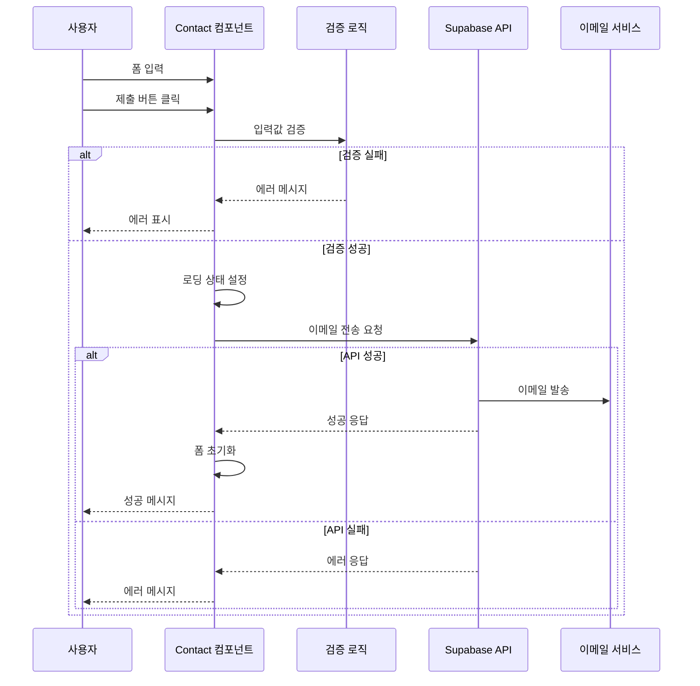
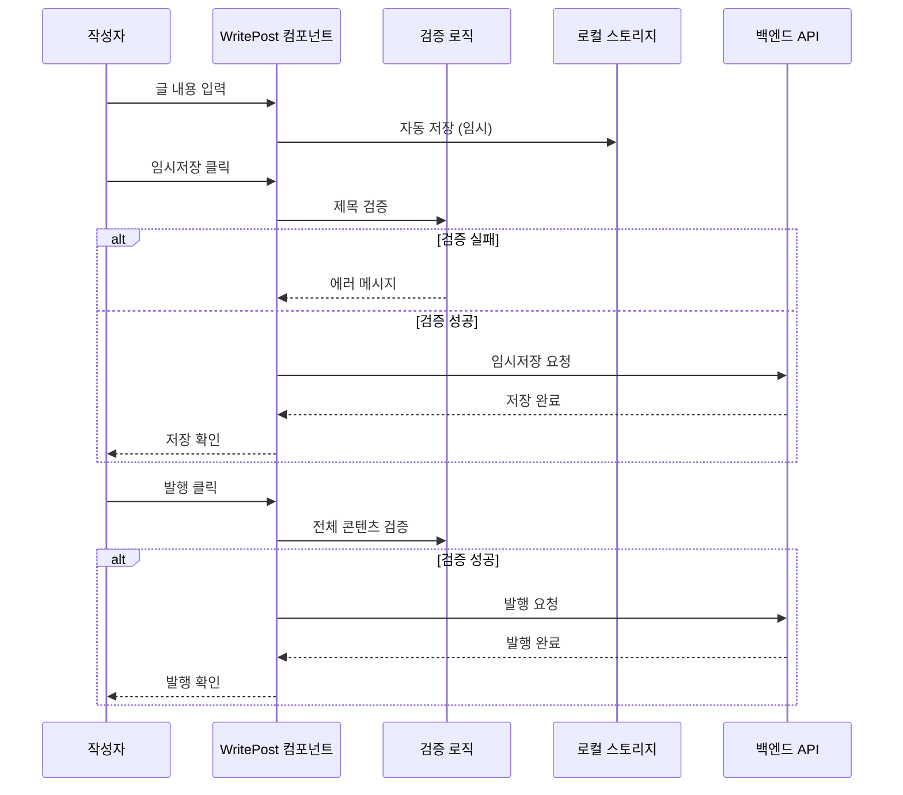
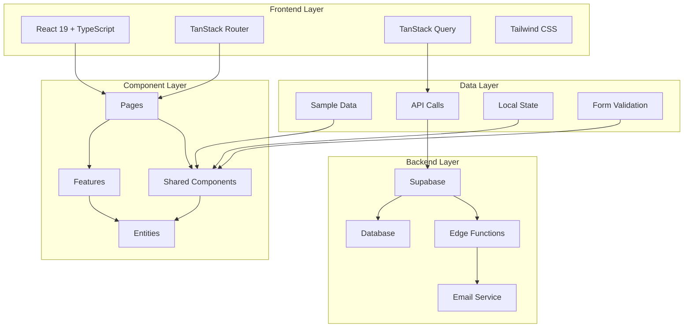
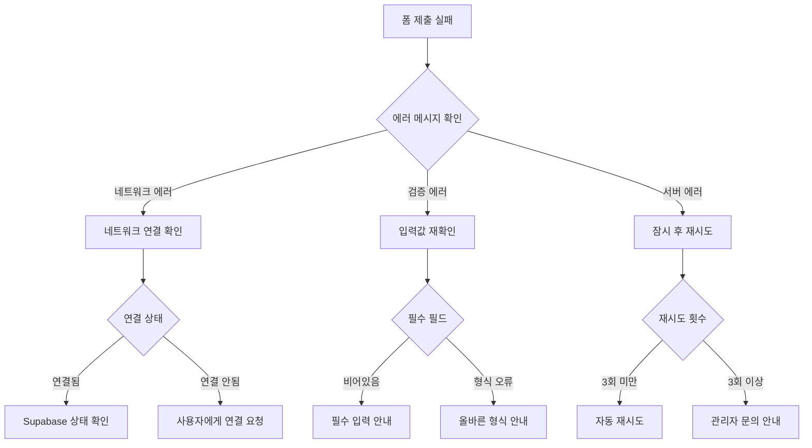
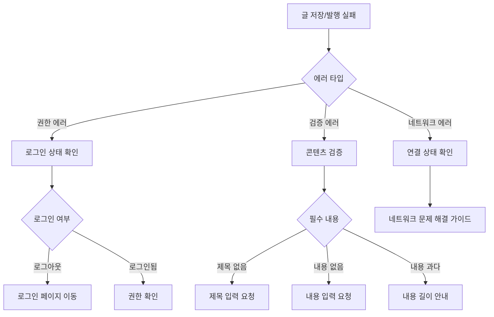

# 블로그 애플리케이션 아키텍처 개선 문서

## 📋 개요

이 문서는 블로그 애플리케이션의 주요 아키텍처 개선사항, 새로 추가된 기능들, 그리고 이들의 통합 방법에 대해 설명합니다.

## 🏗️ 아키텍처적 결정사항

### 1. 컴포넌트 아키텍처

#### 결정: 공통 컴포넌트 라이브러리 도입
```
src/shared/components/
├── PostCard.tsx          # 포스트 카드 컴포넌트
├── PageHeader.tsx        # 페이지 헤더 컴포넌트
├── LoadingSpinner.tsx    # 로딩 상태 컴포넌트
├── EmptyState.tsx        # 빈 상태 컴포넌트
├── TagBadge.tsx          # 태그 배지 컴포넌트
├── Header.tsx            # 메인 헤더
└── Footer.tsx            # 메인 푸터
```

**근거:**
- **재사용성**: 동일한 UI 패턴을 여러 페이지에서 일관되게 사용
- **유지보수성**: 컴포넌트 수정 시 한 곳에서만 변경
- **테스트 용이성**: 각 컴포넌트를 독립적으로 테스트 가능

### 2. 상태 관리 아키텍처

#### 결정: 컴포넌트 레벨 상태 관리 + 중앙화된 데이터
```typescript
// 로컬 상태 (React useState)
const [formData, setFormData] = useState<ContactFormData>({
  name: '',
  email: '',
  subject: '',
  message: '',
  privacyConsent: false,
});

// 상태 타입 정의
type EmailSendingStatus = 'idle' | 'sending' | 'success' | 'error';
type SaveStatus = 'idle' | 'saving' | 'saved' | 'error';
```

**근거:**
- **단순성**: 복잡한 전역 상태 관리 없이 컴포넌트 단위로 관리
- **타입 안전성**: TypeScript로 상태 타입 명확히 정의
- **예측 가능성**: 상태 변화가 명확하고 추적 가능

### 3. 에러 처리 아키텍처

#### 결정: 계층화된 에러 처리
```typescript
// 1. 입력 검증 레벨
if (!formData.privacyConsent) {
  setErrorMessage('개인정보 수집 및 이용에 동의해주세요.');
  return;
}

// 2. API 호출 레벨
try {
  const { error } = await supabase.functions.invoke('contact-email', {
    body: { name, email, subject, message }
  });
  if (error) throw error;
} catch (error) {
  // 3. 사용자 피드백 레벨
  if (error instanceof Error) {
    setErrorMessage(error.message.includes('network') ?
      '네트워크 연결을 확인해주세요.' :
      '메시지 전송에 실패했습니다.');
  }
}
```

## 🔐 보안 고려사항

### 1. 입력 검증 및 검색
```typescript
// 클라이언트 사이드 검증
const handleFormSubmit = async (e: React.FormEvent) => {
  e.preventDefault();

  // 필수 필드 검증
  if (!formData.name.trim() || !formData.email.trim()) {
    setErrorMessage('모든 필수 항목을 입력해주세요.');
    return;
  }

  // 이메일 형식 검증 (HTML5 input type="email" + 추가 검증)
  const emailRegex = /^[^\s@]+@[^\s@]+\.[^\s@]+$/;
  if (!emailRegex.test(formData.email)) {
    setErrorMessage('올바른 이메일 형식을 입력해주세요.');
    return;
  }
};
```

### 2. 개인정보 보호
```typescript
interface ContactFormData {
  name: string;
  email: string;
  subject: string;
  message: string;
  privacyConsent: boolean; // 명시적 동의 필수
}

// 폼 제출 후 즉시 초기화
setSendingStatus('success');
setFormData({
  name: '',
  email: '',
  subject: '',
  message: '',
  privacyConsent: false, // 동의도 초기화
});
```

### 3. API 보안
```typescript
// Supabase Edge Functions를 통한 서버사이드 처리
const { error } = await supabase.functions.invoke('contact-email', {
  body: {
    name: formData.name,      // 서버에서 추가 검증
    email: formData.email,    // 서버에서 이메일 형식 재검증
    subject: formData.subject,
    message: formData.message,
  }
});
```

## 🔄 컴포넌트 간 데이터 흐름

### 1. 연락처 폼 데이터 흐름


### 2. 글 작성 데이터 흐름


### 3. 컴포넌트 재사용 패턴
```typescript
// 데이터 흐름: 샘플 데이터 → 페이지 컴포넌트 → 공통 컴포넌트
import { getAllPosts } from '@/shared/data/sampleData';
import { PostCard } from '@/shared/components';

function PostsPage() {
  const posts = getAllPosts();

  return (
    <div>
      {posts.map(post => (
        <PostCard key={post.slug} post={post} />
      ))}
    </div>
  );
}
```

## ⚠️ 잠재적 실패 지점

### 1. 네트워크 관련 실패
**실패 시나리오:**
- 인터넷 연결 끊김
- Supabase 서비스 다운
- API 응답 지연

**대응 방안:**
```typescript
try {
  const { error } = await supabase.functions.invoke('contact-email', {
    body: formData
  });
} catch (error) {
  if (error instanceof Error) {
    // 네트워크 에러 감지
    setErrorMessage(error.message.includes('network') ?
      '네트워크 연결을 확인해주세요.' :
      '서비스에 일시적인 문제가 발생했습니다.');
  }
}
```

### 2. 상태 관리 실패
**실패 시나리오:**
- 비동기 상태 업데이트 충돌
- 메모리 누수
- 컴포넌트 언마운트 후 상태 업데이트

**대응 방안:**
```typescript
useEffect(() => {
  let isMounted = true;

  const saveData = async () => {
    try {
      const result = await apiCall();
      if (isMounted) {
        setSaveStatus('saved');
      }
    } catch (error) {
      if (isMounted) {
        setSaveStatus('error');
      }
    }
  };

  return () => {
    isMounted = false;
  };
}, []);
```

### 3. 사용자 입력 관련 실패
**실패 시나리오:**
- 특수 문자나 스크립트 입력
- 과도하게 긴 텍스트
- 잘못된 이메일 형식

**대응 방안:**
```typescript
// 입력값 사전 검증 및 정제
const sanitizeInput = (input: string) => {
  return input
    .trim()
    .slice(0, 1000) // 최대 길이 제한
    .replace(/<script\b[^<]*(?:(?!<\/script>)<[^<]*)*<\/script>/gi, ''); // 스크립트 제거
};
```

## 🌐 전체 애플리케이션 아키텍처 통합

### 아키텍처 다이어그램


### 통합 패턴

#### 1. 컴포넌트 통합
```typescript
// 페이지 레벨에서 공통 컴포넌트 조합
function PostsPage() {
  return (
    <>
      <PageHeader
        title="모든 글"
        description="개발 경험과 학습 내용을 공유하는 글들"
      />
      {loading ? (
        <LoadingSpinner text="글을 불러오는 중..." />
      ) : posts.length === 0 ? (
        <EmptyState
          title="작성된 글이 없습니다"
          actionText="글 작성하기"
          actionHref="/admin/write"
        />
      ) : (
        <div className="grid gap-6 md:grid-cols-2 lg:grid-cols-3">
          {posts.map(post => (
            <PostCard key={post.slug} post={post} />
          ))}
        </div>
      )}
    </>
  );
}
```

#### 2. 타입 통합
```typescript
// 중앙화된 타입 정의로 일관성 보장
export interface Post {
  id: number;
  slug: string;
  title: string;
  summary: string;
  content?: string;
  publishedAt: string;
  status: 'published' | 'draft' | 'scheduled';
  tags: string[];
  viewCount?: number;
  commentCount?: number;
  readingTime?: string;
}

// 모든 컴포넌트에서 동일한 타입 사용
export interface PostCardProps {
  post: Post;
  className?: string;
}
```

## 🔧 문제 해결 의사결정 트리

### 연락처 폼 문제 해결


### 글 작성 문제 해결


## 📊 성능 및 모니터링

### 성능 최적화 포인트
1. **컴포넌트 최적화**: React.memo, useMemo, useCallback 활용
2. **번들 최적화**: 코드 스플리팅, 지연 로딩
3. **이미지 최적화**: WebP 형식, 압축, 반응형 이미지

### 모니터링 지표
```typescript
// 성능 측정
const performanceObserver = new PerformanceObserver((list) => {
  list.getEntries().forEach((entry) => {
    if (entry.entryType === 'navigation') {
      console.log('페이지 로드 시간:', entry.loadEventEnd - entry.loadEventStart);
    }
  });
});

performanceObserver.observe({ entryTypes: ['navigation'] });
```

## 🚀 향후 개선 계획

### 1. 단기 개선사항 (1-2개월)
- [ ] 이미지 업로드 기능 추가
- [ ] 마크다운 에디터 고도화
- [ ] 댓글 시스템 구현
- [ ] SEO 최적화

### 2. 중기 개선사항 (3-6개월)
- [ ] PWA 변환
- [ ] 오프라인 지원
- [ ] 다국어 지원
- [ ] 고급 검색 기능

### 3. 장기 개선사항 (6개월+)
- [ ] AI 기반 콘텐츠 추천
- [ ] 실시간 협업 기능
- [ ] 분석 대시보드
- [ ] API 공개

---

이 문서는 지속적으로 업데이트되며, 새로운 기능 추가나 아키텍처 변경 시 반영됩니다.