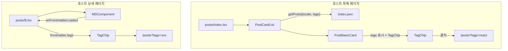

# 아키텍처 가이드

## 📋 목차

- [개요](#개요)
- [대상](#대상)
- [기술 스택 현황](#기술-스택-현황)
- [리포지터리 구조](#리포지터리-구조)
- [FSD 아키텍처](#fsd-아키텍처)
- [콘텐츠 파이프라인](#콘텐츠-파이프라인)
- [국제화](#국제화)
- [기술 선택 이유](#기술-선택-이유)
- [성능 최적화](#성능-최적화)
- [과거 시행착오](#과거-시행착오)
- [참고 문서](#참고-문서)

## 개요

이 프로젝트는 React 19 + TanStack Router v1 + Vite v7 기반의 개인 개발 블로그로, **Feature-Sliced Design(FSD)** 아키텍처 패턴을 따릅니다. 콘텐츠와 코드를 분리하여 관리하는 독립적인 리포지터리 구조를 채택하고 있습니다.

## 대상

### ✅ 포함 대상

- 프로젝트 전체 구조를 이해하고 싶은 개발자
- FSD 아키텍처 레이어와 의존성 규칙을 파악하려는 경우
- 콘텐츠 파이프라인 흐름을 이해하려는 경우
- 기술 스택 선택 배경을 알고 싶은 경우

### ❌ 제외 대상

- 개발 환경 설정 및 시작 방법 → [development.md](./development.md) 참고
- AI 에이전트를 위한 코딩 규칙 → [agents.md](./agents.md) 참고
- 프로젝트 회고 및 의사결정 로그 → [retrospective/overview.md](./retrospective/overview.md) 참고

## 기술 스택 현황

### Framework

- **React 19.2.3**: UI 라이브러리
- **TanStack Router v1**: 타입 안전 라우팅
- **Vite v7**: 빌드 도구 및 개발 서버
- **TypeScript 5**: 정적 타입 검사

### Styling

- **Tailwind CSS v4**: 유틸리티 우선 CSS 프레임워크
- **CSS Modules**: 로컬 스코프 CSS (일부 컴포넌트)

### Content

- **@mdx-js/mdx**: 런타임 MDX 렌더링 (`evaluate()` + remark/rehype 플러그인)
- **rehype-highlight**: 코드 하이라이팅
- **remark/rehype**: 마크다운 처리 플러그인

### Data

- **Zod v4**: 런타임 데이터 검증
- **Zustand**: 경량 상태 관리 (테마, 로케일)
- **TanStack Query**: 서버 상태 관리
- **Axios**: HTTP 클라이언트
- **i18next**: UI 다국어 지원
- **react-i18next**: React용 i18next 바인딩

### UI

- **@base-ui/react**: Headless UI 컴포넌트
- **Lucide React**: 아이콘 라이브러리
- **clsx**: 조건부 클래스 유틸리티

### Testing

- **Vitest**: 유닛/통합 테스트 러너
- **Playwright**: E2E 테스트
- **Testing Library**: React 컴포넌트 테스트
- **Storybook 10**: 컴포넌트 문서화
- **fast-check**: Property-Based 테스트

### Code Quality

- **ESLint 9**: 코드 린팅
- **Prettier 3**: 코드 포맷팅
- **Husky**: Git 훅 관리
- **lint-staged**: 스테이징 파일 린팅

### Deployment

- **Netlify**: 정적 사이트 호스팅
- **Netlify Functions**: 서버리스 함수 (이메일 발송)

### External Services

- **Cloudflare Turnstile**: 봇 방지
- **Resend**: 이메일 발송
- **Giscus**: GitHub Discussions 기반 댓글 시스템

## 리포지터리 구조

### 이중 리포지터리 전략

#### 지시사항

이 프로젝트는 코드와 콘텐츠를 분리하여 관리합니다:

- **blog**: React + TanStack Router + Vite 애플리케이션 (UI, 렌더링, 비즈니스 로직)
- **blog-content**: MDX 콘텐츠 저장소 (다국어 포스트)

#### 데이터 흐름

```
┌─────────────────────┐ ┌──────────────────────┐
│ blog │ │ blog-content │
│ (React + Vite App) │ ◄───── │ (MDX Contents) │
│ │ fetch │ │
│ - UI/UX │ │ - Posts (ko/ja/en) │
│ - 렌더링 │ │ - index.json │
│ - 배포 │ │ │
└─────────────────────┘ └──────────────────────┘
│ │
│ push to main │ push to main
▼ ▼
┌─────────────┐ ┌──────────────────┐
│ Netlify │ │ GitHub Actions │
│ 배포 │ │ 인덱싱 생성 │
└─────────────┘ └──────────────────┘
```

#### 예제

**blog (현재 리포지터리)**:

- **역할**: 블로그 애플리케이션
- **기술**: React 19.2.3, TanStack Router v1, Vite v7, TypeScript 5, Tailwind CSS v4
- **배포**: Netlify (main 브랜치 자동 배포)
- **URL**: https://chan-ok.com

**blog-content (콘텐츠 리포지터리)**:

- **역할**: MDX 포스트 및 정적 콘텐츠 저장
- **구조**: 다국어 폴더 (ko, ja, en)
- **자동화**: GitHub Actions로 \`index.json\` 자동 생성
- **URL**: https://github.com/chan-ok/blog-content

#### 주의사항

- ⚠️ blog-content는 별도 리포지터리이므로 \`blog/\` 디렉토리에서 콘텐츠 수정 불가
- ⚠️ 콘텐츠 추가 시 blog-content 리포지터리에서 작업 후 \`index.json\` 자동 생성 확인 필수
- ⚠️ 런타임에 GitHub Raw URL로 콘텐츠를 fetch하므로 네트워크 실패 처리 필요

## FSD 아키텍처

### 레이어 의존성

#### 지시사항

Feature-Sliced Design(FSD)는 단방향 의존성을 갖는 5개 레이어로 구성됩니다:

```
pages → widgets → features → entities → shared
```

각 레이어는 자신보다 하위 레이어만 import할 수 있습니다.

#### 디렉토리 구조

```
src/
├── 0-app/ # 🏗️ App Layer (앱 진입점)
│ ├── globals.css # 글로벌 스타일
│ └── main.tsx # 앱 진입점
│
├── 4-pages/ # 🗂️ Pages Layer (라우팅)
│ ├── __root.tsx # 루트 레이아웃
│ ├── index.tsx # 홈 페이지
│ └── $locale/ # 로케일 동적 라우트
│ ├── index.tsx # 로케일별 홈
│ ├── about.tsx # About 페이지
│ ├── contact.tsx # Contact 페이지
│ └── posts/ # 포스트 라우트
│
├── 3-widgets/ # 🧩 Widget Layer (복합 UI)
│ ├── footer.tsx
│ └── header.tsx
│
├── 2-features/ # 🎯 Feature Layer (비즈니스 기능)
│ ├── about/
│ │ └── ui/
│ ├── contact/
│ │ ├── model/
│ │ ├── ui/
│ │ └── util/
│ └── post/
│ ├── model/
│ ├── ui/
│ └── util/
│
├── 1-entities/ # 📦 Entity Layer (비즈니스 엔티티)
│ └── markdown/
│ ├── model/
│ ├── ui/
│ └── util/
│
└── 5-shared/ # 🛠️ Shared Layer (공유 리소스)
 ├── components/ # 독립적인 복합 컴포넌트 (유기체 이상)
 │ ├── reply/
 │ ├── toggle/
 │ ├── turnstile/
 │ └── ui/ # 순수 UI 컴포넌트 (원자, 분자)
 ├── config/
 ├── hooks/
 ├── providers/
 ├── stores/
 ├── types/
 └── util/
```

#### 레이어별 역할

**1️⃣ Pages Layer (4-pages/ — 라우팅)**:

- TanStack Router의 파일 기반 라우팅
- 페이지 컴포넌트는 최소한의 로직만 포함
- 비즈니스 로직은 하위 레이어에 위임
- import 가능: widgets, features, entities, shared

**2️⃣ Widgets Layer (3-widgets/ — 위젯)**:

- 복합 UI 컴포넌트 (여러 features 조합)
- Header, Footer 같은 레이아웃 컴포넌트
- import 가능: features, entities, shared

**3️⃣ Features Layer (2-features/ — 기능)**:

- 독립적인 비즈니스 기능 단위
- \`model/\`, \`ui/\`, \`util/\` 서브 디렉토리 구조
- 다른 feature에 의존하지 않음
- import 가능: entities, shared만

**4️⃣ Entities Layer (1-entities/ — 엔티티)**:

- 비즈니스 도메인 엔티티
- 재사용 가능한 도메인 로직
- import 가능: shared만

**5️⃣ Shared Layer (5-shared/ — 공유)**:

- 어디서든 사용 가능한 공통 코드
- 다른 레이어에 의존하지 않음
- 유틸리티, 타입, 기본 UI 컴포넌트

**Shared 내부 구조 (Atomic Design 기반)**:

| 디렉토리           | 설명                                    | 예시                 |
| ------------------ | --------------------------------------- | -------------------- |
| \`components/\`    | 독립적인 복합 컴포넌트 (유기체 이상)    | toggle, turnstile    |
| \`components/ui/\` | 순수 프레젠테이션 컴포넌트 (원자, 분자) | Button, Input, Badge |

#### 예제

```typescript
// ✅ Good - 올바른 의존성 방향
// src/2-features/post/ui/card.tsx
import { renderMDX } from '@/1-entities/markdown'; // entities 사용 OK
import { Button } from '@/5-shared/components/ui/button'; // shared 사용 OK

// ❌ Bad - 역방향 의존성
// src/5-shared/util/post-utils.ts
import { PostCard } from '@/2-features/post'; // ❌ 5-shared → 2-features 불가

// ❌ Bad - features 간 의존성
// src/2-features/contact/ui/form.tsx
import { PostCard } from '@/2-features/post'; // ❌ 2-features 간 의존 불가
```

#### 주의사항

- ⚠️ 역방향 import 절대 금지 (예: 5-shared → 2-features)
- ⚠️ features/ 간 import 절대 금지 (예: 2-features/post → 2-features/contact)
- ⚠️ 의존성 순환 발생 시 공통 로직을 하위 레이어로 이동

### 새 기능 추가 흐름

#### 지시사항

새로운 기능을 추가할 때 다음 순서를 따릅니다:

1. **Shared에 재사용 가능한 컴포넌트/유틸 추가**
2. **Entities에 도메인 로직 추가** (필요 시)
3. **Features에 비즈니스 기능 구현**
4. **Widgets에서 features 조합** (필요 시)
5. **App에서 라우팅 및 페이지 구성**

#### 예제

"태그 필터링" 기능 추가:

```typescript
// 1. Shared - 재사용 가능한 Badge 컴포넌트
// src/5-shared/components/ui/badge/badge.tsx
export function Badge({ label, onClick }: BadgeProps) {
return <button onClick={onClick}>{label}</button>;
}

// 2. Features - 태그 필터링 기능
// src/2-features/post/ui/tag-filter.tsx
import { Badge } from '@/5-shared/components/ui/badge';

export function TagFilter({ tags, onFilter }: TagFilterProps) {
return (

<div>
{tags.map(tag => (
<Badge key={tag} label={tag} onClick={() => onFilter(tag)} />
))}
</div>
);
}

// 3. Pages - 페이지에서 사용
// src/4-pages/$locale/posts/index.tsx
import { TagFilter } from '@/2-features/post/ui/tag-filter';

export default function PostsPage() {
return <TagFilter tags={['react', 'nextjs']} onFilter={handleFilter} />;
}
```

## 콘텐츠 파이프라인

### 전체 흐름

#### 지시사항

콘텐츠는 다음 단계로 처리됩니다:

1. 작성자가 blog-content 리포지터리에 MDX 포스트 push
2. GitHub Actions가 main 브랜치 트리거 감지
3. `generate-index.ts` 스크립트 실행하여 `index.json` 생성
4. blog 애플리케이션이 `index.json` fetch (목록 페이지)
5. 필요 시 MDX 파일 fetch (상세 페이지)
6. `@mdx-js/mdx`로 런타임 렌더링 (`evaluate()` + remark/rehype 플러그인)
7. 사용자에게 렌더링된 페이지 제공

#### 시퀀스 다이어그램

\`\`\`mermaid
sequenceDiagram
participant Writer as 작성자
participant BC as blog-content
participant GHA as GitHub Actions
participant Blog as blog (React + Vite)
participant User as 사용자

    Writer->>BC: 1. MDX 포스트 push
    BC->>GHA: 2. main 브랜치 트리거
    GHA->>GHA: 3. generate-index.ts 실행
    GHA->>BC: 4. index.json 커밋

    User->>Blog: 5. 블로그 방문
    Blog->>BC: 6. index.json fetch (GitHub Raw)
    Blog->>BC: 7. MDX 파일 fetch (필요 시)
    Blog->>User: 8. 렌더링된 페이지 제공

\`\`\`

#### 예제

**index.json 구조**:

\`\`\`json
[
{
"id": "nextjs-16-upgrade",
"title": "Next.js 16으로 업그레이드 후기",
"createdAt": "2025-12-06T00:00:00.000Z",
"updatedAt": "2025-12-07T00:00:00.000Z",
"tags": ["nextjs", "react"],
"published": true,
"path": "/nextjs-16-upgrade"
}
]
\`\`\`

**목록 페이지에서 index.json fetch**:

\`\`\`typescript
// src/2-features/post/api/get-posts.ts
const response = await fetch(
\`\${import.meta.env.VITE_GIT_RAW_URL}/\${locale}/index.json\`
);
const posts: PostMetadata[] = await response.json();
\`\`\`

**상세 페이지에서 MDX fetch 및 렌더링**:

\`\`\`typescript
// src/1-entities/markdown/util/get-markdown.ts
import { evaluate } from '@mdx-js/mdx';
import \* as runtime from 'react/jsx-runtime';
import remarkGfm from 'remark-gfm';
import rehypeHighlight from 'rehype-highlight';

export default async function getMarkdown(path: string) {
  // MDX evaluate - remark/rehype 플러그인과 함께 1단계 처리
  const { default: MDXContent } = await evaluate(content, {
    ...(runtime as any),
    remarkPlugins: [remarkGfm, remarkFrontmatter],
    rehypePlugins: [rehypeHighlight, rehypeSlug],
  });

  return { MDXContent };
}
\`\`\`

#### 주의사항

- ⚠️ `index.json`은 GitHub Actions가 자동 생성하므로 수동 수정 금지
- ⚠️ MDX 파일 fetch 실패 시 에러 처리 필수
- ⚠️ 브라우저 캐시를 활용하여 불필요한 재요청 방지

### 페이지네이션

#### 지시사항

목록 페이지에서 페이지네이션을 구현할 때:

- \`index.json\`의 전체 포스트 목록을 클라이언트에서 분할
- URL 쿼리 파라미터로 현재 페이지 관리 (\`?page=2\`)
- 한 페이지당 10개 포스트 표시

#### 예제

\`\`\`typescript
// src/2-features/post/util/paginate-posts.ts
export function paginatePosts(posts: Post[], page: number, perPage = 10) {
const start = (page - 1) \* perPage;
const end = start + perPage;
return {
items: posts.slice(start, end),
total: posts.length,
totalPages: Math.ceil(posts.length / perPage),
};
}
\`\`\`

## 태그 기능

### 개요

포스트에 태그를 표시하고 필터링하는 기능입니다. 각 포스트는 frontmatter에 `tags: string[]` 필드를 가지며, 태그를 클릭하면 해당 태그로 필터된 포스트 목록으로 이동합니다.

### 데이터 구조

#### Frontmatter 스키마

```typescript
// src/1-entities/markdown/model/markdown.schema.ts
export const FrontmatterSchema = z.object({
  title: z.string(),
  path: z.array(z.string()),
  tags: z.array(z.string()).default([]), // 태그 배열
  createdAt: z.date(),
  updatedAt: z.date().optional(),
  published: z.boolean().default(false),
  thumbnail: z.string().optional(),
  summary: z.string().optional(),
});
```

#### index.json 구조

```json
[
  {
    "title": "Next.js 16으로 업그레이드 후기",
    "path": ["2024", "01", "nextjs-16-upgrade"],
    "tags": ["nextjs", "react", "typescript"],
    "createdAt": "2024-01-15T00:00:00.000Z",
    "published": true
  }
]
```

### 컴포넌트 구조

#### TagChip 컴포넌트

태그를 칩 형태로 표시하고, 클릭 시 해당 태그로 필터된 목록으로 이동합니다.

```typescript
// src/2-features/post/ui/tag-chip.tsx
interface TagChipProps {
  tag: string;
  locale: string;
}

export default function TagChip({ tag, locale }: TagChipProps) {
  const href = `/${locale}/posts?tags=${encodeURIComponent(tag)}`;
  return (
    <Link href={href} className="...">
      {tag}
    </Link>
  );
}
```

#### PostBasicCard / PostCompactCard

포스트 카드 컴포넌트에 태그를 표시합니다.

```typescript
// src/2-features/post/ui/post-basic-card.tsx
{tags && tags.length > 0 && (
  <div className="mb-2 flex flex-wrap gap-2">
    {tags.map((tag) => (
      <TagChip key={tag} tag={tag} locale={locale} />
    ))}
  </div>
)}
```

### 태그 필터링

#### URL 쿼리 파라미터

태그 필터링은 URL 쿼리 파라미터로 관리됩니다:

- 형식: `?tags=react,typescript` (쉼표 구분)
- 여러 태그: `?tags=react,typescript,nextjs`

#### 라우트 검색 파라미터 검증

```typescript
// src/4-pages/$locale/posts/index.tsx
export const Route = createFileRoute('/$locale/posts/')({
  validateSearch: (search) => {
    return z
      .object({
        tags: z.string().optional(),
      })
      .parse(search);
  },
});
```

#### 필터링 로직

```typescript
// src/2-features/post/ui/post-card-list.tsx
const search = useSearch({ from: Route.fullPath });
const tags = search.tags
  ? search.tags.split(',').map((tag) => tag.trim()).filter(Boolean)
  : [];

const { data: pagingPosts } = useSuspenseQuery({
  queryKey: ['posts', locale, tags],
  queryFn: () => getPosts({ locale, tags }),
});
```

```typescript
// src/2-features/post/util/get-posts.ts
export async function getPosts(props: GetPostsProps): Promise<PagingPosts> {
  const { locale, tags = [] } = props;
  
  // ... index.json fetch ...
  
  const filteredPosts = response.data
    .filter((post) => post.published)
    .filter(
      (post) =>
        tags.length === 0 || tags.some((tag) => post.tags.includes(tag))
    );
}
```

### 상세 페이지 태그 표시

포스트 상세 페이지에서도 frontmatter의 태그를 표시합니다.

```typescript
// src/4-pages/$locale/posts/$.tsx
const [frontmatter, setFrontmatter] = useState<Frontmatter | null>(null);

<MDComponent
  path={path}
  onFrontmatterLoaded={setFrontmatter}
/>

{frontmatter && (
  <div className="mb-8">
    <h1>{frontmatter.title}</h1>
    <div>{format(frontmatter.createdAt, 'yyyy-MM-dd')}</div>
    {frontmatter.tags && frontmatter.tags.length > 0 && (
      <div className="flex flex-wrap gap-2">
        {frontmatter.tags.map((tag) => (
          <TagChip key={tag} tag={tag} locale={locale} />
        ))}
      </div>
    )}
  </div>
)}
```

### 데이터 흐름



### Link 컴포넌트 쿼리 파라미터 지원

Link 컴포넌트가 쿼리 파라미터를 처리하도록 수정되었습니다:

```typescript
// src/5-shared/components/ui/link/index.tsx
function parseInternalLink(href: string, locale: string) {
  const [pathWithLocale, searchString] = href.split('?');
  const searchParams = searchString
    ? Object.fromEntries(new URLSearchParams(searchString))
    : undefined;
  
  // ... 경로 매칭 ...
  
  return {
    to: '/$locale/posts',
    params: { locale },
    ...(searchParams && { search: searchParams }),
  };
}
```

### 테스트

TDD 기반으로 구현되었으며, 다음 테스트가 포함됩니다:

- `TagChip` 컴포넌트 테스트 (태그 렌더링, href 생성, 접근성)
- `PostBasicCard` 태그 표시 테스트
- `PostCompactCard` 태그 표시 테스트
- Property-Based 테스트 (다양한 태그 문자열, locale 조합)

## 국제화

### URL 기반 라우팅

#### 지시사항

이 프로젝트는 TanStack Router의 파일 기반 라우팅을 통해 다국어를 지원합니다:

- `/ko/posts/example` - 한국어
- `/ja/posts/example` - 일본어
- `/en/posts/example` - 영어

locale은 라우팅 컨텍스트에서 관리되며, `LocaleProvider`를 통해 앱 전체에서 접근할 수 있습니다.

#### 언어 감지 프로세스

\`\`\`mermaid
graph TD
A[사용자 접속] --> B{경로에 locale 있음?}
B -->|Yes| C[해당 locale 페이지]
B -->|No| D[LocaleProvider]
D --> E{NEXT_LOCALE 쿠키 확인}
E -->|Yes| G[쿠키 언어로 설정]
E -->|No| F{브라우저 언어 확인}
F -->|Yes| G[감지된 언어로 설정]
F -->|No| H[기본 언어 ko로 설정]
\`\`\`

#### 예제

**콘텐츠 구조 (blog-content)**:

\`\`\`
blog-content/
├── ko/
│ ├── post-1.mdx
│ ├── post-2.mdx
│ └── index.json (자동 생성)
├── ja/
│ ├── post-1.mdx
│ └── index.json (자동 생성)
└── en/
├── post-1.mdx
└── index.json (자동 생성)
\`\`\`

**언어 감지 프로바이더 (LocaleProvider)**:

\`\`\`typescript
// src/5-shared/providers/locale-provider.tsx
export function LocaleProvider({ children }: Props) {
const cookieLocale = getCookie('NEXT_LOCALE');
const browserLocale = navigator.language.split('-')[0];
const locale = cookieLocale || browserLocale || 'ko';

return <LocaleContext.Provider value={{ locale }}>{children}</LocaleContext.Provider>;
}
\`\`\`

#### 주의사항

- ⚠️ \`NEXT_LOCALE\` 쿠키는 사용자가 언어 토글로 선택한 언어 저장 (영속성)
- ⚠️ 쿠키가 없으면 \`Accept-Language\` 헤더로 브라우저 언어 감지
- ⚠️ 지원하지 않는 언어는 기본 언어(ko)로 폴백

## 기술 선택 이유

### 1. TanStack Router + Vite 채택

**결정**: Next.js 16에서 TanStack Router v1 + Vite v7로 전환

**배경**:

- Next.js App Router의 `use client`/`use server` 혼란
- 예측 불가능한 캐싱 동작
- 느린 빌드 속도 (12초)
- 느린 HMR (2초)
- 블로그처럼 단순한 프로젝트에 Next.js는 과한 선택

**결과**:

- 빌드 시간: 12s → 5s (60% 개선)
- HMR: 2s → 100ms (95% 개선)
- 번들 크기: 200KB → 150KB (25% 감소)
- 타입 안전성: TanStack Router의 파일 기반 라우팅 자동 타입 생성
- 복잡도 감소: `use client`/`use server` 제거

**주요 기술 결정**:

- TanStack Router v1 파일 기반 라우팅
- Vite v7 빌드 도구 및 개발 서버
- `@mdx-js/mdx` 런타임 MDX 렌더링
- 클라이언트 사이드 렌더링 (SSR 미사용, 필요 시 추가 가능)
- Netlify Functions로 서버리스 함수 처리 (Turnstile, 이메일 발송)

### 2. 리포지터리 분리

**결정**: blog와 blog-content 분리

**이유**:

- 콘텐츠 작성과 코드 개발의 독립성
- 배포 파이프라인 분리 (콘텐츠 수정 시 전체 재배포 불필요)
- Git 히스토리 분리로 관리 용이성 증대
- 콘텐츠 작성자와 개발자의 역할 분리 가능

### 3. @mdx-js/mdx 채택

**결정**: 런타임 MDX 렌더링 (`evaluate()` + remark/rehype 플러그인)

**이유**:

- 콘텐츠가 외부 리포지터리에 있어 빌드 타임 접근 불가
- 동적 콘텐츠 로딩 가능 (콘텐츠 수정 시 재배포 불필요)
- 서버/클라이언트 구분 없이 어디서든 MDX 렌더링 가능
- 브라우저 캐시로 성능 보완

**트레이드오프**:

- 빌드 타임 MDX보다 초기 렌더링 느림
- 하지만 캐시로 두 번째 요청부터는 빠름

### 4. FSD 아키텍처

**결정**: Feature-Sliced Design 패턴 채택

**이유**:

- 확장 가능한 구조 (새 기능 추가 시 독립적)
- 명확한 의존성 방향 (레이어 간 순환 의존성 방지)
- 팀 협업 시 충돌 최소화
- 기능 단위 재사용 용이

### 5. URL 기반 i18n

**결정**: 쿠키/세션 대신 URL 경로로 언어 관리

**이유**:

- SEO 친화적 (검색 엔진이 언어별 페이지 인덱싱)
- 링크 공유 시 언어 유지 (URL에 locale 포함)
- CDN 캐싱 효율적 (언어별로 다른 캐시 키)
- 명확한 언어 컨텍스트 (URL만 봐도 언어 확인 가능)

**보완**:

- Zustand store로 사용자 선택 언어 관리 (URL 경로 기반)
- URL에 locale이 없으면 브라우저 언어 자동 감지

## 성능 최적화

### 1. Vite 빌드 최적화

Vite의 빠른 빌드 속도와 HMR을 활용하여 개발 생산성을 극대화합니다:

\`\`\`typescript
// vite.config.ts
export default defineConfig({
build: {
rollupOptions: {
output: {
manualChunks(id) {
if (id.includes('node_modules')) {
if (id.includes('react') || id.includes('react-dom')) return 'react-vendor';
if (id.includes('@tanstack')) return 'tanstack';
if (id.includes('rehype') || id.includes('remark') || id.includes('highlight.js')) return 'mdx';
if (id.includes('i18next')) return 'i18n';
if (id.includes('lucide-react') || id.includes('@base-ui')) return 'ui';
if (id.includes('date-fns') || id.includes('zod') || id.includes('zustand')) return 'utils';
}
},
},
},
},
});
\`\`\`

**결과**:

성능 최적화 결과는 [TanStack Router + Vite 채택](#1-tanstack-router--vite-채택) 섹션을 참고하세요.

### 2. React Compiler

React 19의 자동 최적화를 활용하여 수동 메모이제이션을 최소화합니다.

\`\`\`typescript
// ❌ Bad - 불필요한 useMemo
const sortedPosts = useMemo(
() => posts.sort((a, b) => b.createdAt - a.createdAt),
[posts]
);

// ✅ Good - React Compiler가 자동 최적화
const sortedPosts = posts.sort((a, b) => b.createdAt - a.createdAt);
\`\`\`

### 3. 폰트 최적화

Google Fonts의 `preload` 설정과 서브셋 로딩:

```html
<!-- index.html -->
<link rel="preconnect" href="https://fonts.googleapis.com" />
<link rel="preconnect" href="https://fonts.gstatic.com" crossorigin />
<link
  href="https://fonts.googleapis.com/css2?family=Noto+Sans+KR:wght@400;700&display=swap"
  rel="stylesheet"
/>
```

### 4. 이미지 최적화

Vite 플러그인을 사용하여 이미지를 최적화합니다:

```typescript
// vite.config.ts
import { ViteImageOptimizer } from 'vite-plugin-image-optimizer';

export default defineConfig({
  plugins: [ViteImageOptimizer()],
});

// 컴포넌트에서 사용

```

### 5. 코드 스플리팅

TanStack Router의 `autoCodeSplitting`으로 라우트 기반 자동 코드 스플리팅을 적용하며, React의 lazy와 Suspense를 사용한 동적 import도 활용합니다:

```typescript
import { lazy, Suspense } from 'react';

const ContactForm = lazy(() => import('@/2-features/contact/ui/form'));

<Suspense fallback={<p>Loading...</p>}>
  <ContactForm />
</Suspense>
```

### 6. 데이터 캐싱

TanStack Query를 사용한 데이터 캐싱:

```typescript
import { useQuery } from '@tanstack/react-query';

const { data } = useQuery({
  queryKey: ['posts', locale],
  queryFn: () => fetch(url).then((res) => res.json()),
  staleTime: 3600000, // 1시간
});
```

## 과거 시행착오

### 1. Next.js App Router의 복잡도

**문제**: `use client` / `use server`의 난해함, 예측 불가능한 캐싱, 느린 빌드 속도

**시도**:

- ❌ 1차 시도 (Claude Code): 단일 에이전트, 8시간 → Next.js에서 TanStack Router로 마이그레이션 실패
- ❌ 2차 시도 (Amazon Kiro): 단일 에이전트, 7시간 → 타입 에러
- ✅ 3차 시도 (멀티 에이전트): Master Orchestrator + 6 Subagents, 12시간 → 성공

**해결**:

- ✅ TanStack Router v1 + Vite v7로 전환
- ✅ 빌드 시간 60% 개선, HMR 95% 개선, 번들 크기 25% 감소
- ✅ 멀티 에이전트 시스템 활용 (Master Orchestrator, feature-developer, test-specialist, git-guardian, github-helper, doc-manager, tech-architect)

### 2. Contact 봇 스팸 문제

**문제**: Contact 폼에 봇 스팸 발생

**시도**:

- ❌ Honeypot 필드만 사용 → 고급 봇에게 무용지물
- ❌ reCAPTCHA → 사용자 경험 저하 (이미지 선택 불편)

**해결**:

- ✅ Cloudflare Turnstile 도입 → 봇 차단 + 사용자 경험 유지
- ✅ Rate limiting (Netlify Functions) → API 남용 방지

### 3. 쿠키 영속성 문제

**문제**: 언어 선택 후 새로고침 시 기본 언어로 돌아감

**시도**:

- ❌ localStorage 사용 → SSR 환경에서 접근 불가
- ❌ URL 쿼리 파라미터 → SEO에 불리

**해결**:

- ✅ \`NEXT_LOCALE\` 쿠키 도입 → 서버/클라이언트 모두 접근 가능
- ✅ \`proxy.ts\`에서 쿠키 우선 확인 → 브라우저 언어는 폴백

### 4. MDX 렌더링 문제

**문제**: 외부 리포지터리 MDX를 빌드 타임에 처리 불가

**시도**:

- ❌ Git submodule → 빌드마다 submodule update 필요 (복잡)
- ❌ 빌드 시 blog-content clone → CI 시간 증가

**해결**:

- ✅ `@mdx-js/mdx`로 런타임 렌더링 (`evaluate()` + remark/rehype 플러그인)
- ✅ GitHub Raw URL로 fetch → 간단하고 빠름
- ✅ 브라우저 캐시로 성능 보완

## 참고 문서

- [agents.md](./agents.md) - AI 코딩 에이전트 가이드
- [development.md](./development.md) - 개발 환경 설정 및 시작 가이드
- [retrospective/overview.md](./retrospective/overview.md) - 프로젝트 회고 및 의사결정 로그
