# 에이전트 역할 재정의 상세 설계

> **Version**: v3.0.0  
> **Last Updated**: 2025-01-XX

## 📋 목차

- [개요](#개요)
- [에이전트 매핑: 현재 → 새 체계](#에이전트-매핑-현재--새-체계)
- [컨설턴트 상세 설계](#컨설턴트-상세-설계)
- [명세서 관리자 상세 설계](#명세서-관리자-상세-설계)
- [프로젝트 리드 상세 설계](#프로젝트-리드-상세-설계)
- [깃 매니저 상세 설계](#깃-매니저-상세-설계)
- [리뷰어 상세 설계](#리뷰어-상세-설계)
- [신입 개발자 상세 설계](#신입-개발자-상세-설계)
- [백그라운드 개발자 상세 설계](#백그라운드-개발자-상세-설계)
- [Pod 배치 및 리소스](#pod-배치-및-리소스)
- [에이전트 간 통신 매트릭스](#에이전트-간-통신-매트릭스)
- [Git 보안 정책](#git-보안-정책)
- [역할 경계와 충돌 방지](#역할-경계와-충돌-방지)
- [마이그레이션 경로](#마이그레이션-경로)
- [버전 정보](#버전-정보)

## 개요

### 문서 목적

이 문서는 현재 동기식 OpenCode 기반 9개 에이전트 시스템에서 비동기 Kubernetes 기반 7개 에이전트 시스템으로 전환하는 과정을 상세히 기술합니다. 각 에이전트의 역할, 책임, 통신 패턴, 실행 환경을 정의하고, 기존 에이전트와의 매핑 관계를 명확히 합니다.

### 현재 시스템의 한계

| 문제 | 설명 | 영향 |
|------|------|------|
| 동기식 실행 | 모든 에이전트가 순차 실행, 병렬 처리 불가 | 개발 시간 N배 증가 |
| 중앙 조율자 의존 | master-orchestrator가 모든 작업 조율 | 단일 장애점, 확장 불가 |
| 격리 부재 | 동일 파일 시스템 공유 | 충돌 위험, 테스트 오염 |
| 역할 분산 과도 | 9개 에이전트로 세분화 | 컨텍스트 전환 비용, 통신 오버헤드 |
| 수동 승인 빈번 | 모든 파일 수정/커밋에 사용자 승인 | 워크플로우 중단 |

### 새 시스템의 장점

| 개선사항 | 설명 | 효과 |
|----------|------|------|
| 비동기 병렬 처리 | NATS 경량 메시징 + KEDA 오토스케일링 | 개발 시간 1/N 단축 |
| 이벤트 드리븐 | Watchman + NATS ping 기반 자동 트리거 | 중앙 조율자 불필요 |
| K8s Pod 격리 | 에이전트별 독립 Pod, 읽기 전용 권한 | 안전한 병렬 실행 |
| 역할 통합 | 7개로 통합하여 응집도 향상 | 컨텍스트 전환 감소 |
| 자동 승인 정책 | 안전한 작업은 자동 실행 | 워크플로우 효율화 |
| 명세 중심 통신 | spec 파일이 상태 + 통신 매체 역할 | 메시지 페이로드 최소화 (~50MB 메모리 절약) |

### 핵심 변경점 요약

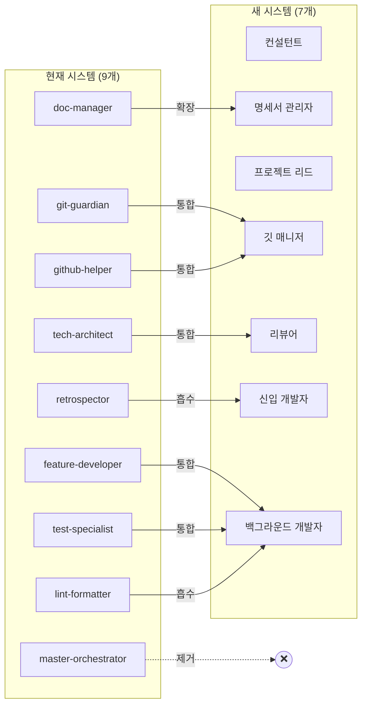

## 에이전트 매핑: 현재 → 새 체계

### 매핑 테이블

| # | 현재 에이전트 | 새 에이전트 | 변환 유형 | 설계 근거 |
|---|--------------|------------|-----------|-----------|
| 1 | master-orchestrator | — (제거) | 제거 | 비동기 큐 + Watchman + NATS ping이 조율 역할 대체 |
| 2 | feature-developer | 백그라운드 개발자 | 통합 | Worker Pod에서 개발+테스트를 하나의 에이전트가 수행 |
| 3 | test-specialist | 백그라운드 개발자 | 통합 | 동일 컨텍스트에서 구현과 테스트를 함께 수행하는 것이 효율적 |
| 4 | tech-architect | 리뷰어 | 통합 | 품질 검증 + 보안 검증을 단일 에이전트로 통합하여 응집도 향상 |
| 5 | lint-formatter | 백그라운드 개발자 | 흡수 | 코드 작성 시 린트/포매팅을 자동 적용하는 것이 별도 에이전트보다 효율적 |
| 6 | git-guardian | 깃 매니저 | 통합 | Git 워크플로우 + GitHub 통합을 단일 에이전트로 관리 |
| 7 | github-helper | 깃 매니저 | 통합 | PR/Issue 관리와 Git 작업을 하나의 에이전트가 총괄 |
| 8 | doc-manager | 명세서 관리자 | 확장 | 문서 관리에 명세서 CRUD 기능을 추가하여 역할 확장 |
| 9 | retrospector | 신입 개발자 | 흡수 | 회고 분석과 학습 문서화를 "왜?" 질문 문화에 통합 |

### 제거 근거: master-orchestrator

**왜 제거하는가**

현재 시스템에서 master-orchestrator는 모든 작업의 시작점이자 조율자입니다. 그러나 비동기 시스템에서는:

1. **명세서 기반 작업 관리**: 프로젝트 리드가 spec 파일에 작업을 정의하면 Worker가 자동으로 감지
2. **Watchman 파일 감지**: spec 파일 변경 시 해당 에이전트가 자동 트리거
3. **NATS 경량 알림**: "spec 변경됨" 메시지만 전송 (상세 내용은 spec 파일에서 읽기)
4. **KEDA**: 큐 길이에 따라 Worker Pod가 자동 스케일링

이 4가지 메커니즘이 master-orchestrator의 역할을 완전히 대체합니다.

### 통합 근거: feature-developer + test-specialist → 백그라운드 개발자

**왜 통합하는가**

1. **동일 컨텍스트**: 기능을 구현하는 에이전트가 그 기능의 테스트도 작성하는 것이 컨텍스트 전환 비용을 줄임
2. **TDD 자연스러운 적용**: 하나의 에이전트가 Red-Green-Refactor 사이클을 직접 수행
3. **Worker Pod 격리**: 각 Worker가 독립된 Pod에서 실행되므로 기능+테스트를 함께 수행해도 안전
4. **통신 오버헤드 제거**: 기존에는 feature-developer → test-specialist 간 파일 전달이 필요했으나 통합으로 불필요

### 통합 근거: tech-architect → 리뷰어

**왜 통합하는가**

1. **검증 관점 통합**: 코드 스타일, FSD 아키텍처, 보안, 성능을 하나의 리뷰 프로세스에서 검증
2. **중복 제거**: tech-architect와 기존 reviewer의 역할이 상당 부분 중복
3. **Semgrep MCP**: 보안 스캔을 리뷰 체크리스트에 통합

### 통합 근거: git-guardian + github-helper → 깃 매니저

**왜 통합하는가**

1. **Git 작업 일원화**: 커밋, 푸시, 브랜치 관리, PR 생성, Issue 관리를 하나의 에이전트가 총괄
2. **Worker 제출물 수신**: Redis Stream Consumer로 Worker의 diff/patch를 수신하여 브랜치에 적용하는 새로운 핵심 역할 추가
3. **충돌 방지**: 모든 Git 쓰기 작업을 하나의 에이전트가 직렬화하여 충돌 원천 방지

## 컨설턴트 상세 설계

### 역할과 책임

| 항목 | 내용 |
|------|------|
| **핵심 역할** | 사용자 대면 인터페이스, 요구사항 구체화 |
| **Pod** | gateway Pod (컨테이너 1/2, 깃 매니저와 공존) |
| **기존 매핑** | 신규 (master-orchestrator의 사용자 대면 기능 계승) |
| **입력** | 사용자의 자연어 요구사항 |
| **출력** | 구체화된 명세서 초안 + 승인 요청 |

### 실행 환경

- **Pod 유형**: gateway Pod (Deployment, replicas: 1, multi-container)
- **컨테이너**: consultant (이 에이전트) + git-manager (공존)
- **네트워크**: 외부 노출 (사용자 터미널 접근)
- **스토리지**: PVC RWX (프로젝트 전체 읽기, specs/ 쓰기)
- **리소스**: CPU 250m~500m, Memory 256Mi~512Mi (Pod 전체: 550m~1100m / 640Mi~1280Mi)

### 상세 프로세스

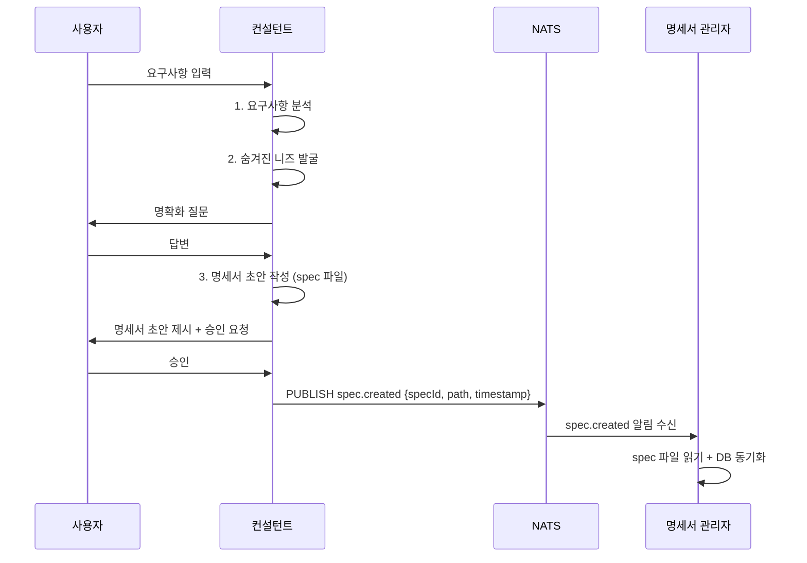

### 데이터 스키마

```typescript
// ⚠️ 로직 이해용 예시 코드 — 실제 에이전트는 .agents/agents/*.md 프롬프트로 구현
import { z } from 'zod';

const RequirementAnalysisSchema = z.object({
  originalInput: z.string(),
  clarifiedRequirements: z.array(z.string()),
  hiddenNeeds: z.array(z.object({
    need: z.string(),
    reason: z.string(),
    priority: z.enum(['high', 'medium', 'low']),
  })),
  technicalConstraints: z.array(z.string()),
  outOfScope: z.array(z.string()),
});

const SpecDraftSchema = z.object({
  title: z.string(),
  description: z.string(),
  requirements: z.array(z.object({
    id: z.string(),
    description: z.string(),
    acceptance: z.array(z.string()),
    priority: z.enum(['must', 'should', 'could', 'wont']),
  })),
  technicalNotes: z.array(z.string()),
  estimatedComplexity: z.enum(['simple', 'medium', 'complex']),
});
```

### NATS 통신

**설계 원칙**: NATS 메시지는 "변경 알림"만 담고, 상세 내용은 spec 파일에 저장

| 방향 | 토픽 | 페이로드 | 상세 정보 위치 |
|------|------|---------|--------------|
| 발행 | `spec.created` | `{ type, specId, path, timestamp }` | `specs/{specId}.yaml` |
| 발행 | `spec.status-changed` | `{ type, specId, from, to, timestamp }` | `specs/{specId}.yaml` |
| 구독 | `spec.approved` | `{ type, specId, timestamp }` | `specs/{specId}.yaml` |
| 구독 | `spec.review-requested` | `{ type, specId, timestamp }` | `specs/{specId}.yaml` |

**메시지 크기**: 평균 ~100 bytes (JSON), Redis 대비 ~99% 감소

### MCP 도구 / 스킬

| 도구 | 용도 |
|------|------|
| Context7 | 라이브러리 문서 조회 (기술 제약사항 확인) |
| Exa Web Search | 최신 기술 트렌드, 유사 사례 검색 |
| Serena | 프로젝트 심볼 탐색 (기존 코드와의 관계 분석) |

### 에러 처리

| 에러 상황 | 대응 | 에스컬레이션 |
|-----------|------|-------------|
| 사용자 무응답 (5분) | 타임아웃 경고 후 세션 유지 | 30분 후 세션 종료 |
| 명세서 초안 거부 | 피드백 수집 → 수정 → 재제시 | 3회 거부 시 사용자에게 직접 작성 제안 |
| NATS 발행 실패 | 3회 재시도 (지수 백오프) | spec 파일은 이미 저장되었으므로 Watchman이 백업 감지 |

## 명세서 관리자 상세 설계

### 역할과 책임

| 항목 | 내용 |
|------|------|
| **핵심 역할** | 명세서 CRUD, 진행 추적, 문서 관리, spec 파일 변경 감지 |
| **Pod** | coordinator Pod (컨테이너 1/3, 프로젝트 리드·리뷰어와 공존) |
| **기존 매핑** | doc-manager 확장 |
| **입력** | 컨설턴트의 명세서 초안, Worker 진행 보고, spec 파일 변경 이벤트 |
| **출력** | 정제된 명세서, 진행 상황 🟢🟡🔴, 업데이트된 문서, NATS 알림 |

### 실행 환경

- **Pod 유형**: coordinator Pod (Deployment, replicas: 1, multi-container)
- **컨테이너**: spec-manager (이 에이전트) + project-lead + reviewer (공존)
- **Watchman 감시 대상**: `specs/`, `docs/`
- **스토리지**: PVC RWX (specs/, docs/ 읽기+쓰기 권한)
- **리소스**: CPU 150m~300m, Memory 192Mi~384Mi (Pod 전체: 500m~1000m / 768Mi~1536Mi)

### Watchman 트리거 설정

```json
// ⚠️ 로직 이해용 예시 코드 — 실제 에이전트는 .agents/agents/*.md 프롬프트로 구현
{
  "triggers": [
    {
      "name": "spec-change",
      "expression": ["allof",
        ["dirname", "specs"],
        ["suffix", ".yaml"]
      ],
      "command": ["node", "triggers/on-spec-change.js"]
    },
    {
      "name": "doc-change",
      "expression": ["allof",
        ["dirname", "docs"],
        ["anyof", ["suffix", ".md"], ["suffix", ".mdx"]]
      ],
      "command": ["node", "triggers/on-doc-change.js"]
    }
  ]
}
```

### 진행 추적 알고리즘

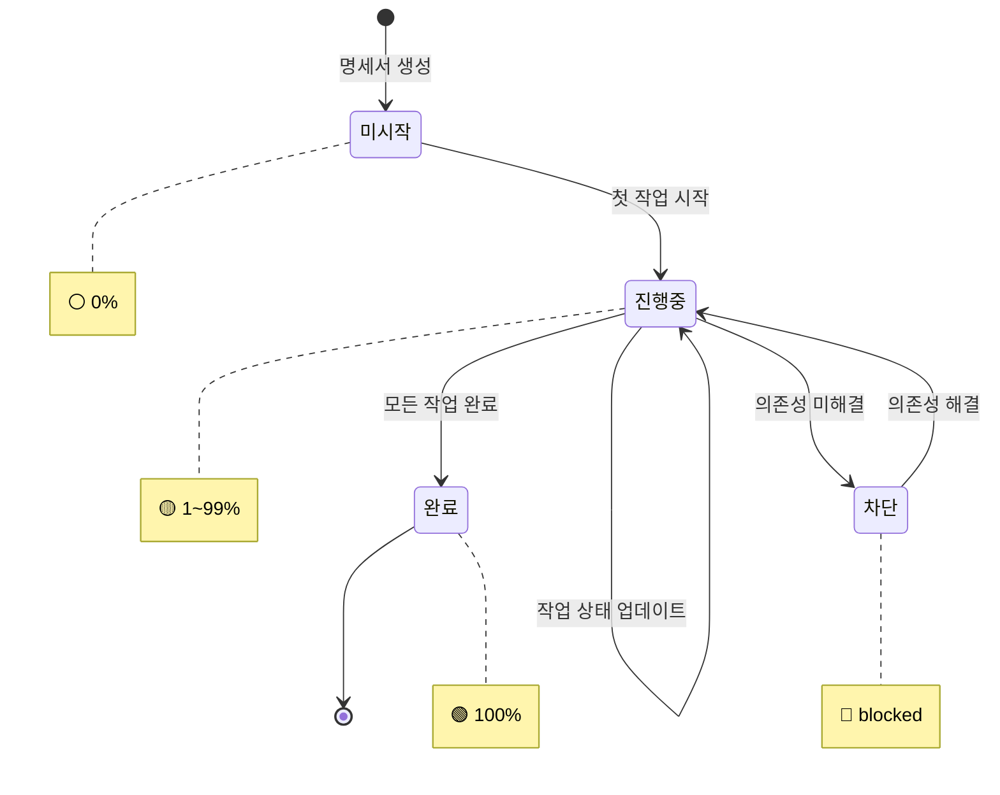

```typescript
// ⚠️ 로직 이해용 예시 코드 — 실제 에이전트는 .agents/agents/*.md 프롬프트로 구현
interface ProgressTracker {
  calculateProgress(spec: Specification): ProgressReport;
}

interface ProgressReport {
  overall: number; // 0~100
  emoji: '🟢' | '🟡' | '🔴' | '⚪';
  tasks: {
    total: number;
    completed: number;
    inProgress: number;
    failed: number;
    blocked: number;
  };
  estimatedCompletion: Date | null;
}

class SpecProgressTracker implements ProgressTracker {
  calculateProgress(spec: Specification): ProgressReport {
    const tasks = spec.tasks;
    const total = tasks.length;
    const completed = tasks.filter(t => t.status === 'completed').length;
    const failed = tasks.filter(t => t.status === 'failed').length;
    const blocked = tasks.filter(t => t.status === 'blocked').length;
    const inProgress = tasks.filter(t => t.status === 'in-progress').length;

    const percentage = total > 0 ? Math.round((completed / total) * 100) : 0;

    let emoji: ProgressReport['emoji'];
    if (blocked > 0 || failed > 0) emoji = '🔴';
    else if (percentage === 100) emoji = '🟢';
    else if (percentage > 0) emoji = '🟡';
    else emoji = '⚪';

    return {
      overall: percentage,
      emoji,
      tasks: { total, completed, inProgress, failed, blocked },
      estimatedCompletion: this.estimateCompletion(tasks),
    };
  }

  private estimateCompletion(tasks: Task[]): Date | null {
    // 완료된 작업의 평균 소요 시간으로 추정
    const completedTasks = tasks.filter(t => t.completedAt && t.startedAt);
    if (completedTasks.length === 0) return null;

    const avgDuration = completedTasks.reduce((sum, t) => {
      return sum + (t.completedAt!.getTime() - t.startedAt!.getTime());
    }, 0) / completedTasks.length;

    const remaining = tasks.filter(t => t.status !== 'completed').length;
    return new Date(Date.now() + avgDuration * remaining);
  }
}
```

### PostgreSQL 연동

```sql
-- ⚠️ 로직 이해용 예시 — 실제 스키마는 구현 Phase에서 확정
-- 명세서 관리자가 YAML ↔ PostgreSQL 동기화에 사용하는 주요 쿼리

-- 명세서 상태 업데이트
UPDATE specifications
SET status = $1, version = $2, updated_at = NOW()
WHERE id = $3 AND version = $4
RETURNING *;

-- 진행 상황 조회 (작업별)
SELECT
  s.id AS spec_id,
  s.title,
  COUNT(*) AS total_tasks,
  COUNT(*) FILTER (WHERE t.status = 'completed') AS completed,
  COUNT(*) FILTER (WHERE t.status = 'in-progress') AS in_progress,
  COUNT(*) FILTER (WHERE t.status = 'failed') AS failed
FROM specifications s
LEFT JOIN tasks t ON t.spec_id = s.id
WHERE s.id = $1
GROUP BY s.id, s.title;
```

### NATS 통신

**설계 원칙**: 명세서의 상세 내용은 YAML 파일에 저장되며, NATS는 변경 알림만 전달

| 방향 | 토픽 | 페이로드 | 상세 정보 위치 |
|------|------|---------|--------------|
| 구독 | `spec.created` | `{ type, specId, path, timestamp }` | `specs/{specId}.yaml` |
| 구독 | `spec.task-completed` | `{ type, specId, taskId, timestamp }` | `specs/{specId}.yaml` (tasks[] 배열) |
| 구독 | `spec.task-failed` | `{ type, specId, taskId, timestamp }` | `specs/{specId}.yaml` (tasks[] 배열) |
| 발행 | `spec.status-changed` | `{ type, specId, from, to, timestamp }` | `specs/{specId}.yaml` (status 필드) |
| 발행 | `spec.progress-updated` | `{ type, specId, progress, timestamp }` | `specs/{specId}.yaml` (progress 필드) |

**메시지 크기**: 평균 ~100 bytes, 명세서 내용은 PVC에 저장 (NATS 메모리 사용량 최소화)

### MCP 도구 / 스킬

| 도구 | 용도 |
|------|------|
| Serena | 프로젝트 심볼 탐색 (문서-코드 일관성 검증) |
| Context7 | 라이브러리 문서 (버전 정보 최신성 확인) |

### 에러 처리

| 에러 상황 | 대응 | 에스컬레이션 |
|-----------|------|-------------|
| YAML 파싱 실패 | Zod 검증 오류 로그 + 이전 버전 유지 | 컨설턴트에게 수정 요청 |
| PostgreSQL 동기화 실패 | 3회 재시도 + YAML을 진실의 원천으로 유지 | 알림 + 수동 동기화 |
| Watchman 트리거 폭주 | 디바운스 (500ms) + 배치 처리 | 큐 초과 시 경고 |

---

## 프로젝트 리드 상세 설계

### 역할과 책임

| 항목 | 내용 |
|------|------|
| **핵심 역할** | 기술 계획 수립, 작업 분할, 아키텍처 의사결정 |
| **Pod** | coordinator Pod (컨테이너 2/3, 명세서 관리자·리뷰어와 공존) |
| **기존 매핑** | 신규 (master-orchestrator의 작업 분배 기능 계승) |
| **입력** | 명세서 관리자의 승인된 명세서 (spec 파일 변경 감지) |
| **출력** | 기술 계획 + 작업 큐 (spec 파일 tasks[] 배열 업데이트) |

### 실행 환경

- **Pod 유형**: coordinator Pod (Deployment, replicas: 1, multi-container)
- **컨테이너**: project-lead (이 에이전트) + spec-manager + reviewer (공존)
- **Watchman 감시 대상**: `specs/` (승인된 명세서 감지)
- **스토리지**: PVC RWX (specs/ 읽기+쓰기, 계획서 쓰기)
- **리소스**: CPU 200m~400m, Memory 256Mi~512Mi (Pod 전체: 500m~1000m / 768Mi~1536Mi)

### 작업 분할 알고리즘

**설계 근거**: DAG(Directed Acyclic Graph) 기반으로 작업을 분할하여, 의존성이 없는 작업을 병렬 실행하고, 크리티컬 패스를 식별하여 전체 소요 시간을 최적화합니다.

```mermaid
flowchart TD
    SPEC[승인된 명세서] --> ANALYZE[요구사항 분석]
    ANALYZE --> DECOMPOSE[작업 분해]
    DECOMPOSE --> DEP[의존성 그래프 생성]
    DEP --> CRITICAL[크리티컬 패스 분석]
    CRITICAL --> ASSIGN[Worker 능력 기반 할당]
    ASSIGN --> UPDATE[spec 파일 tasks[] 업데이트]
    UPDATE --> NOTIFY[NATS worker.needed 알림]
    
    NOTIFY --> W1[Worker-1: 기능 개발]
    NOTIFY --> W2[Worker-2: 테스트 작성]
    NOTIFY --> W3[Worker-3: 보안 스캔]
```

```typescript
// ⚠️ 로직 이해용 예시 코드 — 실제 에이전트는 .agents/agents/*.md 프롬프트로 구현
interface TaskDecomposition {
  specId: string;
  tasks: DecomposedTask[];
  dependencyGraph: Map<string, string[]>; // taskId → dependsOn[]
  criticalPath: string[]; // 크리티컬 패스 taskId 순서
  estimatedTotalTime: number; // 분 단위
}

interface DecomposedTask {
  id: string;
  type: 'feature' | 'test' | 'refactor' | 'fix' | 'security-scan';
  title: string;
  description: string;
  requiredCapabilities: string[]; // Worker 필요 능력
  estimatedTime: number; // 분 단위
  priority: number; // 1~10
  dependsOn: string[]; // 선행 작업 ID
}

class TaskDecomposer {
  async decompose(spec: Specification): Promise<TaskDecomposition> {
    // 1. 요구사항별 작업 생성
    const tasks = await this.createTasks(spec.requirements);
    
    // 2. 의존성 그래프 구축
    const graph = this.buildDependencyGraph(tasks);
    
    // 3. 크리티컬 패스 계산 (위상 정렬 + 최장 경로)
    const criticalPath = this.calculateCriticalPath(graph, tasks);
    
    // 4. 병렬 실행 그룹 식별
    const parallelGroups = this.identifyParallelGroups(graph);
    
    return {
      specId: spec.id,
      tasks,
      dependencyGraph: graph,
      criticalPath,
      estimatedTotalTime: this.estimateTotal(criticalPath, tasks),
    };
  }

  private calculateCriticalPath(
    graph: Map<string, string[]>,
    tasks: DecomposedTask[]
  ): string[] {
    // 위상 정렬 후 최장 경로 계산
    const sorted = this.topologicalSort(graph);
    const distances = new Map<string, number>();
    const predecessors = new Map<string, string>();

    for (const taskId of sorted) {
      const task = tasks.find(t => t.id === taskId)!;
      const deps = graph.get(taskId) || [];
      
      let maxDist = 0;
      let maxPred = '';
      for (const dep of deps) {
        const depDist = distances.get(dep) || 0;
        if (depDist > maxDist) {
          maxDist = depDist;
          maxPred = dep;
        }
      }
      
      distances.set(taskId, maxDist + task.estimatedTime);
      if (maxPred) predecessors.set(taskId, maxPred);
    }

    // 최장 경로 역추적
    let current = [...distances.entries()].sort((a, b) => b[1] - a[1])[0][0];
    const path = [current];
    while (predecessors.has(current)) {
      current = predecessors.get(current)!;
      path.unshift(current);
    }
    
    return path;
  }
}
```

### Worker 할당 전략

**설계 근거**: 능력 기반 할당(Capability-Based Assignment)으로 전문화된 Worker에게 적합한 작업을 분배하고, 부하 분산으로 특정 Worker에 작업이 몰리지 않도록 합니다.

| 전략 | 설명 | 적용 시기 |
|------|------|----------|
| 능력 기반 | Worker의 capabilities와 작업의 requiredCapabilities 매칭 | 항상 (1차 필터) |
| 부하 분산 | 활성 작업 수가 가장 적은 Worker 선택 | 능력 매칭 후 (2차) |
| 라운드 로빈 | 동일 조건 시 순번 할당 | 동일 부하 시 (3차) |
| 우선순위 | 크리티컬 패스 작업 우선 할당 | 큐 정렬 시 |

### NATS 통신

**설계 원칙**: 작업 목록은 spec 파일의 tasks[] 배열에 저장되며, NATS는 "작업 준비됨" 알림만 전달

| 방향 | 토픽 | 페이로드 | 상세 정보 위치 |
|------|------|---------|--------------|
| 구독 | `spec.approved` | `{ type, specId, timestamp }` | `specs/{specId}.yaml` |
| 구독 | `spec.unblocked` | `{ type, specId, taskId, timestamp }` | `specs/{specId}.yaml` (tasks[].status) |
| 발행 | `spec.task-assigned` | `{ type, specId, taskId, timestamp }` | `specs/{specId}.yaml` (tasks[]) |
| 발행 | `worker.needed` | `{ type, count, timestamp }` | spec 파일의 미할당 작업 개수 |

**KEDA 스케일링**: `worker.needed` 메시지를 NATS scaler로 감지하여 Worker Pod 0→3 자동 스케일링

### MCP 도구 / 스킬

| 도구 | 용도 |
|------|------|
| Serena | 프로젝트 심볼 탐색 (아키텍처 결정 시 기존 구조 파악) |
| Context7 | 라이브러리 문서 (기술 호환성 확인) |
| Grep.app | GitHub 코드 검색 (유사 구현 패턴 참조) |

### 에러 처리

| 에러 상황 | 대응 | 에스컬레이션 |
|-----------|------|-------------|
| 순환 의존성 감지 | DAG 검증 실패 → 사용자에게 의존성 수정 요청 | 컨설턴트를 통해 사용자 알림 |
| Worker 능력 부족 | 해당 작업 대기 큐에 유지 + 범용 Worker 할당 시도 | 사용자에게 수동 개입 요청 |
| 작업 분할 실패 | 명세서 재분석 → 더 작은 단위로 분할 시도 | 3회 실패 시 사용자 알림 |

---

## 깃 매니저 상세 설계

### 역할과 책임

| 항목 | 내용 |
|------|------|
| **핵심 역할** | Git 중앙 관리, 커밋/브랜치/머지 (로컬 전용), Worker 제출물 적용, PR 생성 (인간 푸시) |
| **Pod** | gateway Pod (컨테이너 2/2, 컨설턴트와 공존) |
| **기존 매핑** | git-guardian + github-helper 통합 |
| **입력** | 리뷰어의 커밋 요청, Worker의 diff/patch (spec 파일 기반) |
| **출력** | Git 로컬 작업 (커밋, 브랜치, 머지), PR 생성 (인간이 푸시) |

### 실행 환경

- **Pod 유형**: gateway Pod (Deployment, replicas: 1, multi-container)
- **컨테이너**: git-manager (이 에이전트) + consultant (공존)
- **네트워크**: 내부 전용 (NATS, GitHub API 접근), **외부 push 금지**
- **스토리지**: PVC RWX (전체 프로젝트 쓰기 권한, 로컬 Git 작업만)
- **리소스**: CPU 300m~600m, Memory 384Mi~768Mi (Pod 전체: 550m~1100m / 640Mi~1280Mi)

### Git 보안 정책 (Push 금지)

**설계 근거**: 에이전트의 자동 push는 보안 사고(secrets 유출, malicious code injection) 위험이 크므로, 모든 push는 인간의 검토와 승인을 거쳐야 합니다.

| 작업 | 에이전트 권한 | 인간 권한 | 이유 |
|------|-------------|----------|------|
| `git commit` | ✅ 허용 | ✅ 허용 | 로컬 작업, 롤백 가능 |
| `git branch` | ✅ 허용 | ✅ 허용 | 로컬 작업 |
| `git merge` (로컬) | ✅ 허용 | ✅ 허용 | 로컬 작업, squash 가능 |
| `git push` | ❌ **절대 금지** | ✅ 허용 | 보안 검토 필수 |
| `git push --force` | ❌ **절대 금지** | ⚠️ 신중 허용 | 히스토리 변경 위험 |
| PR 생성 (no-push) | ✅ 허용 | ✅ 허용 | push 없이 PR 초안 가능 |

### Pre-Push 보안 검토 프로세스

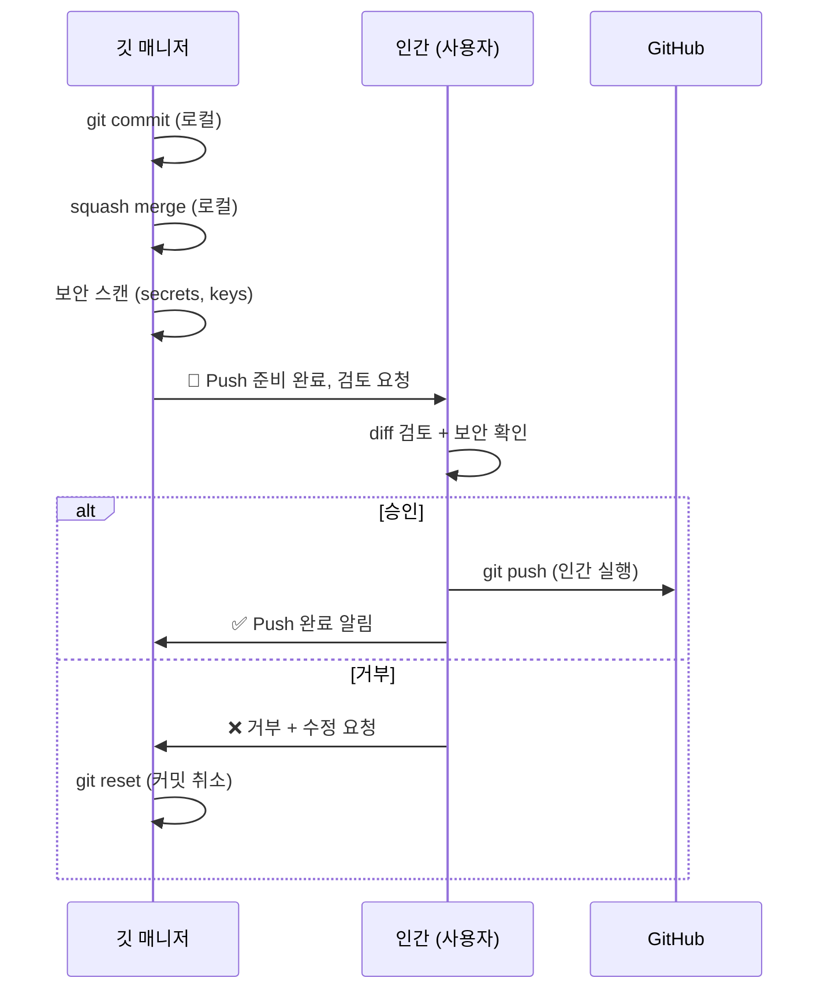

**자동 보안 스캔 (Pre-Push)**:
- `git-secrets` 또는 `trufflehog` 실행
- `.env`, `credentials.json`, API keys, private keys 탐지
- 발견 시 커밋 취소 + 경고

### 자동/수동 승인 정책

**설계 근거**: 안전한 작업은 자동화하여 워크플로우 효율을 높이되, 원격 저장소 변경은 반드시 사용자 확인을 거쳐 안전성을 보장합니다.

| 작업 | 승인 유형 | 설명 |
|------|----------|------|
| `develop` → `main` PR 생성 (draft) | ✅ 자동 | PR 초안 생성만, push는 인간이 수행 |
| 계획서 승인 → `feature/*` PR 생성 (draft) | ✅ 자동 | PR 초안 생성만, push는 인간이 수행 |
| Git 로컬 커밋 | ✅ 자동 | 로컬 작업, 롤백 가능 |
| Git 로컬 브랜치 생성/삭제 | ✅ 자동 | 로컬 작업 |
| Git 로컬 머지 | ✅ 자동 | 로컬 작업 |
| **Git 푸시** | ❌ **수동 (인간만)** | 보안 검토 필수 |
| PR 승인/머지 | ❌ 수동 | 사용자 확인 필요 |
| 브랜치 원격 삭제 | ❌ 수동 | 사용자 확인 필요 |

### Worker 제출물 처리 (Spec 파일 기반)

**설계 근거**: Worker Pod는 읽기 전용이므로 직접 Git 작업을 할 수 없습니다. Worker가 `/scratch`에서 생성한 diff를 spec 파일의 `submissions[]` 배열에 기록하고, Watchman이 감지하여 깃 매니저가 적절한 브랜치에 적용합니다.

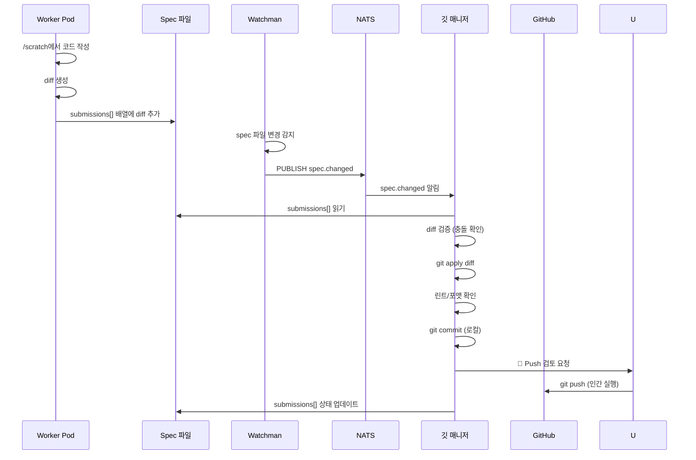

```typescript
// ⚠️ 로직 이해용 예시 코드 — 실제 에이전트는 .agents/agents/*.md 프롬프트로 구현
interface Submission {
  id: string;
  specId: string;
  taskId: string;
  workerId: string;
  diff: string; // unified diff format
  metadata: {
    filesChanged: string[];
    linesAdded: number;
    linesDeleted: number;
    testsPassed: boolean;
    timestamp: string;
  };
}

class SubmissionProcessor {
  async processSubmission(submission: Submission): Promise<void> {
    // 1. diff 검증
    const validation = await this.validateDiff(submission.diff);
    if (!validation.valid) {
      await this.rejectSubmission(submission, validation.errors);
      return;
    }

    // 2. 충돌 확인
    const conflicts = await this.checkConflicts(submission);
    if (conflicts.length > 0) {
      await this.handleConflicts(submission, conflicts);
      return;
    }

    // 3. diff 적용
    await this.applyDiff(submission.specId, submission.diff);

    // 4. 린트/포맷 자동 수정
    await this.autoFixLint(submission.metadata.filesChanged);

    // 5. 사용자 승인 대기 (커밋)
    await this.requestCommitApproval(submission);
  }

  private async handleConflicts(
    submission: Submission,
    conflicts: ConflictInfo[]
  ): Promise<void> {
    // 충돌 해결 전략:
    // 1. 자동 해결 가능한 경우 (non-overlapping changes) → 자동 머지
    // 2. 수동 해결 필요 → 사용자에게 알림 + 충돌 정보 제공
    const autoResolvable = conflicts.filter(c => c.type === 'non-overlapping');
    const manualRequired = conflicts.filter(c => c.type === 'overlapping');

    if (autoResolvable.length > 0) {
      await this.autoResolveConflicts(autoResolvable);
    }
    if (manualRequired.length > 0) {
      await this.notifyConflict(submission, manualRequired);
    }
  }
}
```

### NATS 통신

**설계 근거**: submission 상세 정보는 spec 파일에 저장되며, NATS는 변경 알림만 전달

| 방향 | 토픽 | 페이로드 | 상세 정보 위치 |
|------|------|---------|--------------|
| 구독 | `spec.changed` | `{ type, specId, path, timestamp }` | `specs/{specId}.yaml` (submissions[]) |
| 구독 | `review.approved` | `{ type, specId, taskId, timestamp }` | `specs/{specId}.yaml` |
| 발행 | `git.committed` | `{ type, specId, branch, timestamp }` | Git 로그 (로컬) |
| 발행 | `git.pr-created` | `{ type, prNumber, branch, timestamp }` | GitHub API (draft PR) |
| 발행 | `git.conflict` | `{ type, specId, files, timestamp }` | `specs/{specId}.yaml` (conflicts[]) |

**메시지 크기**: ~100 bytes, diff 내용은 spec 파일에 저장

### MCP 도구 / 스킬

| 도구 | 용도 |
|------|------|
| GitHub MCP | PR 생성/관리, Issue 연동, CI/CD 확인 |

### 에러 처리

| 에러 상황 | 대응 | 에스컬레이션 |
|-----------|------|-------------|
| diff 적용 실패 | 3회 재시도 → 실패 시 Worker에게 재생성 요청 | spec 파일에 실패 기록 + 사용자 알림 |
| Git 충돌 | 자동 해결 시도 → 실패 시 사용자에게 충돌 정보 제공 | 수동 머지 요청 |
| GitHub API 오류 | 지수 백오프 재시도 (3회) | 알림 + 수동 처리 |
| **Push 시도 감지** | ❌ **즉시 차단** + 경고 로그 | 사용자에게 보안 정책 위반 알림 |

---

## 리뷰어 상세 설계

### 역할과 책임

| 항목 | 내용 |
|------|------|
| **핵심 역할** | 코드 리뷰 + 보안 검증 (tech-architect 통합) |
| **Pod** | coordinator Pod (컨테이너 3/3, 명세서 관리자·프로젝트 리드와 공존) |
| **기존 매핑** | tech-architect 흡수 |
| **입력** | Worker의 제출물 (깃 매니저 경유, spec 파일) |
| **출력** | 리뷰 보고서 (✅⚠️🚨) |

### 실행 환경

- **Pod 유형**: coordinator Pod (Deployment, replicas: 1, multi-container)
- **컨테이너**: reviewer (이 에이전트) + spec-manager + project-lead (공존)
- **Watchman 감시 대상**: feature/* 브랜치 변경 감지 (Git 커밋 후)
- **스토리지**: PVC RO (읽기 전용, 보안 정책)
- **리소스**: CPU 150m~300m, Memory 320Mi~640Mi (Pod 전체: 500m~1000m / 768Mi~1536Mi)

### 리뷰 체크리스트

**설계 근거**: tech-architect의 품질/보안 검증과 코드 리뷰를 통합하여, 단일 리뷰 프로세스에서 모든 관점을 검증합니다.

| 카테고리 | 검증 항목 | 도구 |
|----------|----------|------|
| **FSD 아키텍처** | 레이어 의존성, 역방향 import 금지 | AST 분석 |
| **코드 스타일** | Import 순서, TypeScript strict, 네이밍 | ESLint |
| **보안** | XSS, 인젝션, 환경변수 노출, Zod 검증 | Semgrep MCP |
| **성능** | 불필요한 리렌더링, 메모이제이션, 번들 크기 | 정적 분석 |
| **타입 안전성** | any 금지, 타입 추론, strict 모드 | TypeScript 컴파일러 |
| **테스트** | 커버리지 80%+, 엣지 케이스, Property-based | 테스트 실행 |
| **접근성** | ARIA 속성, 키보드 네비게이션, 스크린 리더 | axe-core |

### 검증 보고서 포맷

```typescript
// ⚠️ 로직 이해용 예시 코드 — 실제 에이전트는 .agents/agents/*.md 프롬프트로 구현
interface ReviewReport {
  specId: string;
  taskId: string;
  reviewedAt: string;
  overallVerdict: 'pass' | 'improvements_needed' | 'blocked';
  verdictEmoji: '✅' | '⚠️' | '🚨';
  categories: {
    architecture: CheckResult;
    codeStyle: CheckResult;
    security: CheckResult;
    performance: CheckResult;
    typeSafety: CheckResult;
    testing: CheckResult;
    accessibility: CheckResult;
  };
  summary: string;
  actionItems: ActionItem[];
}

interface CheckResult {
  status: 'pass' | 'warning' | 'fail';
  items: CheckItem[];
  score: number; // 0~100
}

interface ActionItem {
  severity: 'critical' | 'major' | 'minor' | 'suggestion';
  file: string;
  line?: number;
  description: string;
  suggestedFix?: string;
}
```

### 리뷰 프로세스

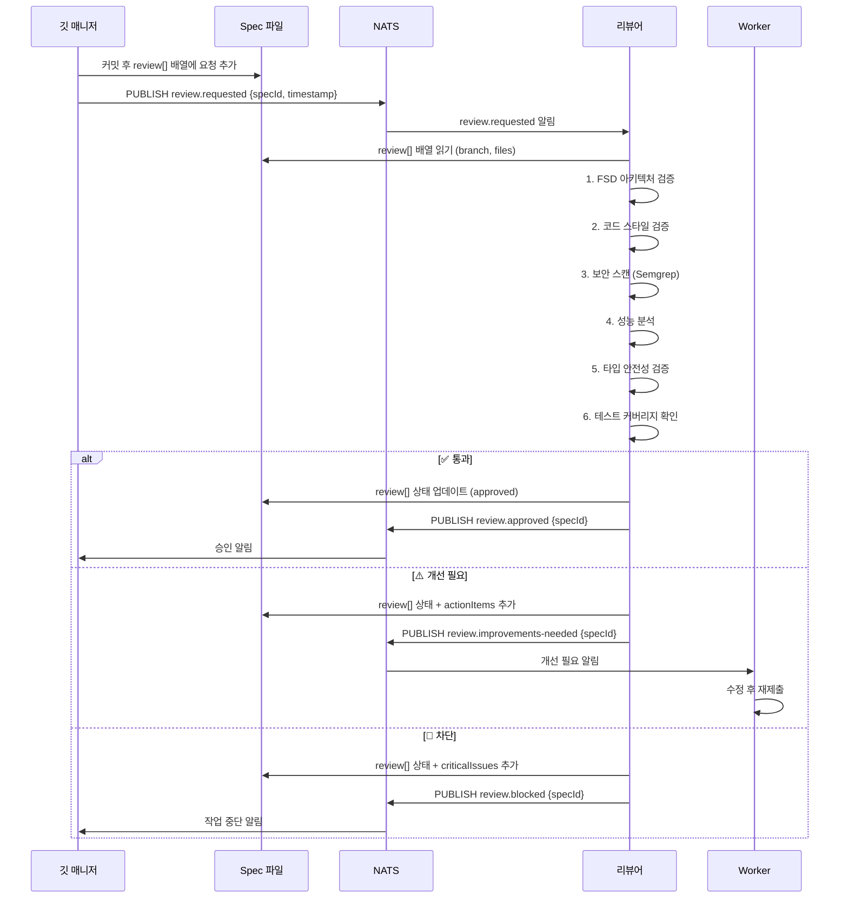

### NATS 통신

| 방향 | 토픽 | 페이로드 | 상세 정보 위치 |
|------|------|---------|--------------|
| 구독 | `review.requested` | `{ type, specId, timestamp }` | `specs/{specId}.yaml` (review[]) |
| 발행 | `review.approved` | `{ type, specId, timestamp }` | `specs/{specId}.yaml` (review[].status) |
| 발행 | `review.improvements-needed` | `{ type, specId, timestamp }` | `specs/{specId}.yaml` (actionItems[]) |
| 발행 | `review.blocked` | `{ type, specId, timestamp }` | `specs/{specId}.yaml` (criticalIssues[]) |

### MCP 도구 / 스킬

| 도구 | 용도 |
|------|------|
| Semgrep MCP | 보안 취약점 정적 분석 |
| Serena | 심볼 탐색 (FSD 레이어 의존성 확인) |

### 에러 처리

| 에러 상황 | 대응 | 에스컬레이션 |
|-----------|------|-------------|
| Semgrep 스캔 실패 | 보안 카테고리 skip 표시 + 나머지 리뷰 진행 | 수동 보안 리뷰 요청 |
| 파일 접근 불가 (PVC) | Pod 재시작 시도 | K8s 관리자 알림 |
| 리뷰 시간 초과 (10분) | 부분 리뷰 결과 발행 + 타임아웃 표시 | 사용자에게 수동 리뷰 제안 |

---

## 신입 개발자 상세 설계

### 역할과 책임

| 항목 | 내용 |
|------|------|
| **핵심 역할** | "왜?" 질문 생성, 지식 문서화, 시행착오 DB 관리 |
| **Pod** | coordinator Pod (optional sidecar) 또는 독립 CronJob |
| **기존 매핑** | retrospector 흡수 |
| **입력** | Git 변경 이력, 리뷰 결과, 작업 실패 로그 (spec 파일) |
| **출력** | 질문 리스트, 시행착오 문서, 학습 자료 |

### 실행 환경

- **Pod 유형**: CronJob (daily) 또는 Watchman trigger (실시간)
- **Watchman 감시 대상**: `.git/refs/` (브랜치 변경 감지)
- **스토리지**: PVC RWX (docs/trial-errors/ 쓰기 권한)
- **리소스**: CPU 100m~200m, Memory 128Mi~256Mi (경량, 우선순위 낮음)

### retrospector 흡수 설계

**설계 근거**: 기존 retrospector의 "잘한 점 / 개선점 / 프롬프트 개선 제안" 3축 분석을 신입 개발자의 "왜?" 질문 문화에 통합합니다. 회고 분석은 결국 "왜 그렇게 했는가?"라는 질문의 연장이며, 시행착오 DB에 축적되어 향후 유사한 상황에서 참조됩니다.

| retrospector 기능 | 신입 개발자에서의 위치 |
|-------------------|----------------------|
| "잘한 점" 분석 | 성공 패턴으로 시행착오 DB에 저장 |
| "개선점" 분석 | "왜?" 질문 → 개선 제안으로 변환 |
| "프롬프트 개선 제안" | 에이전트 학습 자료로 문서화 |
| 회고 문서 작성 | docs/trial-errors/ 에 통합 |

### "왜?" 질문 생성 알고리즘

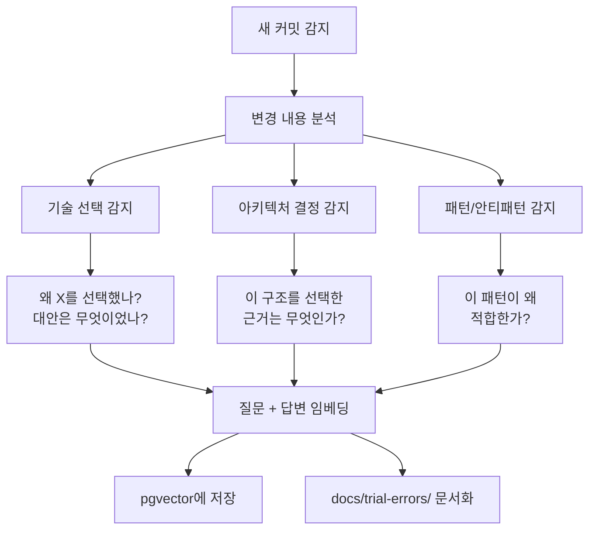

```typescript
// ⚠️ 로직 이해용 예시 코드 — 실제 에이전트는 .agents/agents/*.md 프롬프트로 구현
interface TrialErrorEntry {
  id: string;
  specId: string;
  taskId: string;
  category: 'success' | 'failure' | 'lesson';
  question: string;     // "왜?" 질문
  answer: string;       // 답변 (프로젝트 리드 or 리뷰어)
  context: string;      // 관련 코드/커밋 컨텍스트
  embedding: number[];  // 1536차원 벡터 (OpenAI)
  tags: string[];       // 검색용 태그
  createdAt: string;
  verifiedBy?: string;  // 검증한 에이전트
}

class QuestionGenerator {
  async analyzeCommit(commit: Commit): Promise<Question[]> {
    const questions: Question[] = [];
    const diff = await this.getDiff(commit);

    // 1. 새로운 의존성 추가 감지
    if (this.detectNewDependency(diff)) {
      questions.push({
        type: 'why',
        question: `왜 ${this.extractDependency(diff)}를 추가했나요? 기존 라이브러리로 대체할 수 없었나요?`,
        priority: 8,
      });
    }

    // 2. 아키텍처 패턴 변경 감지
    if (this.detectArchChange(diff)) {
      questions.push({
        type: 'why',
        question: `이 구조 변경의 근거는 무엇인가요? FSD 레이어 규칙을 준수하나요?`,
        priority: 9,
      });
    }

    // 3. 유사 실패 검색 (pgvector)
    const similarFailures = await this.searchSimilarFailures(diff);
    if (similarFailures.length > 0) {
      questions.push({
        type: 'warning',
        question: `유사한 접근이 과거에 실패한 적이 있습니다: ${similarFailures[0].context}. 이번에는 왜 다른가요?`,
        priority: 10,
      });
    }

    return questions;
  }
}
```

### PostgreSQL + pgvector 연동

```sql
-- ⚠️ 로직 이해용 예시 — 실제 스키마는 구현 Phase에서 확정

-- 시행착오 테이블
CREATE TABLE trial_errors (
  id UUID PRIMARY KEY DEFAULT gen_random_uuid(),
  spec_id VARCHAR(64),
  task_id VARCHAR(64),
  category VARCHAR(20) NOT NULL CHECK (category IN ('success', 'failure', 'lesson')),
  question TEXT NOT NULL,
  answer TEXT,
  context TEXT,
  embedding vector(1536),
  tags TEXT[],
  verified_by VARCHAR(64),
  created_at TIMESTAMPTZ DEFAULT NOW()
);

-- HNSW 인덱스 (코사인 유사도)
CREATE INDEX idx_trial_errors_embedding
  ON trial_errors USING hnsw (embedding vector_cosine_ops)
  WITH (m = 16, ef_construction = 200);

-- 유사 실패 검색 쿼리
SELECT id, question, answer, context,
       1 - (embedding <=> $1::vector) AS similarity
FROM trial_errors
WHERE category = 'failure'
  AND 1 - (embedding <=> $1::vector) > 0.8
ORDER BY embedding <=> $1::vector
LIMIT 5;
```

### NATS 통신

| 방향 | 토픽 | 페이로드 | 상세 정보 위치 |
|------|------|---------|--------------|
| 구독 | `git.committed` | `{ type, branch, timestamp }` | Git 로그 |
| 구독 | `spec.task-failed` | `{ type, specId, taskId, timestamp }` | `specs/{specId}.yaml` (tasks[]) |
| 구독 | `review.improvements-needed` | `{ type, specId, timestamp }` | `specs/{specId}.yaml` (actionItems[]) |
| 발행 | `junior.question` | `{ type, questionId, timestamp }` | `docs/trial-errors/*.md` |
| 발행 | `junior.trial-error` | `{ type, entryId, timestamp }` | PostgreSQL + docs |

### MCP 도구 / 스킬

| 도구 | 용도 |
|------|------|
| PostgreSQL MCP | pgvector 유사도 검색, 시행착오 CRUD |
| Serena | 프로젝트 심볼 탐색 (변경 영향 분석) |

### 에러 처리

| 에러 상황 | 대응 | 에스컬레이션 |
|-----------|------|-------------|
| 임베딩 생성 실패 | 텍스트 기반 키워드 검색으로 폴백 | 임베딩 서비스 재시작 |
| pgvector 연결 실패 | 로컬 캐시에 질문 저장 후 재시도 | DB 관리자 알림 |
| 질문 답변 없음 (72시간) | 미답변 질문 목록 집계 → 프로젝트 리드에게 전달 | 컨설턴트를 통해 사용자 알림 |

---

## 백그라운드 개발자 상세 설계

### 역할과 책임

| 항목 | 내용 |
|------|------|
| **핵심 역할** | 기능 개발 + 테스트 작성 + 린트/포매팅 (통합) |
| **Pod** | Worker Pod ×N (KEDA 0→3) |
| **기존 매핑** | feature-developer + test-specialist + lint-formatter 통합 |
| **입력** | 작업 큐 (spec 파일 tasks[] 배열) |
| **출력** | diff/patch (spec 파일 submissions[] 배열에 기록) |

### 실행 환경

- **Pod 유형**: Deployment (KEDA ScaledObject, min: 0, max: 3)
- **스토리지**: PVC RO (읽기 전용) + emptyDir `/scratch` (임시 쓰기)
- **네트워크**: 내부 전용 (NATS, PostgreSQL만 접근)
- **리소스**: CPU 500m~1000m, Memory 768Mi~1536Mi (최대 3개 동시 실행)
- **KEDA Scaler**: NATS topic `worker.needed` 메시지 개수 기반

### 통합 설계 근거

| 기존 에이전트 | 백그라운드 개발자에서의 역할 |
|--------------|---------------------------|
| feature-developer | 기능 개발 (컴포넌트, 비즈니스 로직, API 연동) |
| test-specialist | 테스트 작성 (Unit, E2E, Property-based, Storybook) |
| lint-formatter | 코드 작성 시 자동 린트/포매팅 적용 |

**왜 통합하는가**: Worker Pod는 격리된 환경에서 독립적으로 실행됩니다. 하나의 Worker가 기능 개발 → 테스트 작성 → 린트 적용을 일관된 컨텍스트에서 수행하면:
1. **컨텍스트 전환 비용 제거**: 구현 의도를 알고 있는 에이전트가 테스트 작성
2. **TDD 자연스러운 적용**: Red-Green-Refactor 사이클을 단일 에이전트가 수행
3. **통신 오버헤드 제거**: 에이전트 간 파일 전달 불필요
4. **격리된 테스트**: `/scratch`에서 테스트 실행 → 메인 프로젝트 오염 없음

### 작업 유형별 행동

| 유형 | 행동 | 출력 |
|------|------|------|
| `feature` | 컴포넌트/로직 구현 + 관련 테스트 작성 | diff (소스 + 테스트) |
| `test` | 기존 코드에 대한 테스트만 작성 | diff (테스트 파일만) |
| `refactor` | 코드 리팩토링 + 기존 테스트 통과 확인 | diff (수정 코드) |
| `fix` | 버그 수정 + 재현 테스트 작성 | diff (수정 + 테스트) |
| `security-scan` | 보안 취약점 탐지 + 수정 제안 | diff (수정) + 보고서 |

### 코드 → diff → 제출 프로세스

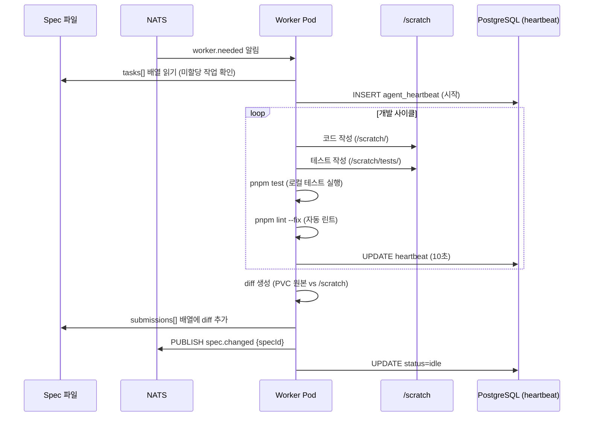

```typescript
// ⚠️ 로직 이해용 예시 코드 — 실제 에이전트는 .agents/agents/*.md 프롬프트로 구현
class BackgroundDeveloper {
  private scratchDir = '/scratch';
  private workerId: string;

  async executeTask(task: DecomposedTask): Promise<void> {
    // 1. 작업 환경 준비
    await this.prepareScratch(task);
    this.startHeartbeat();

    try {
      // 2. 작업 유형별 실행
      switch (task.type) {
        case 'feature':
          await this.developFeature(task);
          await this.writeTests(task);
          break;
        case 'test':
          await this.writeTests(task);
          break;
        case 'refactor':
          await this.refactorCode(task);
          await this.verifyExistingTests();
          break;
        case 'fix':
          await this.writeReproductionTest(task);
          await this.fixBug(task);
          await this.verifyFix();
          break;
        case 'security-scan':
          await this.scanSecurity(task);
          break;
      }

      // 3. 린트/포매팅 자동 적용
      await this.runLintFix();

      // 4. 로컬 테스트 실행
      const testResult = await this.runTests();
      if (!testResult.passed) {
        await this.fixFailingTests(testResult);
      }

      // 5. diff 생성 및 제출
      const diff = await this.generateDiff();
      await this.submitDiff(task, diff, testResult);

    } catch (error) {
      await this.reportFailure(task, error);
    } finally {
      this.stopHeartbeat();
      await this.cleanupScratch();
    }
  }

  private async generateDiff(): Promise<string> {
    // PVC 원본과 /scratch 간의 diff 생성
    const originalFiles = await this.listOriginalFiles();
    const scratchFiles = await this.listScratchFiles();
    
    let unifiedDiff = '';
    for (const file of scratchFiles) {
      const original = originalFiles.get(file) || '';
      const modified = await this.readScratchFile(file);
      unifiedDiff += this.createUnifiedDiff(file, original, modified);
    }
    
    return unifiedDiff;
  }

  private async submitDiff(
    task: DecomposedTask,
    diff: string,
    testResult: TestResult
  ): Promise<void> {
    const submission = {
      specId: task.specId,
      taskId: task.id,
      workerId: this.workerId,
      diff,
      metadata: {
        filesChanged: this.extractChangedFiles(diff),
        linesAdded: this.countAdded(diff),
        linesDeleted: this.countDeleted(diff),
        testsPassed: testResult.passed,
        timestamp: new Date().toISOString(),
      },
    };

    await this.redis.xadd(
      `submissions:${task.specId}`,
      '*',
      'data', JSON.stringify(submission)
    );
  }
}
```

### KEDA 스케일링 설정

```yaml
# ⚠️ 로직 이해용 예시 — 실제 매니페스트는 구현 Phase에서 확정
apiVersion: keda.sh/v1alpha1
kind: ScaledObject
metadata:
  name: worker-scaler
spec:
  scaleTargetRef:
    name: worker-deployment
  minReplicaCount: 0
  maxReplicaCount: 3  # 6에서 3으로 감소 (리소스 예산 준수)
  pollingInterval: 15
  cooldownPeriod: 300
  triggers:
    - type: nats-jetstream  # redis에서 nats로 변경
      metadata:
        natsServerMonitoringEndpoint: "nats.default.svc.cluster.local:8222"
        account: "default"
        stream: "worker_tasks"  # spec 파일 기반 작업 큐
        consumer: "worker_consumer"
        lagThreshold: "1"  # 대기 중인 작업이 1개 이상이면 스케일업
```

**설계 근거**: 
- spec 파일의 미할당 tasks 개수를 NATS로 알림
- Worker가 tasks를 claim하면 NATS 메시지 ack 처리
- 최대 3개까지 스케일링 (리소스 예산: 1.5 CPU / 2.3GB RAM)
- 5분간 작업이 없으면 0으로 축소하여 비용 최적화

### 하트비트 관리

| 항목 | 값 | 설명 |
|------|---|------|
| 갱신 주기 | 10초 | `UPDATE agent_heartbeats SET updated_at = NOW()` |
| TTL | 30초 | 미갱신 시 offline 간주 |
| 장애 감지 | 30초 | 30초 이상 미갱신 → 프로젝트 리드가 작업 재할당 |
| 상태 값 | `idle`, `busy`, `offline` | PostgreSQL 테이블에 저장 |

### NATS 통신

| 방향 | 토픽 | 페이로드 | 상세 정보 위치 |
|------|------|---------|--------------|
| 구독 | `worker.needed` | `{ type, count, timestamp }` | `specs/{specId}.yaml` (tasks[]) |
| 구독 | `spec.changed` | `{ type, specId, path, timestamp }` | `specs/{specId}.yaml` (tasks[]) |
| 발행 | `spec.task-completed` | `{ type, specId, taskId, timestamp }` | `specs/{specId}.yaml` (submissions[]) |
| 발행 | `spec.task-failed` | `{ type, specId, taskId, reason, timestamp }` | `specs/{specId}.yaml` (failures[]) |

**PostgreSQL 사용**: 하트비트는 NATS 대신 PostgreSQL에 저장 (agent_heartbeats 테이블)

### MCP 도구 / 스킬

| 도구 | 용도 |
|------|------|
| Context7 | 라이브러리 문서 (구현 시 API 참조) |
| Serena | 심볼 탐색 (기존 코드 패턴 파악) |
| Grep.app | GitHub 코드 검색 (구현 패턴 참조) |
| Exa | 최신 베스트 프랙티스 검색 |

### 에러 처리

| 에러 상황 | 대응 | 에스컬레이션 |
|-----------|------|-------------|
| 테스트 실패 (자동 수정 가능) | 3회까지 자동 수정 시도 | 3회 실패 → 실패 보고 |
| 테스트 실패 (자동 수정 불가) | 실패 보고 + 부분 diff 제출 | 프로젝트 리드 → 작업 재할당 |
| /scratch 디스크 초과 | 불필요 파일 정리 → 재시도 | Pod 재시작 |
| 작업 타임아웃 (30분) | 진행 상황 스냅샷 저장 + 타임아웃 보고 | 프로젝트 리드에게 분할 요청 |
| NATS 연결 끊김 | 지수 백오프 재연결 (5회) | Pod 재시작 (K8s) |
| 하트비트 만료 | — (자동 offline 전환, PostgreSQL) | 작업 재할당 (프로젝트 리드) |

---

## Pod 배치 및 리소스

### Pod 구조 요약

**설계 근거**: 관련 에이전트를 multi-container Pod로 묶어 통신 지연을 줄이고, 리소스를 효율적으로 사용합니다.

| Pod 이름 | 컨테이너 | 리소스 (CPU / RAM) | 역할 | 외부 노출 |
|----------|---------|-------------------|------|----------|
| **gateway** | consultant, git-manager | 550m~1100m / 640Mi~1280Mi | 사용자 대면, Git 관리 | ✅ 외부 |
| **coordinator** | spec-manager, project-lead, reviewer | 500m~1000m / 768Mi~1536Mi | 내부 조율, 리뷰 | ❌ 내부 |
| **nats** | nats-server | 50m~100m / 64Mi~128Mi | 경량 메시징 | ❌ 내부 |
| **postgresql** | postgres + pgvector | 250m~500m / 512Mi~1024Mi | 시행착오 DB, 하트비트 | ❌ 내부 |
| **Worker (×0~3)** | background-dev | 500m~1000m each / 768Mi~1536Mi each | 개발+테스트 | ❌ 내부 |

**총 리소스 (Worker 0개 시)**:
- CPU: 1.35 ~ 2.7 cores
- RAM: 1984Mi ~ 3968Mi (1.9 ~ 3.9GB)

**총 리소스 (Worker 3개 시)**:
- CPU: 2.85 ~ 5.7 cores (k3s 포함 시 3.35 ~ 6.2 cores)
- RAM: 4288Mi ~ 8576Mi (4.2 ~ 8.4GB, k3s 포함 시 5GB ~ 9.3GB)

**k3s overhead**: ~0.5 CPU, ~750MB RAM

### Pod 간 통신

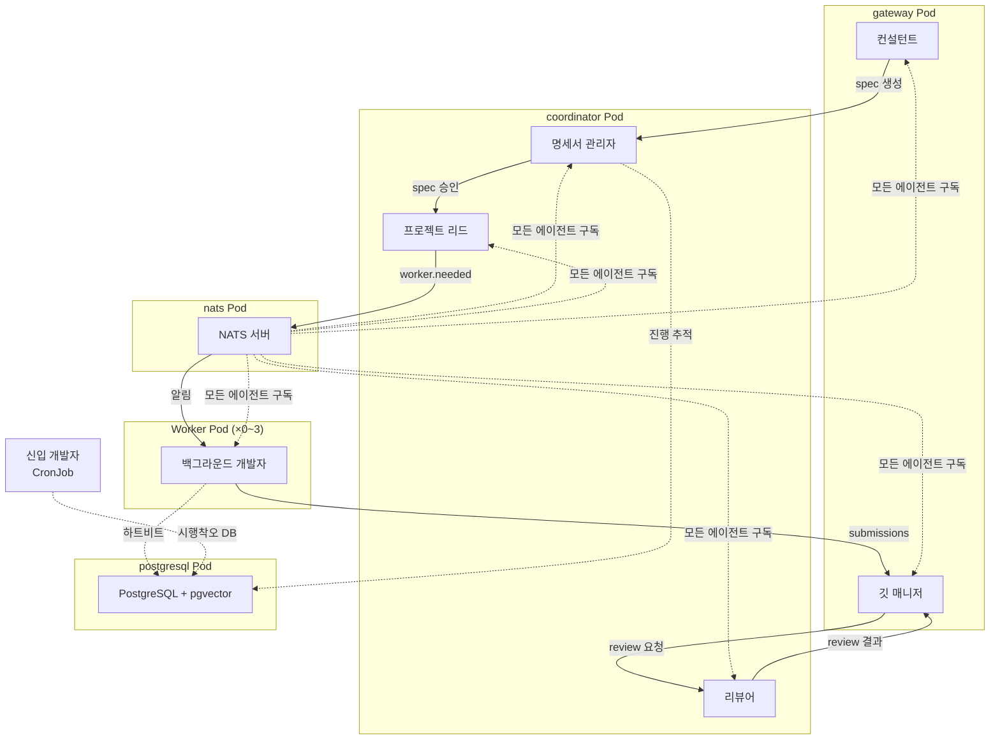

---

## 에이전트 간 통신 매트릭스

### 통신 매트릭스 테이블

**설계 근거**: 에이전트 간 통신을 명확히 정의하여 역할 경계를 보장하고, NATS 경량 알림 + spec 파일 기반 상세 정보 전달로 메모리 사용량을 최소화합니다.

| 발신자 \ 수신자 | 컨설턴트 | 명세서 관리자 | 프로젝트 리드 | 깃 매니저 | 리뷰어 | 신입 개발자 | 백그라운드 개발자 |
|----------------|----------|-------------|-------------|----------|--------|-----------|----------------|
| **컨설턴트** | — | spec.created (NATS) | — | — | — | — | — |
| **명세서 관리자** | spec.approved (NATS) | — | spec.approved (NATS) | — | — | — | — |
| **프로젝트 리드** | — | spec.task-assigned (NATS) | — | — | — | junior.question (NATS) | worker.needed (NATS) |
| **깃 매니저** | — | git.committed (NATS) | — | — | review.requested (NATS) | git.committed (NATS) | — |
| **리뷰어** | — | review.completed (NATS) | — | review.approved (NATS) | — | review.improvements-needed (NATS) | review.improvements-needed (NATS) |
| **신입 개발자** | junior.question (NATS) | junior.trial-error (NATS) | junior.question (NATS) | — | — | — | — |
| **백그라운드 개발자** | — | spec.task-completed (NATS) | — | spec.changed (NATS, submissions[]) | — | spec.task-failed (NATS) | — |

### 통신 프로토콜별 사용 시나리오

| 프로토콜 | 사용 시나리오 | 특징 |
|----------|-------------|------|
| **NATS Pub/Sub** | 모든 에이전트 간 이벤트 알림 | 경량, ~100 bytes 페이로드, 상세 정보는 spec 파일 |
| **Spec 파일 (YAML)** | 명세서, 작업, 제출물, 리뷰 결과 저장 | PVC에 저장, Watchman 감지, NATS는 변경 알림만 |
| **PostgreSQL** | 하트비트, 시행착오 DB, 진행 추적 | 영구 저장, pgvector 유사도 검색, optimistic locking |
| **Watchman** | spec 파일 변경 감지 → NATS 알림 | 실시간 파일 시스템 감시, debounce 500ms |

### 전체 데이터 흐름

```mermaid
graph TD
    U[사용자] -->|요구사항| CON[컨설턴트]
    CON -->|spec.created| SM[명세서 관리자]
    SM -->|spec.approved| PL[프로젝트 리드]
    PL -->|worker.needed| BG[백그라운드 개발자 ×0~3]
    BG -->|spec.changed<br/>submissions[]| GM[깃 매니저]
    GM -->|review.requested| RV[리뷰어]
    
    RV -->|review.approved| GM
    RV -->|review.improvements-needed| BG
    
    GM -->|git.committed| JR[신입 개발자]
    BG -->|spec.task-failed| JR
    JR -->|junior:question| PL
    
    SM -->|spec.progress-updated| CON
    CON -->|상태 보고| U
    
    style CON fill:#4CAF50,color:#fff
    style SM fill:#FF9800,color:#fff
    style PL fill:#2196F3,color:#fff
    style GM fill:#9C27B0,color:#fff
    style RV fill:#F44336,color:#fff
    style JR fill:#00BCD4,color:#fff
    style BG fill:#795548,color:#fff
```

### 에이전트별 NATS 토픽 요약

| 에이전트 | 구독 토픽 | 발행 토픽 |
|----------|----------|----------|
| 컨설턴트 | `spec.approved`, `spec.progress-updated` | `spec.created`, `spec.status-changed` |
| 명세서 관리자 | `spec.created`, `spec.task-completed`, `spec.task-failed` | `spec.status-changed`, `spec.progress-updated`, `spec.approved` |
| 프로젝트 리드 | `spec.approved`, `spec.unblocked`, `junior.question` | `spec.task-assigned`, `worker.needed` |
| 깃 매니저 | `review.approved`, `spec.changed` (submissions[]) | `git.committed`, `git.pr-created`, `git.conflict`, `review.requested` |
| 리뷰어 | `review.requested` | `review.approved`, `review.improvements-needed`, `review.blocked` |
| 신입 개발자 | `git.committed`, `spec.task-failed`, `review.improvements-needed` | `junior.question`, `junior.trial-error` |
| 백그라운드 개발자 | `worker.needed`, `spec.changed` | `spec.changed` (submissions[]), `spec.task-completed`, `spec.task-failed` |

---

## Git 보안 정책

### Push 금지 정책 (ALL Agents)

**설계 근거**: 에이전트의 자동 push는 보안 사고(secrets 유출, malicious code injection, force push 리스크) 위험이 크므로, **모든 에이전트에 대해** push를 금지하고 인간의 검토와 승인을 의무화합니다.

| 작업 | 모든 에이전트 | 인간 (사용자) | 이유 |
|------|-------------|-------------|------|
| `git commit` (로컬) | ✅ 허용 | ✅ 허용 | 로컬 작업, 롤백 가능 |
| `git branch` (로컬) | ✅ 허용 | ✅ 허용 | 로컬 작업 |
| `git merge` (로컬) | ✅ 허용 | ✅ 허용 | 로컬 작업, squash 가능 |
| **`git push`** | ❌ **절대 금지** | ✅ 허용 | 보안 검토 필수 |
| **`git push --force`** | ❌ **절대 금지** | ⚠️ 신중 허용 | 히스토리 변경 위험 |
| PR 생성 (draft, no-push) | ✅ 허용 | ✅ 허용 | push 없이 PR 초안 가능 |

### Pre-Push 보안 검토 프로세스

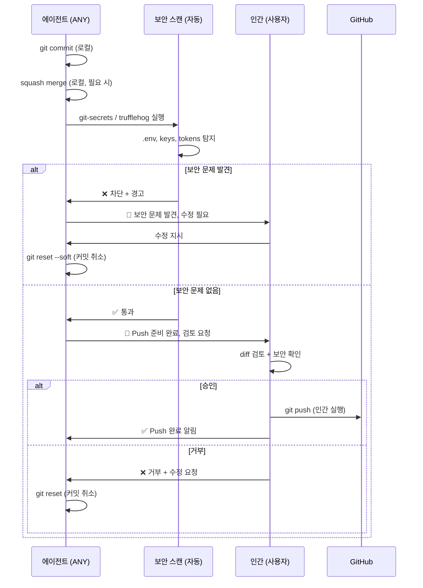

### 자동 보안 스캔 (Pre-Push, 필수)

**도구**: `git-secrets` (AWS Labs) 또는 `trufflehog` (TruffleHog)

**탐지 대상**:
- `.env`, `.env.local`, `credentials.json`
- AWS Access Key ID (정규식: `AKIA[0-9A-Z]{16}`)
- API keys, private keys, OAuth tokens
- Database connection strings (password 포함)
- JWT secrets, encryption keys

**동작**:
1. 커밋 전 자동 실행 (pre-commit hook)
2. 발견 시 **커밋 차단** + 상세 경고 메시지
3. 에이전트에게 경고 전달 → 사용자에게 알림
4. 사용자 수동 수정 후 재시도

### Push 금지 적용 시기

- **Phase 1** (Migration Plan): Pod 배포 시 NetworkPolicy로 외부 push 차단
- **K8s NetworkPolicy**: gateway Pod는 GitHub API 접근 허용, but `git push` 포트 차단
- **Git hooks**: pre-push hook에서 에이전트 실행 감지 시 차단

---

## 역할 경계와 충돌 방지

### 역할 중복 가능성 분석

**설계 근거**: 역할 통합으로 인해 발생할 수 있는 책임 중복을 사전에 식별하고, 단일 책임 원칙(SRP)을 적용하여 명확한 경계를 설정합니다.

| 충돌 영역 | 관련 에이전트 | 중복 내용 | 해결 방안 |
|-----------|-------------|----------|----------|
| 아키텍처 검증 | 리뷰어 vs 프로젝트 리드 | 둘 다 FSD 구조를 검증 | 프로젝트 리드는 **사전 설계** 단계, 리뷰어는 **사후 검증** 단계로 분리 |
| 명세서 수정 | 명세서 관리자 vs 프로젝트 리드 | 둘 다 명세서를 수정할 수 있음 | 명세서 관리자는 **상태/진행률** 수정, 프로젝트 리드는 **작업 분할** 수정으로 분리 |
| 자체 검증 vs 외부 검증 | 백그라운드 개발자 vs 리뷰어 | 백그라운드 개발자도 린트/테스트를 자체 실행 | 백그라운드 개발자는 **1차 자체 검증**, 리뷰어는 **2차 독립 검증**으로 분리 |
| 문서 관리 | 명세서 관리자 vs 신입 개발자 | 둘 다 docs/에 문서를 작성 | 명세서 관리자는 **프로젝트 문서**, 신입 개발자는 **시행착오 문서(docs/trial-errors/)** 로 경로 분리 |
| Git 작업 | 깃 매니저 독점 | 다른 에이전트가 Git 작업 시도 가능 | 깃 매니저만 Git 쓰기 권한 (로컬), **모든 에이전트 push 금지** |

### 동시 접근 제어

**설계 근거**: 복수 에이전트가 동일 리소스(명세서, 파일, 작업)에 동시 접근할 때 데이터 무결성을 보장합니다.

| 리소스 | 접근 제어 방식 | 설명 |
|--------|--------------|------|
| 명세서 YAML 파일 | PostgreSQL Advisory Lock | `pg_advisory_lock(spec_id_hash)` — 동시 수정 방지 |
| Spec 작업 큐 | Optimistic Locking | spec 파일 version 필드로 충돌 감지 |
| Git 브랜치 | 깃 매니저 직렬화 | 모든 Git 쓰기 작업을 깃 매니저가 순차 처리 |
| PVC 파일 | Pod별 권한 분리 | Worker는 읽기 전용, 특정 Pod만 특정 디렉토리 쓰기 |

### 에스컬레이션 경로

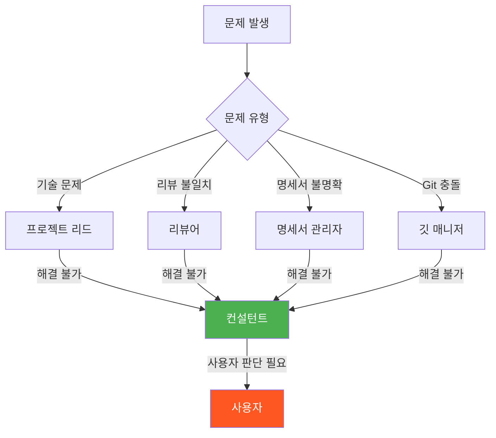

**규칙**:
1. 각 에이전트는 자신의 책임 범위 내에서 먼저 해결을 시도
2. 해결 불가 시 상위 에이전트(프로젝트 리드 또는 컨설턴트)로 에스컬레이션
3. 최종 에스컬레이션은 컨설턴트를 통해 사용자에게 전달
4. 에스컬레이션 시 문제 컨텍스트, 시도한 해결 방법, 제안된 옵션을 포함

---

## 마이그레이션 경로

### Phase 1: 에이전트 프롬프트 리팩토링 (2주)

**목표**: 기존 `.agents/agents/*.md` 프롬프트를 새 역할 체계에 맞게 수정

| 작업 | 내용 | 파일 |
|------|------|------|
| 1.1 | feature-developer + test-specialist 통합 → background-dev.md | `.agents/agents/background-dev.md` |
| 1.2 | git-guardian + github-helper 통합 → git-manager.md | `.agents/agents/git-manager.md` |
| 1.3 | tech-architect → reviewer.md로 흡수 | `.agents/agents/reviewer.md` |
| 1.4 | retrospector → junior.md로 흡수 | `.agents/agents/junior.md` |
| 1.5 | doc-manager → spec-manager.md로 확장 | `.agents/agents/spec-manager.md` |
| 1.6 | 컨설턴트 신규 작성 | `.agents/agents/consultant.md` |
| 1.7 | master-orchestrator 비활성화 | `.agents/agents/master-orchestrator.md` → deprecated |
| 1.8 | lint-formatter 비활성화 | `.agents/agents/lint-formatter.md` → deprecated |

**롤백**: Git 브랜치로 이전 프롬프트 복원 가능

### Phase 2: 비동기 통신 기반 구축 (3주)

**목표**: Redis + Watchman 통신 레이어 구축

| 작업 | 내용 | 의존성 |
|------|------|--------|
| 2.1 | Redis 컨테이너 구성 + 키 네임스페이스 설정 | — |
| 2.2 | Watchman 설정 파일 작성 (각 Pod별) | — |
| 2.3 | OpenCode Plugin 브릿지 구현 (Redis ↔ OpenCode) | 2.1 |
| 2.4 | 하트비트 시스템 구현 | 2.1 |
| 2.5 | 작업 큐 + Pub/Sub 채널 설정 | 2.1 |
| 2.6 | Redis Stream + Consumer Group 설정 | 2.1 |
| 2.7 | PostgreSQL + pgvector 초기화 | — |

**롤백**: 기존 동기식 시스템과 병행 운영 가능 (feature flag)

### Phase 3: Kubernetes 배포 (4주)

**목표**: K8s 클러스터에 전체 시스템 배포

| 작업 | 내용 | 의존성 |
|------|------|--------|
| 3.1 | K8s Deployment 매니페스트 작성 (각 Pod별) | 2.* |
| 3.2 | PVC (EFS/Longhorn RWX) 구성 | 3.1 |
| 3.3 | NetworkPolicy 설정 (에이전트 간 격리) | 3.1 |
| 3.4 | KEDA ScaledObject 설정 (Worker Pod) | 3.1, 2.5 |
| 3.5 | RBAC 구성 (Pod별 권한 분리) | 3.1 |
| 3.6 | 통합 테스트 실행 | 3.1~3.5 |
| 3.7 | 모니터링 + 알림 설정 | 3.6 |

**롤백**: K8s Deployment rollout undo

### 전체 마이그레이션 타임라인

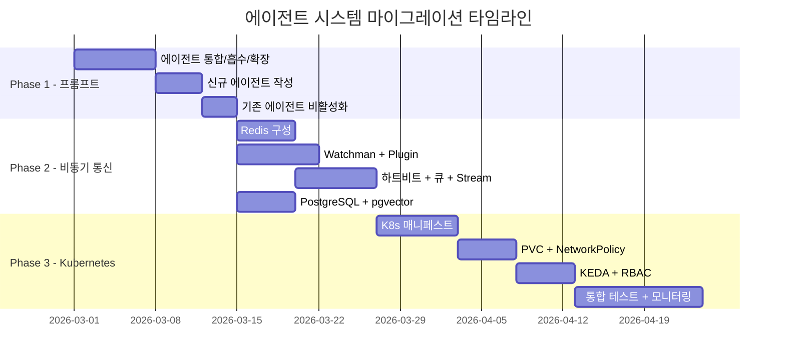

### 하위 호환성 유지

| 단계 | 호환성 방안 |
|------|-----------|
| Phase 1 | 기존 에이전트와 새 에이전트 병행 운영 (opencode.json에서 선택) |
| Phase 2 | Feature flag로 동기식/비동기식 전환 가능 |
| Phase 3 | K8s 환경과 로컬 환경 모두 지원 (Kubernetes 없이도 동작 가능) |

---

## 버전 정보

| 항목 | 내용 |
|------|------|
| **버전** | v3.0.0 |
| **작성일** | 2026-02-18 |
| **최종 수정일** | 2026-02-19 |
| **작성자** | doc-manager |
| **상태** | 확정 (Confirmed) — NATS 기반 v3.0.0 아키텍처 |
| **관련 문서** | [multi-agent-system.md](./multi-agent-system.md), [spec-system.md](./spec-system.md), [migration-plan.md](./migration-plan.md) |

### 변경 이력

| 버전 | 날짜 | 변경 내용 |
|------|------|----------|
| v3.0.0 | 2026-02-19 | **NATS 전환 + Pod 통합** — Redis→NATS Core, Pod 8→4+Worker(0→3), Git push 금지 정책, spec 파일 중심 통신 |
| v2.0.0 | 2026-02-18 | Kubernetes + KEDA 오토스케일링 설계 추가 |
| v1.0.0 | 2026-02-18 | 초안 작성 — 7개 에이전트 상세 설계, Redis 통신 매트릭스, 마이그레이션 경로 |

---
