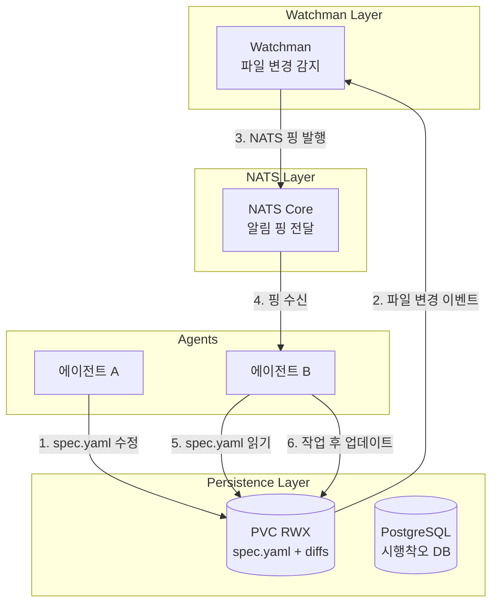
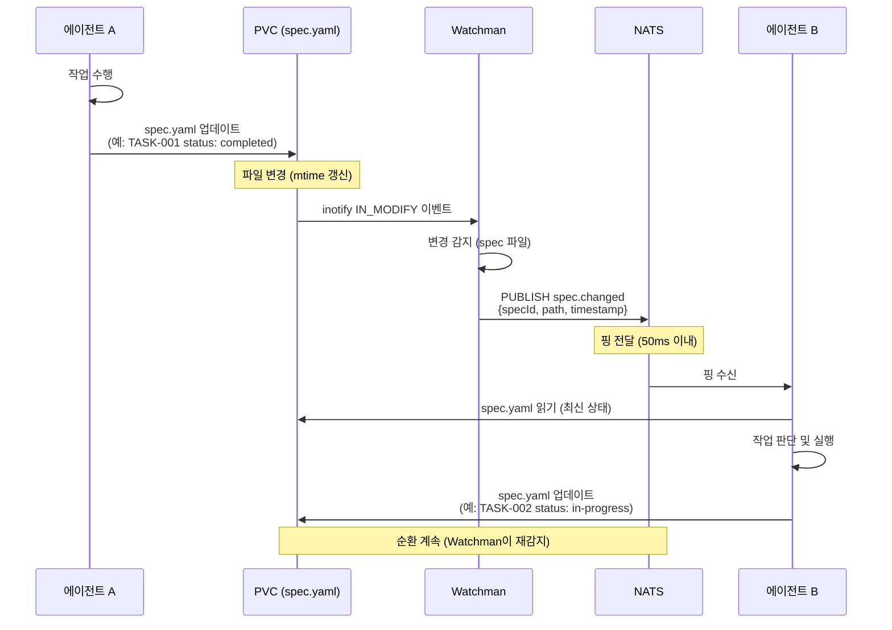
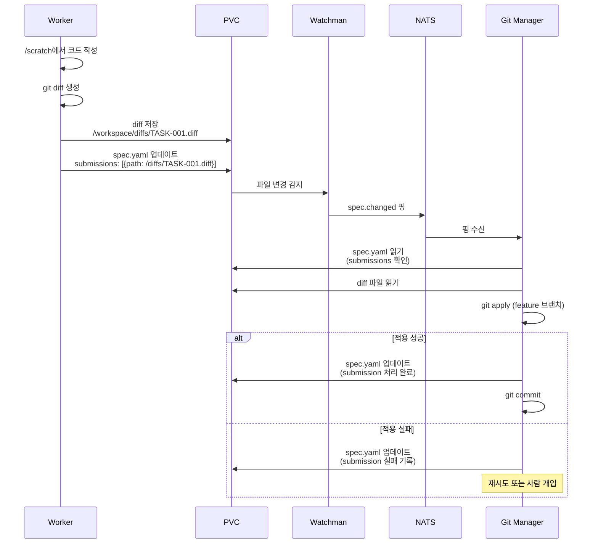

# 비동기 통신 아키텍처 상세 설계 (v3.0.0)

## 개요

### 문서 목적

이 문서는 멀티 에이전트 시스템에서 에이전트 간 **명세서 중심 비동기 통신(Spec-Driven Asynchronous Communication)**의 구현 가능한 상세 설계를 정의합니다. [multi-agent-system.md](./multi-agent-system.md)의 "비동기 통신 아키텍처" 섹션에서 제시한 개요를 구체화하여 NATS 기반 알림 핑 시스템, 명세서 파일 변경 감지, Watchman 통합, 에러 핸들링 전략을 상세히 명시합니다.

### 관련 문서

- **상위 문서**: [multi-agent-system.md](./multi-agent-system.md) — 전체 멀티 에이전트 아키텍처
- **참고 문서**:
  - [spec-system.md](./spec-system.md) — 명세서 시스템 포맷 및 상태 관리
  - [architecture.md](../architecture.md) — FSD 구조
  - [security.md](../security.md) — 보안 규칙

### v2.0.0 대비 핵심 변경사항

| 항목 | v2.0.0 (Redis 기반) | v3.0.0 (명세서 중심) |
|------|---------------------|----------------------|
| **MQ** | Redis (100~300MB) | NATS Core (~50MB) |
| **통신 모델** | 24채널 Pub/Sub + Stream | 명세서 파일 + 알림 핑 |
| **메시지 페이로드** | 상세 정보 포함 (JSON) | 극도로 간결 (핑만) |
| **상태 저장** | Redis Hash/Stream | spec.yaml 파일 (PVC) |
| **순서 보장** | Stream 사용 | 파일 버전 (spec.version) |
| **재처리** | Stream ACK/NACK | Watchman 주기적 폴백 |
| **JetStream** | 미사용 | 미사용 (spec 파일이 persistent state) |

### 설계 목적

1. **통신 단순화**: 복잡한 Redis 채널 → 명세서 파일 + 간결한 NATS 핑
2. **리소스 효율**: Redis 100~300MB → NATS ~50MB (50~83% 감소)
3. **상태 일관성**: 단일 진실 공급원 (spec.yaml) 중심 통신
4. **장애 복원력**: Watchman 주기적 폴백으로 핑 유실 보완
5. **확장성**: NATS Core는 수평 확장 가능 (필요 시)

### 통신 계층 개요 (v3.0.0)



---

## 1. NATS Core 토폴로지

### 1.1 NATS 인스턴스 구성

#### 개발 환경: 단일 NATS 인스턴스

```yaml
# ⚠️ 로직 이해용 예시 — 실제 매니페스트는 구현 Phase에서 확정
# k8s/nats-deployment.yaml

apiVersion: apps/v1
kind: Deployment
metadata:
  name: nats
  namespace: multi-agent
spec:
  replicas: 1
  selector:
    matchLabels:
      app: nats
  template:
    metadata:
      labels:
        app: nats
    spec:
      containers:
      - name: nats
        image: nats:2.10-alpine
        ports:
        - containerPort: 4222
          name: client
        - containerPort: 8222
          name: monitoring
        command:
        - nats-server
        - --port
        - "4222"
        - --http_port
        - "8222"
        - --max_payload
        - "1MB"
        - --max_connections
        - "100"
        resources:
          requests:
            cpu: "50m"
            memory: "64Mi"
          limits:
            cpu: "200m"
            memory: "128Mi"
---
apiVersion: v1
kind: Service
metadata:
  name: nats
spec:
  selector:
    app: nats
  ports:
  - port: 4222
    name: client
  - port: 8222
    name: monitoring
```

**설계 근거**:
- **max_payload: 1MB**: 핑 메시지는 수백 바이트 수준, 여유 있게 설정
- **max_connections: 100**: 에이전트 10개 × 5 연결 (여유분 포함)
- **JetStream 불필요**: spec 파일이 persistent state 역할

#### 프로덕션 환경: NATS Cluster (옵션)

```yaml
# ⚠️ 로직 이해용 예시 — 실제 매니페스트는 구현 Phase에서 확정
# k8s/nats-cluster.yaml

apiVersion: v1
kind: ConfigMap
metadata:
  name: nats-cluster-config
data:
  nats.conf: |
    cluster {
      name: nats-cluster
      listen: 0.0.0.0:6222
      routes = [
        nats://nats-0.nats:6222
        nats://nats-1.nats:6222
        nats://nats-2.nats:6222
      ]
    }
---
apiVersion: apps/v1
kind: StatefulSet
metadata:
  name: nats
spec:
  replicas: 3
  serviceName: nats
  selector:
    matchLabels:
      app: nats
  template:
    metadata:
      labels:
        app: nats
    spec:
      containers:
      - name: nats
        image: nats:2.10-alpine
        ports:
        - containerPort: 4222
          name: client
        - containerPort: 6222
          name: cluster
        - containerPort: 8222
          name: monitoring
        volumeMounts:
        - name: config
          mountPath: /etc/nats
      volumes:
      - name: config
        configMap:
          name: nats-cluster-config
```

**설계 근거**: 프로덕션에서 고가용성 필요 시 3-node 클러스터 (개발 환경은 단일 인스턴스로 충분)

### 1.2 토픽 네임스페이스 설계

#### 토픽 체계

```
{domain}.{event}
```

#### 토픽 목록 (v3.0.0 - 최소화)

| 토픽 | 트리거 | 구독자 | 페이로드 예시 |
|------|--------|--------|---------------|
| `spec.changed` | spec.yaml 파일 수정 | 전체 에이전트 | `{ specId, path, timestamp }` |
| `spec.completed` | 명세서 완료 | 전체 에이전트 | `{ specId, timestamp }` |
| `worker.needed` | 작업 할당 필요 | KEDA scaler | `{ queueLength, timestamp }` |
| `system.health` | 헬스 체크 | 모니터링 | `{ service, status }` |

**v2.0.0 (Redis 24채널) 대비**: 24개 → 4개 토픽으로 단순화

### 1.3 메시지 포맷 표준

```typescript
// ⚠️ 로직 이해용 예시 코드 — 실제 에이전트는 .agents/agents/*.md 프롬프트로 구현

interface NATSPingMessage {
  type: 'spec.changed' | 'spec.completed' | 'worker.needed' | 'system.health';
  specId?: string;         // spec ID (spec.* 토픽만)
  path?: string;           // spec.yaml 파일 경로
  queueLength?: number;    // worker.needed 토픽만
  service?: string;        // system.health 토픽만
  status?: 'ok' | 'error'; // system.health 토픽만
  timestamp: string;       // ISO 8601
}

// 사용 예시: spec.changed 핑
const ping: NATSPingMessage = {
  type: 'spec.changed',
  specId: 'spec-2026-02-19-001',
  path: '/workspace/specs/active/spec-2026-02-19-001.yaml',
  timestamp: '2026-02-19T10:30:00Z',
};

// 메시지 크기: ~150 bytes (JSON)
```

**설계 근거**: 극도로 간결한 핑 메시지. 상세 정보는 spec 파일에서 읽기

---

## 2. 명세서 중심 통신 흐름

### 2.1 전체 통신 아키텍처



### 2.2 Watchman → NATS 브릿지

```typescript
// ⚠️ 로직 이해용 예시 코드 — 실제 에이전트는 .agents/agents/*.md 프롬프트로 구현
// watchman-nats-bridge.ts

import { Client as WatchmanClient } from 'fb-watchman';
import { connect, StringCodec } from 'nats';

class WatchmanNATSBridge {
  private watchman: WatchmanClient;
  private nats: any;
  private sc: any;

  async initialize() {
    // Watchman 초기화
    this.watchman = new WatchmanClient();
    
    // NATS 연결
    this.nats = await connect({
      servers: [process.env.NATS_URL || 'nats://localhost:4222'],
      reconnect: true,
      maxReconnectAttempts: -1, // 무한 재연결
    });
    this.sc = StringCodec();

    console.log('Watchman-NATS bridge initialized');
  }

  async watchSpecDirectory(dirPath: string) {
    this.watchman.command(['watch-project', dirPath], (error, resp) => {
      if (error) {
        console.error('Failed to watch directory:', error);
        return;
      }

      const { watch, relative_path } = resp;
      const sub = {
        expression: ['allof', ['match', '*.yaml', 'wholename']],
        fields: ['name', 'mtime_ms', 'exists'],
        relative_root: relative_path,
      };

      this.watchman.command(['subscribe', watch, 'spec-changes', sub], (error) => {
        if (error) {
          console.error('Failed to subscribe:', error);
        }
      });
    });

    // 파일 변경 이벤트 핸들러
    this.watchman.on('subscription', async (resp) => {
      if (resp.subscription !== 'spec-changes') return;

      for (const file of resp.files) {
        if (!file.exists) {
          // 파일 삭제 → spec.completed 핑
          await this.publishPing('spec.completed', {
            specId: this.extractSpecId(file.name),
            timestamp: new Date().toISOString(),
          });
        } else {
          // 파일 생성/수정 → spec.changed 핑
          await this.publishPing('spec.changed', {
            specId: this.extractSpecId(file.name),
            path: `/workspace/specs/active/${file.name}`,
            timestamp: new Date().toISOString(),
          });
        }
      }
    });
  }

  private async publishPing(type: string, payload: any) {
    const message = {
      type,
      ...payload,
    };

    try {
      this.nats.publish(type, this.sc.encode(JSON.stringify(message)));
      console.log(`[NATS] Published ${type}: ${JSON.stringify(message)}`);
    } catch (error) {
      console.error(`Failed to publish ${type}:`, error);
    }
  }

  private extractSpecId(fileName: string): string {
    // "spec-2026-02-19-001.yaml" → "spec-2026-02-19-001"
    return fileName.replace('.yaml', '');
  }

  async close() {
    this.watchman.end();
    await this.nats.close();
  }
}

// 사용 예시
const bridge = new WatchmanNATSBridge();
await bridge.initialize();
await bridge.watchSpecDirectory('/workspace/specs/active');
```

**설계 근거**: Watchman이 파일 변경을 실시간 감지 (inotify 기반) → NATS 핑 발행

### 2.3 에이전트의 NATS 구독 패턴

```typescript
// ⚠️ 로직 이해용 예시 코드 — 실제 에이전트는 .agents/agents/*.md 프롬프트로 구현
// agent-nats-subscriber.ts

import { connect, StringCodec, Subscription } from 'nats';
import YAML from 'yaml';
import fs from 'fs/promises';

class AgentNATSSubscriber {
  private nats: any;
  private sc: any;
  private subscriptions: Map<string, Subscription> = new Map();

  async connect() {
    this.nats = await connect({
      servers: [process.env.NATS_URL || 'nats://localhost:4222'],
      reconnect: true,
      maxReconnectAttempts: -1,
    });
    this.sc = StringCodec();

    console.log('Agent connected to NATS');
  }

  async subscribeToSpecChanges(handler: (ping: NATSPingMessage) => Promise<void>) {
    const sub = this.nats.subscribe('spec.changed');
    this.subscriptions.set('spec.changed', sub);

    (async () => {
      for await (const msg of sub) {
        const ping: NATSPingMessage = JSON.parse(this.sc.decode(msg.data));
        console.log(`[NATS] Received spec.changed: ${ping.specId}`);

        try {
          await handler(ping);
        } catch (error) {
          console.error('Handler error:', error);
        }
      }
    })();
  }

  async handleSpecChanged(ping: NATSPingMessage) {
    // 1. spec 파일 읽기 (PVC)
    const specContent = await fs.readFile(ping.path!, 'utf-8');
    const spec = YAML.parse(specContent);

    console.log(`Spec ${ping.specId} version: ${spec.version}, status: ${spec.status}`);

    // 2. 자신에게 할당된 작업 확인
    const myTasks = spec.tasks.filter((task: any) => task.assignedTo === this.agentId);

    // 3. 작업 처리
    for (const task of myTasks) {
      if (task.status === 'pending') {
        await this.executeTask(task);
      }
    }

    // 4. spec 파일 업데이트 (상태 변경)
    spec.tasks = spec.tasks.map((task: any) => {
      if (task.assignedTo === this.agentId && task.status === 'pending') {
        return { ...task, status: 'in-progress', startedAt: new Date().toISOString() };
      }
      return task;
    });

    // 5. PVC에 저장 (Watchman이 재감지 → 순환)
    await fs.writeFile(ping.path!, YAML.stringify(spec), 'utf-8');
    console.log(`Updated spec ${ping.specId}`);
  }

  async close() {
    for (const sub of this.subscriptions.values()) {
      sub.unsubscribe();
    }
    await this.nats.close();
  }
}

// 사용 예시
const subscriber = new AgentNATSSubscriber();
await subscriber.connect();
await subscriber.subscribeToSpecChanges(subscriber.handleSpecChanged.bind(subscriber));
```

**설계 근거**: NATS 핑 수신 → spec 파일 읽기 → 작업 처리 → spec 파일 업데이트 → 순환

### 2.4 Worker → Git Manager 제출 흐름 (v3.0.0)



**v2.0.0 (Redis Stream) 대비**:
- ❌ Redis Stream 제거
- ✅ diff 파일을 PVC에 저장
- ✅ spec.yaml에 경로만 기록
- ✅ Watchman → NATS 핑으로 알림

---

## 3. 에러 핸들링 & 복원력

### 3.1 NATS 핑 유실 시나리오

**문제**: NATS는 Pub/Sub이므로 구독자가 오프라인이면 메시지 유실

**해결**: Watchman 주기적 폴백 + spec 파일 버전 추적

```typescript
// ⚠️ 로직 이해용 예시 코드 — 실제 에이전트는 .agents/agents/*.md 프롬프트로 구현
// fallback-poller.ts

class FallbackPoller {
  private lastSeenVersion: Map<string, string> = new Map();

  async pollSpecFiles(dirPath: string, intervalMs: number = 60000) {
    setInterval(async () => {
      const files = await fs.readdir(dirPath);

      for (const file of files) {
        if (!file.endsWith('.yaml')) continue;

        const path = `${dirPath}/${file}`;
        const content = await fs.readFile(path, 'utf-8');
        const spec = YAML.parse(content);

        const specId = spec.id;
        const lastVersion = this.lastSeenVersion.get(specId);

        if (lastVersion !== spec.version) {
          console.log(`[Fallback] Detected spec change: ${specId} (v${lastVersion} → v${spec.version})`);

          // 핑 유실을 보완하여 강제로 핸들러 호출
          await this.handleSpecChanged({
            type: 'spec.changed',
            specId,
            path,
            timestamp: new Date().toISOString(),
          });

          this.lastSeenVersion.set(specId, spec.version);
        }
      }
    }, intervalMs);
  }
}

// 사용 예시: 1분마다 폴백 체크
const poller = new FallbackPoller();
await poller.pollSpecFiles('/workspace/specs/active', 60000);
```

**설계 근거**: NATS 핑은 빠른 알림 (50ms), 폴백은 안전망 (1분 주기)

### 3.2 재시도 전략

```typescript
// ⚠️ 로직 이해용 예시 코드 — 실제 에이전트는 .agents/agents/*.md 프롬프트로 구현
// retry-strategy.ts

interface RetryConfig {
  maxRetries: number;
  initialDelayMs: number;
  maxDelayMs: number;
  backoffMultiplier: number;
}

const DEFAULT_RETRY_CONFIG: RetryConfig = {
  maxRetries: 5,
  initialDelayMs: 1000, // 1초
  maxDelayMs: 60000, // 60초
  backoffMultiplier: 2,
};

async function retryWithBackoff<T>(
  fn: () => Promise<T>,
  config: RetryConfig = DEFAULT_RETRY_CONFIG
): Promise<T> {
  let attempt = 0;
  let delayMs = config.initialDelayMs;

  while (true) {
    try {
      return await fn();
    } catch (error) {
      attempt++;

      if (attempt >= config.maxRetries) {
        throw new Error(`Max retries (${config.maxRetries}) exceeded: ${error}`);
      }

      console.warn(`Attempt ${attempt} failed, retrying in ${delayMs}ms...`);

      await sleep(delayMs);

      // 지수 백오프
      delayMs = Math.min(delayMs * config.backoffMultiplier, config.maxDelayMs);
    }
  }
}

function sleep(ms: number): Promise<void> {
  return new Promise((resolve) => setTimeout(resolve, ms));
}

// 사용 예시: PVC 파일 읽기 재시도
await retryWithBackoff(async () => {
  return await fs.readFile('/workspace/specs/active/spec-001.yaml', 'utf-8');
});
```

### 3.3 장애 시나리오별 대응 (v3.0.0)

| 장애 | 감지 방법 | 자동 대응 | 수동 대응 | RTO | RPO |
|------|-----------|-----------|-----------|-----|-----|
| **NATS 다운** | 연결 실패 | 재연결 시도 + 폴백 폴러 | NATS 재시작 (K8s) | 1분 | 0 (spec 파일 유지) |
| **Watchman 장애** | 폴백 폴러가 감지 | 폴백 폴러가 계속 작동 | Watchman 재시작 | 1분 | 0 |
| **Worker 장애** | 하트비트 만료 | KEDA 스케일 다운 → 업 | Pod 재시작 (K8s) | 1분 | 0 |
| **PVC 장애** | 파일 읽기 실패 | 재시도 (exponential backoff) | PVC 복원 | 15분 | 5분 (백업 주기) |
| **PostgreSQL 장애** | 쿼리 실패 | 읽기 전용 모드 (시행착오 조회 불가) | DB 복원 | 15분 | 5분 |

---

## 4. 성능 최적화

### 4.1 NATS 연결 풀링

```typescript
// ⚠️ 로직 이해용 예시 코드 — 실제 에이전트는 .agents/agents/*.md 프롬프트로 구현
// nats-connection-pool.ts

class NATSConnectionPool {
  private static instance: any;

  static async getConnection() {
    if (!this.instance) {
      this.instance = await connect({
        servers: [process.env.NATS_URL || 'nats://localhost:4222'],
        reconnect: true,
        maxReconnectAttempts: -1,
        reconnectTimeWait: 1000, // 1초
        maxReconnectWait: 30000, // 30초
      });

      console.log('NATS connection pool initialized');
    }

    return this.instance;
  }
}

// 사용 예시: 모든 에이전트가 동일한 연결 재사용
const nats = await NATSConnectionPool.getConnection();
```

**설계 근거**: 에이전트당 1개 연결 재사용 (연결 오버헤드 최소화)

### 4.2 spec 파일 캐싱

```typescript
// ⚠️ 로직 이해용 예시 코드 — 실제 에이전트는 .agents/agents/*.md 프롬프트로 구현
// spec-cache.ts

class SpecCache {
  private cache: Map<string, { version: string; content: any; expiresAt: number }> = new Map();
  private ttlMs = 30000; // 30초

  async get(specId: string, path: string): Promise<any> {
    const cached = this.cache.get(specId);

    if (cached && Date.now() < cached.expiresAt) {
      // 캐시 히트: 파일 읽기 건너뛰기
      console.log(`[Cache] Hit for ${specId}`);
      return cached.content;
    }

    // 캐시 미스: 파일 읽기
    console.log(`[Cache] Miss for ${specId}`);
    const content = await fs.readFile(path, 'utf-8');
    const spec = YAML.parse(content);

    // 캐시 저장
    this.cache.set(specId, {
      version: spec.version,
      content: spec,
      expiresAt: Date.now() + this.ttlMs,
    });

    return spec;
  }

  invalidate(specId: string) {
    this.cache.delete(specId);
    console.log(`[Cache] Invalidated ${specId}`);
  }
}

// 사용 예시
const cache = new SpecCache();

// spec.changed 핑 수신 시 캐시 무효화
nats.subscribe('spec.changed', async (msg) => {
  const ping = JSON.parse(msg.data);
  cache.invalidate(ping.specId);
});
```

**설계 근거**: 30초 캐시로 반복 읽기 최적화 (Watchman 핑 수신 시 무효화)

### 4.3 Watchman 효율적 구독

```javascript
// ⚠️ 로직 이해용 예시 — 실제 구현은 구현 Phase에서 확정
// .watchmanconfig

{
  "ignore_dirs": [
    ".git",
    "node_modules",
    ".next",
    "dist",
    "build"
  ],
  "settle": 20
}
```

**설계 근거**: `settle: 20ms` — 파일 변경 후 20ms 대기 후 이벤트 발행 (빈번한 알림 방지)

---

## 5. 모니터링 & 관측성 (v3.0.0 - 경량화)

### 5.1 kubectl logs 기반 모니터링

```bash
# ⚠️ 로직 이해용 예시 — 실제 명령어는 구현 Phase에서 확정

# 전체 Pod 로그 실시간 추적
kubectl logs -f -l app=agent-worker

# 특정 에이전트 로그
kubectl logs -f gateway-pod -c consultant

# 에러 로그만 필터링
kubectl logs -l app=agent-worker | grep ERROR

# NATS 연결 상태 확인
kubectl logs -f nats-pod | grep "Client connection"
```

### 5.2 k9s CLI 대시보드

```bash
# ⚠️ 로직 이해용 예시 — 실제 명령어는 구현 Phase에서 확정

# k9s 실행 (TUI 대시보드)
k9s

# 주요 기능:
# - :pods → Pod 목록 및 상태
# - :logs → 로그 실시간 조회
# - :describe → Pod 상세 정보
# - :events → K8s 이벤트 확인
# - :top → CPU/Memory 사용량
```

**설계 근거**: Prometheus + Loki + Jaeger + Grafana 제거 (1GB+ RAM 절약) → kubectl logs + k9s로 충분

### 5.3 NATS 내장 모니터링

```bash
# ⚠️ 로직 이해용 예시 — 실제 명령어는 구현 Phase에서 확정

# NATS 서버 상태
curl http://nats.default.svc.cluster.local:8222/varz

# 연결 수
curl http://nats.default.svc.cluster.local:8222/connz

# 구독 수
curl http://nats.default.svc.cluster.local:8222/subsz
```

### 5.4 알림 규칙 (간소화)

| 조건 | 심각도 | 알림 대상 | 알림 방법 |
|------|--------|-----------|-----------|
| NATS 다운 | Critical | 운영팀 | Slack |
| Watchman 장애 | Warning | 프로젝트 리드 | Slack |
| Worker 장애 | Warning | 프로젝트 리드 | Slack |
| PVC 용량 > 80% | Warning | 운영팀 | Slack |
| PVC 용량 > 95% | Critical | 운영팀 | PagerDuty |

---

## 6. 마이그레이션 가이드 (v2.0.0 → v3.0.0)

### 6.1 Redis → NATS 전환

**변경 사항**:
```typescript
// v2.0.0 (Redis)
await redis.publish('spec:updated', JSON.stringify({
  specId: 'spec-001',
  changes: ['TASK-001 추가'],
  tasks: [...],  // 상세 정보 포함
}));

// v3.0.0 (NATS)
await nats.publish('spec.changed', JSON.stringify({
  specId: 'spec-001',
  path: '/workspace/specs/active/spec-001.yaml',
  timestamp: new Date().toISOString(),
}));
// 상세 정보는 spec 파일에서 읽기
```

### 6.2 Redis Stream → spec.yaml 제출

**변경 사항**:
```typescript
// v2.0.0 (Redis Stream)
await redis.xadd('submissions:spec-001', '*',
  'taskId', 'TASK-001',
  'payload', diffContent,  // 큰 페이로드
  'timestamp', Date.now()
);

// v3.0.0 (spec.yaml)
// 1. diff 파일 저장
await fs.writeFile('/workspace/diffs/TASK-001.diff', diffContent);

// 2. spec.yaml에 경로 기록
const spec = YAML.parse(await fs.readFile(specPath, 'utf-8'));
spec.submissions.push({
  taskId: 'TASK-001',
  path: '/workspace/diffs/TASK-001.diff',
  timestamp: new Date().toISOString(),
});
await fs.writeFile(specPath, YAML.stringify(spec));
// Watchman이 자동 감지 → NATS 핑
```

### 6.3 점진적 마이그레이션 전략

**1단계: 병렬 운영 (1주)**
- Redis + NATS 동시 운영
- 새 작업은 NATS 사용
- 기존 작업은 Redis 유지

**2단계: NATS 전환 (1주)**
- 모든 새 작업 NATS 사용
- Redis는 읽기 전용

**3단계: Redis 제거 (1주)**
- Redis StatefulSet 삭제
- NATS만 사용

---

## 참고 자료

- [multi-agent-system.md](./multi-agent-system.md) — 전체 멀티 에이전트 아키텍처
- [spec-system.md](./spec-system.md) — 명세서 시스템 포맷
- [NATS Documentation](https://docs.nats.io/) — NATS Core 공식 문서
- [NATS Pub/Sub](https://docs.nats.io/nats-concepts/core-nats/pubsub) — Pub/Sub 패턴
- [KEDA NATS Scaler](https://keda.sh/docs/scalers/nats-streaming/) — KEDA 통합
- [Watchman 공식 문서](https://facebook.github.io/watchman/)

---

**버전**: 3.0.0  
**작성일**: 2026-02-19  
**작성자**: doc-manager

### 변경 이력

- **v3.0.0** (2026-02-19): Redis 24채널 → NATS 핑 + 명세서 중심 통신으로 전면 재작성
- **v2.0.0** (2026-02-17): 초안 (Redis 기반)
- **v1.0.0** (2026-02-17): 비동기 통신 아키텍처 개요
