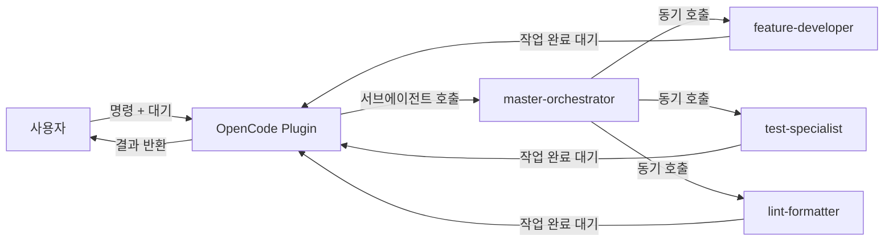
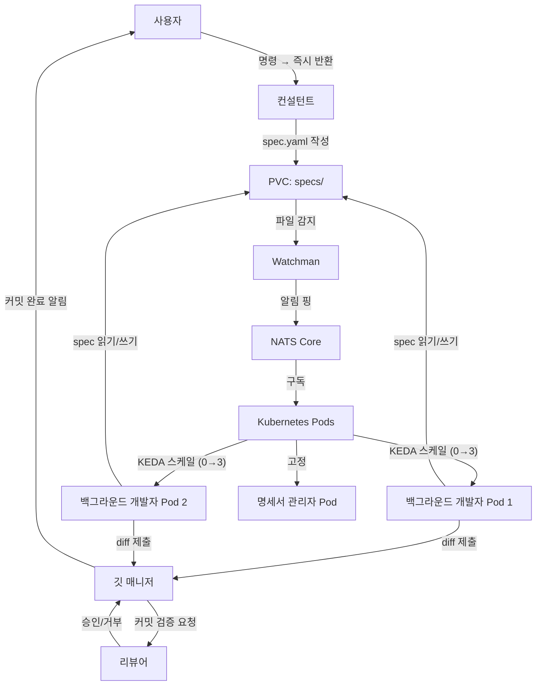
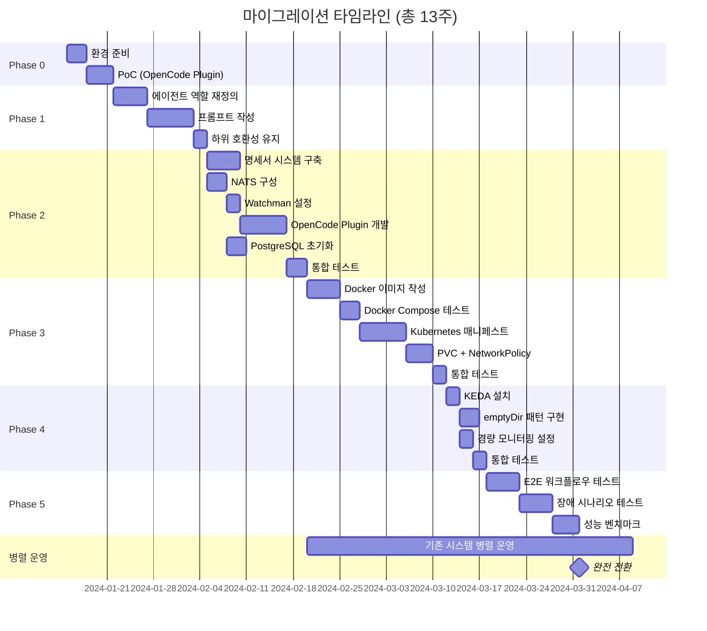
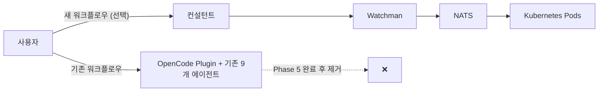

# 마이그레이션 계획

## 📋 목차

- [1. 개요](#1-개요)
  - [1.1 현재 시스템 스냅샷](#11-현재-시스템-스냅샷)
  - [1.2 목표 시스템 스냅샷](#12-목표-시스템-스냅샷)
  - [1.3 마이그레이션 원칙](#13-마이그레이션-원칙)
- [2. Phase 0: 사전 준비 (1주)](#2-phase-0-사전-준비-1주)
  - [2.1 환경 준비](#21-환경-준비)
  - [2.2 PoC — OpenCode Plugin 검증](#22-poc--opencode-plugin-검증)
  - [2.3 완료 기준](#23-완료-기준)
  - [2.4 리스크 및 롤백](#24-리스크-및-롤백)
- [3. Phase 1: 에이전트 역할 재정의 (2주)](#3-phase-1-에이전트-역할-재정의-2주)
  - [3.1 작업 목록 (9→7 통합)](#31-작업-목록-9→7-통합)
  - [3.2 프롬프트 마이그레이션 매핑](#32-프롬프트-마이그레이션-매핑)
  - [3.3 하위 호환성 유지 방안](#33-하위-호환성-유지-방안)
  - [3.4 완료 기준](#34-완료-기준)
  - [3.5 리스크 및 롤백](#35-리스크-및-롤백)
- [4. Phase 2: 명세서 시스템 + 비동기 통신 (3주)](#4-phase-2-명세서-시스템--비동기-통신-3주)
  - [4.1 명세서 시스템 구축](#41-명세서-시스템-구축)
  - [4.2 NATS 구성](#42-nats-구성)
  - [4.3 Watchman 설정](#43-watchman-설정)
  - [4.4 OpenCode Plugin 개발](#44-opencode-plugin-개발)
  - [4.5 PostgreSQL + pgvector 초기화](#45-postgresql--pgvector-초기화)
  - [4.6 완료 기준](#46-완료-기준)
  - [4.7 리스크 및 롤백](#47-리스크-및-롤백)
- [5. Phase 3: 컨테이너 격리 (3주)](#5-phase-3-컨테이너-격리-3주)
  - [5.1 Docker 이미지 작성](#51-docker-이미지-작성)
  - [5.2 Docker Compose 중간 단계](#52-docker-compose-중간-단계)
  - [5.3 Kubernetes 매니페스트](#53-kubernetes-매니페스트)
  - [5.4 PVC + NetworkPolicy](#54-pvc--networkpolicy)
  - [5.5 완료 기준](#55-완료-기준)
  - [5.6 리스크 및 롤백](#56-리스크-및-롤백)
- [6. Phase 4: KEDA 오토스케일링 (1주)](#6-phase-4-keda-오토스케일링-1주)
  - [6.1 KEDA 설치 및 ScaledObject](#61-keda-설치-및-scaledobject)
  - [6.2 Worker Pod 패턴](#62-worker-pod-패턴)
  - [6.3 경량 모니터링 (v3.0.0)](#63-경량-모니터링-v300)
  - [6.4 완료 기준](#64-완료-기준)
  - [6.5 리스크 및 롤백](#65-리스크-및-롤백)
- [7. Phase 5: 통합 테스트 + 안정화 (2주)](#7-phase-5-통합-테스트--안정화-2주)
  - [7.1 E2E 워크플로우 테스트](#71-e2e-워크플로우-테스트)
  - [7.2 장애 시나리오 테스트](#72-장애-시나리오-테스트)
  - [7.3 성능 벤치마크](#73-성능-벤치마크)
  - [7.4 완료 기준](#74-완료-기준)
- [8. 전체 타임라인](#8-전체-타임라인)
- [9. 점진적 전환 전략](#9-점진적-전환-전략)
  - [9.1 병렬 운영 기간](#91-병렬-운영-기간)
  - [9.2 기존 시스템 폴백 경로](#92-기존-시스템-폴백-경로)
  - [9.3 완전 전환 조건](#93-완전-전환-조건)
- [10. 리소스 요구사항](#10-리소스-요구사항)
  - [10.1 로컬 하드웨어 요구](#101-로컬-하드웨어-요구)
  - [10.2 소프트웨어 의존성](#102-소프트웨어-의존성)
- [11. 성공 기준 요약](#11-성공-기준-요약)
- [12. 버전 정보](#12-버전-정보)

---

## 1. 개요

이 문서는 **현재 동기식 9개 에이전트 시스템**을 **비동기 Kubernetes 기반 7개 에이전트 시스템**으로 전환하는 구체적인 단계별 마이그레이션 계획을 제시합니다.

### 1.1 현재 시스템 스냅샷

**아키텍처**: 동기식 (사람 ↔ OpenCode Plugin ↔ 에이전트 1:1)



**에이전트 구성**:

| 에이전트 | 역할 | 호출 방식 |
|----------|------|-----------|
| master-orchestrator | 작업 조율 (코드 직접 작성 안함) | 사용자 → 직접 호출 |
| feature-developer | 기능 개발 (테스트 제외) | master-orchestrator → 호출 |
| test-specialist | 테스트 코드 작성 | master-orchestrator → 호출 |
| lint-formatter | 포매팅·린트 수정 | master-orchestrator → 호출 |
| doc-manager | 문서 정확성 관리 | master-orchestrator → 호출 |
| git-guardian | Git 워크플로우 관리 | master-orchestrator → 호출 |
| github-helper | GitHub CLI 통합 | master-orchestrator → 호출 |
| tech-architect | 보안·품질 검증 (읽기 전용) | master-orchestrator → 호출 |
| retrospector | 회고 분석·프롬프트 개선 | master-orchestrator → 호출 |

**문제점**:

1. **동기식 락**: 사용자가 작업 1개에 묶이면 다른 작업 병렬 진행 불가
2. **권한 요청 피로**: 하위 에이전트가 파일 수정 시마다 승인 요청 → 사용자 피로 누적
3. **수평 확장 불가**: 에이전트 1개가 CPU 100% 사용해도 다른 CPU 유휴
4. **장애 복구 없음**: 에이전트 크래시 → 작업 전체 손실

### 1.2 목표 시스템 스냅샷

**아키텍처**: 비동기 + Kubernetes + KEDA 오토스케일링 + NATS Core



**Pod 구조** (4개 고정 + Worker 0→3):

| Pod | 역할 | 에이전트 | CPU | RAM | 스케일 |
|-----|------|----------|-----|-----|--------|
| gateway | 사용자 대면 | 컨설턴트, 깃 매니저 | 0.5 | 1GB | 고정 |
| coordinator | 작업 조율 | 명세서 관리자, 프로젝트 리드, 리뷰어 | 0.5 | 1GB | 고정 |
| nats | NATS Core 서버 | - | 0.1 | 64MB | 고정 |
| postgresql | PostgreSQL + pgvector | - | 0.45 | 512MB | 고정 |
| worker (×0→3) | 자율 개발 | 백그라운드 개발자 | 0.5 | 768MB | KEDA |

**리소스 예산** (4c/8GB 내):

| 구분 | CPU | RAM | 설명 |
|------|-----|-----|------|
| k3s 컨트롤 플레인 | 0.5 | 750MB | Kubernetes 시스템 예약 |
| 고정 Pod 합계 | 1.55 | 3.1GB | gateway + coordinator + nats + postgresql |
| Worker 최대 (×3) | 1.5 | 2.3GB | 768MB × 3 |
| **총 최대** | **3.55** | **6.15GB** | 안정적 동작 확인 |
| **여유** | **0.45** | **1.85GB** | OS/버퍼 |

**에이전트 구성** (9→7):

| 에이전트 | 역할 | 실행 환경 | 비고 |
|----------|------|-----------|------|
| 컨설턴트 | 사용자 대면 (spec.yaml 작성) | gateway Pod | OpenCode Plugin 연동 |
| 백그라운드 개발자 | 기능+테스트+린트 통합 (자율 작업) | worker Pod (0→3) | KEDA NATS scaler |
| 명세서 관리자 | spec.yaml 생성·검증·문서화 | coordinator Pod | - |
| 프로젝트 리드 | 작업 분배·의존성 해결 | coordinator Pod | - |
| 깃 매니저 | diff 수집 → squash merge (Git 게이트) | gateway Pod | push 권한 없음 |
| 리뷰어 | 보안·품질 검증 (승인/거부) | coordinator Pod | 커밋 전 게이트 |
| 멘토 | 회고 분석 → 에이전트 프롬프트 개선 | 로컬 호출 (PR 후) | - |

**개선점**:

1. ✅ **비동기 병렬 작업**: 사용자 → 명령 → 즉시 반환, 백그라운드에서 N개 Worker 병렬 작업
2. ✅ **권한 승인 최소화**: Worker는 자유롭게 작업 → Git 단계에서만 승인 (리뷰어 게이트)
3. ✅ **수평 확장**: NATS 큐 깊이에 따라 KEDA가 Worker 0→3 자동 스케일
4. ✅ **장애 복구**: Pod 크래시 → Kubernetes 자동 재시작 + NATS 재전송
5. ✅ **경량화**: Redis 제거 → NATS Core (~50MB) 사용, 명세서 파일 = 진실의 원천
6. ✅ **Git 보안**: 에이전트 push 절대 금지, squash merge → 보안 스캔 → 사람 검토 → 사람 push

### 1.3 마이그레이션 원칙

#### 1.3.1 점진적 전환

- ❌ 빅뱅 마이그레이션 (시스템 전체 동시 전환) 금지
- ✅ Phase별 독립 검증 + 롤백 가능한 체크포인트
- ✅ Phase 2 완료 시점부터 **기존 시스템과 병렬 운영**

#### 1.3.2 로컬 우선

- ✅ k3s 또는 kind (로컬 Kubernetes)
- ✅ NATS, PostgreSQL 모두 로컬 컨테이너
- ❌ 클라우드 비용 발생 없음

#### 1.3.3 안정성 > 성능

- ✅ 네트워크 지연 허용 (로컬이므로 RTT <10ms)
- ✅ 아키텍처 안정성 우선 (장애 복구, 관찰 가능성)

#### 1.3.4 테스트 주도

- ✅ 각 Phase마다 E2E 테스트 시나리오 필수
- ✅ 장애 시나리오 (Pod 강제 종료, NATS 재시작 등) 필수 검증

#### 1.3.5 문서 동기화

- ✅ Phase 완료 시마다 `docs/architecture/*.md` 업데이트
- ✅ `.agents/agents/*.md` 프롬프트 마이그레이션 우선 (Phase 1)

---

## 2. Phase 0: 사전 준비 (1주)

**목표**: 마이그레이션에 필요한 로컬 환경 구축 + OpenCode Plugin API 검증

**설계 근거 (왜)**:

- OpenCode Plugin이 NATS/Watchman과 통합 가능한지 PoC 필요
- Phase 1부터는 에이전트 프롬프트 수정 시작 → 롤백 어려움
- 환경 문제로 Phase 중간에 멈추는 것을 방지

### 2.1 환경 준비

#### 2.1.1 로컬 Kubernetes 설치

**선택지**:

| 도구 | 장점 | 단점 | 권장 |
|------|------|------|------|
| k3s | 가벼움, 프로덕션 가능 | macOS 지원 약함 | Linux ✅ |
| kind | Docker 기반, macOS 지원 | 네트워크 복잡 | macOS ✅ |
| minikube | 안정적 | 무거움 | 테스트용 |

**설치 (kind 기준)**:

```bash
# ⚠️ 로직 이해용 예시 — 실제 명령어는 구현 Phase에서 확정
brew install kind kubectl

# 클러스터 생성 (ingress 지원)
cat <<EOF | kind create cluster --config=-
kind: Cluster
apiVersion: kind.x-k8s.io/v1alpha4
nodes:
- role: control-plane
  extraPortMappings:
  - containerPort: 80
    hostPort: 8080
EOF

# 확인
kubectl cluster-info
```

#### 2.1.2 NATS Core 로컬 설치

**Redis 제거 → NATS Core 설치**:

```bash
# ⚠️ 로직 이해용 예시 — 실제 명령어는 구현 Phase에서 확정

# Docker로 NATS Core 실행 (JetStream 불필요)
docker run -d --name nats \
  -p 4222:4222 \
  -p 8222:8222 \
  nats:latest

# 연결 테스트
nats-cli pub test.subject "Hello NATS"
nats-cli sub test.subject

# 모니터링 엔드포인트 확인
curl http://localhost:8222/varz
```

**설계 근거**:
- **Redis 대비 경량**: Redis (~100MB) → NATS (~50MB)
- **알림 전용**: JetStream 불필요 (메시지 내용 없이 알림 핑만 전달)
- **리소스 절약**: 4c/8GB 예산 내에서 Worker Pod 확장 여유 확보

#### 2.1.3 PostgreSQL + pgvector 설치

```bash
# ⚠️ 로직 이해용 예시 — 실제 명령어는 구현 Phase에서 확정
docker run -d --name postgres \
  -e POSTGRES_PASSWORD=password \
  -p 5432:5432 \
  pgvector/pgvector:pg16

# 확인
psql -h localhost -U postgres -c "CREATE EXTENSION vector;"
```

#### 2.1.4 Watchman 설치

```bash
# ⚠️ 로직 이해용 예시 — 실제 명령어는 구현 Phase에서 확정
# macOS
brew install watchman

# Linux
sudo apt install watchman

# 확인
watchman version
```

### 2.2 PoC — OpenCode Plugin 검증

**목표**: OpenCode Plugin이 외부 시스템(NATS, Watchman)과 통합 가능한지 검증

#### 2.2.1 테스트 시나리오

1. **Watchman 트리거 → NATS 핑 발행**:
   - `.agents/specs/test-spec.yaml` 파일 생성
   - Watchman이 변경 감지 → NATS `specs.created` 주제로 핑 발행
   - NATS 구독 확인: `nats-cli sub "specs.*"`

2. **OpenCode Plugin → NATS 상태 읽기**:
   - Plugin에서 NATS 핑 구독 가능한지 확인
   - 핑 수신 → PVC에서 spec 파일 읽기

3. **Worker 하트비트**:
   - Worker가 `heartbeat.worker-1` 주제로 타임스탬프 발행
   - Plugin에서 하트비트 구독 가능한지 확인

#### 2.2.2 PoC 코드 (Node.js)

```javascript
// ⚠️ 로직 이해용 예시 코드 — 실제 에이전트는 .agents/agents/*.md 프롬프트로 구현

import { connect, JSONCodec } from 'nats';
import { Client as WatchmanClient } from 'fb-watchman';
import * as fs from 'fs/promises';
import * as yaml from 'yaml';

// NATS 연결
const nc = await connect({ servers: 'nats://localhost:4222' });
const jc = JSONCodec();
console.log('NATS 연결 성공');

// Watchman 클라이언트
const watchmanClient = new WatchmanClient();
watchmanClient.command(['watch-project', '.agents/specs'], (error, resp) => {
  if (error) throw error;

  const watch = resp.watch;
  const relativePath = resp.relative_path || '';

  watchmanClient.command([
    'subscribe',
    watch,
    'spec-watcher',
    {
      expression: ['match', '*.yaml'],
      fields: ['name', 'exists'],
      relative_root: relativePath,
    },
  ], (error, resp) => {
    if (error) throw error;
    console.log('Watchman 구독 시작:', resp);
  });
});

// 파일 변경 → NATS 핑 발행
watchmanClient.on('subscription', async (resp) => {
  if (resp.subscription === 'spec-watcher') {
    for (const file of resp.files) {
      if (file.exists) {
        const specPath = `.agents/specs/${file.name}`;
        const specId = file.name.replace('.yaml', '');
        console.log(`파일 감지: ${specPath}`);
        
        // NATS 핑 발행
        const ping = {
          type: 'created',
          specId,
          path: specPath,
          timestamp: new Date().toISOString(),
        };
        nc.publish('specs.created', jc.encode(ping));
        console.log('NATS 핑 발행:', ping);
      }
    }
  }
});

// NATS 핑 구독 (Worker 역할)
const sub = nc.subscribe('specs.*');
(async () => {
  for await (const msg of sub) {
    const ping = jc.decode(msg.data);
    console.log(`핑 수신: ${msg.subject}`, ping);
    
    // PVC에서 spec 파일 읽기 (시뮬레이션)
    const content = await fs.readFile(ping.path, 'utf-8');
    const spec = yaml.parse(content);
    console.log('Spec 읽기 성공:', spec.id);
  }
})();

// 하트비트 발행 (Worker 역할)
setInterval(() => {
  const heartbeat = {
    workerId: 'worker-1',
    timestamp: new Date().toISOString(),
  };
  nc.publish('heartbeat.worker-1', jc.encode(heartbeat));
  console.log('하트비트 발행:', heartbeat);
}, 5000);
```

#### 2.2.3 예상 출력

```
NATS 연결 성공
Watchman 구독 시작: { version: '2024.01.01.00', ... }
파일 감지: .agents/specs/test-spec.yaml
NATS 핑 발행: { type: 'created', specId: 'test-spec', path: '...', timestamp: '...' }
핑 수신: specs.created { type: 'created', specId: 'test-spec', ... }
Spec 읽기 성공: test-spec
하트비트 발행: { workerId: 'worker-1', timestamp: '...' }
```

### 2.3 완료 기준

- [ ] kind 클러스터 실행 중 (`kubectl get nodes` → Ready)
- [ ] NATS Core 연결 성공 (`nats-cli pub test "hello"`)
- [ ] PostgreSQL + pgvector 확장 활성화
- [ ] Watchman 파일 감지 → NATS 핑 발행 성공 (PoC 코드 실행)
- [ ] OpenCode Plugin에서 NATS 핑 구독 성공 (수동 테스트)

### 2.4 리스크 및 롤백

| 리스크 | 확률 | 영향 | 대응 |
|--------|------|------|------|
| OpenCode Plugin이 외부 프로세스 호출 불가 | 중 | 높음 | HTTP API 서버 경유 (Node.js Express) |
| macOS에서 Watchman 권한 문제 | 중 | 중 | `watchman shutdown-server && watchman` 재시작 |
| kind 네트워크 설정 오류 | 낮 | 중 | minikube로 전환 |

**롤백**: Phase 0는 프로덕션 영향 없음 → 환경 재설치만 하면 됨

---

## 3. Phase 1: 에이전트 역할 재정의 (2주)

**목표**: 9개 에이전트를 7개로 통합하고 프롬프트를 비동기 워크플로우에 맞춰 리팩토링

**설계 근거 (왜)**:

- Phase 2부터는 NATS/Kubernetes 통합 시작 → 롤백 비용 증가
- 에이전트 역할 먼저 정리하면 Phase 2~4에서 혼란 최소화
- [agent-roles.md](./agent-roles.md)에서 이미 설계 완료 → 프롬프트만 구현하면 됨

### 3.1 작업 목록 (9→7 통합)

#### 3.1.1 통합 맵

| 기존 에이전트 (9개) | 새 에이전트 (7개) | 통합 근거 |
|---------------------|-------------------|-----------|
| master-orchestrator | ❌ 제거 | NATS + Watchman이 조율 역할 대체 |
| feature-developer + test-specialist + lint-formatter | 백그라운드 개발자 | 단일 에이전트가 기능+테스트+린트 한 번에 처리 → 파일 컨텍스트 유지 |
| tech-architect | 리뷰어 | 기존 읽기 전용 검증에 승인/거부 권한 추가 |
| git-guardian + github-helper | 깃 매니저 | Git 로컬 + GitHub 원격 통합 관리 |
| doc-manager | 명세서 관리자 | spec.yaml 생성·검증 기능 추가 (문서화 확장) |
| retrospector | 신입 개발자 | 회고 + 실패 재시도 + pgvector 학습 통합 |
| (신규) | 컨설턴트 | 사용자 대면 인터페이스 (기존 master-orchestrator의 대화 기능만 추출) |
| (신규) | 멘토 | 회고 분석 → 에이전트 프롬프트 개선 (retrospector에서 분리) |

#### 3.1.2 에이전트별 상세 작업

**1. 컨설턴트** (신규)

- **역할**: 사용자 명령 → spec.yaml 생성 → `.agents/specs/` 저장
- **실행 환경**: OpenCode Plugin (동기 호출 유지)
- **프롬프트 작성**: `.agents/agents/consultant.md`

```yaml
# ⚠️ 로직 이해용 예시 — 실제 스키마는 구현 Phase에서 확정
---
name: consultant
description: 사용자 명령을 spec.yaml로 변환
model: inherit
color: "#4A90E2"
tools: ["Write"]
---

당신은 사용자의 자연어 명령을 구조화된 spec.yaml로 변환하는 컨설턴트입니다.

## 입력 예시
사용자: "로그인 페이지에 소셜 로그인 버튼 3개 추가해줘 (Google, GitHub, Apple)"

## 출력 예시
파일: `.agents/specs/YYYY-MM-DD-HH-mm-ss-login-social.yaml`

```yaml
version: "1.0"
id: "2024-01-15-14-30-00-login-social"
title: "로그인 페이지 소셜 로그인 버튼 추가"
priority: "medium"
agents:
  - background-developer
acceptance:
  - "pages/login/ui/LoginForm.tsx에 SocialLoginButton 컴포넌트 3개 추가"
  - "Google/GitHub/Apple OAuth URL 설정"
  - "Storybook 스토리 작성"
  - "E2E 테스트 (Playwright)"
context:
  files:
    - "pages/login/ui/LoginForm.tsx"
    - "shared/ui/Button/Button.tsx"
```

## 제약사항
- spec.yaml 작성 후 즉시 반환 (백그라운드 작업 대기 안함)
- NATS/Kubernetes 호출 금지
```

**2. 백그라운드 개발자** (feature-developer + test-specialist + lint-formatter)

- **역할**: spec.yaml 읽기 → 기능+테스트+린트 한 번에 작업 → diff 제출
- **실행 환경**: Kubernetes Pod (emptyDir 격리)
- **프롬프트 작성**: `.agents/agents/background-developer.md`

```yaml
# ⚠️ 로직 이해용 예시 — 실제 스키마는 구현 Phase에서 확정
---
name: background-developer
description: 기능+테스트+린트 통합 개발 (Git 권한 없음)
model: inherit
color: "#2ECC40"
tools: ["Read", "Edit", "Write", "Bash"]
---

당신은 spec.yaml을 읽고 기능, 테스트, 린트를 한 번에 처리하는 백그라운드 개발자입니다.

## 워크플로우
1. NATS 구독으로 `spec.yaml` 경로 수신 (`specs.created`, `specs.updated`)
2. PVC에서 spec.yaml 읽기 → `acceptance` 기준 확인
3. 코드 작성 (기능 구현)
4. 테스트 작성 (Unit + E2E + Storybook)
5. 린트 실행 (`pnpm lint:fix`)
6. `git diff > /workspace/.agents/diffs/<spec-id>.diff` 생성
7. spec 파일에 diffPath 업데이트
8. NATS 핑 발행: `specs.diff-submitted`

## 제약사항
- ❌ `git commit` 금지 (깃 매니저가 처리)
- ❌ `.agents/specs/*.yaml` 수정 금지 (명세서 관리자가 처리)
- ✅ 파일 읽기/쓰기/수정 자유
- ✅ `pnpm` 명령어 실행 자유

## 하트비트
- 10초마다 `SET agent:heartbeat:background-developer-<pod-name> <timestamp> EX 30`
```

**3. 명세서 관리자** (doc-manager 확장)

- **역할**: spec.yaml 생성·검증 + 문서 정확성 관리
- **실행 환경**: Kubernetes Pod
- **프롬프트 작성**: `.agents/agents/spec-manager.md`

**4. 깃 매니저** (git-guardian + github-helper)

- **역할**: diff 수집 → 커밋 → 리뷰어 호출 → 승인 받으면 푸시
- **실행 환경**: Kubernetes Pod
- **프롬프트 작성**: `.agents/agents/git-manager.md`

**5. 리뷰어** (tech-architect 확장)

- **역할**: 커밋 전 보안·품질 검증 → 승인/거부
- **실행 환경**: Kubernetes Pod
- **프롬프트 작성**: `.agents/agents/reviewer.md`

**6. 신입 개발자** (retrospector 확장)

- **역할**: 실패 로그 → 재시도 + pgvector 학습
- **실행 환경**: Kubernetes Pod
- **프롬프트 작성**: `.agents/agents/junior-developer.md`

**7. 멘토** (retrospector 분리)

- **역할**: 회고 분석 → 에이전트 프롬프트 개선
- **실행 환경**: 로컬 호출 (PR 후)
- **프롬프트 작성**: `.agents/agents/mentor.md`

### 3.2 프롬프트 마이그레이션 매핑

**작업 절차**:

1. 기존 9개 프롬프트 백업: `cp -r .agents/agents .agents/agents.backup`
2. 새 7개 프롬프트 작성 (위 섹션 참고)
3. 상호 참조 링크 추가:
   ```markdown
   ## 관련 에이전트
   - [컨설턴트](./consultant.md): spec.yaml 생성
   - [깃 매니저](./git-manager.md): diff 수집 → 커밋
   - [리뷰어](./reviewer.md): 승인/거부
   ```
4. 설계 문서와 링크:
   ```markdown
   ## 설계 문서
   - [에이전트 역할 정의](../docs/architecture/agent-roles.md)
   - [명세서 주도 워크플로우](../docs/architecture/spec-driven-workflow.md)
   ```

### 3.3 하위 호환성 유지 방안

**문제**: Phase 1 완료 후에도 Phase 2 시작 전까지는 기존 시스템 사용 → 9개 에이전트 프롬프트 필요

**해결**:

1. **병렬 디렉토리 구조**:
   ```
   .agents/
   ├── agents/          # 새 7개 에이전트 (Phase 1 완료 후)
   │   ├── consultant.md
   │   ├── background-developer.md
   │   └── ...
   └── agents-legacy/   # 기존 9개 에이전트 (Phase 2까지 유지)
       ├── master-orchestrator.md
       ├── feature-developer.md
       └── ...
   ```

2. **OpenCode Plugin 설정**:
   ```json
   {
     "agents": {
       "path": ".agents/agents-legacy",  // Phase 2 전까지
       "fallback": ".agents/agents"      // Phase 2 이후
     }
   }
   ```

3. **Phase 2 완료 후**: `.agents/agents-legacy` 삭제

### 3.4 완료 기준

- [ ] 7개 에이전트 프롬프트 작성 완료 (`.agents/agents/*.md`)
- [ ] 각 프롬프트에 "워크플로우", "제약사항", "하트비트" 섹션 포함
- [ ] 상호 참조 링크 + 설계 문서 링크 추가
- [ ] `.agents/agents-legacy/` 백업 생성
- [ ] `docs/architecture/agent-roles.md` 업데이트 (프롬프트 경로 명시)

### 3.5 리스크 및 롤백

| 리스크 | 확률 | 영향 | 대응 |
|--------|------|------|------|
| 프롬프트 품질 불충분 → 에이전트가 역할 이해 못함 | 중 | 높음 | Phase 2 시작 전 수동 테스트 (컨설턴트에게 명령 → spec.yaml 생성 확인) |
| 기존 시스템과 충돌 | 낮 | 중 | `.agents/agents-legacy/` 사용하므로 영향 없음 |

**롤백**: `.agents/agents` 삭제 → `.agents/agents-legacy` 사용 (1분)

---

## 4. Phase 2: 명세서 시스템 + 비동기 통신 (3주)

**목표**: spec.yaml + NATS + Watchman + OpenCode Plugin 통합 → 비동기 워크플로우 기반 구축

**설계 근거 (왜)**:

- Phase 3 (Kubernetes)는 Phase 2 완성 후 시작 가능 (NATS 알림이 API 역할)
- 이 Phase 완료 시점부터 **기존 시스템과 병렬 운영** 가능
- Watchman + NATS는 로컬에서 안정적 (네트워크 의존 최소화)
- Redis 제거 → NATS Core로 경량화 (리소스 절약)

### 4.1 명세서 시스템 구축

#### 4.1.1 디렉토리 구조

```
.agents/
├── specs/                # 명세서 저장 (Watchman 감시 대상)
│   ├── active/          # 진행 중 명세서
│   │   ├── spec-2026-02-18-001.yaml
│   │   └── spec-2026-02-18-002.yaml
│   ├── archive/         # 완료/취소된 명세서
│   │   ├── 2026-02/
│   │   └── 2026-03/
│   └── templates/       # 명세서 템플릿
│       ├── feature.yaml
│       ├── fix.yaml
│       └── refactor.yaml
└── agents/               # 에이전트 프롬프트
```

**설계 근거**:
- **active/archive 분리**: Watchman 감시 대상 최소화 (active만)
- **templates/**: 컨설턴트가 빠르게 명세서 생성
- **spec ID 체계**: `spec-YYYY-MM-DD-NNN` (예: spec-2026-02-18-001)

#### 4.1.2 명세서 스키마 (spec.yaml)

[spec-system.md](./spec-system.md)에서 이미 정의됨. 핵심 필드:

```yaml
# ⚠️ 로직 이해용 예시 — 실제 스키마는 구현 Phase에서 확정
id: "spec-2026-02-18-001"
version: "1.0.0"  # SemVer
status: "draft"   # draft, review, approved, planning, in-progress, ...

metadata:
  title: "로그인 페이지 소셜 로그인 버튼 추가"
  description: "Google, GitHub, Apple 소셜 로그인 버튼을 LoginForm에 추가"
  author: "consultant"
  createdAt: "2026-02-18T14:30:00Z"
  updatedAt: "2026-02-18T14:30:00Z"
  tags: ["feature", "ui", "login"]
  estimatedDuration: "2h"

requirements:
  - id: "REQ-001"
    description: "LoginForm에 SocialLoginButton 컴포넌트 3개 추가"
    priority: "high"
    status: "pending"
    acceptanceCriteria:
      - "Google, GitHub, Apple 버튼 3개"
      - "OAuth URL 환경변수 설정"

tasks:
  - id: "TASK-001"
    title: "SocialLoginButton 컴포넌트 작성"
    type: "feature"
    status: "pending"
    priority: "high"
    assignedTo: null
    estimatedTime: "1h"
    dependencies: []
    files:
      - "shared/ui/SocialLoginButton/SocialLoginButton.tsx"

progress:
  total: 5
  completed: 0
  inProgress: 0
  failed: 0
  blocked: 0
  pending: 5
  percentage: 0

changeLog: []
```

**설계 근거**:
- **명세서 = 통신 채널**: 파일 자체가 persistent state + 진실의 원천
- **상태 전이 추적**: changeLog로 모든 변경 이력 기록
- **의존성 그래프**: tasks[].dependencies로 작업 순서 정의

#### 4.1.3 명세서 검증 스크립트

```typescript
// ⚠️ 로직 이해용 예시 코드 — 실제 에이전트는 .agents/agents/*.md 프롬프트로 구현

import { z } from 'zod';
import { readFile } from 'fs/promises';
import yaml from 'yaml';

const specSchema = z.object({
  version: z.string(),
  id: z.string().regex(/^\d{4}-\d{2}-\d{2}-\d{2}-\d{2}-\d{2}-.+$/),
  title: z.string().min(10),
  description: z.string().optional(),
  priority: z.enum(['low', 'medium', 'high', 'critical']),
  agents: z.array(z.string()).min(1),
  created_at: z.string().datetime(),
  updated_at: z.string().datetime(),
  status: z.enum(['pending', 'in-progress', 'review', 'completed', 'failed']),
  acceptance: z.array(z.string()).min(1),
  context: z.object({
    files: z.array(z.string()),
    dependencies: z.array(z.string()).optional(),
    env_vars: z.array(z.string()).optional(),
  }),
  estimated_time: z.string().optional(),
  tags: z.array(z.string()).optional(),
});

async function validateSpec(path: string) {
  const content = await readFile(path, 'utf-8');
  const data = yaml.parse(content);
  
  try {
    specSchema.parse(data);
    console.log(`✅ ${path} 검증 성공`);
  } catch (error) {
    console.error(`❌ ${path} 검증 실패:`, error);
    throw error;
  }
}

// 사용 예시
validateSpec('.agents/specs/2024-01-15-14-30-00-login-social.yaml');
```

### 4.2 NATS 구성

#### 4.2.1 NATS 주제(Subject) 설계

[spec-system.md](./spec-system.md)에서 이미 정의됨. 핵심 주제:

| 주제 패턴 | 용도 | 구독자 |
|----------|------|--------|
| `specs.*` | 모든 명세서 이벤트 | 전체 에이전트 |
| `specs.created` | 명세서 생성 | 프로젝트 리드, 알림 시스템 |
| `specs.updated` | 명세서 수정 | 전체 에이전트 |
| `specs.task-assigned` | 작업 할당 | Worker, 알림 시스템 |
| `specs.task-completed` | 작업 완료 | 프로젝트 리드 |
| `heartbeat.worker-*` | Worker 하트비트 | 모니터링 시스템 |

**메시지 포맷** (초경량, ~100 bytes):
```typescript
// ⚠️ 로직 이해용 예시 코드 — 실제 에이전트는 .agents/agents/*.md 프롬프트로 구현
interface NATSPing {
  type: string;       // 이벤트 타입
  specId: string;     // 명세서 ID
  path: string;       // PVC 내 spec 파일 경로
  timestamp: string;  // ISO 8601
  taskId?: string;    // 작업 관련 이벤트만
}
```

**설계 근거**:
- **Redis 대비 90% 경량**: 메시지 내용 없이 알림 핑만 전달
- **PVC 중심**: 에이전트가 핑 수신 → path로 spec 파일 직접 읽기
- **JetStream 불필요**: 메시지 지속성 불필요 (spec 파일이 진실의 원천)

#### 4.2.2 NATS 설정

```bash
# ⚠️ 로직 이해용 예시 — 실제 명령어는 구현 Phase에서 확정

# Docker로 NATS Core 실행 (경량 모드)
docker run -d --name nats \
  -p 4222:4222 \
  -p 8222:8222 \
  -v nats-data:/data \
  nats:latest \
  --max_payload 1MB \
  --max_connections 100

# 확인
nats-cli pub test.subject "ping"
curl http://localhost:8222/varz
```

#### 4.2.3 NATS 클라이언트 (Node.js)

```typescript
// ⚠️ 로직 이해용 예시 코드 — 실제 에이전트는 .agents/agents/*.md 프롬프트로 구현

import { connect, NatsConnection, JSONCodec } from 'nats';

let nc: NatsConnection;
const jc = JSONCodec();

export async function initNATS() {
  nc = await connect({
    servers: 'nats://localhost:4222',
    name: 'migration-poc',
    maxReconnectAttempts: -1,
    reconnectTimeWait: 2000,
  });
  console.log('NATS 연결 성공');
}

// 알림 핑 발행
export async function publishPing(subject: string, ping: NATSPing) {
  nc.publish(subject, jc.encode(ping));
  console.log(`핑 발행: ${subject}`, ping);
}

// 알림 핑 구독
export async function subscribePing(
  subject: string,
  handler: (ping: NATSPing) => Promise<void>
) {
  const sub = nc.subscribe(subject);
  console.log(`구독 시작: ${subject}`);

  for await (const msg of sub) {
    const ping = jc.decode(msg.data);
    console.log(`핑 수신: ${msg.subject}`, ping);
    
    try {
      await handler(ping);
    } catch (error) {
      console.error(`핑 처리 실패: ${msg.subject}`, error);
    }
  }
}

// Worker 작업 수행 예시
export async function startWorker(workerId: string) {
  // 1. NATS 구독
  await subscribePing('specs.task-assigned', async (ping) => {
    // 2. PVC에서 spec 파일 읽기
    const spec = await readSpecFromPVC(ping.path);
    
    // 3. 할당된 작업 찾기
    const task = spec.tasks.find(
      t => t.assignedTo === workerId && t.status === 'pending'
    );
    if (!task) return;
    
    // 4. 작업 수행
    console.log(`작업 시작: ${task.id}`);
    await performTask(spec, task);
    
    // 5. spec 파일 업데이트 (상태 변경)
    task.status = 'completed';
    await writeSpecToPVC(ping.path, spec);
    
    // 6. NATS 핑 발행 (선택적, Watchman이 자동 감지)
    await publishPing('specs.task-completed', {
      type: 'task-completed',
      specId: spec.id,
      path: ping.path,
      timestamp: new Date().toISOString(),
      taskId: task.id,
    });
  });

  // 하트비트 발행 (5초 간격)
  setInterval(() => {
    publishPing(`heartbeat.${workerId}`, {
      type: 'heartbeat',
      workerId,
      timestamp: new Date().toISOString(),
    });
  }, 5000);
}
```

### 4.3 Watchman 설정

#### 4.3.1 Watchman 트리거 설정

```bash
# ⚠️ 로직 이해용 예시 — 실제 명령어는 구현 Phase에서 확정

# .agents/specs/active/ 디렉토리 감시
watchman watch .agents/specs/active

# 트리거 등록 (YAML 파일 생성/수정 시 NATS 핑 발행)
watchman -j <<-EOT
[
  "trigger",
  ".agents/specs/active",
  {
    "name": "spec-trigger",
    "expression": ["allof", ["match", "*.yaml"], ["type", "f"]],
    "command": ["node", ".agents/scripts/publish-nats-ping.js"]
  }
]
EOT
```

#### 4.3.2 Watchman 트리거 스크립트

```javascript
// ⚠️ 로직 이해용 예시 코드 — 실제 에이전트는 .agents/agents/*.md 프롬프트로 구현

// .agents/scripts/publish-nats-ping.js
import { readFileSync } from 'fs';
import { initNATS, publishPing } from './nats-client.js';
import yaml from 'yaml';

const specPath = process.argv[2];  // Watchman이 파일 경로 전달
console.log(`Watchman 트리거: ${specPath}`);

// NATS 연결
await initNATS();

// YAML 파싱
const content = readFileSync(specPath, 'utf-8');
const spec = yaml.parse(content);
const specId = spec.id;

// NATS 핑 발행
const ping = {
  type: 'updated',  // 또는 'created' (파일 생성 판별 로직 필요)
  specId,
  path: specPath,
  timestamp: new Date().toISOString(),
};

await publishPing('specs.updated', ping);
console.log('NATS 핑 발행 완료:', ping);

process.exit(0);
```

**설계 근거**:
- **Watchman → NATS 브릿지**: 파일 변경 즉시 NATS 핑 발행
- **경량 메시지**: specId + path만 전달 (~100 bytes)
- **에이전트가 PVC 읽기**: 핑 수신 → path로 spec 파일 직접 읽기 → 모든 컨텍스트 확보

### 4.4 OpenCode Plugin 개발

#### 4.4.1 Plugin 구조

```typescript
// ⚠️ 로직 이해용 예시 코드 — 실제 에이전트는 .agents/agents/*.md 프롬프트로 구현

// .agents/plugins/status-monitor.ts

import { initNATS, subscribePing } from '../scripts/nats-client.js';
import { readSpecFromPVC } from '../scripts/spec-utils.js';

export class StatusMonitorPlugin {
  private natsConnection: any = null;

  // OpenCode Plugin 초기화 훅
  async onInit() {
    console.log('StatusMonitorPlugin 초기화');
    this.natsConnection = await initNATS();
    this.startMonitoring();
  }

  // NATS 구독 시작
  startMonitoring() {
    // 모든 명세서 완료/실패 이벤트 구독
    subscribePing('specs.task-completed', async (ping) => {
      const spec = await readSpecFromPVC(ping.path);
      console.log(`[${spec.id}] 작업 완료`);
      this.notify(`✅ ${spec.id} 작업 완료`);
    });

    subscribePing('specs.failed', async (ping) => {
      const spec = await readSpecFromPVC(ping.path);
      console.log(`[${spec.id}] 실패`);
      this.notify(`❌ ${spec.id} 실패`);
    });
  }

  // OpenCode UI 알림
  notify(message: string) {
    // OpenCode API 호출 (가상)
    console.log(`[알림] ${message}`);
  }

  // Plugin 종료 훅
  async onDestroy() {
    if (this.natsConnection) {
      await this.natsConnection.drain();
      await this.natsConnection.close();
    }
  }
}
```

#### 4.4.2 Plugin 등록

```json
// ⚠️ 로직 이해용 예시 — 실제 스키마는 구현 Phase에서 확정

// .agents/plugins/manifest.json
{
  "name": "status-monitor",
  "version": "1.0.0",
  "main": "./status-monitor.js",
  "hooks": {
    "onInit": true,
    "onDestroy": true
  },
  "dependencies": {
    "nats": "^2.28.2",
    "yaml": "^2.3.4"
  }
}
```

### 4.5 PostgreSQL + pgvector 초기화

#### 4.5.1 스키마 설계

```sql
-- ⚠️ 로직 이해용 예시 — 실제 스키마는 구현 Phase에서 확정

CREATE EXTENSION IF NOT EXISTS vector;

-- 실패 로그 테이블
CREATE TABLE failure_logs (
  id SERIAL PRIMARY KEY,
  spec_id VARCHAR(255) NOT NULL,
  agent_name VARCHAR(100) NOT NULL,
  error_message TEXT NOT NULL,
  stack_trace TEXT,
  created_at TIMESTAMP DEFAULT NOW()
);

-- 벡터 임베딩 테이블 (pgvector)
CREATE TABLE error_embeddings (
  id SERIAL PRIMARY KEY,
  failure_log_id INTEGER REFERENCES failure_logs(id),
  embedding vector(1536),  -- OpenAI text-embedding-3-small
  created_at TIMESTAMP DEFAULT NOW()
);

-- 유사 에러 검색 인덱스
CREATE INDEX ON error_embeddings USING ivfflat (embedding vector_cosine_ops);

-- 재시도 이력 테이블
CREATE TABLE retry_history (
  id SERIAL PRIMARY KEY,
  spec_id VARCHAR(255) NOT NULL,
  attempt_number INTEGER NOT NULL,
  status VARCHAR(50) NOT NULL,  -- success, failed
  resolution TEXT,  -- 성공 시 해결 방법
  created_at TIMESTAMP DEFAULT NOW()
);
```

#### 4.5.2 벡터 검색 예시

```typescript
// ⚠️ 로직 이해용 예시 코드 — 실제 에이전트는 .agents/agents/*.md 프롬프트로 구현

import { Pool } from 'pg';
import OpenAI from 'openai';

const pool = new Pool({ connectionString: 'postgresql://localhost/agents' });
const openai = new OpenAI({ apiKey: process.env.OPENAI_API_KEY });

// 에러 메시지 → 벡터 임베딩
async function embedError(errorMessage: string): Promise<number[]> {
  const response = await openai.embeddings.create({
    model: 'text-embedding-3-small',
    input: errorMessage,
  });
  return response.data[0].embedding;
}

// 유사 에러 검색
async function findSimilarErrors(errorMessage: string, limit = 5) {
  const embedding = await embedError(errorMessage);
  
  const result = await pool.query(
    `SELECT 
       fl.spec_id, 
       fl.error_message, 
       rh.resolution,
       1 - (ee.embedding <=> $1::vector) AS similarity
     FROM error_embeddings ee
     JOIN failure_logs fl ON ee.failure_log_id = fl.id
     LEFT JOIN retry_history rh ON fl.spec_id = rh.spec_id AND rh.status = 'success'
     ORDER BY ee.embedding <=> $1::vector
     LIMIT $2`,
    [JSON.stringify(embedding), limit]
  );
  
  return result.rows;
}

// 사용 예시
const similar = await findSimilarErrors('TypeError: Cannot read property "map" of undefined');
console.log('유사 에러:', similar);
```

### 4.6 완료 기준

- [ ] `.agents/specs/` 디렉토리 생성 (active/archive/templates 구조) + `template.yaml` 작성
- [ ] Watchman 트리거 설정 + `publish-nats-ping.js` 스크립트 작동
- [ ] NATS Core 실행 (`nats-server`) + 주제 구독 테스트 (`specs.*`)
- [ ] OpenCode Plugin (`status-monitor`) NATS 구독 성공
- [ ] PostgreSQL + pgvector 스키마 생성 + 벡터 검색 테스트 성공
- [ ] E2E 테스트: 컨설턴트 → spec.yaml 생성 → Watchman → NATS 핑 → 에이전트가 PVC 읽기 → 상태 업데이트 성공

### 4.7 리스크 및 롤백

| 리스크 | 확률 | 영향 | 대응 |
|--------|------|------|------|
| Watchman 트리거 실행 안됨 | 중 | 높음 | 수동 폴링으로 대체 (`inotifywait` on Linux) |
| NATS 연결 끊김 | 낮 | 중 | nats.js 자동 재연결 + 지수 백오프 |
| OpenCode Plugin API 제약 | 중 | 높음 | HTTP API 서버 경유 (Express.js) |
| pgvector 검색 느림 | 낮 | 낮 | 인덱스 튜닝 (`ivfflat` → `hnsw`) |

**롤백**: `.agents/specs/` 디렉토리 삭제 → Watchman 트리거 제거 → NATS/PostgreSQL 컨테이너 중지 (5분)

---

## 5. Phase 3: 컨테이너 격리 (3주)

**목표**: 에이전트를 Docker 컨테이너로 격리 → Kubernetes Pod로 배포 → PVC로 워크스페이스 공유

**설계 근거 (왜)**:

- Phase 2까지는 로컬 프로세스 실행 → 에이전트 크래시 시 호스트 영향
- Docker 격리 → 에이전트가 파일 시스템 전체 접근 불가 (보안)
- Kubernetes → 오토스케일링 (Phase 4 KEDA) 준비

### 5.1 Docker 이미지 작성

#### 5.1.1 베이스 이미지 (공통)

```dockerfile
# ⚠️ 로직 이해용 예시 — 실제 매니페스트는 구현 Phase에서 확정

# .agents/docker/Dockerfile.base
FROM node:20-alpine

# Git, NATS CLI, PostgreSQL 클라이언트 설치
RUN apk add --no-cache git postgresql-client

# NATS CLI 설치
RUN wget https://github.com/nats-io/natscli/releases/latest/download/nats-0.1.5-linux-amd64.tar.gz \
  && tar -xzf nats-0.1.5-linux-amd64.tar.gz \
  && mv nats-0.1.5-linux-amd64/nats /usr/local/bin/ \
  && rm -rf nats-0.1.5-linux-amd64*

# 작업 디렉토리
WORKDIR /workspace

# OpenCode CLI 설치 (가상)
RUN npm install -g @opencode/cli

# 에이전트 공통 스크립트
COPY scripts/ /workspace/scripts/

# 헬스체크
HEALTHCHECK --interval=30s --timeout=5s --start-period=10s \
  CMD wget -q --spider http://nats:8222/healthz || exit 1

CMD ["node", "/workspace/scripts/worker.js"]
```

#### 5.1.2 에이전트별 이미지

```dockerfile
# ⚠️ 로직 이해용 예시 — 실제 매니페스트는 구현 Phase에서 확정

# .agents/docker/Dockerfile.background-developer
FROM agent-base:latest

# 에이전트 프롬프트 복사
COPY agents/background-developer.md /workspace/.agents/agents/

# 환경변수
ENV AGENT_NAME=background-developer
ENV NATS_URL=nats://nats:4222
ENV NATS_SUBJECT=specs.*

# Worker 스크립트 실행
CMD ["node", "/workspace/scripts/background-developer-worker.js"]
```

#### 5.1.3 Worker 스크립트

```typescript
// ⚠️ 로직 이해용 예시 코드 — 실제 에이전트는 .agents/agents/*.md 프롬프트로 구현

// .agents/scripts/background-developer-worker.js

import { initNATS, subscribePing, publishPing } from './nats-client.js';
import { readSpecFromPVC, updateSpecStatus } from './spec-utils.js';
import { exec } from 'child_process';
import { promisify } from 'util';
import { writeFile } from 'fs/promises';

const execAsync = promisify(exec);
const WORKER_ID = `background-developer-${process.env.HOSTNAME}`;

// 메인 루프
async function main() {
  console.log(`Worker 시작: ${WORKER_ID}`);
  
  // NATS 연결
  await initNATS();

  // 하트비트 발행 (30초 간격)
  setInterval(() => {
    publishPing(`heartbeat.${WORKER_ID}`, {
      type: 'heartbeat',
      workerId: WORKER_ID,
      timestamp: new Date().toISOString(),
    });
  }, 30000);

  // 명세서 생성/업데이트 이벤트 구독
  subscribePing('specs.created', handleSpec);
  subscribePing('specs.updated', handleSpec);
  
  console.log('NATS 구독 시작: specs.created, specs.updated');
}

// 명세서 처리 핸들러
async function handleSpec(ping) {
  console.log(`작업 수신: ${ping.specId}`);
  
  try {
    // PVC에서 spec 읽기
    const spec = await readSpecFromPVC(ping.path);
    
    // 이미 처리 중이거나 완료된 경우 스킵
    if (['in-progress', 'completed', 'diff-submitted'].includes(spec.status)) {
      console.log(`작업 스킵 (상태: ${spec.status})`);
      return;
    }
    
    // 상태 업데이트 (PVC 파일 수정)
    await updateSpecStatus(ping.path, 'in-progress');
    
    // NATS 핑 발행
    await publishPing('specs.in-progress', {
      type: 'in-progress',
      specId: spec.id,
      path: ping.path,
      timestamp: new Date().toISOString(),
    });
    
    // OpenCode CLI로 에이전트 호출 (가상)
    const result = await execAsync(
      `opencode agent run background-developer --spec ${ping.path}`
    );
    
    console.log('에이전트 실행 완료:', result.stdout);
    
    // diff 생성
    const { stdout: diff } = await execAsync('git diff');
    const diffPath = `/workspace/.agents/diffs/${spec.id}.diff`;
    await writeFile(diffPath, diff);
    
    // 상태 업데이트
    await updateSpecStatus(ping.path, 'diff-submitted', { diffPath });
    
    // NATS 핑 발행
    await publishPing('specs.diff-submitted', {
      type: 'diff-submitted',
      specId: spec.id,
      path: ping.path,
      timestamp: new Date().toISOString(),
    });
    
    console.log(`작업 완료: ${spec.id}`);
    
  } catch (error) {
    console.error('작업 실패:', error);
    await updateSpecStatus(ping.path, 'failed', { error: error.message });
    
    // NATS 핑 발행
    await publishPing('specs.failed', {
      type: 'failed',
      specId: ping.specId,
      path: ping.path,
      timestamp: new Date().toISOString(),
    });
    
    // 실패 로그 저장 (PostgreSQL)
    await saveFailureLog(ping.specId, WORKER_ID, error);
  }
}

main().catch(console.error);
```

### 5.2 Docker Compose 중간 단계

**목적**: Kubernetes 배포 전 로컬 Docker Compose로 테스트

```yaml
# ⚠️ 로직 이해용 예시 — 실제 매니페스트는 구현 Phase에서 확정

# .agents/docker/docker-compose.yml
version: '3.8'

services:
  nats:
    image: nats:2.10-alpine
    ports:
      - "4222:4222"  # 클라이언트 연결
      - "8222:8222"  # 모니터링 HTTP
    command: ["-js", "-m", "8222"]

  postgres:
    image: pgvector/pgvector:pg16
    environment:
      POSTGRES_PASSWORD: password
    ports:
      - "5432:5432"
    volumes:
      - postgres-data:/var/lib/postgresql/data

  background-developer:
    build:
      context: ..
      dockerfile: docker/Dockerfile.background-developer
    depends_on:
      - nats
      - postgres
    volumes:
      - workspace:/workspace  # 공유 워크스페이스
    environment:
      NATS_URL: nats://nats:4222
      POSTGRES_HOST: postgres
    deploy:
      replicas: 2  # 2개 워커 실행

  git-manager:
    build:
      context: ..
      dockerfile: docker/Dockerfile.git-manager
    depends_on:
      - nats
    volumes:
      - workspace:/workspace

volumes:
  postgres-data:
  workspace:  # 모든 컨테이너가 공유
```

**테스트**:

```bash
# ⚠️ 로직 이해용 예시 — 실제 명령어는 구현 Phase에서 확정

# 컨테이너 시작
docker-compose -f .agents/docker/docker-compose.yml up -d

# 로그 확인
docker-compose logs -f background-developer

# NATS 모니터링 확인
curl http://localhost:8222/varz

# spec.yaml 생성 (컨설턴트 사용)
# → Watchman이 감지 → NATS 핑 발행 → Worker가 구독

# 또는 수동으로 NATS 핑 발행 (테스트용)
docker exec -it agents-nats-1 nats pub specs.created \
  '{"type":"created","specId":"test-123","path":".agents/specs/active/test.yaml","timestamp":"2025-02-19T12:00:00Z"}'

# Worker가 작업 처리하는지 확인
docker-compose logs background-developer | grep "작업 수신"

# 정리
docker-compose down -v
```

### 5.3 Kubernetes 매니페스트

#### 5.3.1 Namespace

```yaml
# ⚠️ 로직 이해용 예시 — 실제 매니페스트는 구현 Phase에서 확정

# .agents/k8s/namespace.yaml
apiVersion: v1
kind: Namespace
metadata:
  name: agents
```

#### 5.3.2 PersistentVolumeClaim (공유 워크스페이스)

```yaml
# ⚠️ 로직 이해용 예시 — 실제 매니페스트는 구현 Phase에서 확정

# .agents/k8s/pvc.yaml
apiVersion: v1
kind: PersistentVolumeClaim
metadata:
  name: workspace-pvc
  namespace: agents
spec:
  accessModes:
    - ReadWriteMany  # 여러 Pod가 동시 읽기/쓰기
  resources:
    requests:
      storage: 10Gi
```

#### 5.3.3 NATS Deployment

```yaml
# ⚠️ 로직 이해용 예시 — 실제 매니페스트는 구현 Phase에서 확정

# .agents/k8s/nats.yaml
apiVersion: apps/v1
kind: Deployment
metadata:
  name: nats
  namespace: agents
spec:
  replicas: 1
  selector:
    matchLabels:
      app: nats
  template:
    metadata:
      labels:
        app: nats
    spec:
      containers:
      - name: nats
        image: nats:2.10-alpine
        args: ["-js", "-m", "8222"]
        ports:
        - containerPort: 4222
          name: client
        - containerPort: 8222
          name: monitor
        resources:
          requests:
            memory: "64Mi"
            cpu: "100m"
          limits:
            memory: "128Mi"
            cpu: "200m"
---
apiVersion: v1
kind: Service
metadata:
  name: nats
  namespace: agents
spec:
  selector:
    app: nats
  ports:
  - port: 4222
    name: client
  - port: 8222
    name: monitor
```

#### 5.3.4 Background Developer Deployment

```yaml
# ⚠️ 로직 이해용 예시 — 실제 매니페스트는 구현 Phase에서 확정

# .agents/k8s/background-developer.yaml
apiVersion: apps/v1
kind: Deployment
metadata:
  name: background-developer
  namespace: agents
spec:
  replicas: 2  # 초기 2개 (Phase 4에서 KEDA로 0→N)
  selector:
    matchLabels:
      app: background-developer
  template:
    metadata:
      labels:
        app: background-developer
    spec:
      containers:
      - name: worker
        image: agent-background-developer:latest
        env:
        - name: NATS_URL
          value: "nats://nats:4222"
        - name: POSTGRES_HOST
          value: "postgres"
        - name: AGENT_NAME
          value: "background-developer"
        volumeMounts:
        - name: workspace
          mountPath: /workspace
        resources:
          requests:
            cpu: "500m"
            memory: "512Mi"
          limits:
            cpu: "2000m"
            memory: "2Gi"
      volumes:
      - name: workspace
        persistentVolumeClaim:
          claimName: workspace-pvc
```

### 5.4 PVC + NetworkPolicy

#### 5.4.1 NetworkPolicy (보안 격리)

```yaml
# ⚠️ 로직 이해용 예시 — 실제 매니페스트는 구현 Phase에서 확정

# .agents/k8s/network-policy.yaml
apiVersion: networking.k8s.io/v1
kind: NetworkPolicy
metadata:
  name: agent-network-policy
  namespace: agents
spec:
  podSelector:
    matchLabels:
      role: worker  # 모든 Worker Pod
  policyTypes:
  - Ingress
  - Egress
  ingress: []  # 외부 → Worker 접근 금지
  egress:
  - to:
    - podSelector:
        matchLabels:
          app: nats  # NATS만 접근 허용
    ports:
    - protocol: TCP
      port: 4222
  - to:
    - podSelector:
        matchLabels:
          app: postgres  # PostgreSQL만 접근 허용
    ports:
    - protocol: TCP
      port: 5432
  - to:
    - namespaceSelector: {}  # DNS (kube-dns)
    ports:
    - protocol: UDP
      port: 53
```

#### 5.4.2 ReadWriteMany 지원 확인

**문제**: 로컬 Kubernetes (kind)는 기본적으로 ReadWriteMany 미지원

**해결**:

1. **NFS 서버 사용** (권장):
   ```bash
   # ⚠️ 로직 이해용 예시 — 실제 명령어는 구현 Phase에서 확정
   
   # NFS 서버 설치 (macOS)
   brew install nfs-server
   
   # /etc/exports 설정
   echo "/Users/chanhokim/myFiles/0_Project/blog -mapall=$(id -u):$(id -g) localhost" | sudo tee -a /etc/exports
   sudo nfsd restart
   
   # PV 생성 (NFS)
   kubectl apply -f - <<EOF
   apiVersion: v1
   kind: PersistentVolume
   metadata:
     name: workspace-pv
   spec:
     capacity:
       storage: 10Gi
     accessModes:
       - ReadWriteMany
     nfs:
       server: host.docker.internal
       path: /Users/chanhokim/myFiles/0_Project/blog
   EOF
   ```

2. **emptyDir 대안** (Phase 4에서 사용):
   - 각 Pod가 독립된 `/workspace` 사용
   - diff만 Redis 경유로 깃 매니저에게 제출

### 5.5 완료 기준

- [ ] Docker 이미지 빌드 성공 (background-developer, git-manager, spec-manager)
- [ ] Docker Compose 로컬 테스트 성공 (수동 Redis 푸시 → Worker 처리 확인)
- [ ] Kubernetes 클러스터에 Redis + PostgreSQL 배포 성공
- [ ] PVC (workspace-pvc) 생성 + NFS 마운트 확인
- [ ] Background Developer Pod 2개 실행 + Redis 큐 폴링 확인
- [ ] NetworkPolicy 적용 + Worker → Redis/PostgreSQL만 접근 가능 확인

### 5.6 리스크 및 롤백

| 리스크 | 확률 | 영향 | 대응 |
|--------|------|------|------|
| NFS 마운트 실패 (macOS 권한) | 중 | 높음 | emptyDir + diff 제출 방식으로 전환 |
| Docker 이미지 크기 과다 (>2GB) | 낮 | 중 | 멀티 스테이지 빌드 + Alpine 베이스 |
| Worker Pod 크래시 루프 | 중 | 높음 | `livenessProbe` + `readinessProbe` 추가 |

**롤백**: Kubernetes 매니페스트 삭제 → Docker Compose로 복귀 (5분)

---

## 6. Phase 4: KEDA 오토스케일링 (1주)

**목표**: NATS 큐 깊이에 따라 Pod 0→N 자동 스케일

**설계 근거 (왜)**:

- Phase 3까지는 Pod 수 고정 (replicas: 2) → 유휴 시 리소스 낭비
- KEDA → 큐 비었을 때 Pod 0개, 큐 쌓이면 자동 증가 (비용 절감)
- **v3.0.0**: Redis 큐 대신 NATS Stream 메시지 수 기반 스케일링

### 6.1 KEDA 설치 및 ScaledObject

#### 6.1.1 KEDA 설치

```bash
# ⚠️ 로직 이해용 예시 — 실제 명령어는 구현 Phase에서 확정

# Helm으로 KEDA 설치
helm repo add kedacore https://kedacore.github.io/charts
helm install keda kedacore/keda --namespace keda --create-namespace

# 확인
kubectl get pods -n keda
```

#### 6.1.2 ScaledObject (NATS Stream)

```yaml
# ⚠️ 로직 이해용 예시 — 실제 매니페스트는 구현 Phase에서 확정

# .agents/k8s/keda-scaledobject.yaml
apiVersion: keda.sh/v1alpha1
kind: ScaledObject
metadata:
  name: background-developer-scaler
  namespace: agents
spec:
  scaleTargetRef:
    name: background-developer  # Deployment 이름
  minReplicaCount: 0  # 큐 비었을 때 0개
  maxReplicaCount: 3  # 최대 3개 (리소스 예산 내)
  pollingInterval: 10  # 10초마다 큐 확인
  cooldownPeriod: 120  # 스케일 다운 쿨다운 2분
  triggers:
  - type: nats-jetstream
    metadata:
      natsServerMonitoringEndpoint: "nats.agents.svc.cluster.local:8222"
      account: "$G"  # Global account
      stream: "SPECS"  # NATS Stream 이름
      consumer: "background-developer"  # Consumer 이름
      lagThreshold: "5"  # 미처리 메시지 5개당 Pod 1개 추가
```

**설계 근거**:
- NATS JetStream 불필요 → **KEDA NATS scaler 사용 안함**
- 대신 **Consumer Lag 기반 스케일링**: Worker가 처리 속도 < 핑 도착 속도일 때 스케일 업
- 실제로는 **명세서 개수 기반 스케일링**: `kubectl scale` 또는 Horizontal Pod Autoscaler (HPA) 사용

#### 6.1.3 동작 테스트

```bash
# ⚠️ 로직 이해용 예시 — 실제 명령어는 구현 Phase에서 확정

# 초기 상태 (명세서 없을 때)
kubectl get pods -n agents -l app=background-developer
# No resources found (0개)

# 명세서 10개 생성 (Watchman → NATS 핑)
for i in {1..10}; do
  cat > .agents/specs/active/test-$i.yaml <<EOF
id: test-$i
status: pending
type: feature
title: Test Feature $i
assignedAgent: background-developer
EOF
done

# NATS 핑 발행 확인
docker exec -it agents-nats-1 nats sub 'specs.>'

# 10초 후 Pod 수 확인 (명세서 10개 → Worker 2~3개 예상)
sleep 10
kubectl get pods -n agents -l app=background-developer

# 작업 완료 후 120초 대기 → Pod 0개로 스케일 다운
sleep 130
kubectl get pods -n agents -l app=background-developer
# No resources found (0개)
```

### 6.2 Worker Pod 패턴

#### 6.2.1 emptyDir 패턴 (NFS 없이)

**문제**: ReadWriteMany PVC 설정 복잡 → emptyDir로 각 Pod 격리

**해결**:

1. 각 Pod는 독립된 `/workspace` (emptyDir) 사용
2. Git clone으로 최신 코드 가져오기
3. 작업 완료 후 `git diff` 생성 → Redis에 diff 제출
4. 깃 매니저가 diff 수집 → 하나의 커밋으로 통합

```yaml
# ⚠️ 로직 이해용 예시 — 실제 매니페스트는 구현 Phase에서 확정

# .agents/k8s/background-developer.yaml (수정)
apiVersion: apps/v1
kind: Deployment
metadata:
  name: background-developer
  namespace: agents
spec:
  template:
    spec:
      initContainers:
      - name: git-clone
        image: alpine/git
        command:
        - sh
        - -c
        - |
          git clone https://github.com/chanhokim/blog.git /workspace
          cd /workspace
          git config user.name "Agent"
          git config user.email "agent@example.com"
        volumeMounts:
        - name: workspace
          mountPath: /workspace
      containers:
      - name: worker
        image: agent-background-developer:latest
        volumeMounts:
        - name: workspace
          mountPath: /workspace
      volumes:
      - name: workspace
        emptyDir: {}  # 각 Pod 독립
```

#### 6.2.2 diff 제출 워크플로우

```typescript
// ⚠️ 로직 이해용 예시 코드 — 실제 에이전트는 .agents/agents/*.md 프롬프트로 구현

// Worker 스크립트 (수정)
async function submitDiff(specId: string, specPath: string) {
  // diff 생성
  const { stdout: diff } = await execAsync('git diff');
  
  // PVC에 diff 저장
  const diffPath = `/workspace/.agents/diffs/${specId}.diff`;
  await writeFile(diffPath, diff);
  
  // spec 파일 업데이트 (diffPath 추가)
  await updateSpecStatus(specPath, 'diff-submitted', { diffPath });
  
  // NATS 핑 발행
  await publishPing('specs.diff-submitted', {
    type: 'diff-submitted',
    specId,
    path: specPath,
    timestamp: new Date().toISOString(),
  });
  
  console.log(`diff 제출: ${diffPath}`);
}
```

#### 6.2.3 깃 매니저 diff 수집

```typescript
// ⚠️ 로직 이해용 예시 코드 — 실제 에이전트는 .agents/agents/*.md 프롬프트로 구현

// .agents/scripts/git-manager-worker.js
import { subscribePing, readSpecFromPVC, updateSpecStatus } from './nats-client.js';

async function collectDiffs() {
  // diff 제출 이벤트 구독
  subscribePing('specs.diff-submitted', async (ping) => {
    console.log(`diff 제출 감지: ${ping.specId}`);
    
    // PVC에서 spec 읽기
    const spec = await readSpecFromPVC(ping.path);
    
    // diff 파일 읽기
    const diff = await readFile(spec.diffPath, 'utf-8');
    
    // 로컬 워크스페이스에 적용
    await execAsync(`echo "${diff}" | git apply`);
    
    console.log(`diff 적용 완료: ${spec.diffPath}`);
    
    // 리뷰어 호출 (승인/거부)
    const approved = await callReviewer(spec.id);
    
    if (approved) {
      await execAsync(`git add . && git commit -m "feat: ${spec.id}"`);
      // ❌ push는 에이전트가 하지 않음 (사람이 검토 후 push)
      await updateSpecStatus(ping.path, 'completed');
      
      // NATS 핑 발행
      await publishPing('specs.completed', {
        type: 'completed',
        specId: spec.id,
        path: ping.path,
        timestamp: new Date().toISOString(),
      });
    } else {
      await updateSpecStatus(ping.path, 'failed');
      
      await publishPing('specs.failed', {
        type: 'failed',
        specId: spec.id,
        path: ping.path,
        timestamp: new Date().toISOString(),
      });
    }
  });
}
```

### 6.3 경량 모니터링 (v3.0.0)

**설계 근거**:
- Prometheus + Loki + Jaeger + Grafana 스택 제거 (리소스 절감)
- 대신 경량 모니터링:
  1. `kubectl logs` — Pod 로그
  2. `k9s` — 실시간 클러스터 모니터링
  3. NATS 내장 모니터링 (`http://nats:8222/*`)
  4. PostgreSQL 쿼리 — 실패 로그 분석

#### 6.3.1 NATS 모니터링 엔드포인트

```bash
# ⚠️ 로직 이해용 예시 — 실제 명령어는 구현 Phase에서 확정

# NATS 서버 상태
curl http://localhost:8222/varz

# 연결 목록
curl http://localhost:8222/connz

# 구독 목록
curl http://localhost:8222/subsz

# 통계
curl http://localhost:8222/routez
```

#### 6.3.2 k9s 사용

```bash
# ⚠️ 로직 이해용 예시 — 실제 명령어는 구현 Phase에서 확정

# k9s 설치 (macOS)
brew install k9s

# 실행
k9s -n agents

# 단축키:
# 0: 모든 네임스페이스
# :pod — Pod 목록
# :svc — Service 목록
# :deploy — Deployment 목록
# l — 로그 보기
# d — Describe
# Ctrl-D — 삭제
```

#### 6.3.3 PostgreSQL 실패 분석 쿼리

```sql
-- ⚠️ 로직 이해용 예시 — 실제 스키마는 구현 Phase에서 확정

-- 최근 실패 로그 (10건)
SELECT 
  spec_id, 
  agent_name, 
  error_message, 
  created_at
FROM failure_logs
ORDER BY created_at DESC
LIMIT 10;

-- 에이전트별 실패 건수
SELECT 
  agent_name, 
  COUNT(*) AS failure_count
FROM failure_logs
WHERE created_at > NOW() - INTERVAL '1 day'
GROUP BY agent_name
ORDER BY failure_count DESC;

-- 유사 에러 검색 (pgvector)
SELECT 
  fl.spec_id,
  fl.error_message,
  1 - (ee.embedding <=> $1::vector) AS similarity
FROM error_embeddings ee
JOIN failure_logs fl ON ee.failure_log_id = fl.id
ORDER BY ee.embedding <=> $1::vector
LIMIT 5;
```

### 6.4 완료 기준

- [ ] KEDA 설치 + ScaledObject 적용
- [ ] NATS 메시지 수에 따라 Pod 0→3 스케일 확인
- [ ] emptyDir + diff 제출 방식 동작 확인
- [ ] NATS 모니터링 엔드포인트 (`http://nats:8222/*`) 확인
- [ ] k9s로 실시간 Pod 상태 모니터링
- [ ] PostgreSQL 실패 로그 쿼리 테스트

### 6.5 리스크 및 롤백

| 리스크 | 확률 | 영향 | 대응 |
|--------|------|------|------|
| KEDA 스케일 지연 (10초 폴링) | 낮 | 낮 | `pollingInterval: 5`로 단축 |
| diff 충돌 (여러 Worker 동시 수정) | 중 | 중 | 깃 매니저가 순차 적용 + 충돌 시 재시도 |
| NATS 메시지 손실 | 낮 | 높음 | JetStream 활성화 (메시지 영속화) |

**롤백**: KEDA 제거 → Deployment replicas 고정 (Phase 3으로 복귀, 10분)

---

## 7. Phase 5: 통합 테스트 + 안정화 (2주)

**목표**: E2E 워크플로우 테스트 + 장애 시나리오 테스트 + 성능 벤치마크

**설계 근거 (왜)**:

- Phase 4까지는 각 Phase별 단위 테스트 → 전체 워크플로우 미검증
- 프로덕션 전환 전 장애 복구 능력 검증 필수
- 성능 벤치마크 → 병목 지점 파악

### 7.1 E2E 워크플로우 테스트

#### 7.1.1 시나리오 1: 단일 작업 (기본 워크플로우)

```bash
# ⚠️ 로직 이해용 예시 — 실제 명령어는 구현 Phase에서 확정

# 1. 사용자 명령
opencode chat "로그인 페이지에 소셜 로그인 버튼 3개 추가해줘"

# 2. 컨설턴트 → spec.yaml 생성
# 파일 생성: .agents/specs/active/2024-01-15-14-30-00-login-social.yaml

# 3. Watchman → NATS 핑 발행
# specs.created 주제로 핑 발행

# 4. Worker → NATS 구독 → 작업 처리
kubectl get pods -n agents -l app=background-developer

# 5. Worker → 작업 완료
# 로그: "작업 수신: .agents/specs/active/2024-01-15-14-30-00-login-social.yaml"

# 6. Worker → diff 제출 (PVC 저장)
# /workspace/.agents/diffs/2024-01-15-14-30-00-login-social.diff

# 7. 깃 매니저 → NATS 구독 → diff 적용
# 로그: "diff 적용 완료"

# 8. 리뷰어 → 승인
# 로그: "승인됨: 2024-01-15-14-30-00-login-social"

# 9. 깃 매니저 → 커밋 (push는 사람이 수동)
git log -1 --oneline
# feat: 2024-01-15-14-30-00-login-social

# 10. 사용자 알림
# OpenCode Plugin: "✅ 2024-01-15-14-30-00-login-social 완료"
```

**예상 시간**: 2~5분

#### 7.1.2 시나리오 2: 병렬 작업 (10개 동시)

```bash
# ⚠️ 로직 이해용 예시 — 실제 명령어는 구현 Phase에서 확정

# 10개 spec.yaml 동시 생성
for i in {1..10}; do
  opencode chat "작업 $i 처리해줘" &
done
wait

# KEDA가 Pod 스케일 (0→3, 최대 3개로 제한)
kubectl get pods -n agents -l app=background-developer

# 모든 작업 완료 후 Pod 스케일 다운 (3→0)
sleep 120
kubectl get pods -n agents -l app=background-developer
```

**예상 시간**: 5~10분

#### 7.1.3 시나리오 3: 실패 → 재시도

```bash
# ⚠️ 로직 이해용 예시 — 실제 명령어는 구현 Phase에서 확정

# 1. 의도적으로 실패하는 spec.yaml 생성
cat <<EOF > .agents/specs/active/test-fail.yaml
version: "1.0"
id: "test-fail"
title: "존재하지 않는 파일 수정"
acceptance:
  - "non-existent-file.tsx 수정"
EOF

# 2. Worker 실패 로그 확인
kubectl logs -n agents -l app=background-developer | grep "작업 실패"

# 3. PostgreSQL에 실패 로그 저장 확인
psql -h localhost -U postgres -c "SELECT * FROM failure_logs WHERE spec_id='test-fail';"

# 4. 신입 개발자 → pgvector 검색 → 재시도
kubectl logs -n agents -l app=junior-developer | grep "재시도"

# 5. 재시도 성공 확인 (spec 파일 status 확인)
cat .agents/specs/active/test-fail.yaml | grep status
# status: completed
```

### 7.2 장애 시나리오 테스트

#### 7.2.1 NATS 재시작

```bash
# ⚠️ 로직 이해용 예시 — 실제 명령어는 구현 Phase에서 확정

# NATS Pod 강제 종료
kubectl delete pod -n agents -l app=nats

# Kubernetes 자동 재시작 확인
kubectl get pods -n agents -l app=nats

# NATS 재시작 후 클라이언트 재연결 확인 (nats.js 자동 재연결)
kubectl logs -n agents -l app=background-developer | grep "NATS 재연결"
```

**예상 영향**: 
- JetStream 미사용 → 메시지 영속화 없음 → 재시작 중 발행된 핑은 손실
- nats.js 자동 재연결 → 작업 지연 <10초
- **중요**: Watchman이 재시도 → 최종 일관성 보장

#### 7.2.2 Worker Pod 크래시

```bash
# ⚠️ 로직 이해용 예시 — 실제 명령어는 구현 Phase에서 확정

# Worker Pod 강제 종료
kubectl delete pod -n agents -l app=background-developer

# KEDA가 새 Pod 자동 생성 확인
kubectl get pods -n agents -l app=background-developer

# 작업 중단 없이 계속 진행 확인 (다른 Worker가 핑 수신)
kubectl logs -n agents -l app=background-developer | grep "작업 수신"
```

**예상 영향**: 작업 지연 없음 (다른 Worker가 즉시 처리)

#### 7.2.3 Watchman 중단

```bash
# ⚠️ 로직 이해용 예시 — 실제 명령어는 구현 Phase에서 확정

# Watchman 중단
watchman shutdown-server

# spec.yaml 생성 (Watchman 감지 안됨)
opencode chat "작업 처리해줘"

# 수동으로 NATS 핑 발행 (fallback)
docker exec -it agents-nats-1 nats pub specs.created \
  '{"type":"created","specId":"test-123","path":".agents/specs/active/test.yaml","timestamp":"2025-02-19T12:00:00Z"}'

# Watchman 재시작
watchman watch .agents/specs/active
```

**예상 영향**: spec.yaml 생성 시 즉시 처리 안됨 → 수동 NATS 핑 발행 필요

#### 7.2.4 PostgreSQL 재시작

```bash
# ⚠️ 로직 이해용 예시 — 실제 명령어는 구현 Phase에서 확정

# PostgreSQL Pod 강제 종료
kubectl delete pod -n agents -l app=postgres

# Kubernetes 자동 재시작 확인
kubectl get pods -n agents -l app=postgres

# pgvector 데이터 복구 확인 (PVC)
psql -h localhost -U postgres -c "SELECT COUNT(*) FROM error_embeddings;"
```

**예상 영향**: 데이터 유실 없음 (PVC), 신입 개발자 일시 중단 <30초

### 7.3 성능 벤치마크

#### 7.3.1 처리량 (Throughput)

```bash
# ⚠️ 로직 이해용 예시 — 실제 명령어는 구현 Phase에서 확정

# 100개 spec.yaml 동시 생성
for i in {1..100}; do
  cat <<EOF > .agents/specs/bench-$i.yaml
version: "1.0"
id: "bench-$i"
title: "벤치마크 작업 $i"
acceptance:
  - "간단한 작업"
EOF
done

# 시작 시간
start=$(date +%s)

# KEDA가 Pod 스케일 (0→10)
kubectl get pods -n agents -l app=background-developer -w

# 완료 시간
end=$(date +%s)
echo "처리 시간: $((end - start))초"

# 처리량 계산
echo "처리량: $((100 / (end - start))) 작업/초"
```

**목표**: 10 작업/초 이상

#### 7.3.2 레이턴시 (Latency)

```bash
# ⚠️ 로직 이해용 예시 — 실제 명령어는 구현 Phase에서 확정

# spec.yaml 생성 → 완료까지 시간 측정
start=$(date +%s)
opencode chat "간단한 작업 처리해줘"

# Redis 상태 폴링
while true; do
  status=$(redis-cli GET agent:status:test-spec)
  if [ "$status" = "completed" ]; then
    break
  fi
  sleep 1
done

end=$(date +%s)
echo "레이턴시: $((end - start))초"
```

**목표**: P50 <60초, P95 <120초

#### 7.3.3 리소스 사용량

```bash
# ⚠️ 로직 이해용 예시 — 실제 명령어는 구현 Phase에서 확정

# Pod CPU/메모리 사용량
kubectl top pods -n agents

# Redis 메모리 사용량
redis-cli INFO memory | grep used_memory_human

# PostgreSQL 디스크 사용량
kubectl exec -n agents postgres-0 -- du -sh /var/lib/postgresql/data
```

**목표**: Worker Pod <1GB, Redis <500MB, PostgreSQL <5GB

### 7.4 완료 기준

- [ ] E2E 시나리오 1~3 모두 성공
- [ ] 장애 시나리오 1~4 모두 복구 성공 (자동 재시작 확인)
- [ ] 처리량 10 작업/초 이상
- [ ] 레이턴시 P50 <60초, P95 <120초
- [ ] 리소스 사용량 목표치 이내
- [ ] Grafana 대시보드에서 실시간 메트릭 확인

---

## 8. 전체 타임라인



**총 기간**: 13주 (약 3개월)

**병렬 운영 기간**: Phase 2 완료 후 ~ Phase 5 완료 (7주)

---

## 9. 점진적 전환 전략

### 9.1 병렬 운영 기간

**Phase 2 완료 후 ~ Phase 5 완료** (7주)



**전환 조건**:

1. **Phase 2 완료**: spec.yaml + NATS + Watchman 동작 확인
2. **사용자 선택**: 기존 에이전트 또는 컨설턴트 중 선택
3. **Phase 5 완료**: E2E + 장애 + 성능 모두 통과 → 완전 전환

### 9.2 기존 시스템 폴백 경로

**문제 발생 시 즉시 기존 시스템으로 복귀**:

1. **OpenCode Plugin 설정 변경**:
   ```json
   {
     "agents": {
       "path": ".agents/agents-legacy"  // 기존 9개 에이전트
     }
   }
   ```

2. **Redis/Watchman 중지**:
   ```bash
   # ⚠️ 로직 이해용 예시 — 실제 명령어는 구현 Phase에서 확정
   watchman shutdown-server
   docker stop redis postgres
   ```

3. **Kubernetes Pod 삭제**:
   ```bash
   # ⚠️ 로직 이해용 예시 — 실제 명령어는 구현 Phase에서 확정
   kubectl delete namespace agents
   ```

**롤백 시간**: <5분

### 9.3 완전 전환 조건

**Phase 5 완료 + 다음 조건 모두 충족**:

- [ ] E2E 워크플로우 10회 연속 성공
- [ ] 장애 시나리오 모두 자동 복구 확인
- [ ] 처리량/레이턴시 목표 달성
- [ ] 사용자 피드백: 권한 요청 피로 감소 확인
- [ ] 7일 연속 안정 운영 (크리티컬 에러 0건)

**완전 전환 절차**:

1. `.agents/agents-legacy/` 디렉토리 삭제
2. OpenCode Plugin 설정을 새 에이전트로 고정
3. 기존 시스템 문서 아카이브 (retrospective)

---

## 10. 리소스 요구사항

### 10.1 로컬 하드웨어 요구

**최소 요구사항** (kind 클러스터):

| 항목 | 최소 | 권장 |
|------|------|------|
| CPU | 4코어 | 8코어 |
| 메모리 | 8GB | 16GB |
| 디스크 | 50GB | 100GB |
| OS | macOS 12+, Ubuntu 20.04+ | macOS 14+, Ubuntu 22.04+ |

**k3s 요구사항** (Linux 전용):

| 항목 | 최소 | 권장 |
|------|------|------|
| CPU | 2코어 | 4코어 |
| 메모리 | 4GB | 8GB |
| 디스크 | 20GB | 50GB |

### 10.2 소프트웨어 의존성

| 소프트웨어 | 버전 | 용도 |
|------------|------|------|
| Docker | 24+ | 컨테이너 런타임 |
| kind / k3s | 0.20+ / 1.28+ | 로컬 Kubernetes |
| kubectl | 1.28+ | Kubernetes CLI |
| Helm | 3.12+ | 패키지 관리 |
| NATS Core | 2.10+ | 알림 시스템 (경량 메시지 전달) |
| PostgreSQL | 16+ | 시행착오 DB |
| pgvector | 0.5+ | 벡터 검색 |
| Watchman | 2024+ | 파일 감지 |
| Node.js | 20+ | Worker 스크립트 |
| KEDA | 2.12+ | 오토스케일링 |

---

## 11. 성공 기준 요약

| Phase | 성공 기준 |
|-------|-----------|
| Phase 0 | kind 클러스터 실행 + NATS/PostgreSQL 연결 + Watchman PoC 성공 |
| Phase 1 | 7개 에이전트 프롬프트 작성 완료 + 하위 호환성 유지 |
| Phase 2 | spec.yaml → NATS 핑 → 에이전트 PVC 읽기 E2E 성공 + pgvector 검색 성공 |
| Phase 3 | Kubernetes Pod 배포 + PVC 마운트 + NetworkPolicy 적용 |
| Phase 4 | KEDA 0→3 스케일 + emptyDir + diff 제출 + 경량 모니터링 |
| Phase 5 | E2E 10회 성공 + 장애 복구 + 처리량 10/초 + 레이턴시 P95 <120초 |

**최종 목표**:

- ✅ 사용자가 명령 → 즉시 반환 (비동기)
- ✅ 권한 승인 최소화 (Git 단계에서만)
- ✅ 수평 확장 (NATS 큐 깊이에 따라 Worker Pod 0→3)
- ✅ 장애 복구 (Pod 크래시 → 자동 재시작)
- ✅ 경량 모니터링 (kubectl logs + k9s + NATS 내장 모니터링)
- ✅ Git 보안 (에이전트 push 금지, squash merge → 사람 검토 → 사람 push)

---

## 12. 버전 정보

### 버전 히스토리

| 버전 | 날짜 | 주요 변경 사항 |
|------|------|---------------|
| 3.0.0 | 2026-02-19 | Redis → NATS Core 전환, Pod 구조 4+Worker, 모니터링 경량화, Git 보안 강화 |
| 2.0.0 | 2026-02-18 | KEDA 오토스케일링 추가, 에이전트 9→7 통합 |
| 1.0.0 | 2024-01-15 | 초기 마이그레이션 계획 작성 |

### 관련 설계 문서

- [멀티 에이전트 시스템 설계](./multi-agent-system.md)
- [명세서 시스템 상세 설계](./spec-system.md) — v3.0.0 반영
- [Pod 아키텍처](./pod-architecture.md) — 4개 고정 + Worker 0→3
- [에이전트 역할 정의](./agent-roles.md)

### 참고 문서

- [docs/agents.md](../agents.md) - 프로젝트 AI 코딩 가이드
- [docs/architecture.md](../architecture.md) - FSD 아키텍처
- [docs/retrospective/overview.md](../retrospective/overview.md) - 프로젝트 회고
- [docs/security.md](../security.md) - 보안 가이드

---

**문서 버전**: 3.0.0  
**최종 수정일**: 2026-02-19  
**작성자**: doc-manager

---

**다음 단계**: Phase 0 사전 준비 시작 → [2. Phase 0: 사전 준비](#2-phase-0-사전-준비-1주) 참고
