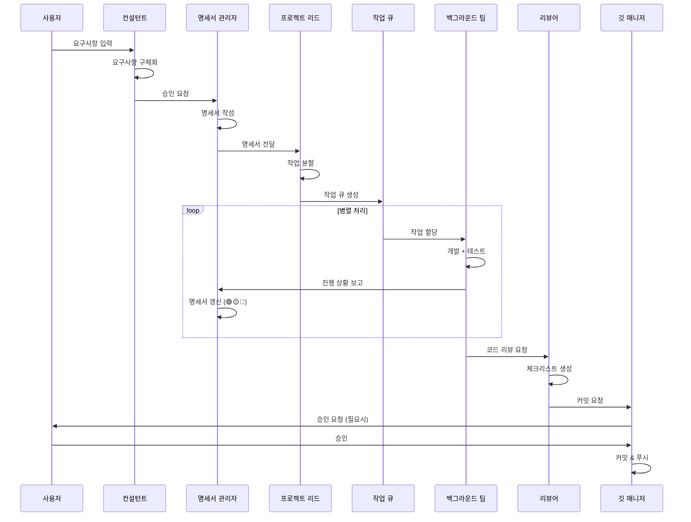
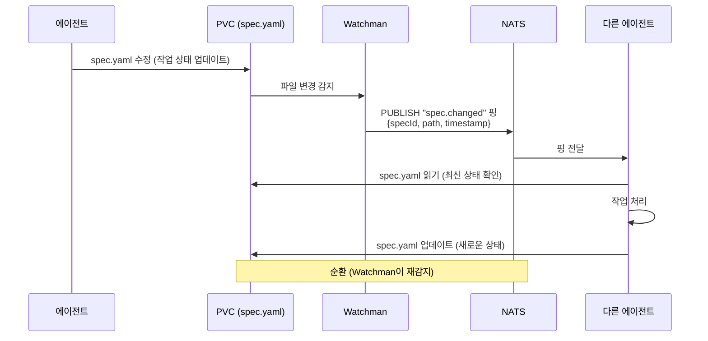

# 멀티 에이전트 시스템 아키텍처

## 📋 목차

- [개요](#개요)
- [시스템 구조](#시스템-구조)
- [에이전트 역할 상세](#에이전트-역할-상세)
- [명세서 시스템](#명세서-시스템)
- [비동기 통신 아키텍처](#비동기-통신-아키텍처)
- [컨테이너 격리 전략](#컨테이너-격리-전략)
- [자동 승인 정책](#자동-승인-정책)
- [실시간 감지 메커니즘](#실시간-감지-메커니즘)
- [오토스케일링](#오토스케일링)
- [시행착오 관리](#시행착오-관리)
- [Phase별 구현 계획](#phase별-구현-계획)
- [기존 시스템과의 마이그레이션](#기존-시스템과의-마이그레이션)

## 개요

### 현재 시스템의 한계

**1. 동기식 실행의 비효율**
- 모든 에이전트가 순차적으로 실행되어 병렬 처리 불가
- 하나의 작업이 완료될 때까지 다른 에이전트는 대기
- 예: 기능 개발 3개 → 3배의 시간 소요 (병렬 처리 시 1배)

**2. 빈번한 권한 요청**
- 모든 파일 수정/커밋에 사용자 승인 필요
- 워크플로우 중단 빈도 증가
- 개발 속도 저하

**3. 격리 환경 부재**
- 모든 에이전트가 동일한 파일 시스템 공유
- 동시 작업 시 충돌 가능성
- 테스트 환경과 실제 환경 분리 불가

**4. 상태 관리 부재**
- 진행 상황 추적 어려움
- 작업 완료 여부 판단 불명확
- 롤백/재시도 메커니즘 없음

### 목표 아키텍처

**비동기 + 병렬 처리**
- 독립적인 작업은 동시 실행
- 큐 기반 작업 관리
- 실시간 진행 상황 추적

**Kubernetes 기반 격리**
- Kubernetes Pod로 작업 환경 분리
- 읽기 전용 권한으로 안전성 확보
- 테스트 실행 환경 독립

**자동 스케일링**
- KEDA 기반 0→N 오토스케일링
- 작업량에 따라 Pod 증감 (유휴 시 0개로 비용 최적화)
- 리소스 효율적 활용

**명세서 중심 관리**
- 단일 진실 공급원 (Single Source of Truth)
- 실시간 상태 추적
- 변경 이력 자동 반영

## 시스템 구조

### 전체 아키텍처

```
┌─────────────────────────────────────────────────────────────────┐
│                        사용자 (User)                             │
└────────────────────────────┬────────────────────────────────────┘
                             │ 요구사항 입력
                             ↓
┌─────────────────────────────────────────────────────────────────┐
│                   컨설턴트 (Consultant)                          │
│                   [OpenCode Pod - 실시간]                        │
│  • 요구사항 구체화                                               │
│  • 숨겨진 니즈 발굴                                              │
│  • 승인 요청 생성                                                │
└────────────────────────────┬────────────────────────────────────┘
                             │ 승인
                             ↓
┌─────────────────────────────────────────────────────────────────┐
│                명세서 관리자 (Spec Manager)                       │
│                  [Pod - 실시간 감지 Watchman]                    │
│  • 명세서 작성/갱신                                              │
│  • 진행 상황 추적 (🟢🟡🔴)                                      │
│  • 변경사항 감지 → 재할당                                        │
└────────────────────────────┬────────────────────────────────────┘
                             │ 명세서 전달
                             ↓
┌─────────────────────────────────────────────────────────────────┐
│              프로젝트 리드 (Project Lead)                         │
│                  [Pod - 비실시간 Watchman]                       │
│  • 기술 계획 수립                                                │
│  • 작업 분할 및 할당                                             │
│  • 아키텍처 의사결정                                             │
└────────────────────────────┬────────────────────────────────────┘
                             │ 작업 큐 생성
            ┌────────────────┴─────────────────┐
            ↓                                  ↓
┌──────────────────────────┐      ┌──────────────────────────┐
│  백그라운드 개발 팀       │      │   리뷰어 (Reviewer)      │
│  [Worker Pod N개 - 격리]  │      │   [Pod - 비동기]         │
│  • 기능 개발              │      │   • 코드 리뷰            │
│  • 테스트 작성            │      │   • 체크리스트 생성      │
│  • 로컬 테스트 실행       │      │   • 개선 제안            │
│  • KEDA 오토스케일링      │      └──────────┬───────────────┘
└────────────┬──────────────┘                 │
             │ 작업 보고                      │ 리뷰 결과
             └────────────────┬───────────────┘
                             ↓
┌─────────────────────────────────────────────────────────────────┐
│                 신입 (Junior Developer)                          │
│                  [Pod - 비동기 Watchman]                         │
│  • 변경 이력 확인                                                │
│  • 질문 생성 ("왜?", "근거는?")                                  │
│  • 학습 및 문서화                                                │
└────────────────────────────┬────────────────────────────────────┘
                             │ 질문/피드백
                             ↓
┌─────────────────────────────────────────────────────────────────┐
│                  깃 매니저 (Git Manager)                          │
│                   [OpenCode Pod - 실시간]                        │
│  • Git 작업 관리 (커밋, 푸시, 브랜치)                            │
│  • PR 생성 (일부 자동, 일부 수동)                                │
│  • 충돌 해결                                                     │
└─────────────────────────────────────────────────────────────────┘
```

### 데이터 흐름



### 컴포넌트 관계도

```
┌─────────────────────────────────────────┐
│         실시간 감지 레이어               │
│  (OpenCode Pod 직접 실행)                │
│  • 컨설턴트                              │
│  • 명세서 관리자 (파일 변경 감지)       │
│  • 깃 매니저                             │
└─────────────────────────────────────────┘
                  ↕
┌─────────────────────────────────────────┐
│         공용 Pod (Watchman 감지)         │
│  • 프로젝트 리드                         │
│  • 리뷰어                                │
│  • 신입                                  │
└─────────────────────────────────────────┘
                  ↕
┌─────────────────────────────────────────┐
│       격리 Worker Pod (KEDA N개)         │
│  • 백그라운드 개발 팀                    │
│  • 0→N 오토스케일링                      │
│  • 읽기 전용 권한                        │
└─────────────────────────────────────────┘
```

### Kubernetes Pod 구성도 (v3.0.0)

```
┌─────────────────────────────────────────────────────────────────┐
│                    Kubernetes Cluster (k3s)                        │
├─────────────────────────────────────────────────────────────────┤
│                                                                   │
│  ┌──────────────────────────────────┐  ┌────────────────────┐   │
│  │ gateway Pod (multi-container)    │  │ NATS Pod           │   │
│  │ - consultant (사용자 대면)       │  │ (~50MB RAM)        │   │
│  │ - git-manager (Git 작업)         │  │ 알림 핑만          │   │
│  │ 외부 노출                        │  │                    │   │
│  └──────────────────────────────────┘  └────────────────────┘   │
│                                                                   │
│  ┌──────────────────────────────────┐  ┌────────────────────┐   │
│  │ coordinator Pod (multi-container)│  │ PostgreSQL Pod     │   │
│  │ - spec-manager (명세서 관리)     │  │ + pgvector         │   │
│  │ - project-lead (기술 계획)       │  │ (512MB RAM)        │   │
│  │ - reviewer (코드 리뷰)           │  │ 시행착오 DB        │   │
│  └──────────────────────────────────┘  └────────────────────┘   │
│                                                                   │
│  ┌──────────────────────────────────────────────────────────┐   │
│  │ Worker Pod ×0→3 (KEDA NATS scaler)                        │   │
│  │ background-dev (기능 개발 / 테스트)                       │   │
│  │ 읽기 전용 + emptyDir /scratch                              │   │
│  └──────────────────────────────────────────────────────────┘   │
│                                                                   │
│  PVC (RWX) — 공유 파일 시스템 (specs, code)                      │
└─────────────────────────────────────────────────────────────────┘

리소스 예산:
┌──────────────────┬─────────┬──────────┐
│ 구분             │ CPU     │ RAM      │
├──────────────────┼─────────┼──────────┤
│ k3s 컨트롤 플레인│ 0.5     │ 750MB    │
│ gateway Pod      │ 0.4     │ 768MB    │
│ coordinator Pod  │ 0.6     │ 896MB    │
│ nats Pod         │ 0.05    │ 64MB     │
│ postgresql Pod   │ 0.5     │ 512MB    │
│ 고정 합계        │ 1.55    │ 3.1GB    │
│ Worker ×3 (최대) │ 1.5     │ 2.3GB    │
│ 총 최대          │ 3.55    │ 6.15GB   │
│ 여유             │ 0.45    │ 1.85GB   │
└──────────────────┴─────────┴──────────┘
```

**설계 근거**:
- **Pod 통합**: 8개 → 4개 고정 + Worker 0→3. 컨테이너 오버헤드 감소 (~500MB RAM 절약)
- **NATS 경량성**: Redis(100~300MB) → NATS(~50MB). 알림 핑만 전달, 상세 정보는 spec 파일에
- **Worker 축소**: 0→6에서 0→3으로 축소. 명세서 중심 통신으로 작업 효율성 증가
- **모니터링 제거**: Prometheus + Loki + Jaeger + Grafana 제거 (1GB+ 절약) → kubectl logs + k9s

## 에이전트 역할 상세

### 1. 컨설턴트 (Consultant)

**실행 환경**: 터미널 (실시간 감지 필요)

**왜 필요한가**
- 사용자의 모호한 요구사항을 구체화
- 기술적 제약사항과 비즈니스 요구사항의 균형
- 명확한 작업 범위 정의로 후속 작업 효율 향상

**어떻게 구현할 것인가**

```typescript
// ⚠️ 로직 이해용 예시 코드 — 실제 에이전트는 .agents/agents/*.md 프롬프트로 구현
// consultant-agent.ts
interface ConsultantConfig {
  conversationHistory: Message[];
  userContext: ProjectContext;
  clarificationQuestions: string[];
}

class ConsultantAgent {
  async clarifyRequirements(userInput: string): Promise<Specification> {
    // 1. 요구사항 분석
    const analysis = await this.analyzeRequirement(userInput);
    
    // 2. 숨겨진 니즈 발굴
    const hiddenNeeds = await this.detectHiddenNeeds(analysis);
    
    // 3. 명확화 질문 생성
    const questions = await this.generateClarificationQuestions(hiddenNeeds);
    
    // 4. 사용자와 대화
    const answers = await this.conversateWithUser(questions);
    
    // 5. 명세서 초안 작성
    return await this.draftSpecification(answers);
  }
  
  async requestApproval(spec: Specification): Promise<boolean> {
    // 사용자에게 승인 요청
    return await this.promptUser(`다음 작업을 진행할까요?\n${spec.summary}`);
  }
}
```

**입력**: 사용자 요구사항 (자연어)  
**출력**: 구체화된 명세서 초안 + 승인 요청

**상호작용**
- 사용자 ↔ 실시간 대화
- 명세서 관리자 → 명세서 전달

---

### 2. 명세서 관리자 (Spec Manager)

**실행 환경**: 공용 컨테이너1 또는 터미널 (실시간 감지 필요)

**왜 필요한가**
- 프로젝트의 단일 진실 공급원(Single Source of Truth)
- 모든 에이전트가 참조할 중앙 상태 관리
- 변경사항 자동 감지 및 재할당으로 일관성 유지

**어떻게 구현할 것인가**

```typescript
// ⚠️ 로직 이해용 예시 코드 — 실제 에이전트는 .agents/agents/*.md 프롬프트로 구현
// spec-manager-agent.ts
interface Specification {
  id: string;
  version: string;
  status: 'draft' | 'approved' | 'in-progress' | 'completed';
  requirements: Requirement[];
  tasks: Task[];
  progress: ProgressTracker;
}

interface Task {
  id: string;
  title: string;
  status: 'pending' | 'in-progress' | 'completed' | 'failed';
  statusEmoji: '🟢' | '🟡' | '🔴'; // 초록/노랑/빨강
  assignedTo?: string;
  dependencies: string[];
  createdAt: Date;
  updatedAt: Date;
}

class SpecManagerAgent {
  private watcher: FileWatcher;
  
  async watchSpecification(specPath: string): Promise<void> {
    // 파일 변경 감지
    this.watcher.on('change', async (event) => {
      const updatedSpec = await this.loadSpecification(specPath);
      await this.handleSpecChange(updatedSpec);
    });
  }
  
  async updateProgress(taskId: string, status: TaskStatus): Promise<void> {
    const spec = await this.loadSpecification();
    const task = spec.tasks.find(t => t.id === taskId);
    
    if (!task) throw new Error(`Task ${taskId} not found`);
    
    // 상태 업데이트
    task.status = status;
    task.statusEmoji = this.mapStatusToEmoji(status);
    task.updatedAt = new Date();
    
    // 명세서 저장
    await this.saveSpecification(spec);
    
    // 의존 작업 확인
    await this.checkDependentTasks(taskId);
  }
  
  private mapStatusToEmoji(status: TaskStatus): string {
    switch (status) {
      case 'completed': return '🟢';
      case 'in-progress': return '🟡';
      case 'failed': return '🔴';
      default: return '⚪';
    }
  }
  
  async handleSpecChange(spec: Specification): Promise<void> {
    // 1. 변경 사항 분석
    const changes = await this.analyzeChanges(spec);
    
    // 2. 영향받는 작업 식별
    const affectedTasks = await this.identifyAffectedTasks(changes);
    
    // 3. 작업 재할당
    await this.reassignTasks(affectedTasks);
    
    // 4. 에이전트 알림
    await this.notifyAgents(affectedTasks);
  }
}
```

**입력**: 컨설턴트의 명세서 초안  
**출력**: 정제된 명세서 + 진행 상황 추적

**상호작용**
- 컨설턴트 → 명세서 초안 수신
- 프로젝트 리드 → 명세서 전달
- 백그라운드 팀 ← 진행 상황 수신
- 실시간 파일 감지 → 자동 재할당

---

### 3. 프로젝트 리드 (Project Lead)

**실행 환경**: 공용 컨테이너1 (비실시간, 요청 시 활성화)

**왜 필요한가**
- 기술적 의사결정의 중앙화
- 작업 분할 및 우선순위 결정
- 아키텍처 일관성 유지

**어떻게 구현할 것인가**

```typescript
// ⚠️ 로직 이해용 예시 코드 — 실제 에이전트는 .agents/agents/*.md 프롬프트로 구현
// project-lead-agent.ts
interface TechnicalPlan {
  architecture: ArchitectureDecision[];
  tasks: Task[];
  dependencies: DependencyGraph;
  estimatedTime: number;
  risks: Risk[];
}

class ProjectLeadAgent {
  async createTechnicalPlan(spec: Specification): Promise<TechnicalPlan> {
    // 1. 아키텍처 결정
    const architecture = await this.decideArchitecture(spec);
    
    // 2. 작업 분할
    const tasks = await this.breakdownTasks(spec, architecture);
    
    // 3. 의존성 그래프 생성
    const dependencies = await this.buildDependencyGraph(tasks);
    
    // 4. 리스크 분석
    const risks = await this.analyzeRisks(tasks, dependencies);
    
    return { architecture, tasks, dependencies, risks, estimatedTime: 0 };
  }
  
  async assignTasks(plan: TechnicalPlan): Promise<void> {
    // 작업 큐에 할당
    for (const task of plan.tasks) {
      if (this.canStartTask(task, plan.dependencies)) {
        await this.taskQueue.enqueue(task);
      }
    }
  }
  
  private canStartTask(task: Task, dependencies: DependencyGraph): boolean {
    // 의존성이 모두 완료되었는지 확인
    return dependencies.get(task.id)?.every(dep => dep.status === 'completed') ?? true;
  }
}
```

**입력**: 명세서 관리자의 명세서  
**출력**: 기술 계획 + 작업 큐

**상호작용**
- 명세서 관리자 → 명세서 수신
- 작업 큐 → 작업 할당
- 신입 ← 질문 답변

---

### 4. 깃 매니저 (Git Manager)

**실행 환경**: 터미널 (실시간 실행)

**왜 필요한가**
- Git 작업의 중앙 관리로 충돌 방지
- **보안**: 에이전트의 push 금지로 잘못된 커밋/시크릿 유출 방지
- 안전한 브랜치 전략 강제

**어떻게 구현할 것인가**

```typescript
// ⚠️ 로직 이해용 예시 코드 — 실제 에이전트는 .agents/agents/*.md 프롬프트로 구현
// git-manager-agent.ts
interface GitPolicy {
  allowedOperations: {
    commit: boolean;
    branch: boolean;
    merge: boolean;  // 로컬만
    push: boolean;   // v3.0.0: 절대 금지
    forcePush: boolean;  // v3.0.0: 절대 금지
  };
  securityChecks: string[];
}

class GitManagerAgent {
  private policy: GitPolicy = {
    allowedOperations: {
      commit: true,
      branch: true,
      merge: true,   // 로컬 squash merge만
      push: false,   // ❌ 에이전트 push 금지
      forcePush: false,  // ❌ force push 금지
    },
    securityChecks: [
      'secret-scan',      // 시크릿/키 유출 검사
      'sensitive-data',   // 개인정보/인증 토큰 검사
      'large-files',      // 대용량 파일 검사
    ],
  };
  
  async commit(files: string[], message: string): Promise<void> {
    // 1. 보안 스캔
    const scanResults = await this.runSecurityScans(files);
    if (scanResults.hasIssues) {
      throw new Error(`보안 이슈 발견: ${scanResults.issues.join(', ')}`);
    }
    
    // 2. 로컬 커밋
    await this.git.add(files);
    await this.git.commit(message);
    
    console.log(`✅ 로컬 커밋 완료: ${message}`);
  }
  
  async preparePush(): Promise<void> {
    // 1. 로컬 squash merge
    await this.git.merge('--squash', 'feature-branch');
    
    // 2. 보안 검토 리포트 생성
    const securityReport = await this.generateSecurityReport();
    
    // 3. 사용자에게 알림 (푸시 준비 완료)
    console.log(`
    ✅ 푸시 준비 완료
    
    다음 단계 (수동 실행 필요):
    1. 보안 리포트 확인: ${securityReport.path}
    2. 변경사항 최종 검토
    3. 사용자가 직접 push 실행:
       $ git push origin develop
    `);
  }
  
  async push(): Promise<never> {
    throw new Error('❌ 에이전트 push 금지. 사용자가 직접 실행하세요.');
  }
  
  private async runSecurityScans(files: string[]): Promise<ScanResult> {
    const issues: string[] = [];
    
    for (const file of files) {
      const content = await this.readFile(file);
      
      // 시크릿 패턴 검사
      if (/AKIA[0-9A-Z]{16}/.test(content)) {
        issues.push(`${file}: AWS Access Key 발견`);
      }
      if (/sk-[a-zA-Z0-9]{48}/.test(content)) {
        issues.push(`${file}: OpenAI API Key 발견`);
      }
      if (/ghp_[a-zA-Z0-9]{36}/.test(content)) {
        issues.push(`${file}: GitHub Token 발견`);
      }
    }
    
    return {
      hasIssues: issues.length > 0,
      issues,
    };
  }
}
```

**입력**: 리뷰어의 커밋 요청  
**출력**: 로컬 Git 작업 (커밋, 브랜치, squash merge) + 푸시 준비 알림

**v3.0.0 정책**:
- ✅ 로컬 commit, branch, merge 허용
- ❌ push 절대 금지 (모든 에이전트)
- ✅ 푸시 전 보안 스캔 (시크릿/키 유출 검사)
- ✅ 사용자 최종 검토 후 수동 push

---

### 5. 리뷰어 (Reviewer)

**실행 환경**: 공용 컨테이너1 (비동기)

**왜 필요한가**
- 코드 품질 자동 검증
- 일관된 리뷰 기준 적용
- 사람의 리뷰 전 1차 필터링

**어떻게 구현할 것인가**

```typescript
// ⚠️ 로직 이해용 예시 코드 — 실제 에이전트는 .agents/agents/*.md 프롬프트로 구현
// reviewer-agent.ts
interface ReviewChecklist {
  codeStyle: CheckItem[];
  architecture: CheckItem[];
  testing: CheckItem[];
  security: CheckItem[];
  performance: CheckItem[];
}

interface CheckItem {
  id: string;
  description: string;
  status: 'pass' | 'fail' | 'warning';
  details?: string;
}

class ReviewerAgent {
  async reviewCode(files: ChangedFile[]): Promise<ReviewChecklist> {
    const checklist: ReviewChecklist = {
      codeStyle: await this.checkCodeStyle(files),
      architecture: await this.checkArchitecture(files),
      testing: await this.checkTesting(files),
      security: await this.checkSecurity(files),
      performance: await this.checkPerformance(files),
    };
    
    return checklist;
  }
  
  private async checkArchitecture(files: ChangedFile[]): Promise<CheckItem[]> {
    const checks: CheckItem[] = [];
    
    // FSD 레이어 의존성 검증
    for (const file of files) {
      const layer = this.detectFSDLayer(file.path);
      const imports = this.extractImports(file.content);
      
      for (const imp of imports) {
        const importLayer = this.detectFSDLayer(imp);
        if (!this.isValidLayerDependency(layer, importLayer)) {
          checks.push({
            id: `arch-${file.path}`,
            description: `❌ FSD 역방향 import: ${layer} → ${importLayer}`,
            status: 'fail',
            details: `${file.path}:${imp}`,
          });
        }
      }
    }
    
    return checks;
  }
}
```

**입력**: 백그라운드 팀의 코드  
**출력**: 리뷰 체크리스트 + 개선 제안

**상호작용**
- 백그라운드 팀 → 코드 수신
- 깃 매니저 → 커밋 요청

---

### 6. 신입 (Junior Developer)

**실행 환경**: 공용 컨테이너1 (비동기)

**왜 필요한가**
- "왜?"를 묻는 문화 정착
- 암묵적 지식의 명시화
- 문서화 자동화

**어떻게 구현할 것인가**

```typescript
// ⚠️ 로직 이해용 예시 코드 — 실제 에이전트는 .agents/agents/*.md 프롬프트로 구현
// junior-agent.ts
interface Question {
  id: string;
  context: string;
  question: string;
  type: 'why' | 'how' | 'what' | 'alternative';
  priority: number;
}

class JuniorAgent {
  async reviewChanges(commits: Commit[]): Promise<Question[]> {
    const questions: Question[] = [];
    
    for (const commit of commits) {
      // 기술 선택에 대한 질문
      const techChoices = this.detectTechChoices(commit);
      for (const choice of techChoices) {
        questions.push({
          id: `tech-${commit.hash}-${choice.name}`,
          context: `${commit.message}\n파일: ${choice.file}`,
          question: `왜 ${choice.name}을(를) 선택했나요? 대안은 무엇이었나요?`,
          type: 'why',
          priority: 8,
        });
      }
      
      // 아키텍처 결정에 대한 질문
      const archDecisions = this.detectArchDecisions(commit);
      for (const decision of archDecisions) {
        questions.push({
          id: `arch-${commit.hash}-${decision.name}`,
          context: `${commit.message}\n파일: ${decision.file}`,
          question: `이 구조를 선택한 근거는 무엇인가요?`,
          type: 'why',
          priority: 9,
        });
      }
    }
    
    return questions.sort((a, b) => b.priority - a.priority);
  }
  
  async verifyAnswers(questions: Question[], answers: Answer[]): Promise<void> {
    // 프로젝트 리드 또는 리뷰어에게 답변 검증 요청
    for (const answer of answers) {
      await this.requestVerification(answer);
    }
  }
}
```

**입력**: Git 변경 이력  
**출력**: 질문 리스트

**상호작용**
- Git 이력 → 변경사항 분석
- 프로젝트 리드/리뷰어 → 답변 검증 요청

---

### 7. 백그라운드 개발 팀 (Background Dev Team)

**실행 환경**: 격리 컨테이너 N개 (병렬 실행)

**왜 필요한가**
- 병렬 처리로 개발 속도 향상
- 격리 환경으로 안전성 확보
- 독립적인 테스트 실행

**어떻게 구현할 것인가**

```typescript
// ⚠️ 로직 이해용 예시 코드 — 실제 에이전트는 .agents/agents/*.md 프롬프트로 구현
// background-dev-agent.ts
interface DevTask {
  id: string;
  type: 'feature' | 'test' | 'refactor' | 'fix';
  spec: TaskSpecification;
  containerId?: string;
}

class BackgroundDevAgent {
  private containerId: string;
  
  async executeTask(task: DevTask): Promise<TaskResult> {
    // 1. 작업 시작 알림
    await this.notifyStart(task);
    
    // 2. 중간 지시사항 확인
    const instructions = await this.checkInstructions(task.id);
    if (instructions.length > 0) {
      await this.updateTaskPlan(task, instructions);
    }
    
    // 3. 개발 실행
    const code = await this.developFeature(task.spec);
    
    // 4. 테스트 작성
    const tests = await this.writeTests(code);
    
    // 5. 로컬 테스트 실행
    const testResult = await this.runTests(tests);
    
    // 6. 진행 상황 보고
    await this.reportProgress(task.id, testResult);
    
    return { code, tests, testResult };
  }
  
  private async checkInstructions(taskId: string): Promise<Instruction[]> {
    // 큐에서 새로운 지시사항 확인
    const instructions = await this.taskQueue.getInstructions(taskId);
    
    if (instructions.length > 0) {
      // 읽었음을 알림
      await this.taskQueue.markAsRead(taskId, instructions);
    }
    
    return instructions;
  }
  
  private async reportProgress(taskId: string, result: TestResult): Promise<void> {
    // 명세서 관리자에게 보고
    await this.specManager.updateProgress(taskId, {
      status: result.passed ? 'completed' : 'in-progress',
      details: result,
      timestamp: new Date(),
    });
  }
}
```

**입력**: 작업 큐의 작업  
**출력**: 개발된 코드 + 테스트 + 실행 결과

**상호작용**
- 작업 큐 → 작업 수신
- 명세서 관리자 → 진행 상황 보고
- 리뷰어 → 코드 전달

**제약사항**
- 격리 환경 내에서만 실행 (읽기 전용)
- 내부에서 로컬 서버 기동 및 테스트 가능
- 외부 파일 시스템 수정 불가

### Worker 결과물 제출 패턴 (v3.0.0 - spec 파일 기반)

Worker Pod는 읽기 전용이므로 `/scratch`(emptyDir)에 코드를 작성한 뒤,
diff를 생성하고 **spec.yaml의 submissions 섹션에 경로를 기록**합니다.
Git Manager가 Watchman 감지 → spec 파일 읽기 → diff 적용 순으로 처리합니다.

```
Worker Pod                    spec.yaml (PVC)       Git Manager
┌────────────┐               ┌─────────────┐       ┌──────────────┐
│ /workspace │ (읽기 전용)   │ submissions:│       │              │
│ /scratch   │ → diff 생성 → │   - path:   │ → 감지→│ git apply    │
│            │               │     /diffs/ │       │ git commit   │
└────────────┘               └─────────────┘       └──────────────┘
```

**v2.0.0 (Redis Stream) 대비 변경점**:
- ❌ Redis Stream 제거
- ✅ diff 파일을 PVC에 저장 (예: `/workspace/diffs/TASK-001.diff`)
- ✅ spec.yaml에 경로 기록
- ✅ Watchman이 spec 변경 감지 → NATS 핑 → Git Manager가 처리

---

## 명세서 시스템

### 왜 필요한가

- **단일 진실 공급원**: 모든 에이전트가 동일한 정보 참조
- **진행 상황 가시성**: 실시간으로 작업 상태 추적
- **변경 이력 관리**: 누가, 언제, 무엇을, 왜 변경했는지 기록
- **롤백 가능성**: 문제 발생 시 이전 상태로 복원

### 파일 구조

```
specs/
├── current.yaml              # 현재 진행 중인 명세서
├── archive/
│   ├── 2025-02-17-feature-auth.yaml
│   └── 2025-02-16-refactor-routing.yaml
└── templates/
    ├── feature.yaml
    ├── refactor.yaml
    └── fix.yaml
```

### 명세서 포맷 (YAML)

```yaml
# specs/current.yaml
id: "spec-2025-02-17-001"
version: "1.2.0"
status: "in-progress"  # draft | approved | in-progress | completed | cancelled

metadata:
  title: "사용자 인증 기능 구현"
  author: "consultant-agent"
  createdAt: "2025-02-17T10:00:00Z"
  updatedAt: "2025-02-17T14:30:00Z"
  approvedBy: "user@example.com"
  approvedAt: "2025-02-17T10:15:00Z"

requirements:
  - id: "REQ-001"
    description: "이메일/비밀번호 로그인"
    priority: "high"
    status: "completed"  # 🟢
    
  - id: "REQ-002"
    description: "소셜 로그인 (Google, GitHub)"
    priority: "medium"
    status: "in-progress"  # 🟡
    
  - id: "REQ-003"
    description: "2FA (Two-Factor Authentication)"
    priority: "low"
    status: "failed"  # 🔴
    failureReason: "외부 API 연동 실패"

technicalPlan:
  architecture:
    - decision: "JWT 기반 인증"
      reason: "Stateless, 확장 가능"
      alternatives: ["Session 기반", "OAuth2"]
      
  dependencies:
    - name: "jsonwebtoken"
      version: "^9.0.0"
      reason: "JWT 생성/검증"

tasks:
  - id: "TASK-001"
    title: "JWT 유틸리티 함수 작성"
    type: "feature"
    status: "completed"  # 🟢
    emoji: "🟢"
    assignedTo: "background-dev-1"
    estimatedTime: "2h"
    actualTime: "1.5h"
    dependencies: []
    files:
      - "src/shared/lib/jwt.ts"
      - "src/shared/lib/__tests__/jwt.test.ts"
    
  - id: "TASK-002"
    title: "로그인 API 엔드포인트"
    type: "feature"
    status: "in-progress"  # 🟡
    emoji: "🟡"
    assignedTo: "background-dev-2"
    estimatedTime: "3h"
    actualTime: "2h"
    dependencies: ["TASK-001"]
    files:
      - "src/features/auth/api/login.ts"
      
  - id: "TASK-003"
    title: "2FA 구현"
    type: "feature"
    status: "failed"  # 🔴
    emoji: "🔴"
    assignedTo: "background-dev-3"
    estimatedTime: "4h"
    actualTime: "3h"
    dependencies: ["TASK-001"]
    failureReason: "speakeasy 라이브러리 TOTP 생성 실패"
    retryCount: 2

progress:
  total: 3
  completed: 1  # 🟢
  inProgress: 1  # 🟡
  failed: 1  # 🔴
  percentage: 33

changeLog:
  - timestamp: "2025-02-17T14:30:00Z"
    author: "spec-manager"
    action: "update-task-status"
    details:
      taskId: "TASK-003"
      from: "in-progress"
      to: "failed"
      reason: "외부 라이브러리 이슈"
```

### JSON 대안 (더 간결한 표현)

```json
{
  "id": "spec-2025-02-17-001",
  "version": "1.2.0",
  "status": "in-progress",
  "metadata": {
    "title": "사용자 인증 기능 구현",
    "author": "consultant-agent",
    "createdAt": "2025-02-17T10:00:00Z"
  },
  "tasks": [
    {
      "id": "TASK-001",
      "title": "JWT 유틸리티 함수 작성",
      "status": "completed",
      "emoji": "🟢"
    }
  ],
  "progress": {
    "completed": 1,
    "inProgress": 1,
    "failed": 1,
    "percentage": 33
  }
}
```

### 상태 관리 규칙

| 이모지 | 상태 | 의미 | 다음 상태 |
|-------|------|------|-----------|
| ⚪ | `pending` | 대기 중 | 🟡 |
| 🟡 | `in-progress` | 진행 중 | 🟢, 🔴 |
| 🟢 | `completed` | 완료 | - |
| 🔴 | `failed` | 실패 | 🟡 (재시도) |

### 버전 관리

```yaml
# 명세서 수정 시 자동으로 버전 증가
version: "1.2.3"
# MAJOR.MINOR.PATCH
# MAJOR: 요구사항 추가/삭제 (큰 변경)
# MINOR: 작업 추가/수정 (중간 변경)
# PATCH: 상태 업데이트 (작은 변경)
```

---

## 비동기 통신 아키텍처

### 왜 필요한가

- **응답 대기 시간 제거**: 에이전트가 블로킹되지 않음
- **실시간 지시 반영**: 작업 중에도 새로운 지시사항 수신
- **효율적 리소스 활용**: 대기 중인 에이전트는 휴면 상태

### 명세서 중심 통신 모델 (v3.0.0)

**핵심 원칙**: NATS는 "알림 핑"만, 상세 정보는 spec 파일에



**v2.0.0 (Redis 24채널) 대비 변경점**:
- ❌ Redis Pub/Sub 24채널 제거
- ❌ Redis Stream 제거
- ✅ NATS 핑 기반 알림 (극도로 간결한 메시지)
- ✅ 모든 상세 정보는 spec.yaml 파일에 저장
- ✅ Watchman이 파일 변경 감지 → NATS 핑 발행
- ✅ 에이전트는 핑 수신 후 PVC에서 spec 파일 직접 읽기

### NATS Core 특성 (v3.0.0)

- **경량**: Go 바이너리, ~50MB RAM (Redis 100~300MB 대비 1/2~1/6)
- **CNCF 프로젝트**: 클라우드 네이티브 메시징 표준
- **JetStream 불필요**: spec 파일이 persistent state 역할
- **단순 Pub/Sub**: 채널 구독, 메시지 발행만
- **KEDA 통합**: NATS scaler로 Worker 오토스케일링

**상세 설계**: [async-communication.md](./async-communication.md)

---

## Kubernetes Pod 격리 전략

### 왜 필요한가

- **안전성**: 격리된 환경에서 코드 실행 → 메인 시스템 영향 없음
- **재현성**: 동일한 환경에서 항상 동일한 결과
- **병렬성**: 여러 Pod 동시 실행으로 속도 향상

### Kubernetes 기반 아키텍처

```dockerfile
# ⚠️ 로직 이해용 예시 — 실제 Dockerfile은 구현 Phase에서 확정
# Dockerfile.dev-agent
FROM node:20-alpine

# 필수 도구 설치
RUN apk add --no-cache git

# 작업 디렉토리
WORKDIR /workspace

# 프로젝트 파일 복사 (읽기 전용)
COPY --chown=node:node . .

# 의존성 설치
RUN pnpm install --frozen-lockfile

# 비특권 사용자로 전환
USER node

# 에이전트 실행
CMD ["node", "agents/background-dev.js"]
```

### Pod 권한 분리 (v3.0.0)

| Pod | 읽기 | 쓰기 | Git | 네트워크 | 볼륨 |
|-----|------|------|-----|----------|------|
| gateway Pod | ✅ | ✅ | commit/branch/merge (로컬만) | ✅ (외부) | PVC RWX |
| coordinator Pod | ✅ | ✅ (specs/, docs/) | ❌ | ✅ (내부) | PVC RWX |
| Worker Pod ×3 | ✅ | ❌ | ❌ | ✅ (제한) | PVC RO + emptyDir |
| nats Pod | - | - | ❌ | ✅ (내부) | - |
| postgresql Pod | - | - | ❌ | ✅ (내부) | PVC RWO |

**Git 보안 정책 (v3.0.0)**:
- ❌ **모든 에이전트 push 금지** (gateway Pod 포함)
- ✅ commit, branch, merge (로컬만) 허용
- ✅ **푸시 전 필수 프로세스**: squash merge → 로컬 보안 검토 (시크릿/키 유출 스캔) → 사람 검토/승인 → **사람이 직접 push**
- ❌ force push 금지

**설계 근거**: 에이전트의 실수로 인한 잘못된 커밋/시크릿 유출이 원격 저장소에 푸시되는 것을 원천 차단

### Kubernetes Worker Deployment (v3.0.0 - NATS scaler)

```yaml
# ⚠️ 로직 이해용 예시 — 실제 매니페스트는 구현 Phase에서 확정
# k8s/worker-deployment.yaml
apiVersion: apps/v1
kind: Deployment
metadata:
  name: worker-dev
  labels:
    app: agent-worker
spec:
  replicas: 0  # KEDA가 관리
  selector:
    matchLabels:
      app: agent-worker
  template:
    metadata:
      labels:
        app: agent-worker
    spec:
      containers:
        - name: background-dev
          image: blog-agent-worker:latest
          env:
            - name: AGENT_TYPE
              value: "background-dev"
            - name: NATS_URL
              valueFrom:
                secretKeyRef:
                  name: nats-secret
                  key: url
            - name: DATABASE_URL
              valueFrom:
                secretKeyRef:
                  name: pg-secret
                  key: url
          volumeMounts:
            - name: shared-workspace
              mountPath: /workspace
              readOnly: true     # 읽기 전용
            - name: scratch
              mountPath: /scratch  # 임시 작업 공간
          resources:
            requests:
              cpu: "500m"
              memory: "768Mi"
            limits:
              cpu: "2000m"
              memory: "2Gi"
      volumes:
        - name: shared-workspace
          persistentVolumeClaim:
            claimName: workspace-pvc  # RWX PVC
        - name: scratch
          emptyDir: {}
```

**v2.0.0 대비 변경점**:
- `REDIS_URL` → `NATS_URL`
- RAM requests: 512Mi → 768Mi (명세서 파일 파싱 오버헤드)
- KEDA scaler: Redis list → NATS 큐 (아래 참조)

---

## 자동 승인 정책

### 왜 필요한가

- **워크플로우 효율화**: 안전한 작업은 자동 승인
- **사용자 피로도 감소**: 불필요한 승인 요청 제거
- **일관성 유지**: 정책 기반 자동 결정

### 승인 정책 테이블

| 작업 | 자동 승인 | 수동 승인 | 이유 |
|------|-----------|-----------|------|
| `develop` 푸시 | ✅ | - | 이미 feature에서 검증됨 |
| `develop` → `main` PR | ✅ | - | CI/CD 통과 후 자동 |
| 계획서 승인 후 커밋 | ✅ | - | 사용자가 계획서 승인함 |
| Feature PR 생성 | ✅ | - | 계획서 승인 시점에 이미 승인됨 |
| `main` 직접 푸시 | - | ✅ | 보호된 브랜치 |
| 수동 충돌 해결 | - | ✅ | 사람 판단 필요 |
| 환경변수 변경 | - | ✅ | 보안 위험 |

### 구현

```typescript
// ⚠️ 로직 이해용 예시 코드 — 실제 에이전트는 .agents/agents/*.md 프롬프트로 구현
// approval-policy.ts
interface ApprovalPolicy {
  autoApprove(action: GitAction): boolean;
  requiresApproval(action: GitAction): boolean;
}

class GitApprovalPolicy implements ApprovalPolicy {
  autoApprove(action: GitAction): boolean {
    switch (action.type) {
      case 'push':
        return action.branch === 'develop';
      
      case 'create-pr':
        if (action.from === 'develop' && action.to === 'main') {
          return true;
        }
        if (action.from.startsWith('feature/') && action.to === 'develop') {
          // 계획서 승인 여부 확인
          return this.isPlanApproved(action.from);
        }
        return false;
      
      case 'commit':
        // 계획서 승인 후 커밋은 자동
        return this.isPlanApproved(action.branch);
      
      default:
        return false;
    }
  }
  
  requiresApproval(action: GitAction): boolean {
    return !this.autoApprove(action);
  }
  
  private isPlanApproved(branch: string): boolean {
    // specs/current.yaml 확인
    const spec = this.loadSpecification();
    return spec.metadata.approvedBy !== null;
  }
}
```

---

## 실시간 감지 메커니즘

### 왜 필요한가

- **즉각 반응**: 변경사항 발생 즉시 처리
- **일관성 유지**: 명세서와 코드의 동기화
- **자동 재할당**: 영향받는 작업 자동 식별

### 파일 감지 (Meta Watchman)

```typescript
// ⚠️ 로직 이해용 예시 코드 — 실제 에이전트는 .agents/agents/*.md 프롬프트로 구현
// file-watcher.ts
import { Client as WatchmanClient } from 'fb-watchman';

class SpecificationWatcher {
  private client: WatchmanClient;

  constructor() {
    this.client = new WatchmanClient();
  }

  watch(specPath: string, callback: (event: FileChangeEvent) => void): void {
    this.client.capabilityCheck(
      { optional: [], required: ['relative_root'] },
      (error) => {
        if (error) throw error;

        this.client.command(
          ['watch-project', specPath],
          (error, resp) => {
            if (error) throw error;

            const { watch, relative_path } = resp;
            const sub = {
              expression: ['anyof', ['match', '*.yaml'], ['match', '*.yml']],
              fields: ['name', 'size', 'mtime_ms', 'exists', 'type'],
              relative_root: relative_path,
            };

            this.client.command(
              ['subscribe', watch, 'spec-changes', sub],
              (error) => {
                if (error) throw error;
              },
            );

            this.client.on('subscription', (resp) => {
              if (resp.subscription !== 'spec-changes') return;
              for (const file of resp.files) {
                callback({
                  type: file.exists ? 'change' : 'delete',
                  path: file.name,
                });
              }
            });
          },
        );
      },
    );
  }

  stop(): void {
    this.client.end();
  }
}

// 사용 예시
const watcher = new SpecificationWatcher();
watcher.watch('specs/current.yaml', async (event) => {
  console.log(`명세서 변경 감지: ${event.type} - ${event.path}`);
  
  // 명세서 재로드
  const spec = await loadSpecification(event.path);
  
  // 영향받는 작업 식별
  const affectedTasks = await analyzeImpact(spec);
  
  // 작업 재할당
  await reassignTasks(affectedTasks);
});
```

### PVC + Watchman 주의사항

> ⚠️ **K8s에서 Watchman 사용 시 주의사항**
>
> - ConfigMap/Secret 볼륨은 `inotify IN_MODIFY` 이벤트를 발생시키지 않음 (심볼릭 링크 교체 방식)
> - **PVC (EFS/NFS/Longhorn RWX)는 정상 작동** — inotify 이벤트 발생
> - 모든 에이전트의 공유 파일 시스템은 PVC RWX로 마운트해야 함
> - Watchman 사용 시 프로젝트 루트에 `.watchmanconfig` 파일 필요

### 진행 상황 감지

```typescript
// ⚠️ 로직 이해용 예시 코드 — 실제 에이전트는 .agents/agents/*.md 프롬프트로 구현
// progress-monitor.ts
class ProgressMonitor {
  private intervals: Map<string, NodeJS.Timeout> = new Map();
  
  startMonitoring(taskId: string, interval: number = 30000): void {
    const timer = setInterval(async () => {
      const status = await this.checkTaskStatus(taskId);
      
      if (status.changed) {
        await this.handleStatusChange(taskId, status);
      }
      
      if (status.completed || status.failed) {
        this.stopMonitoring(taskId);
      }
    }, interval);
    
    this.intervals.set(taskId, timer);
  }
  
  private async handleStatusChange(taskId: string, status: TaskStatus): Promise<void> {
    // 명세서 관리자에게 알림
    await this.specManager.updateProgress(taskId, status);
    
    // 의존 작업 활성화 확인
    const dependentTasks = await this.getDependentTasks(taskId);
    for (const depTask of dependentTasks) {
      if (this.canStartTask(depTask)) {
        await this.taskQueue.enqueue(depTask);
      }
    }
  }
  
  stopMonitoring(taskId: string): void {
    const timer = this.intervals.get(taskId);
    if (timer) {
      clearInterval(timer);
      this.intervals.delete(taskId);
    }
  }
}
```

---

## 오토스케일링 (v3.0.0 - NATS 기반)

### 왜 필요한가

- **비용 효율**: 필요할 때만 리소스 사용 (유휴 시 0개로 축소)
- **속도 향상**: 작업 증가 시 자동으로 용량 증가
- **유연성**: 다양한 작업 부하에 대응

### KEDA NATS Scaler

```yaml
# ⚠️ 로직 이해용 예시 — 실제 매니페스트는 구현 Phase에서 확정
# k8s/keda-scaledobject.yaml
apiVersion: keda.sh/v1alpha1
kind: ScaledObject
metadata:
  name: worker-scaler
spec:
  scaleTargetRef:
    name: worker-dev
  minReplicaCount: 0    # 유휴 시 0개 (비용 최적화)
  maxReplicaCount: 3    # v3.0.0: 최대 3개 (6개→3개 축소)
  cooldownPeriod: 60    # 스케일 다운 대기 (초)
  triggers:
    - type: nats-jetstream
      metadata:
        natsServerMonitoringEndpoint: "nats.default.svc.cluster.local:8222"
        queue: "worker.tasks"
        queueLength: "2"  # 작업 2개당 Pod 1개
```

**v2.0.0 (Redis) 대비 변경점**:
- `type: redis` → `type: nats-jetstream`
- `maxReplicaCount: 6` → `3` (명세서 중심 통신으로 효율 증가)
- `listName: tasks:pending` → `queue: worker.tasks`

### 스케일링 시나리오

**시나리오 1: 기능 개발 3개 + 테스트 3개 (v3.0.0)**
```
초기: 0개 Pod (KEDA idle)
작업 추가: 6개 작업 큐에 쌓임
스케일 업: 3개 Pod (6 / 2 = 3, KEDA 자동) — v2.0.0은 6개였음
병렬 처리: 각 Pod가 2개씩 처리
완료 후: 0개 Pod로 축소 (cooldown 60초 후)
```

**시나리오 2: 유휴 상태**
```
초기: 0개 Pod
리소스 사용: 0 (비용 최적화)
```

---

## 시행착오 관리

### 왜 필요한가

- **학습 효과**: 같은 실수 반복 방지
- **지식 축적**: 프로젝트 특화 지식 구축
- **디버깅 효율**: 과거 실패 원인 빠른 참조

### 하이브리드 시행착오 관리

**PostgreSQL + pgvector** (메인 저장소)
- 시행착오 데이터 CRUD
- 임베딩 기반 유사도 검색 (`<=>` 코사인 유사도)
- HNSW 인덱스로 빠른 검색
- 동시 접속 안전

**마크다운 Git 추적** (보조 저장소)
- 중요 시행착오의 사람 읽기용 문서
- Git 이력으로 변경 추적
- 코드 리뷰 시 참조 가능
- `docs/trial-errors/` 디렉토리에 저장

### PostgreSQL 스키마

```sql
-- ⚠️ 로직 이해용 예시 — 실제 스키마는 구현 Phase에서 확정

-- pgvector 확장
CREATE EXTENSION IF NOT EXISTS vector;

-- 시행착오 테이블
CREATE TABLE trial_errors (
  id UUID PRIMARY KEY DEFAULT gen_random_uuid(),
  agent_type VARCHAR(50) NOT NULL,
  task_id VARCHAR(100) NOT NULL,
  task_type VARCHAR(30) NOT NULL,
  files TEXT[] NOT NULL,
  error_type VARCHAR(100) NOT NULL,
  error_message TEXT NOT NULL,
  stack_trace TEXT,
  solution_description TEXT,
  solution_code TEXT,
  solution_references TEXT[],
  embedding VECTOR(1536),  -- OpenAI text-embedding-3-small
  created_at TIMESTAMPTZ NOT NULL DEFAULT NOW(),
  resolved_at TIMESTAMPTZ
);

-- HNSW 인덱스 (유사도 검색 최적화)
CREATE INDEX idx_trial_errors_embedding ON trial_errors
  USING hnsw (embedding vector_cosine_ops)
  WITH (m = 16, ef_construction = 64);

-- 에이전트별 조회 인덱스
CREATE INDEX idx_trial_errors_agent ON trial_errors (agent_type);
CREATE INDEX idx_trial_errors_type ON trial_errors (error_type);
```

### 유사도 검색 쿼리

```sql
-- 유사한 에러 검색 (코사인 유사도)
SELECT id, error_type, error_message, solution_description,
       1 - (embedding <=> $1::vector) AS similarity
FROM trial_errors
WHERE resolved_at IS NOT NULL
ORDER BY embedding <=> $1::vector
LIMIT 5;
```

### 시행착오 관리 코드

```typescript
// ⚠️ 로직 이해용 예시 코드 — 실제 에이전트는 .agents/agents/*.md 프롬프트로 구현
// trial-error-db.ts
import { Pool } from 'pg';

interface TrialError {
  id: string;
  agentType: string;
  context: {
    taskId: string;
    taskType: string;
    files: string[];
  };
  error: {
    type: string;
    message: string;
    stackTrace?: string;
  };
  solution?: {
    description: string;
    code?: string;
    references: string[];
  };
  timestamp: Date;
  resolvedAt?: Date;
}

class TrialErrorManager {
  private pool: Pool;
  
  constructor() {
    this.pool = new Pool({
      connectionString: process.env.DATABASE_URL,
    });
  }
  
  async recordError(error: TrialError): Promise<TrialError[]> {
    // 1. 에러 임베딩 생성
    const embedding = await this.generateEmbedding(error);
    
    // 2. PostgreSQL에 저장
    await this.pool.query(
      `INSERT INTO trial_errors (agent_type, task_id, task_type, files, error_type, error_message, stack_trace, embedding)
       VALUES ($1, $2, $3, $4, $5, $6, $7, $8)`,
      [error.agentType, error.context.taskId, error.context.taskType,
       error.context.files, error.error.type, error.error.message,
       error.error.stackTrace, embedding]
    );
    
    // 3. 유사한 에러 검색 (pgvector 코사인 유사도)
    const similar = await this.findSimilarErrors(embedding);
    if (similar.length > 0) {
      console.log(`⚠️  유사한 에러 ${similar.length}건 발견`);
    }
    return similar;
  }
  
  async recordSolution(errorId: string, solution: Solution): Promise<void> {
    await this.pool.query(
      `UPDATE trial_errors
       SET solution_description = $1, solution_code = $2, solution_references = $3, resolved_at = NOW()
       WHERE id = $4`,
      [solution.description, solution.code, solution.references, errorId]
    );
  }
  
  private async findSimilarErrors(embedding: number[]): Promise<TrialError[]> {
    const result = await this.pool.query(
      `SELECT *, 1 - (embedding <=> $1::vector) AS similarity
       FROM trial_errors
       WHERE resolved_at IS NOT NULL
       ORDER BY embedding <=> $1::vector
       LIMIT 5`,
      [JSON.stringify(embedding)]
    );
    return result.rows.filter(r => r.similarity > 0.8);
  }
  
  async getSolutions(errorType: string): Promise<Solution[]> {
    const result = await this.pool.query(
      `SELECT solution_description, solution_code, solution_references
       FROM trial_errors
       WHERE error_type = $1 AND resolved_at IS NOT NULL`,
      [errorType]
    );
    return result.rows;
  }
}
```

### 마크다운 Git 추적 구조

```
docs/trial-errors/
├── 2025-02-17-speakeasy-verify-signature.md
├── 2025-02-18-fsd-layer-violation.md
└── README.md
```

### 시행착오 예시 (마크다운)

```markdown
# speakeasy.totp.verify() 시그니처 변경

**날짜**: 2025-02-17  
**에이전트**: background-dev-2  
**작업**: TASK-003 (2FA 구현)

## 에러

\`\`\`
speakeasy.totp.verify() returns undefined
\`\`\`

## 원인

speakeasy v2.0.0에서 verify() 시그니처가 변경됨

## 해결

\`\`\`typescript
// 기존 (v1.x)
const verified = speakeasy.totp.verify(secret, token);

// 신규 (v2.x)
const verified = speakeasy.totp.verify({ secret, encoding: 'base32', token });
\`\`\`

## 참고

- https://github.com/speakeasyjs/speakeasy/releases/tag/v2.0.0
```

---

## Phase별 구현 계획

### Phase 1: 현재 시스템 개선 (1-2주)

**목표**: Git 워크플로우 자동화 + 기존 에이전트 통합

**구현 사항**
- [x] 에이전트 시스템 구축 (이미 완료)
- [ ] git-manager 에이전트 통합
  - [ ] git-guardian + github-helper 통합
  - [ ] 자동 승인 정책 구현
  - [ ] 커밋 메시지 자동 생성
- [ ] 워크플로우 개선
  - [ ] 작업 체크리스트 자동화
  - [ ] Phase 단위 작업 관리
  - [ ] 에이전트 간 통신 표준화

**성과 지표**
- 사용자 승인 요청 50% 감소
- Git 작업 자동화 80% 달성

---

### Phase 2: 명세서 시스템 도입 (2-3주)

**목표**: 진행 상황 가시성 확보 + 상태 관리

**구현 사항**
- [ ] 명세서 포맷 확정 (YAML)
  - [ ] 스키마 정의 (Zod)
  - [ ] 템플릿 작성 (feature/refactor/fix)
  - [ ] 버전 관리 규칙
- [ ] 명세서 관리자 에이전트
  - [ ] 파일 감지 (Watchman)
  - [ ] 상태 추적 (🟢🟡🔴)
  - [ ] 변경 이력 관리
- [ ] 컨설턴트 에이전트 강화
  - [ ] 요구사항 → 명세서 변환
  - [ ] 승인 프로세스 자동화
- [ ] 기존 에이전트 연동
  - [ ] 모든 에이전트가 명세서 참조
  - [ ] 진행 상황 자동 보고

**성과 지표**
- 진행 상황 실시간 추적 100%
- 명세서-코드 동기화율 95%+

---

### Phase 3: 비동기 + 컨테이너 (4-6주)

**목표**: 병렬 처리 + 격리 환경 + 오토스케일링

**구현 사항**

**3.1 큐 시스템 (1주)**
- [ ] Redis 설치 및 설정
- [ ] TaskQueue 구현
- [ ] Pub/Sub 이벤트 버스
- [ ] 지시사항 중간 확인 메커니즘

**3.2 컨테이너 격리 (2주)**
- [ ] Dockerfile 작성
  - [ ] 공용 컨테이너 (spec-manager, project-lead)
  - [ ] 격리 컨테이너 (background-dev)
- [ ] Docker Compose 설정
- [ ] 권한 분리 (읽기 전용 볼륨)
- [ ] 네트워크 구성

**3.3 백그라운드 에이전트 팀 (1주)**
- [ ] 비동기 작업 실행
- [ ] 중간 지시사항 확인
- [ ] 진행 상황 보고
- [ ] 로컬 테스트 실행

**3.4 오토스케일링 (1주)**
- [ ] ContainerManager 구현
- [ ] 스케일링 정책 정의
- [ ] 자동 스케일 스케줄러
- [ ] 모니터링 대시보드

**3.5 통합 및 테스트 (1주)**
- [ ] 엔드투엔드 테스트
- [ ] 성능 벤치마크
- [ ] 에러 핸들링
- [ ] 문서화

**성과 지표**
- 병렬 작업 수 3배 증가
- 전체 작업 시간 50% 단축
- 리소스 활용률 80%+

---

### Phase 4: Kubernetes 마이그레이션 (6-8주)

**목표**: Docker Compose → Kubernetes + KEDA 완전 전환

**구현 사항**

**4.1 Kubernetes 클러스터 설정 (1주)**
- [ ] K8s 클러스터 프로비저닝 (로컬: k3s / 프로덕션: EKS/GKE)
- [ ] PVC RWX 스토리지 구성 (EFS/Longhorn)
- [ ] Redis, PostgreSQL StatefulSet 배포
- [ ] Ingress/NetworkPolicy 설정

**4.2 에이전트 Pod 마이그레이션 (2주)**
- [ ] Dockerfile → K8s Deployment 변환
- [ ] OpenCode Pod (컨설턴트) 외부 노출 설정
- [ ] 각 에이전트 Pod에 Watchman + OpenCode Plugin 통합
- [ ] PVC 마운트 권한 분리 (RO/RWX)

**4.3 KEDA 오토스케일링 (1주)**
- [ ] KEDA 설치 및 ScaledObject 배포
- [ ] Redis 큐 기반 0→6 스케일링 테스트
- [ ] Worker Pod emptyDir + diff 제출 패턴 검증

**4.4 OpenCode Plugin 비동기 브릿지 (2주)**
- [ ] Redis Pub/Sub ↔ OpenCode 이벤트 브릿지 Plugin
- [ ] Watchman 파일 변경 → Redis 알림 Plugin
- [ ] PostgreSQL 시행착오 조회 Plugin
- [ ] `tool:after` 훅 기반 자동 보고

**4.5 통합 테스트 및 안정화 (2주)**
- [ ] 전체 에이전트 E2E 워크플로우 테스트
- [ ] 장애 시나리오 테스트 (Pod 재시작, PVC 장애)
- [ ] 성능 벤치마크 (병렬 처리 속도, 스케일링 반응 시간)
- [ ] Docker Compose 폴백 경로 유지

**성과 지표**
- Pod 0→6 스케일링 시간 < 30초
- 유휴 시 리소스 사용 0 (KEDA minReplicaCount: 0)
- 전체 작업 시간 70% 단축 (Phase 3 대비 추가 20%)

---

## 기존 시스템과의 마이그레이션

### 점진적 전환 전략

**1단계: 병렬 운영 (Phase 1)**
```
현재 시스템 (메인)  ←→  새 시스템 (테스트)
- 작은 작업은 새 시스템
- 큰 작업은 현재 시스템
```

**2단계: 선택적 사용 (Phase 2)**
```
새 시스템 (메인)  ←→  현재 시스템 (백업)
- 기본은 새 시스템
- 문제 발생 시 폴백
```

**3단계: 완전 전환 (Phase 3)**
```
새 시스템 (유일)
- 현재 시스템 제거
```

### 호환성 유지 방안

**에이전트 인터페이스 표준화**
```typescript
// ⚠️ 로직 이해용 예시 코드 — 실제 에이전트는 .agents/agents/*.md 프롬프트로 구현
// agent-interface.ts
interface Agent {
  readonly name: string;
  readonly version: string;
  
  execute(input: AgentInput): Promise<AgentOutput>;
  canHandle(task: Task): boolean;
}

// 기존 에이전트 래퍼
class LegacyAgentWrapper implements Agent {
  constructor(private legacyAgent: any) {}
  
  async execute(input: AgentInput): Promise<AgentOutput> {
    // 새 인터페이스 → 기존 인터페이스 변환
    const legacyInput = this.convertInput(input);
    const legacyOutput = await this.legacyAgent.run(legacyInput);
    return this.convertOutput(legacyOutput);
  }
}
```

**명세서 마이그레이션 도구**
```typescript
// ⚠️ 로직 이해용 예시 코드 — 실제 에이전트는 .agents/agents/*.md 프롬프트로 구현
// migrate-spec.ts
class SpecMigrator {
  async migrateFromChecklist(checklistPath: string): Promise<Specification> {
    // 기존 체크리스트 → 명세서 변환
    const checklist = await this.loadChecklist(checklistPath);
    
    return {
      id: generateId(),
      version: '1.0.0',
      status: 'draft',
      requirements: checklist.items.map(item => ({
        id: generateId(),
        description: item.text,
        priority: 'medium',
        status: item.checked ? 'completed' : 'pending',
      })),
      tasks: [],  // 자동 생성 필요
      progress: this.calculateProgress(checklist),
    };
  }
}
```

### 롤백 계획

```typescript
// ⚠️ 로직 이해용 예시 코드 — 실제 에이전트는 .agents/agents/*.md 프롬프트로 구현
// rollback.ts
class SystemRollback {
  async rollbackToLegacy(): Promise<void> {
    // 1. 진행 중인 작업 저장
    const inProgressTasks = await this.saveInProgressTasks();
    
    // 2. 컨테이너 중지
    await this.containerManager.stopAll();
    
    // 3. 기존 시스템 재시작
    await this.legacySystem.start();
    
    // 4. 작업 복원
    await this.legacySystem.restoreTasks(inProgressTasks);
    
    console.log('✅ 기존 시스템으로 롤백 완료');
  }
}
```

---

## 부록: 시스템 비교표

| 항목 | v2.0.0 (Redis) | v3.0.0 (NATS) | 개선율 |
|------|---------------|--------------|--------|
| **실행 방식** | 비동기 (병렬) | 비동기 (병렬) | - |
| **병렬 작업 수** | 3-10개 | 3-10개 | - |
| **통신 방식** | Redis 24채널 | NATS 핑 + spec 파일 | **단순화** |
| **MQ RAM** | 100~300MB | ~50MB | **-50~-83%** |
| **Pod 수** | 8개 고정 + 0→6 Worker | 4개 고정 + 0→3 Worker | **-50%** |
| **Worker 최대** | 6개 | 3개 | **-50%** |
| **모니터링** | Prometheus 스택 (1GB+) | kubectl logs + k9s | **-1GB** |
| **Git push** | 에이전트 가능 (자동 승인) | ❌ 금지 (사람만) | **보안 ↑** |
| **총 RAM (최대)** | ~8GB | ~6.15GB | **-23%** |
| **상태 관리** | PostgreSQL + Redis | PostgreSQL + spec 파일 | **단순화** |
| **스케일링** | KEDA Redis scaler | KEDA NATS scaler | - |

### v3.0.0 주요 개선 사항

1. **리소스 효율성**: 2GB RAM 절약 (MQ + 모니터링 + Pod 통합)
2. **통신 단순화**: Redis 24채널 → 명세서 중심 통신 (NATS 핑)
3. **보안 강화**: 에이전트 push 금지, 보안 스캔 필수
4. **유지보수 간소화**: 모니터링 스택 제거 → kubectl logs + k9s

---

## MCP 서버 & 스킬 매핑

### MCP 서버 배치

| 에이전트 | 추천 MCP 서버 | 용도 |
|----------|---------------|------|
| 컨설턴트 | Context7, Exa | 라이브러리 문서 조회, 최신 정보 검색 |
| 명세서 관리자 | — (MCP 불필요) | Watchman + Redis만으로 충분 |
| 프로젝트 리드 | Context7, Grep.app | 기술 스택 문서, 프로덕션 코드 패턴 참고 |
| Worker (개발) | Context7, Grep.app | API 사용법 조회, 구현 패턴 참고 |
| Worker (테스트) | Context7 | 테스트 라이브러리 (Vitest/Playwright/fast-check) 문서 |
| 리뷰어 | Semgrep, Context7 | 보안 취약점 스캔, 베스트 프랙티스 검증 |
| 신입 | Context7, Exa | 학습 목적 문서 조회, 의사결정 근거 검색 |
| Git Manager | GitHub MCP | PR/Issue 관리, CI/CD 상태 확인 |
| doc-manager | Context7 | 문서 참조 정확성 검증 |

### 스킬 배치

| 스킬 | 사용 에이전트 | 상태 | 비고 |
|------|---------------|------|------|
| typescript-write | Worker (개발), 프로젝트 리드 | 기존 | 코드 스타일 준수 |
| frontend-design | Worker (개발) | 기존 | UI 컴포넌트 구현 |
| documentation-lookup | 컨설턴트, 프로젝트 리드, Worker | 기존 | 라이브러리 API 참조 |
| webapp-testing | Worker (테스트) | 기존 | Playwright E2E |
| agent-identifier | 컨설턴트 | 기존 | 에이전트 개발/수정 |
| skill-creator | 프로젝트 리드 | 기존 | 새 스킬 필요 시 |
| spec-management | 명세서 관리자 | 🆕 신규 | 명세서 포맷/상태 관리 |
| code-review | 리뷰어 | 🆕 신규 | FSD 검증, 보안 체크 |
| learning-journal | 신입 | 🆕 신규 | 질문 생성, 시행착오 기록 |
| git-workflow | Git Manager | 🆕 신규 | Git Flow, PR 자동화 |

### PostgreSQL 접근 권한

| 에이전트 | 접근 수준 | 용도 |
|----------|-----------|------|
| 명세서 관리자 | READ/WRITE | 명세서 상태, 작업 이력 저장 |
| 프로젝트 리드 | READ | 시행착오 유사도 검색 (pgvector) |
| 리뷰어 | READ | 과거 리뷰 패턴 참조 |
| 신입 | READ/WRITE | 질문/학습 기록 저장, 시행착오 조회 |
| Worker | READ | 유사 시행착오 조회 (반복 방지) |
| Git Manager | READ | 커밋 이력 메타데이터 조회 |

---

## 참고 자료

- [agent-system.md](../agent-system.md) - 현재 에이전트 시스템
- [architecture.md](../architecture.md) - FSD 아키텍처
- [git-flow.md](../git-flow.md) - Git 워크플로우
- [async-communication.md](./async-communication.md) - **v3.0.0 비동기 통신 상세 설계** (NATS 핑 기반)
- [Docker Documentation](https://docs.docker.com/)
- [Kubernetes Documentation](https://kubernetes.io/docs/)
- [KEDA](https://keda.sh/)
- [NATS Documentation](https://docs.nats.io/) - **v3.0.0 추가**
- [Meta Watchman](https://facebook.github.io/watchman/)
- [pgvector](https://github.com/pgvector/pgvector)
- [Context7 MCP](https://github.com/upstash/context7)

---

**작성일**: 2025-02-17  
**수정일**: 2026-02-19  
**버전**: 3.0.0  
**작성자**: doc-manager  
**검토자**: -

### 변경 이력

- **v3.0.0** (2026-02-19): Redis → NATS Core, Pod 통합 (8→4+Worker), Git push 금지, 모니터링 경량화
- **v2.0.0** (2026-02-17): 멀티 에이전트 시스템 아키텍처 초안
