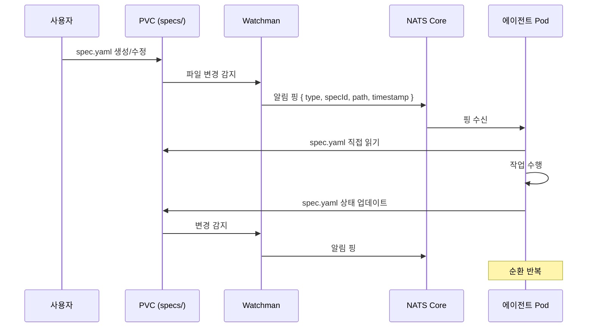
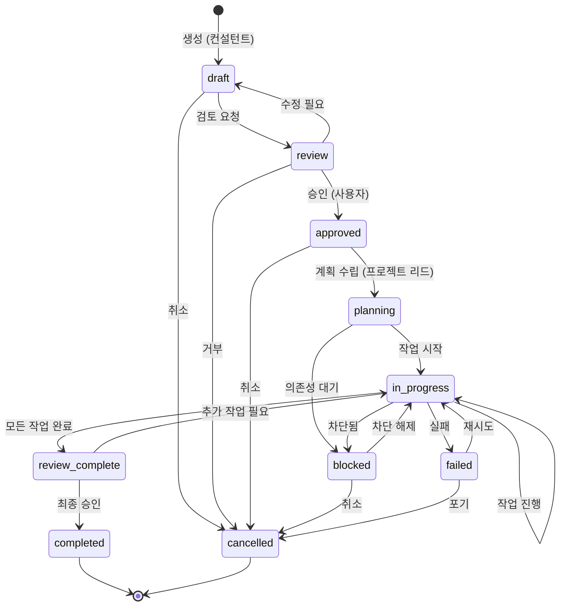

# 명세서 시스템 상세 설계

## 개요

이 문서는 멀티 에이전트 시스템에서 사용하는 **명세서 시스템(Specification System)**의 구현 가능한 상세 설계를 정의합니다. [multi-agent-system.md](./multi-agent-system.md)의 "명세서 시스템" 섹션(line 780-950)에서 제시한 개요를 구체화하여 실제 구현에 필요한 스키마, 상태 머신, 데이터베이스 설계, 이벤트 채널을 명시합니다.

### 관련 문서

- **상위 문서**: [multi-agent-system.md](./multi-agent-system.md) — 전체 멀티 에이전트 아키텍처
- **참고 문서**: 
  - [architecture.md](../architecture.md) — FSD 구조
  - [testing.md](../testing.md) — 테스팅 가이드
  - [security.md](../security.md) — 보안 규칙
  - [migration-plan.md](./migration-plan.md) — 마이그레이션 계획
  - [pod-architecture.md](./pod-architecture.md) — Pod 구조 및 리소스 예산

### 설계 목적

1. **단일 진실 공급원(Single Source of Truth)**: 모든 에이전트가 동일한 명세서를 참조하여 작업
2. **명세서 = 통신 채널**: 파일 변경 감지 → 알림 핑 → 에이전트가 PVC에서 직접 읽기/쓰기 → 순환
3. **진행 상황 가시성**: 실시간으로 작업 상태 추적 및 병목 지점 식별
4. **변경 이력 관리**: 누가, 언제, 무엇을, 왜 변경했는지 완전한 감사 추적
5. **롤백 가능성**: 문제 발생 시 이전 버전으로 안전하게 복원
6. **병렬 작업 조율**: 의존성 그래프 기반 작업 분배 및 동시 실행

### 핵심 아키텍처 (v3.0.0)

**명세서 중심 통신 흐름**:



**설계 근거**:
- **Redis 제거**: 메모리 인메모리 스토어 불필요 → NATS Core(~50MB)로 경량화
- **NATS는 알림 전용**: 메시지 내용 없이 "변경 발생" 신호만 전달 (JetStream 불필요)
- **PVC = Persistent State**: spec 파일이 유일한 진실의 원천 (source of truth)
- **에이전트가 직접 읽기**: NATS 핑 수신 → PVC 마운트에서 spec 파일 읽기 → 작업 후 쓰기

---

## 1. 명세서 라이프사이클

### 1.1 상태 전이 다이어그램



### 1.2 상태별 상세 설명

#### `draft` (초안)
- **설명**: 컨설턴트가 요구사항을 분석하여 명세서를 작성한 상태
- **가능한 액션**:
  - ✅ 명세서 내용 수정 (컨설턴트, 명세서 관리자)
  - ✅ 검토 요청 (`review` 전이)
  - ✅ 취소 (`cancelled` 전이)
- **상태 전이 조건**:
  - `draft → review`: 필수 필드 모두 작성 완료 + 컨설턴트가 검토 요청
  - `draft → cancelled`: 사용자 또는 컨설턴트가 명세서 취소 결정
- **NATS 알림 핑**: Watchman이 spec.yaml 변경 감지 → `specs.created`, `specs.updated` 주제로 핑 전송
- **타임아웃**: 48시간 이내 검토 요청 없으면 자동 경고

#### `review` (검토 중)
- **설명**: 사용자가 명세서를 검토하는 상태
- **가능한 액션**:
  - ✅ 승인 (`approved` 전이)
  - ✅ 수정 요청 (`draft` 전이)
  - ✅ 거부 (`cancelled` 전이)
- **상태 전이 조건**:
  - `review → approved`: 사용자가 승인 버튼 클릭
  - `review → draft`: 사용자가 수정 요청 코멘트와 함께 반려
  - `review → cancelled`: 사용자가 명세서 거부
- **NATS 알림 핑**: `specs.review-requested`, `specs.status-changed` 주제로 핑 전송
- **타임아웃**: 72시간 이내 승인/반려 없으면 자동 알림

#### `approved` (승인됨)
- **설명**: 사용자가 명세서를 승인한 상태
- **가능한 액션**:
  - ✅ 계획 수립 시작 (`planning` 전이)
  - ✅ 취소 (`cancelled` 전이)
- **상태 전이 조건**:
  - `approved → planning`: 프로젝트 리드가 작업 분배 시작
  - `approved → cancelled`: 사용자가 승인 철회
- **NATS 알림 핑**: `specs.approved` 주제로 핑 전송
- **타임아웃**: 24시간 이내 계획 수립 시작 없으면 자동 알림

#### `planning` (계획 수립 중)
- **설명**: 프로젝트 리드가 작업을 분배하고 의존성을 설정하는 상태
- **가능한 액션**:
  - ✅ 작업 추가/수정
  - ✅ 의존성 설정
  - ✅ Worker 할당
  - ✅ 작업 시작 (`in_progress` 전이)
  - ✅ 차단 (`blocked` 전이)
- **상태 전이 조건**:
  - `planning → in_progress`: 모든 작업에 Worker 할당 완료 + 의존성 검증 통과
  - `planning → blocked`: 외부 의존성 대기 (예: API 키 발급 대기)
- **NATS 알림 핑**: `specs.planning-started`, `specs.task-assigned` 주제로 핑 전송
- **타임아웃**: 8시간 이내 작업 시작 없으면 자동 에스컬레이션

#### `in_progress` (진행 중)
- **설명**: Worker들이 할당된 작업을 수행하는 상태
- **가능한 액션**:
  - ✅ 작업 상태 업데이트 (Worker)
  - ✅ 추가 작업 추가 (프로젝트 리드)
  - ✅ 차단 보고 (`blocked` 전이)
  - ✅ 실패 보고 (`failed` 전이)
  - ✅ 모든 작업 완료 시 검토 요청 (`review_complete` 전이)
- **상태 전이 조건**:
  - `in_progress → review_complete`: 모든 TASK 상태가 `completed`
  - `in_progress → blocked`: 하나 이상의 TASK가 외부 요인으로 차단
  - `in_progress → failed`: 크리티컬 TASK 실패 + 재시도 불가
- **NATS 알림 핑**: `specs.task-updated`, `specs.task-completed`, `specs.task-failed` 주제로 핑 전송
- **타임아웃**: 24시간 동안 진행 없으면 자동 경고

#### `blocked` (차단됨)
- **설명**: 외부 요인으로 작업이 차단된 상태
- **가능한 액션**:
  - ✅ 차단 원인 기록
  - ✅ 차단 해제 시 진행 재개 (`in_progress` 전이)
  - ✅ 취소 (`cancelled` 전이)
- **상태 전이 조건**:
  - `blocked → in_progress`: 차단 원인 해결
  - `blocked → cancelled`: 차단 원인 해결 불가능 판단
- **NATS 알림 핑**: `specs.blocked`, `specs.unblocked` 주제로 핑 전송
- **타임아웃**: 48시간 이상 차단 시 자동 에스컬레이션

#### `failed` (실패)
- **설명**: 크리티컬한 작업이 실패하여 명세서 전체가 실패한 상태
- **가능한 액션**:
  - ✅ 실패 원인 분석 기록
  - ✅ 재시도 (`in_progress` 전이)
  - ✅ 포기 (`cancelled` 전이)
- **상태 전이 조건**:
  - `failed → in_progress`: 실패 원인 수정 + 재시도 결정
  - `failed → cancelled`: 재시도 불가능 또는 포기 결정
- **NATS 알림 핑**: `specs.failed`, `specs.retry-requested` 주제로 핑 전송
- **타임아웃**: 24시간 이내 재시도/포기 결정 없으면 자동 알림

#### `review_complete` (검토 완료 대기)
- **설명**: 모든 작업이 완료되어 최종 검토를 기다리는 상태
- **가능한 액션**:
  - ✅ 최종 승인 (`completed` 전이)
  - ✅ 추가 작업 요청 (`in_progress` 전이)
- **상태 전이 조건**:
  - `review_complete → completed`: 사용자 또는 리뷰어가 최종 승인
  - `review_complete → in_progress`: 추가 작업 필요 판단
- **NATS 알림 핑**: `specs.review-complete-requested`, `specs.final-approved` 주제로 핑 전송
- **타임아웃**: 48시간 이내 최종 승인 없으면 자동 알림

#### `completed` (완료)
- **설명**: 명세서의 모든 요구사항이 충족되고 최종 승인된 상태
- **가능한 액션**:
  - ✅ 아카이브 (`specs/archive/` 이동)
  - ✅ 읽기 전용
- **NATS 알림 핑**: `specs.completed` 주제로 핑 전송
- **종료 상태**: 더 이상 전이 없음

#### `cancelled` (취소)
- **설명**: 명세서가 취소된 상태
- **가능한 액션**:
  - ✅ 아카이브 (`specs/archive/` 이동)
  - ✅ 취소 사유 기록
  - ✅ 읽기 전용
- **NATS 알림 핑**: `specs.cancelled` 주제로 핑 전송
- **종료 상태**: 더 이상 전이 없음

### 1.3 버전 관리 전략

#### SemVer 규칙 (MAJOR.MINOR.PATCH)

```typescript
// ⚠️ 로직 이해용 예시 코드 — 실제 에이전트는 .agents/agents/*.md 프롬프트로 구현
interface Version {
  major: number; // 요구사항 추가/삭제, 상태 전이 (큰 변경)
  minor: number; // 작업 추가/수정, 의존성 변경 (중간 변경)
  patch: number; // 작업 상태 업데이트, 메타데이터 수정 (작은 변경)
}

function incrementVersion(
  current: Version,
  changeType: 'major' | 'minor' | 'patch'
): Version {
  switch (changeType) {
    case 'major':
      return { major: current.major + 1, minor: 0, patch: 0 };
    case 'minor':
      return { ...current, minor: current.minor + 1, patch: 0 };
    case 'patch':
      return { ...current, patch: current.patch + 1 };
  }
}
```

#### 자동 버전 증가 로직

| 변경 내용 | 버전 증가 | 예시 |
|-----------|-----------|------|
| 상태 전이 (`draft → review` 등) | MAJOR | `1.0.0 → 2.0.0` |
| 요구사항 추가/삭제 | MAJOR | `1.2.3 → 2.0.0` |
| 작업 추가/삭제 | MINOR | `1.2.3 → 1.3.0` |
| 의존성 변경 | MINOR | `1.2.3 → 1.3.0` |
| Worker 할당/변경 | MINOR | `1.2.3 → 1.3.0` |
| 작업 상태 업데이트 | PATCH | `1.2.3 → 1.2.4` |
| 메타데이터 수정 (제목, 설명 등) | PATCH | `1.2.3 → 1.2.4` |
| changeLog 추가 | PATCH | `1.2.3 → 1.2.4` |

#### 변경 이력(changeLog) 자동 생성 규칙

```typescript
// ⚠️ 로직 이해용 예시 코드 — 실제 에이전트는 .agents/agents/*.md 프롬프트로 구현
interface ChangeLogEntry {
  timestamp: string;       // ISO 8601
  version: string;         // SemVer
  author: string;          // 에이전트 ID
  action: string;          // 액션 타입
  details: Record<string, unknown>; // 변경 세부사항
  reason?: string;         // 변경 사유
}

// 자동 생성 예시
const changeLogEntry: ChangeLogEntry = {
  timestamp: '2026-02-18T10:30:00Z',
  version: '1.2.4',
  author: 'background-dev-1',
  action: 'update-task-status',
  details: {
    taskId: 'TASK-001',
    from: 'in-progress',
    to: 'completed',
    actualTime: '2.5h',
  },
  reason: 'JWT 유틸리티 함수 작성 완료 및 테스트 통과',
};
```

**자동 생성 트리거**:
- 명세서 상태 변경 시
- 작업 추가/삭제 시
- 작업 상태 변경 시
- 의존성 변경 시
- Worker 할당 시
- 메타데이터 수정 시

---

## 2. Zod 스키마 정의

### 2.1 열거형 (Enum) 정의

```typescript
// ⚠️ 로직 이해용 예시 코드 — 실제 에이전트는 .agents/agents/*.md 프롬프트로 구현
import { z } from 'zod';

// 명세서 상태
export const SpecStatusSchema = z.enum([
  'draft',
  'review',
  'approved',
  'planning',
  'in-progress',
  'blocked',
  'failed',
  'review-complete',
  'completed',
  'cancelled',
]);
export type SpecStatus = z.infer<typeof SpecStatusSchema>;

// 작업 상태
export const TaskStatusSchema = z.enum([
  'pending',      // ⚪ 대기 중
  'in-progress',  // 🟡 진행 중
  'completed',    // 🟢 완료
  'failed',       // 🔴 실패
  'blocked',      // ⛔ 차단됨
]);
export type TaskStatus = z.infer<typeof TaskStatusSchema>;

// 작업 유형
export const TaskTypeSchema = z.enum([
  'feature',    // 새 기능 개발
  'test',       // 테스트 작성
  'refactor',   // 리팩토링
  'fix',        // 버그 수정
  'docs',       // 문서 작성
  'chore',      // 기타 작업
]);
export type TaskType = z.infer<typeof TaskTypeSchema>;

// 우선순위
export const PrioritySchema = z.enum([
  'critical',   // 즉시 처리 필요
  'high',       // 높음
  'medium',     // 보통
  'low',        // 낮음
]);
export type Priority = z.infer<typeof PrioritySchema>;

// 에이전트 유형
export const AgentTypeSchema = z.enum([
  'consultant',
  'spec-manager',
  'project-lead',
  'background-dev',
  'reviewer',
  'onboarding',
  'git-manager',
  'user',
]);
export type AgentType = z.infer<typeof AgentTypeSchema>;
```

### 2.2 핵심 스키마

#### MetadataSchema

```typescript
// ⚠️ 로직 이해용 예시 코드 — 실제 에이전트는 .agents/agents/*.md 프롬프트로 구현
export const MetadataSchema = z.object({
  title: z.string().min(1).max(200),
  description: z.string().optional(),
  author: AgentTypeSchema,
  createdAt: z.string().datetime(), // ISO 8601
  updatedAt: z.string().datetime(),
  approvedBy: z.string().email().optional(),
  approvedAt: z.string().datetime().optional(),
  tags: z.array(z.string()).default([]),
  estimatedDuration: z.string().optional(), // "4h", "2d" 등
});
export type Metadata = z.infer<typeof MetadataSchema>;
```

#### RequirementSchema

```typescript
// ⚠️ 로직 이해용 예시 코드 — 실제 에이전트는 .agents/agents/*.md 프롬프트로 구현
export const RequirementSchema = z.object({
  id: z.string().regex(/^REQ-\d{3}$/), // REQ-001, REQ-002, ...
  description: z.string().min(1),
  priority: PrioritySchema,
  status: TaskStatusSchema,
  failureReason: z.string().optional(),
  acceptanceCriteria: z.array(z.string()).optional(),
});
export type Requirement = z.infer<typeof RequirementSchema>;
```

#### TaskSchema

```typescript
// ⚠️ 로직 이해용 예시 코드 — 실제 에이전트는 .agents/agents/*.md 프롬프트로 구현
export const TaskSchema = z.object({
  id: z.string().regex(/^TASK-\d{3}$/), // TASK-001, TASK-002, ...
  title: z.string().min(1).max(200),
  description: z.string().optional(),
  type: TaskTypeSchema,
  status: TaskStatusSchema,
  emoji: z.string().emoji().optional(), // 🟢, 🟡, 🔴, ⚪, ⛔
  priority: PrioritySchema.default('medium'),
  assignedTo: z.string().optional(), // Worker ID (예: "background-dev-1")
  estimatedTime: z.string().optional(), // "2h", "1d" 등
  actualTime: z.string().optional(),
  dependencies: z.array(z.string().regex(/^TASK-\d{3}$/)).default([]),
  files: z.array(z.string()).default([]), // 관련 파일 경로
  failureReason: z.string().optional(),
  retryCount: z.number().int().min(0).default(0),
  blockedReason: z.string().optional(),
});
export type Task = z.infer<typeof TaskSchema>;
```

#### TechnicalPlanSchema

```typescript
// ⚠️ 로직 이해용 예시 코드 — 실제 에이전트는 .agents/agents/*.md 프롬프트로 구현
export const ArchitectureDecisionSchema = z.object({
  decision: z.string().min(1),
  reason: z.string().min(1),
  alternatives: z.array(z.string()).default([]),
});

export const DependencySchema = z.object({
  name: z.string().min(1),
  version: z.string().min(1),
  reason: z.string().min(1),
});

export const TechnicalPlanSchema = z.object({
  architecture: z.array(ArchitectureDecisionSchema).default([]),
  dependencies: z.array(DependencySchema).default([]),
  securityConsiderations: z.array(z.string()).default([]),
  performanceConsiderations: z.array(z.string()).default([]),
  testingStrategy: z.string().optional(),
});
export type TechnicalPlan = z.infer<typeof TechnicalPlanSchema>;
```

#### ProgressSchema

```typescript
// ⚠️ 로직 이해용 예시 코드 — 실제 에이전트는 .agents/agents/*.md 프롬프트로 구현
export const ProgressSchema = z.object({
  total: z.number().int().min(0),
  completed: z.number().int().min(0),
  inProgress: z.number().int().min(0),
  failed: z.number().int().min(0),
  blocked: z.number().int().min(0),
  pending: z.number().int().min(0),
  percentage: z.number().int().min(0).max(100),
}).refine(
  (data) =>
    data.completed + data.inProgress + data.failed + data.blocked + data.pending ===
    data.total,
  {
    message: '작업 상태의 합이 전체 작업 수와 일치해야 합니다',
  }
);
export type Progress = z.infer<typeof ProgressSchema>;
```

#### ChangeLogEntrySchema

```typescript
// ⚠️ 로직 이해용 예시 코드 — 실제 에이전트는 .agents/agents/*.md 프롬프트로 구현
export const ChangeLogEntrySchema = z.object({
  timestamp: z.string().datetime(),
  version: z.string().regex(/^\d+\.\d+\.\d+$/), // SemVer
  author: z.string().min(1),
  action: z.string().min(1), // "update-task-status", "add-requirement" 등
  details: z.record(z.unknown()),
  reason: z.string().optional(),
});
export type ChangeLogEntry = z.infer<typeof ChangeLogEntrySchema>;
```

#### SpecificationSchema (메인)

```typescript
// ⚠️ 로직 이해용 예시 코드 — 실제 에이전트는 .agents/agents/*.md 프롬프트로 구현
export const SpecificationSchema = z
  .object({
    id: z.string().regex(/^spec-\d{4}-\d{2}-\d{2}-\d{3}$/), // spec-2026-02-18-001
    version: z.string().regex(/^\d+\.\d+\.\d+$/), // SemVer
    status: SpecStatusSchema,
    metadata: MetadataSchema,
    requirements: z.array(RequirementSchema).min(1),
    technicalPlan: TechnicalPlanSchema.optional(),
    tasks: z.array(TaskSchema).min(1),
    progress: ProgressSchema,
    changeLog: z.array(ChangeLogEntrySchema).default([]),
  })
  .refine(
    (data) => {
      // 검증 1: dependencies에 존재하지 않는 taskId 참조 금지
      const taskIds = new Set(data.tasks.map((t) => t.id));
      for (const task of data.tasks) {
        for (const dep of task.dependencies) {
          if (!taskIds.has(dep)) {
            return false;
          }
        }
      }
      return true;
    },
    {
      message: 'dependencies에 존재하지 않는 taskId가 참조되었습니다',
    }
  )
  .refine(
    (data) => {
      // 검증 2: 순환 의존성 금지 (DFS 기반)
      const graph = new Map<string, string[]>();
      for (const task of data.tasks) {
        graph.set(task.id, task.dependencies);
      }

      const visited = new Set<string>();
      const recStack = new Set<string>();

      function hasCycle(taskId: string): boolean {
        visited.add(taskId);
        recStack.add(taskId);

        for (const dep of graph.get(taskId) || []) {
          if (!visited.has(dep)) {
            if (hasCycle(dep)) return true;
          } else if (recStack.has(dep)) {
            return true; // 순환 발견
          }
        }

        recStack.delete(taskId);
        return false;
      }

      for (const task of data.tasks) {
        if (!visited.has(task.id)) {
          if (hasCycle(task.id)) {
            return false;
          }
        }
      }

      return true;
    },
    {
      message: '작업 의존성에 순환 참조가 존재합니다',
    }
  )
  .refine(
    (data) => {
      // 검증 3: 상태 전이 검증 (예: pending에서 completed로 직접 전이 금지)
      const invalidTransitions: Array<[SpecStatus, SpecStatus]> = [
        ['draft', 'in-progress'],
        ['draft', 'completed'],
        ['review', 'in-progress'],
        ['approved', 'completed'],
      ];

      // 변경 이력에서 연속된 상태 전이 확인
      for (let i = 0; i < data.changeLog.length - 1; i++) {
        const current = data.changeLog[i];
        const next = data.changeLog[i + 1];

        if (
          current.action === 'status-changed' &&
          next.action === 'status-changed'
        ) {
          const fromStatus = current.details.to as SpecStatus;
          const toStatus = next.details.to as SpecStatus;

          for (const [from, to] of invalidTransitions) {
            if (fromStatus === from && toStatus === to) {
              return false;
            }
          }
        }
      }

      return true;
    },
    {
      message: '허용되지 않는 상태 전이가 감지되었습니다',
    }
  );

export type Specification = z.infer<typeof SpecificationSchema>;
```

### 2.3 검증 규칙 요약

| 검증 규칙 | 설명 | 구현 방법 |
|-----------|------|-----------|
| 순환 의존성 금지 | `TASK-001 → TASK-002 → TASK-001` 방지 | DFS 기반 cycle detection |
| 존재하지 않는 taskId 참조 금지 | `dependencies`에 없는 ID 참조 시 에러 | Set 기반 존재 여부 확인 |
| 상태 전이 검증 | `draft → completed` 같은 직접 전이 금지 | changeLog 분석 + 허용 전이 화이트리스트 |
| 필수 필드 검증 | `id`, `version`, `status`, `metadata`, `requirements`, `tasks` | Zod의 기본 검증 |
| 포맷 검증 | ID 포맷, 날짜 포맷, 이메일 포맷 | Zod의 `regex()`, `datetime()`, `email()` |

### 2.4 TypeScript 타입 추론

```typescript
// ⚠️ 로직 이해용 예시 코드 — 실제 에이전트는 .agents/agents/*.md 프롬프트로 구현
// Zod 스키마에서 TypeScript 타입 자동 추론
export type Specification = z.infer<typeof SpecificationSchema>;
export type Metadata = z.infer<typeof MetadataSchema>;
export type Requirement = z.infer<typeof RequirementSchema>;
export type Task = z.infer<typeof TaskSchema>;
export type TechnicalPlan = z.infer<typeof TechnicalPlanSchema>;
export type Progress = z.infer<typeof ProgressSchema>;
export type ChangeLogEntry = z.infer<typeof ChangeLogEntrySchema>;
export type SpecStatus = z.infer<typeof SpecStatusSchema>;
export type TaskStatus = z.infer<typeof TaskStatusSchema>;
export type TaskType = z.infer<typeof TaskTypeSchema>;
export type Priority = z.infer<typeof PrioritySchema>;
export type AgentType = z.infer<typeof AgentTypeSchema>;

// 사용 예시
const spec: Specification = {
  id: 'spec-2026-02-18-001',
  version: '1.0.0',
  status: 'draft',
  metadata: {
    title: '사용자 인증 기능 구현',
    author: 'consultant',
    createdAt: '2026-02-18T10:00:00Z',
    updatedAt: '2026-02-18T10:00:00Z',
    tags: ['auth', 'security'],
  },
  requirements: [
    {
      id: 'REQ-001',
      description: '이메일/비밀번호 로그인',
      priority: 'high',
      status: 'pending',
    },
  ],
  tasks: [
    {
      id: 'TASK-001',
      title: 'JWT 유틸리티 함수 작성',
      type: 'feature',
      status: 'pending',
      priority: 'high',
      dependencies: [],
    },
  ],
  progress: {
    total: 1,
    completed: 0,
    inProgress: 0,
    failed: 0,
    blocked: 0,
    pending: 1,
    percentage: 0,
  },
  changeLog: [],
};

// Zod 파싱으로 런타임 검증
const result = SpecificationSchema.safeParse(spec);
if (!result.success) {
  console.error('검증 실패:', result.error.format());
}
```

---

## 3. 명세서 포맷 상세

### 3.1 YAML 포맷 확정

```yaml
# ⚠️ 로직 이해용 예시 — 실제 포맷은 구현 Phase에서 확정

# 명세서 ID (필수)
id: spec-2026-02-18-001

# SemVer 버전 (필수)
version: 1.0.0

# 명세서 상태 (필수)
status: draft  # draft | review | approved | planning | in-progress | blocked | failed | review-complete | completed | cancelled

# 메타데이터 (필수)
metadata:
  title: 사용자 인증 기능 구현
  description: 이메일/비밀번호 및 소셜 로그인을 지원하는 인증 시스템 구현
  author: consultant
  createdAt: 2026-02-18T10:00:00Z
  updatedAt: 2026-02-18T10:00:00Z
  approvedBy: user@example.com  # 선택
  approvedAt: 2026-02-18T10:15:00Z  # 선택
  tags:
    - auth
    - security
    - jwt
  estimatedDuration: 2d  # 선택

# 요구사항 (필수, 최소 1개)
requirements:
  - id: REQ-001
    description: 이메일/비밀번호 로그인
    priority: high  # critical | high | medium | low
    status: pending  # pending | in-progress | completed | failed | blocked
    acceptanceCriteria:  # 선택
      - 유효한 이메일 형식 검증
      - 비밀번호 8자 이상 + 특수문자 포함
      - JWT 토큰 발급 및 저장
  
  - id: REQ-002
    description: 소셜 로그인 (Google, GitHub)
    priority: medium
    status: pending

# 기술 계획 (선택)
technicalPlan:
  architecture:
    - decision: JWT 기반 인증
      reason: Stateless하며 확장 가능
      alternatives:
        - Session 기반 (서버 메모리 필요)
        - OAuth2 (복잡도 높음)
  
  dependencies:
    - name: jsonwebtoken
      version: ^9.0.0
      reason: JWT 생성/검증
    - name: bcrypt
      version: ^5.1.0
      reason: 비밀번호 해싱
  
  securityConsiderations:
    - JWT secret은 환경변수로 관리
    - Refresh token은 HttpOnly 쿠키에 저장
    - Rate limiting 적용 (5회 실패 시 30분 잠금)
  
  performanceConsiderations:
    - bcrypt salt rounds를 10으로 설정 (보안과 성능 균형)
    - JWT 만료 시간 15분 (access token)
  
  testingStrategy: |
    - Unit: JWT 유틸리티 함수 테스트
    - Integration: 로그인 API 엔드포인트 테스트
    - E2E: 전체 인증 플로우 테스트
    - Property-based: 비밀번호 검증 로직 테스트

# 작업 목록 (필수, 최소 1개)
tasks:
  - id: TASK-001
    title: JWT 유틸리티 함수 작성
    description: JWT 생성, 검증, 디코딩 함수 구현
    type: feature  # feature | test | refactor | fix | docs | chore
    status: pending  # pending | in-progress | completed | failed | blocked
    emoji: ⚪  # 선택
    priority: high
    assignedTo: background-dev-1  # 선택
    estimatedTime: 2h  # 선택
    actualTime: null  # 선택
    dependencies: []
    files:
      - src/shared/lib/jwt.ts
      - src/shared/lib/__tests__/jwt.test.ts
  
  - id: TASK-002
    title: 로그인 API 엔드포인트
    description: POST /api/auth/login 엔드포인트 구현
    type: feature
    status: pending
    emoji: ⚪
    priority: high
    assignedTo: background-dev-2  # 선택
    estimatedTime: 3h  # 선택
    dependencies:
      - TASK-001
    files:
      - src/features/auth/api/login.ts
      - src/features/auth/api/__tests__/login.test.ts

# 진행 상황 (필수)
progress:
  total: 2
  completed: 0
  inProgress: 0
  failed: 0
  blocked: 0
  pending: 2
  percentage: 0

# 변경 이력 (선택, 자동 생성)
changeLog:
  - timestamp: 2026-02-18T10:00:00Z
    version: 1.0.0
    author: consultant
    action: created
    details:
      initialStatus: draft
    reason: 사용자 인증 기능 요구사항 분석 완료
```

### 3.2 명세서 ID 체계

#### 포맷 규칙

| 타입 | 포맷 | 정규식 | 예시 |
|------|------|--------|------|
| 명세서 ID | `spec-YYYY-MM-DD-NNN` | `^spec-\d{4}-\d{2}-\d{2}-\d{3}$` | `spec-2026-02-18-001` |
| 요구사항 ID | `REQ-NNN` | `^REQ-\d{3}$` | `REQ-001` |
| 작업 ID | `TASK-NNN` | `^TASK-\d{3}$` | `TASK-001` |

#### ID 생성 로직

```typescript
// ⚠️ 로직 이해용 예시 코드 — 실제 에이전트는 .agents/agents/*.md 프롬프트로 구현
function generateSpecId(date: Date): string {
  const year = date.getFullYear();
  const month = String(date.getMonth() + 1).padStart(2, '0');
  const day = String(date.getDate()).padStart(2, '0');
  
  // 같은 날짜의 명세서 개수 확인 (PostgreSQL 또는 파일 시스템)
  const existingSpecs = getSpecsByDate(date);
  const sequence = String(existingSpecs.length + 1).padStart(3, '0');
  
  return `spec-${year}-${month}-${day}-${sequence}`;
}

function generateRequirementId(spec: Specification): string {
  const existingReqs = spec.requirements.length;
  const sequence = String(existingReqs + 1).padStart(3, '0');
  return `REQ-${sequence}`;
}

function generateTaskId(spec: Specification): string {
  const existingTasks = spec.tasks.length;
  const sequence = String(existingTasks + 1).padStart(3, '0');
  return `TASK-${sequence}`;
}
```

### 3.3 파일 저장 경로

```
specs/
├── active/                              # 현재 진행 중인 명세서
│   ├── spec-2026-02-18-001.yaml
│   └── spec-2026-02-18-002.yaml
│
├── archive/                             # 완료/취소된 명세서
│   ├── 2026-02/
│   │   ├── spec-2026-02-17-001.yaml    # completed
│   │   ├── spec-2026-02-16-001.yaml    # completed
│   │   └── spec-2026-02-15-001.yaml    # cancelled
│   └── 2026-01/
│       ├── spec-2026-01-31-001.yaml
│       └── spec-2026-01-30-001.yaml
│
├── templates/                           # 명세서 템플릿
│   ├── feature.yaml                     # 기능 개발용
│   ├── refactor.yaml                    # 리팩토링용
│   ├── fix.yaml                         # 버그 수정용
│   ├── docs.yaml                        # 문서 작성용
│   └── chore.yaml                       # 기타 작업용
│
└── .specconfig.yaml                     # 명세서 시스템 설정
```

#### `.specconfig.yaml` 설정 파일

```yaml
# ⚠️ 로직 이해용 예시 — 실제 포맷은 구현 Phase에서 확정

# 명세서 시스템 설정
version: 1.0.0

# 파일 경로 설정
paths:
  active: specs/active
  archive: specs/archive
  templates: specs/templates

# 아카이브 규칙
archiveRules:
  # 완료/취소된 명세서를 자동으로 아카이브
  autoArchive: true
  # 아카이브 딜레이 (완료 후 24시간 뒤 이동)
  archiveDelay: 24h
  # 아카이브 포맷 (연도-월 디렉토리)
  format: YYYY-MM

# 검증 규칙
validation:
  # 순환 의존성 검증
  checkCyclicDependencies: true
  # 상태 전이 검증
  checkStateTransitions: true
  # 필수 필드 검증
  checkRequiredFields: true

# 알림 설정
notifications:
  # 타임아웃 알림
  timeoutAlerts: true
  # 실패 알림
  failureAlerts: true
  # 차단 알림
  blockAlerts: true

# 동시성 제어
concurrency:
  # 낙관적 잠금 활성화
  optimisticLocking: true
  # 잠금 타임아웃 (초)
  lockTimeout: 30

# PostgreSQL 동기화
sync:
  # 자동 동기화 활성화
  enabled: true
  # 동기화 간격 (초)
  interval: 5
  # drift detection (불일치 감지)
  driftDetection: true
```

---

## 4. 템플릿 시스템

### 4.1 Feature 템플릿

```yaml
# ⚠️ 로직 이해용 예시 — 실제 포맷은 구현 Phase에서 확정
# specs/templates/feature.yaml

id: spec-YYYY-MM-DD-NNN  # 자동 생성
version: 1.0.0
status: draft

metadata:
  title: ""  # 필수 입력
  description: ""  # 선택
  author: consultant
  createdAt: ""  # 자동 생성
  updatedAt: ""  # 자동 생성
  tags: []

requirements:
  - id: REQ-001
    description: ""  # 필수 입력
    priority: medium
    status: pending
    acceptanceCriteria: []

technicalPlan:
  architecture: []
  dependencies: []
  securityConsiderations: []
  performanceConsiderations: []
  testingStrategy: ""

tasks:
  - id: TASK-001
    title: ""  # 필수 입력
    type: feature
    status: pending
    emoji: ⚪
    priority: medium
    dependencies: []
    files: []

progress:
  total: 0
  completed: 0
  inProgress: 0
  failed: 0
  blocked: 0
  pending: 0
  percentage: 0

changeLog: []
```

### 4.2 Refactor 템플릿

```yaml
# ⚠️ 로직 이해용 예시 — 실제 포맷은 구현 Phase에서 확정
# specs/templates/refactor.yaml

id: spec-YYYY-MM-DD-NNN
version: 1.0.0
status: draft

metadata:
  title: ""  # 필수: "XXX 리팩토링"
  description: ""
  author: consultant
  createdAt: ""
  updatedAt: ""
  tags:
    - refactor

# 리팩토링 전용 필드
refactorContext:
  beforeState:  # 현재 상태 설명
    description: ""
    issues:
      - ""  # 현재 문제점
  
  afterState:  # 목표 상태 설명
    description: ""
    benefits:
      - ""  # 기대 효과
  
  impactAnalysis:  # 영향 분석
    affectedFiles: []
    affectedComponents: []
    breakingChanges: false
    migrationRequired: false

requirements:
  - id: REQ-001
    description: "코드 구조 개선"
    priority: high
    status: pending

technicalPlan:
  architecture:
    - decision: ""
      reason: ""
      alternatives: []
  
  dependencies: []
  
  securityConsiderations:
    - 기존 보안 수준 유지
  
  performanceConsiderations:
    - 성능 회귀 방지
  
  testingStrategy: |
    - 기존 테스트 모두 통과
    - 리팩토링 전후 동작 동일성 검증

tasks:
  - id: TASK-001
    title: ""
    type: refactor
    status: pending
    emoji: ⚪
    priority: medium
    dependencies: []
    files: []

progress:
  total: 0
  completed: 0
  inProgress: 0
  failed: 0
  blocked: 0
  pending: 0
  percentage: 0

changeLog: []
```

### 4.3 Fix 템플릿

```yaml
# ⚠️ 로직 이해용 예시 — 실제 포맷은 구현 Phase에서 확정
# specs/templates/fix.yaml

id: spec-YYYY-MM-DD-NNN
version: 1.0.0
status: draft

metadata:
  title: ""  # 필수: "XXX 버그 수정"
  description: ""
  author: consultant
  createdAt: ""
  updatedAt: ""
  tags:
    - fix
    - bug

# 버그 수정 전용 필드
bugReport:
  severity: medium  # critical | high | medium | low
  environment: production  # production | staging | development
  
  reproduction:  # 재현 방법
    steps:
      - ""
    expectedBehavior: ""
    actualBehavior: ""
    errorMessage: ""
  
  rootCause:  # 근본 원인 분석
    description: ""
    location: ""  # 파일 경로
    introduced: ""  # 언제 발생했는지 (커밋 해시 또는 날짜)
  
  impact:  # 영향 범위
    usersAffected: ""
    featuresAffected: []
    dataLoss: false

requirements:
  - id: REQ-001
    description: "버그 수정"
    priority: critical
    status: pending
    acceptanceCriteria:
      - 재현 단계 실행 시 예상 동작 확인
      - 기존 테스트 모두 통과
      - 회귀 테스트 추가

technicalPlan:
  architecture: []
  dependencies: []
  
  securityConsiderations:
    - 수정으로 인한 보안 취약점 발생 방지
  
  performanceConsiderations:
    - 성능 회귀 방지
  
  testingStrategy: |
    - 재현 시나리오 테스트 추가
    - Edge case 테스트 추가
    - 회귀 방지 테스트 추가

tasks:
  - id: TASK-001
    title: "버그 수정"
    type: fix
    status: pending
    emoji: ⚪
    priority: critical
    dependencies: []
    files: []
  
  - id: TASK-002
    title: "회귀 테스트 추가"
    type: test
    status: pending
    emoji: ⚪
    priority: high
    dependencies:
      - TASK-001
    files: []

progress:
  total: 0
  completed: 0
  inProgress: 0
  failed: 0
  blocked: 0
  pending: 0
  percentage: 0

changeLog: []
```

### 4.4 Docs 템플릿

```yaml
# ⚠️ 로직 이해용 예시 — 실제 포맷은 구현 Phase에서 확정
# specs/templates/docs.yaml

id: spec-YYYY-MM-DD-NNN
version: 1.0.0
status: draft

metadata:
  title: ""  # 필수: "XXX 문서 작성"
  description: ""
  author: consultant
  createdAt: ""
  updatedAt: ""
  tags:
    - docs
    - documentation

# 문서 작업 전용 필드
docsContext:
  targetDocs:  # 대상 문서
    - path: ""
      type: new | update | deprecate
  
  changeType: new  # new | update | restructure | deprecate
  
  audience:  # 대상 독자
    - developers
    - users
    - contributors
  
  scope:  # 범위
    - api-docs
    - user-guide
    - architecture
    - tutorials

requirements:
  - id: REQ-001
    description: "문서 작성"
    priority: medium
    status: pending
    acceptanceCriteria:
      - 명확하고 이해하기 쉬운 설명
      - 코드 예시 포함
      - 링크 정상 작동

technicalPlan:
  architecture: []
  dependencies: []
  
  testingStrategy: |
    - 링크 검증
    - 코드 예시 실행 가능 여부 확인
    - 맞춤법 검사

tasks:
  - id: TASK-001
    title: "문서 작성"
    type: docs
    status: pending
    emoji: ⚪
    priority: medium
    dependencies: []
    files: []

progress:
  total: 0
  completed: 0
  inProgress: 0
  failed: 0
  blocked: 0
  pending: 0
  percentage: 0

changeLog: []
```

### 4.5 템플릿 선택 로직

```typescript
// ⚠️ 로직 이해용 예시 코드 — 실제 에이전트는 .agents/agents/*.md 프롬프트로 구현
type TemplateType = 'feature' | 'refactor' | 'fix' | 'docs' | 'chore';

interface TemplateSelection {
  type: TemplateType;
  confidence: number; // 0-1
  reason: string;
}

function selectTemplate(userRequest: string): TemplateSelection {
  const keywords = {
    feature: ['구현', '추가', '기능', '새로운', 'add', 'implement', 'create'],
    refactor: ['리팩토링', '개선', '구조', 'refactor', 'improve', 'restructure'],
    fix: ['버그', '수정', '오류', '에러', 'bug', 'fix', 'error'],
    docs: ['문서', '설명', '가이드', 'docs', 'documentation', 'guide'],
    chore: ['설정', '빌드', '의존성', 'config', 'build', 'dependency'],
  };

  let bestMatch: TemplateSelection = {
    type: 'feature',
    confidence: 0,
    reason: '기본 템플릿',
  };

  for (const [type, words] of Object.entries(keywords)) {
    const matches = words.filter((word) =>
      userRequest.toLowerCase().includes(word)
    ).length;

    const confidence = matches / words.length;

    if (confidence > bestMatch.confidence) {
      bestMatch = {
        type: type as TemplateType,
        confidence,
        reason: `"${words.slice(0, 3).join(', ')}" 키워드 매칭`,
      };
    }
  }

  return bestMatch;
}

// 사용 예시
const userRequest = '사용자 인증 기능을 구현해주세요';
const selection = selectTemplate(userRequest);
console.log(selection);
// { type: 'feature', confidence: 0.14, reason: '"구현, 추가, 기능" 키워드 매칭' }
```

**템플릿 선택 우선순위**:
1. 사용자가 명시적으로 템플릿 지정 (예: "fix 템플릿으로 시작해주세요")
2. 컨설턴트가 자동 선택 (키워드 분석)
3. 기본값: `feature` 템플릿

---

## 5. 에이전트별 명세서 접근 권한

### 5.1 권한 매트릭스

| 에이전트 | 읽기 | 쓰기 | 상태 변경 | 작업 할당 | 삭제 | 비고 |
|----------|------|------|-----------|-----------|------|------|
| **컨설턴트** | ✅ 전체 | ✅ draft만 | ✅ draft→review | ❌ | ❌ | 명세서 초안 작성 |
| **명세서 관리자** | ✅ 전체 | ✅ 전체 | ✅ 전체 | ✅ | ✅ | 전체 권한 |
| **프로젝트 리드** | ✅ 전체 | ✅ 제한적 | ✅ approved→planning→in-progress | ✅ | ❌ | 작업 조율 |
| **Worker (background-dev)** | ✅ 할당된 작업만 | ✅ 작업 상태만 | ✅ in-progress↔completed/failed | ❌ | ❌ | 할당된 작업 수행 |
| **리뷰어** | ✅ 전체 | ❌ | ✅ review 관련 | ❌ | ❌ | 코드 리뷰 |
| **신입 (onboarding)** | ✅ 전체 | ❌ | ❌ | ❌ | ❌ | 읽기 전용 + 질문 추가 |
| **Git Manager** | ✅ 메타데이터만 | ❌ | ❌ | ❌ | ❌ | 커밋 메시지 생성용 |
| **사용자** | ✅ 전체 | ❌ | ✅ review→approved/draft, review-complete→completed | ❌ | ✅ | 승인/거부 권한 |

### 5.2 권한 검증 코드

```typescript
// ⚠️ 로직 이해용 예시 코드 — 실제 에이전트는 .agents/agents/*.md 프롬프트로 구현
type Permission = 'read' | 'write' | 'change-status' | 'assign' | 'delete';

interface AccessControl {
  agent: AgentType;
  permissions: Record<Permission, (spec: Specification) => boolean>;
}

const accessControlList: AccessControl[] = [
  {
    agent: 'consultant',
    permissions: {
      read: () => true,
      write: (spec) => spec.status === 'draft',
      'change-status': (spec) =>
        spec.status === 'draft' && canTransitionTo(spec, 'review'),
      assign: () => false,
      delete: () => false,
    },
  },
  {
    agent: 'spec-manager',
    permissions: {
      read: () => true,
      write: () => true,
      'change-status': () => true,
      assign: () => true,
      delete: () => true,
    },
  },
  {
    agent: 'project-lead',
    permissions: {
      read: () => true,
      write: (spec) =>
        ['approved', 'planning', 'in-progress'].includes(spec.status),
      'change-status': (spec) =>
        ['approved', 'planning', 'in-progress'].includes(spec.status),
      assign: () => true,
      delete: () => false,
    },
  },
  {
    agent: 'background-dev',
    permissions: {
      read: (spec) => hasAssignedTask(spec, getCurrentAgent()),
      write: (spec) => canUpdateTaskStatus(spec, getCurrentAgent()),
      'change-status': (spec) => canUpdateTaskStatus(spec, getCurrentAgent()),
      assign: () => false,
      delete: () => false,
    },
  },
];

function checkPermission(
  agent: AgentType,
  permission: Permission,
  spec: Specification
): boolean {
  const acl = accessControlList.find((a) => a.agent === agent);
  if (!acl) return false;
  return acl.permissions[permission](spec);
}
```

### 5.3 동시 접근 제어

#### PostgreSQL Advisory Lock 기반 낙관적 잠금

```typescript
// ⚠️ 로직 이해용 예시 코드 — 실제 에이전트는 .agents/agents/*.md 프롬프트로 구현
import { Pool } from 'pg';

const pool = new Pool({ connectionString: process.env.DATABASE_URL });

async function acquireLock(specId: string): Promise<boolean> {
  // specId를 정수 해시로 변환 (PostgreSQL advisory lock은 bigint 사용)
  const lockId = hashToInt(specId);

  const result = await pool.query(
    'SELECT pg_try_advisory_lock($1) AS acquired',
    [lockId]
  );

  return result.rows[0].acquired;
}

async function releaseLock(specId: string): Promise<void> {
  const lockId = hashToInt(specId);
  await pool.query('SELECT pg_advisory_unlock($1)', [lockId]);
}

// 사용 예시
async function updateSpecification(
  specId: string,
  updates: Partial<Specification>
): Promise<void> {
  const locked = await acquireLock(specId);

  if (!locked) {
    throw new Error('명세서가 다른 에이전트에 의해 사용 중입니다');
  }

  try {
    // 1. YAML 파일 읽기
    const spec = await readSpecYaml(specId);

    // 2. 버전 확인 (낙관적 잠금)
    if (spec.version !== updates.expectedVersion) {
      throw new Error('버전 충돌: 다른 에이전트가 명세서를 수정했습니다');
    }

    // 3. 업데이트 적용
    const newSpec = { ...spec, ...updates };

    // 4. 버전 증가
    newSpec.version = incrementVersion(
      parseVersion(spec.version),
      'patch'
    ).toString();

    // 5. YAML 파일 쓰기
    await writeSpecYaml(specId, newSpec);

    // 6. PostgreSQL 동기화
    await syncToPostgreSQL(newSpec);

    // 7. Redis 이벤트 발행
    await publishEvent('spec:updated', { specId, version: newSpec.version });
  } finally {
    await releaseLock(specId);
  }
}
```

#### 버전 충돌 해결 전략

```typescript
// ⚠️ 로직 이해용 예시 코드 — 실제 에이전트는 .agents/agents/*.md 프롬프트로 구현
type ConflictResolution = 'last-write-wins' | 'merge' | 'manual';

async function resolveConflict(
  local: Specification,
  remote: Specification,
  strategy: ConflictResolution
): Promise<Specification> {
  switch (strategy) {
    case 'last-write-wins':
      // 최신 updatedAt을 가진 쪽 선택
      return local.metadata.updatedAt > remote.metadata.updatedAt
        ? local
        : remote;

    case 'merge':
      // 필드별 자동 병합 (changeLog는 합치고, tasks는 ID 기준 병합)
      return {
        ...remote,
        tasks: mergeTasks(local.tasks, remote.tasks),
        changeLog: [...local.changeLog, ...remote.changeLog].sort(
          (a, b) => a.timestamp.localeCompare(b.timestamp)
        ),
        version: incrementVersion(parseVersion(remote.version), 'minor').toString(),
      };

    case 'manual':
      // 사용자에게 수동 해결 요청
      throw new ConflictError('수동 해결 필요', { local, remote });
  }
}
```

**설계 근거**: PostgreSQL advisory lock을 사용하면 별도의 락 테이블 없이 가볍게 동시성을 제어할 수 있습니다. 낙관적 잠금(버전 확인)과 함께 사용하여 충돌을 최소화하면서도 성능을 유지합니다.

---

## 6. PostgreSQL 스키마

### 6.1 명세서 테이블

```sql
-- ⚠️ 로직 이해용 예시 — 실제 스키마는 구현 Phase에서 확정

-- 명세서 메인 테이블
CREATE TABLE specifications (
  id VARCHAR(50) PRIMARY KEY,  -- spec-2026-02-18-001
  version VARCHAR(20) NOT NULL,  -- 1.2.3
  status VARCHAR(20) NOT NULL CHECK (status IN (
    'draft', 'review', 'approved', 'planning', 'in-progress',
    'blocked', 'failed', 'review-complete', 'completed', 'cancelled'
  )),
  
  -- 메타데이터
  title VARCHAR(200) NOT NULL,
  description TEXT,
  author VARCHAR(50) NOT NULL,
  created_at TIMESTAMPTZ NOT NULL,
  updated_at TIMESTAMPTZ NOT NULL,
  approved_by VARCHAR(100),
  approved_at TIMESTAMPTZ,
  tags TEXT[],  -- PostgreSQL array
  estimated_duration VARCHAR(20),
  
  -- 진행 상황 (JSON 저장)
  progress JSONB NOT NULL,
  
  -- 기술 계획 (JSON 저장)
  technical_plan JSONB,
  
  -- 전체 YAML 원본 (검색/백업용)
  yaml_content TEXT NOT NULL,
  
  -- 인덱스 최적화
  created_date DATE GENERATED ALWAYS AS (created_at::DATE) STORED,
  
  CONSTRAINT valid_version CHECK (version ~ '^\d+\.\d+\.\d+$')
);

-- 요구사항 테이블
CREATE TABLE requirements (
  id VARCHAR(20) PRIMARY KEY,  -- REQ-001
  spec_id VARCHAR(50) NOT NULL REFERENCES specifications(id) ON DELETE CASCADE,
  description TEXT NOT NULL,
  priority VARCHAR(10) NOT NULL CHECK (priority IN ('critical', 'high', 'medium', 'low')),
  status VARCHAR(20) NOT NULL CHECK (status IN (
    'pending', 'in-progress', 'completed', 'failed', 'blocked'
  )),
  failure_reason TEXT,
  acceptance_criteria TEXT[],
  
  -- 복합 기본 키 (spec_id + id)
  UNIQUE(spec_id, id)
);

-- 작업 테이블
CREATE TABLE tasks (
  id VARCHAR(20) PRIMARY KEY,  -- TASK-001
  spec_id VARCHAR(50) NOT NULL REFERENCES specifications(id) ON DELETE CASCADE,
  title VARCHAR(200) NOT NULL,
  description TEXT,
  type VARCHAR(20) NOT NULL CHECK (type IN (
    'feature', 'test', 'refactor', 'fix', 'docs', 'chore'
  )),
  status VARCHAR(20) NOT NULL CHECK (status IN (
    'pending', 'in-progress', 'completed', 'failed', 'blocked'
  )),
  emoji VARCHAR(10),
  priority VARCHAR(10) NOT NULL CHECK (priority IN ('critical', 'high', 'medium', 'low')),
  assigned_to VARCHAR(50),
  estimated_time VARCHAR(20),
  actual_time VARCHAR(20),
  files TEXT[],
  failure_reason TEXT,
  retry_count INTEGER DEFAULT 0,
  blocked_reason TEXT,
  
  UNIQUE(spec_id, id)
);

-- 작업 의존성 테이블 (방향 그래프)
CREATE TABLE task_dependencies (
  task_id VARCHAR(20) NOT NULL REFERENCES tasks(id) ON DELETE CASCADE,
  depends_on VARCHAR(20) NOT NULL REFERENCES tasks(id) ON DELETE CASCADE,
  spec_id VARCHAR(50) NOT NULL REFERENCES specifications(id) ON DELETE CASCADE,
  
  PRIMARY KEY (task_id, depends_on),
  
  -- 자기 자신에 대한 의존성 금지
  CHECK (task_id != depends_on)
);

-- 변경 이력 테이블
CREATE TABLE change_logs (
  id SERIAL PRIMARY KEY,
  spec_id VARCHAR(50) NOT NULL REFERENCES specifications(id) ON DELETE CASCADE,
  timestamp TIMESTAMPTZ NOT NULL,
  version VARCHAR(20) NOT NULL,
  author VARCHAR(50) NOT NULL,
  action VARCHAR(50) NOT NULL,
  details JSONB NOT NULL,
  reason TEXT,
  
  -- 시간순 정렬 인덱스
  INDEX idx_change_logs_timestamp (spec_id, timestamp DESC)
);
```

### 6.2 인덱스 전략

```sql
-- ⚠️ 로직 이해용 예시 — 실제 스키마는 구현 Phase에서 확정

-- 1. 상태별 조회 인덱스
CREATE INDEX idx_specs_status ON specifications(status);
CREATE INDEX idx_specs_status_updated ON specifications(status, updated_at DESC);

-- 2. 날짜별 조회 인덱스
CREATE INDEX idx_specs_created_date ON specifications(created_date DESC);

-- 3. 에이전트별 할당 조회 인덱스
CREATE INDEX idx_tasks_assigned ON tasks(assigned_to, status);

-- 4. 태그 검색 인덱스 (GIN 인덱스 - PostgreSQL array 전용)
CREATE INDEX idx_specs_tags ON specifications USING GIN(tags);

-- 5. 전문 검색 인덱스 (제목, 설명)
CREATE INDEX idx_specs_title_search ON specifications USING GIN(to_tsvector('english', title));
CREATE INDEX idx_specs_desc_search ON specifications USING GIN(to_tsvector('english', description));

-- 6. 진행 상황 검색 인덱스 (JSONB)
CREATE INDEX idx_specs_progress ON specifications USING GIN(progress);

-- 7. 작업 의존성 조회 인덱스
CREATE INDEX idx_task_deps_depends_on ON task_dependencies(depends_on);
```

**인덱스 선택 근거**:
- **B-Tree 인덱스**: 상태, 날짜, 에이전트 등 일반적인 필터링
- **GIN 인덱스**: 배열(tags), JSONB(progress), 전문 검색에 최적화
- **복합 인덱스**: (status, updated_at) 같이 자주 함께 사용되는 필드

### 6.3 YAML ↔ PostgreSQL 동기화

```typescript
// ⚠️ 로직 이해용 예시 코드 — 실제 에이전트는 .agents/agents/*.md 프롬프트로 구현

// Watchman → YAML 파일 변경 감지 → PostgreSQL 동기화
async function syncYamlToPostgreSQL(yamlPath: string): Promise<void> {
  // 1. YAML 파싱
  const yamlContent = await fs.readFile(yamlPath, 'utf-8');
  const spec = SpecificationSchema.parse(yaml.parse(yamlContent));

  // 2. PostgreSQL INSERT/UPDATE
  await pool.query(
    `
    INSERT INTO specifications (
      id, version, status, title, description, author,
      created_at, updated_at, approved_by, approved_at,
      tags, estimated_duration, progress, technical_plan, yaml_content,
      created_date
    ) VALUES (
      $1, $2, $3, $4, $5, $6, $7, $8, $9, $10, $11, $12, $13, $14, $15, $16::DATE
    )
    ON CONFLICT (id) DO UPDATE SET
      version = EXCLUDED.version,
      status = EXCLUDED.status,
      title = EXCLUDED.title,
      description = EXCLUDED.description,
      updated_at = EXCLUDED.updated_at,
      approved_by = EXCLUDED.approved_by,
      approved_at = EXCLUDED.approved_at,
      tags = EXCLUDED.tags,
      estimated_duration = EXCLUDED.estimated_duration,
      progress = EXCLUDED.progress,
      technical_plan = EXCLUDED.technical_plan,
      yaml_content = EXCLUDED.yaml_content
    `,
    [
      spec.id,
      spec.version,
      spec.status,
      spec.metadata.title,
      spec.metadata.description || null,
      spec.metadata.author,
      spec.metadata.createdAt,
      spec.metadata.updatedAt,
      spec.metadata.approvedBy || null,
      spec.metadata.approvedAt || null,
      spec.metadata.tags,
      spec.metadata.estimatedDuration || null,
      JSON.stringify(spec.progress),
      spec.technicalPlan ? JSON.stringify(spec.technicalPlan) : null,
      yamlContent,
      spec.metadata.createdAt,
    ]
  );

  // 3. 요구사항 동기화
  for (const req of spec.requirements) {
    await pool.query(
      `
      INSERT INTO requirements (
        id, spec_id, description, priority, status, failure_reason, acceptance_criteria
      ) VALUES ($1, $2, $3, $4, $5, $6, $7)
      ON CONFLICT (spec_id, id) DO UPDATE SET
        description = EXCLUDED.description,
        priority = EXCLUDED.priority,
        status = EXCLUDED.status,
        failure_reason = EXCLUDED.failure_reason,
        acceptance_criteria = EXCLUDED.acceptance_criteria
      `,
      [
        req.id,
        spec.id,
        req.description,
        req.priority,
        req.status,
        req.failureReason || null,
        req.acceptanceCriteria || [],
      ]
    );
  }

  // 4. 작업 동기화
  for (const task of spec.tasks) {
    await pool.query(
      `
      INSERT INTO tasks (
        id, spec_id, title, description, type, status, emoji, priority,
        assigned_to, estimated_time, actual_time, files,
        failure_reason, retry_count, blocked_reason
      ) VALUES ($1, $2, $3, $4, $5, $6, $7, $8, $9, $10, $11, $12, $13, $14, $15)
      ON CONFLICT (spec_id, id) DO UPDATE SET
        title = EXCLUDED.title,
        description = EXCLUDED.description,
        type = EXCLUDED.type,
        status = EXCLUDED.status,
        emoji = EXCLUDED.emoji,
        priority = EXCLUDED.priority,
        assigned_to = EXCLUDED.assigned_to,
        estimated_time = EXCLUDED.estimated_time,
        actual_time = EXCLUDED.actual_time,
        files = EXCLUDED.files,
        failure_reason = EXCLUDED.failure_reason,
        retry_count = EXCLUDED.retry_count,
        blocked_reason = EXCLUDED.blocked_reason
      `,
      [
        task.id,
        spec.id,
        task.title,
        task.description || null,
        task.type,
        task.status,
        task.emoji || null,
        task.priority,
        task.assignedTo || null,
        task.estimatedTime || null,
        task.actualTime || null,
        task.files,
        task.failureReason || null,
        task.retryCount,
        task.blockedReason || null,
      ]
    );

    // 5. 작업 의존성 동기화
    await pool.query('DELETE FROM task_dependencies WHERE task_id = $1', [
      task.id,
    ]);
    for (const dep of task.dependencies) {
      await pool.query(
        'INSERT INTO task_dependencies (task_id, depends_on, spec_id) VALUES ($1, $2, $3)',
        [task.id, dep, spec.id]
      );
    }
  }

  // 6. 변경 이력 동기화
  for (const entry of spec.changeLog) {
    await pool.query(
      `
      INSERT INTO change_logs (
        spec_id, timestamp, version, author, action, details, reason
      ) VALUES ($1, $2, $3, $4, $5, $6, $7)
      ON CONFLICT DO NOTHING
      `,
      [
        spec.id,
        entry.timestamp,
        entry.version,
        entry.author,
        entry.action,
        JSON.stringify(entry.details),
        entry.reason || null,
      ]
    );
  }
}

// PostgreSQL → YAML 역방향 동기화 (명세서 관리자 담당)
async function syncPostgreSQLToYaml(specId: string): Promise<void> {
  // 1. PostgreSQL에서 명세서 조회
  const spec = await pool.query('SELECT * FROM specifications WHERE id = $1', [
    specId,
  ]);

  if (spec.rows.length === 0) {
    throw new Error(`명세서 ${specId}를 찾을 수 없습니다`);
  }

  // 2. YAML로 변환
  const yamlContent = spec.rows[0].yaml_content;

  // 3. YAML 파일 쓰기
  const yamlPath = `specs/active/${specId}.yaml`;
  await fs.writeFile(yamlPath, yamlContent, 'utf-8');
}
```

**동기화 설계 근거**:
- **YAML 파일이 진실의 원천**: Git 추적 가능 + 사람이 읽기 쉬움
- **PostgreSQL은 미러**: 빠른 검색 + 복잡한 쿼리 지원
- **Watchman 기반 자동 동기화**: 파일 변경 즉시 PostgreSQL 업데이트 (5초 이내)
- **역방향 동기화**: 명세서 관리자가 PostgreSQL에서 직접 수정 시 YAML 재생성

---

## 7. NATS Core 알림 시스템

### 7.1 설계 근거

**Redis → NATS Core 전환 이유**:
- **경량화**: Redis (메모리 기반, 100MB+) → NATS Core (~50MB, 디스크 기반)
- **단순 알림 전용**: 메시지 내용 없이 "변경 발생" 신호만 전달 → JetStream 불필요
- **명세서 파일이 진실의 원천**: NATS는 알림 핑만 전달, 실제 데이터는 PVC의 spec.yaml에서 읽기
- **리소스 절약**: 4c/8GB 예산 내에서 고정 Pod 리소스 최소화

### 7.2 NATS 주제(Subject) 체계

**계층적 주제 네이밍** (점 구분 `.`):

```
specs.<eventType>
specs.<eventType>.<specId>
```

| 주제 | 트리거 | 구독자 | 페이로드 최소 정보 |
|------|--------|--------|-------------------|
| `specs.created` | 새 명세서 생성 | 프로젝트 리드, 알림 시스템 | `{ type, specId, path, timestamp }` |
| `specs.updated` | 명세서 수정 | 전체 에이전트 | `{ type, specId, path, timestamp }` |
| `specs.status-changed` | 상태 전이 | 전체 에이전트 | `{ type, specId, path, timestamp }` |
| `specs.task-assigned` | 작업 할당 | Worker, 알림 시스템 | `{ type, specId, path, timestamp, taskId }` |
| `specs.task-completed` | 작업 완료 | 프로젝트 리드, 의존성 해결기 | `{ type, specId, path, timestamp, taskId }` |
| `specs.task-failed` | 작업 실패 | 프로젝트 리드, 알림 시스템 | `{ type, specId, path, timestamp, taskId }` |
| `specs.review-requested` | 리뷰 요청 | 리뷰어, 사용자 | `{ type, specId, path, timestamp }` |
| `specs.blocked` | 차단됨 | 프로젝트 리드, 알림 시스템 | `{ type, specId, path, timestamp }` |
| `specs.unblocked` | 차단 해제 | 프로젝트 리드, Worker | `{ type, specId, path, timestamp }` |
| `specs.failed` | 명세서 실패 | 전체 에이전트, 알림 시스템 | `{ type, specId, path, timestamp }` |
| `specs.retry-requested` | 재시도 요청 | Worker | `{ type, specId, path, timestamp, taskId }` |
| `specs.review-complete-requested` | 최종 검토 요청 | 리뷰어, 사용자 | `{ type, specId, path, timestamp }` |
| `specs.final-approved` | 최종 승인 | 전체 에이전트 | `{ type, specId, path, timestamp }` |
| `specs.completed` | 완료 | 전체 에이전트, 아카이브 시스템 | `{ type, specId, path, timestamp }` |
| `specs.cancelled` | 취소 | 전체 에이전트, 아카이브 시스템 | `{ type, specId, path, timestamp }` |

**와일드카드 구독**:
- `specs.*` — 모든 명세서 이벤트 수신
- `specs.task-*` — 모든 작업 관련 이벤트 수신
- `specs.*.spec-2026-02-18-001` — 특정 명세서의 모든 이벤트 수신

### 7.3 알림 핑 메시지 포맷

**핵심 원칙**: 메시지는 최소 메타데이터만 포함, 실제 데이터는 PVC에서 읽기

```typescript
// ⚠️ 로직 이해용 예시 코드 — 실제 에이전트는 .agents/agents/*.md 프롬프트로 구현

// 기본 알림 핑 인터페이스 (모든 메시지 공통)
interface NATSPing {
  type: string;          // 이벤트 타입 (예: "created", "task-completed")
  specId: string;        // 명세서 ID (예: "spec-2026-02-18-001")
  path: string;          // PVC 내 spec 파일 경로 (예: "/specs/active/spec-2026-02-18-001.yaml")
  timestamp: string;     // ISO 8601
  taskId?: string;       // 작업 관련 이벤트 시에만 포함
}

// 예시: 작업 완료 핑
const pingTaskCompleted: NATSPing = {
  type: 'task-completed',
  specId: 'spec-2026-02-18-001',
  path: '/specs/active/spec-2026-02-18-001.yaml',
  timestamp: '2026-02-18T10:30:00Z',
  taskId: 'TASK-001',
};

// 예시: 명세서 상태 변경 핑
const pingStatusChanged: NATSPing = {
  type: 'status-changed',
  specId: 'spec-2026-02-18-001',
  path: '/specs/active/spec-2026-02-18-001.yaml',
  timestamp: '2026-02-18T10:35:00Z',
};
```

**설계 근거**:
- **초경량 메시지**: ~100 bytes (Redis Pub/Sub 대비 90% 절감)
- **PVC 중심 설계**: 에이전트가 핑 수신 → path로 spec 파일 직접 읽기 → 모든 컨텍스트 확보
- **디커플링**: 메시지 포맷 변경 없이 spec 스키마 자유롭게 확장 가능
- **네트워크 효율**: NATS Core는 메시지 크기에 민감 → 작은 메시지로 높은 처리량

### 7.4 NATS 발행/구독 코드

```typescript
// ⚠️ 로직 이해용 예시 코드 — 실제 에이전트는 .agents/agents/*.md 프롬프트로 구현
import { connect, NatsConnection, JSONCodec } from 'nats';

// NATS 클라이언트 초기화
let nc: NatsConnection;

async function initNATS(): Promise<void> {
  nc = await connect({
    servers: process.env.NATS_URL || 'nats://localhost:4222',
    name: process.env.AGENT_ID || 'unknown-agent',
    maxReconnectAttempts: -1,  // 무한 재연결
    reconnectTimeWait: 2000,    // 2초 간격
  });

  console.log(`NATS 연결: ${nc.getServer()}`);

  // 연결 종료 시 정리
  (async () => {
    for await (const status of nc.status()) {
      console.log(`NATS 상태: ${status.type} - ${status.data}`);
    }
  })();
}

// JSON 코덱 (직렬화/역직렬화)
const jc = JSONCodec<NATSPing>();

// 알림 핑 발행
async function publishPing(subject: string, ping: NATSPing): Promise<void> {
  nc.publish(subject, jc.encode(ping));
  console.log(`핑 발행: ${subject}`, ping);
}

// 알림 핑 구독
async function subscribePing(
  subject: string,
  handler: (ping: NATSPing) => Promise<void>
): Promise<void> {
  const sub = nc.subscribe(subject);
  console.log(`구독 시작: ${subject}`);

  for await (const msg of sub) {
    const ping = jc.decode(msg.data);
    console.log(`핑 수신: ${msg.subject}`, ping);
    
    try {
      await handler(ping);
    } catch (error) {
      console.error(`핑 처리 실패: ${msg.subject}`, error);
      // 에러 발생 시에도 다음 메시지 계속 처리
    }
  }
}

// 사용 예시 1: Watchman이 파일 변경 감지 → NATS 핑 발행
async function onFileChanged(specPath: string): Promise<void> {
  const specId = extractSpecIdFromPath(specPath); // "spec-2026-02-18-001"
  
  await publishPing('specs.updated', {
    type: 'updated',
    specId,
    path: specPath,
    timestamp: new Date().toISOString(),
  });
}

// 사용 예시 2: Worker가 작업 완료 → spec 파일 업데이트 → NATS 핑 발행
async function onTaskCompleted(specId: string, taskId: string): Promise<void> {
  const specPath = `/specs/active/${specId}.yaml`;
  
  // 1. PVC에서 spec 파일 읽기
  const spec = await readSpecFromPVC(specPath);
  
  // 2. 작업 상태 업데이트
  const task = spec.tasks.find(t => t.id === taskId);
  if (task) {
    task.status = 'completed';
    task.actualTime = '2.5h';
  }
  
  // 3. PVC에 spec 파일 쓰기
  await writeSpecToPVC(specPath, spec);
  
  // 4. NATS 핑 발행 (Watchman이 감지하여 자동 발행하므로 선택적)
  await publishPing('specs.task-completed', {
    type: 'task-completed',
    specId,
    path: specPath,
    timestamp: new Date().toISOString(),
    taskId,
  });
}

// 사용 예시 3: 프로젝트 리드가 작업 완료 핑 구독 → 의존성 해제
await subscribePing('specs.task-completed', async (ping) => {
  console.log(`작업 완료: ${ping.taskId}`);
  
  // PVC에서 spec 파일 읽기
  const spec = await readSpecFromPVC(ping.path);
  
  // 차단 해제된 작업 찾기
  const unlockedTasks = spec.tasks.filter(task =>
    task.status === 'pending' &&
    task.dependencies.includes(ping.taskId!) &&
    task.dependencies.every(depId => {
      const depTask = spec.tasks.find(t => t.id === depId);
      return depTask?.status === 'completed';
    })
  );
  
  // 차단 해제된 작업 자동 시작
  for (const task of unlockedTasks) {
    await startTask(spec.id, task.id);
  }
});

// 정리
async function closeNATS(): Promise<void> {
  await nc.drain();
  await nc.close();
  console.log('NATS 연결 종료');
}
```

### 7.5 Watchman → NATS 브릿지

**역할**: PVC 내 spec 파일 변경 감지 → NATS 핑 자동 발행

```typescript
// ⚠️ 로직 이해용 예시 코드 — 실제 에이전트는 .agents/agents/*.md 프롬프트로 구현
import { Client as WatchmanClient } from 'fb-watchman';
import * as fs from 'fs/promises';
import * as yaml from 'yaml';

const watchmanClient = new WatchmanClient();

// Watchman 구독 시작
async function startWatchman(): Promise<void> {
  await initNATS();

  watchmanClient.command(['watch-project', '/specs'], (error, resp) => {
    if (error) {
      console.error('Watchman watch-project 실패:', error);
      return;
    }

    const watch = resp.watch;
    const relativePath = resp.relative_path || '';

    // 구독 설정: active/*.yaml 파일 변경 감지
    const sub = {
      expression: ['allof', ['match', '*.yaml'], ['dirname', 'active']],
      fields: ['name', 'size', 'mtime_ms', 'exists'],
    };

    watchmanClient.command(['subscribe', watch, 'spec-changes', sub], (err) => {
      if (err) {
        console.error('Watchman subscribe 실패:', err);
        return;
      }
      console.log('Watchman 구독 시작: specs/active/*.yaml');
    });
  });

  // 파일 변경 이벤트 처리
  watchmanClient.on('subscription', async (resp) => {
    if (resp.subscription === 'spec-changes') {
      for (const file of resp.files) {
        const specPath = `/specs/active/${file.name}`;
        const specId = file.name.replace('.yaml', '');

        if (file.exists) {
          // 파일 생성/수정
          const content = await fs.readFile(specPath, 'utf-8');
          const spec = yaml.parse(content);

          // 상태 변경 감지 (이전 상태와 비교 필요 시)
          const eventType = await detectEventType(spec, specId);

          await publishPing(`specs.${eventType}`, {
            type: eventType,
            specId,
            path: specPath,
            timestamp: new Date().toISOString(),
          });
        } else {
          // 파일 삭제 (archived로 이동)
          await publishPing('specs.archived', {
            type: 'archived',
            specId,
            path: specPath,
            timestamp: new Date().toISOString(),
          });
        }
      }
    }
  });
}

// 이벤트 타입 감지 (상태 기반)
async function detectEventType(spec: any, specId: string): Promise<string> {
  // 간단한 예시: spec.status 기반
  const status = spec.status;
  
  // 캐시된 이전 상태와 비교 (실제로는 Redis/PostgreSQL 사용)
  const prevStatus = await getCachedStatus(specId);
  
  if (!prevStatus) {
    return 'created';
  } else if (prevStatus !== status) {
    return 'status-changed';
  } else {
    return 'updated';
  }
}

// 이전 상태 캐시 (PostgreSQL 활용)
const statusCache = new Map<string, string>();

async function getCachedStatus(specId: string): Promise<string | null> {
  return statusCache.get(specId) || null;
}
```

### 7.6 NATS 모니터링

**내장 모니터링 엔드포인트**: `http://<nats-pod>:8222`

```bash
# ⚠️ 로직 이해용 예시 — 실제 명령어는 구현 Phase에서 확정

# 1. 연결 정보
curl http://localhost:8222/connz

# 2. 구독 정보
curl http://localhost:8222/subsz

# 3. 라우팅 정보
curl http://localhost:8222/routez

# 4. 전체 통계
curl http://localhost:8222/varz
```

**k9s를 통한 간편 확인**:
```bash
# ⚠️ 로직 이해용 예시 — 실제 명령어는 구현 Phase에서 확정

# 1. NATS Pod 로그
kubectl logs -n agents nats-0 --tail=100 -f

# 2. NATS Pod 리소스 사용량
kubectl top pod -n agents nats-0

# 3. k9s에서 실시간 모니터링
k9s -n agents
# :pod 입력 → nats-0 선택 → l (로그) / t (top)
```

**설계 근거**:
- **Prometheus/Grafana 제거**: NATS 내장 모니터링 + kubectl logs + k9s로 충분
- **리소스 절약**: Prometheus 스택 (~500MB) 제거 → Worker Pod 확장 여유 확보
- **단순성**: 개발자가 익숙한 kubectl/k9s 명령어 활용

---

## 8. Watchman 감시 설정

### 8.1 .watchmanconfig

```json
{
  "ignore_dirs": [
    "node_modules",
    ".git",
    "dist",
    "build",
    "coverage"
  ],
  "watch": {
    "specs": {
      "expression": [
        "anyof",
        ["match", "*.yaml", "wholename"],
        ["match", "*.yml", "wholename"]
      ],
      "fields": ["name", "exists", "size", "mtime"],
      "relative_root": "specs"
    }
  }
}
```

### 8.2 Watchman 트리거 설정

```bash
#!/bin/bash
# ⚠️ 로직 이해용 예시 — 실제 스크립트는 구현 Phase에서 확정

# Watchman 트리거 등록
watchman trigger-add . spec-sync \
  'specs/**/*.yaml' \
  -- node scripts/sync-spec-to-postgres.js
```

### 8.3 감시 이벤트 → Redis 브릿지

```typescript
// ⚠️ 로직 이해용 예시 코드 — 실제 에이전트는 .agents/agents/*.md 프롬프트로 구현
// scripts/sync-spec-to-postgres.ts

import { watchman } from 'fb-watchman';
import * as fs from 'fs/promises';
import * as path from 'path';

const client = new watchman.Client();

client.capabilityCheck(
  { optional: [], required: ['relative_root'] },
  async (error, resp) => {
    if (error) {
      console.error('Watchman 연결 실패:', error);
      client.end();
      return;
    }

    // specs/ 디렉토리 감시
    client.command(['watch-project', path.resolve('specs')], async (error, resp) => {
      if (error) {
        console.error('watch-project 실패:', error);
        return;
      }

      // 구독 생성
      const sub = {
        expression: ['allof', ['match', '*.yaml'], ['type', 'f']],
        fields: ['name', 'exists', 'size', 'mtime'],
      };

      client.command(
        ['subscribe', resp.watch, 'spec-changes', sub],
        async (error, resp) => {
          if (error) {
            console.error('subscribe 실패:', error);
            return;
          }

          console.log('명세서 파일 감시 시작');
        }
      );
    });

    // 파일 변경 이벤트 처리
    client.on('subscription', async (resp) => {
      if (resp.subscription !== 'spec-changes') return;

      for (const file of resp.files) {
        const filePath = path.join('specs', file.name);

        if (!file.exists) {
          // 파일 삭제 → spec:cancelled 이벤트
          const specId = path.basename(file.name, '.yaml');
          await handleFileDeleted(specId);
        } else if (file.size === 0) {
          // 빈 파일 무시
          continue;
        } else {
          // 파일 생성/수정
          await handleFileChanged(filePath);
        }
      }
    });
  }
);

async function handleFileChanged(filePath: string): Promise<void> {
  try {
    // 1. YAML 파싱
    const yamlContent = await fs.readFile(filePath, 'utf-8');
    const spec = SpecificationSchema.parse(yaml.parse(yamlContent));

    // 2. 기존 명세서 조회
    const existing = await getSpecFromPostgreSQL(spec.id);

    // 3. 이벤트 타입 결정
    const eventType = existing ? 'spec:updated' : 'spec:created';

    // 4. PostgreSQL 동기화
    await syncYamlToPostgreSQL(filePath);

    // 5. Redis 이벤트 발행
    if (eventType === 'spec:created') {
      await publishEvent<SpecCreatedEvent>('spec:created', {
        timestamp: new Date().toISOString(),
        source: 'watchman',
        specId: spec.id,
        title: spec.metadata.title,
        author: spec.metadata.author,
        status: spec.status,
      });
    } else {
      // diff 생성
      const updatedFields = getUpdatedFields(existing, spec);

      await publishEvent<SpecUpdatedEvent>('spec:updated', {
        timestamp: new Date().toISOString(),
        source: 'watchman',
        specId: spec.id,
        version: spec.version,
        updatedFields,
      });

      // 상태 변경 감지
      if (existing.status !== spec.status) {
        await publishEvent<SpecStatusChangedEvent>('spec:status-changed', {
          timestamp: new Date().toISOString(),
          source: 'watchman',
          specId: spec.id,
          from: existing.status,
          to: spec.status,
        });
      }
    }

    console.log(`✅ ${spec.id} 동기화 완료 (${eventType})`);
  } catch (error) {
    console.error(`❌ 파일 처리 실패: ${filePath}`, error);
  }
}

async function handleFileDeleted(specId: string): Promise<void> {
  // spec:cancelled 이벤트 발행
  await publishEvent<CancelledEvent>('spec:cancelled', {
    timestamp: new Date().toISOString(),
    source: 'watchman',
    specId,
    reason: 'YAML 파일 삭제됨',
    cancelledAt: new Date().toISOString(),
  });

  // PostgreSQL에서 명세서 삭제 (또는 cancelled 상태로 변경)
  await pool.query(
    'UPDATE specifications SET status = $1 WHERE id = $2',
    ['cancelled', specId]
  );
}

function getUpdatedFields(
  old: Specification,
  updated: Specification
): string[] {
  const fields: string[] = [];

  // 간단한 diff (실제로는 deep-diff 라이브러리 사용 권장)
  if (old.metadata.title !== updated.metadata.title) {
    fields.push('metadata.title');
  }
  if (old.status !== updated.status) {
    fields.push('status');
  }
  if (old.tasks.length !== updated.tasks.length) {
    fields.push('tasks');
  }

  return fields;
}
```

**설계 근거**: Watchman은 대규모 파일 시스템 감시에 최적화되어 있으며 (Facebook 개발), inotify/FSEvents를 효율적으로 활용합니다. YAML 파일 변경을 실시간(1초 이내)으로 감지하여 PostgreSQL 동기화 + Redis 이벤트 발행을 자동화합니다.

---

## 9. 의존성 그래프 관리

### 9.1 DAG (방향 비순환 그래프)

```typescript
// ⚠️ 로직 이해용 예시 코드 — 실제 에이전트는 .agents/agents/*.md 프롬프트로 구현

interface TaskGraph {
  nodes: Map<string, Task>;  // taskId → Task
  edges: Map<string, Set<string>>;  // taskId → dependencies
}

function buildTaskGraph(spec: Specification): TaskGraph {
  const nodes = new Map<string, Task>();
  const edges = new Map<string, Set<string>>();

  for (const task of spec.tasks) {
    nodes.set(task.id, task);
    edges.set(task.id, new Set(task.dependencies));
  }

  return { nodes, edges };
}

// 순환 의존성 감지 (DFS 기반)
function detectCycle(graph: TaskGraph): string[] | null {
  const visited = new Set<string>();
  const recStack = new Set<string>();
  const path: string[] = [];

  function dfs(taskId: string): boolean {
    visited.add(taskId);
    recStack.add(taskId);
    path.push(taskId);

    for (const dep of graph.edges.get(taskId) || []) {
      if (!visited.has(dep)) {
        if (dfs(dep)) return true;
      } else if (recStack.has(dep)) {
        // 순환 발견
        path.push(dep);
        return true;
      }
    }

    recStack.delete(taskId);
    path.pop();
    return false;
  }

  for (const taskId of graph.nodes.keys()) {
    if (!visited.has(taskId)) {
      if (dfs(taskId)) {
        return path;  // 순환 경로 반환
      }
    }
  }

  return null;  // 순환 없음
}

// Kahn's algorithm (위상 정렬)
function topologicalSort(graph: TaskGraph): string[] | null {
  const inDegree = new Map<string, number>();
  const result: string[] = [];
  const queue: string[] = [];

  // 1. 진입 차수 계산
  for (const taskId of graph.nodes.keys()) {
    inDegree.set(taskId, 0);
  }
  for (const deps of graph.edges.values()) {
    for (const dep of deps) {
      inDegree.set(dep, (inDegree.get(dep) || 0) + 1);
    }
  }

  // 2. 진입 차수 0인 노드를 큐에 추가
  for (const [taskId, degree] of inDegree.entries()) {
    if (degree === 0) {
      queue.push(taskId);
    }
  }

  // 3. 위상 정렬
  while (queue.length > 0) {
    const current = queue.shift()!;
    result.push(current);

    for (const dep of graph.edges.get(current) || []) {
      const newDegree = inDegree.get(dep)! - 1;
      inDegree.set(dep, newDegree);
      if (newDegree === 0) {
        queue.push(dep);
      }
    }
  }

  // 4. 순환 감지
  if (result.length !== graph.nodes.size) {
    return null;  // 순환 존재
  }

  return result;
}
```

### 9.2 크리티컬 패스 분석

```typescript
// ⚠️ 로직 이해용 예시 코드 — 실제 에이전트는 .agents/agents/*.md 프롬프트로 구현

interface CriticalPath {
  path: string[];  // 작업 ID 순서
  totalTime: number;  // 예상 총 시간 (분)
}

function findCriticalPath(graph: TaskGraph): CriticalPath {
  const earliestStart = new Map<string, number>();
  const latestStart = new Map<string, number>();

  // 1. 위상 정렬
  const sorted = topologicalSort(graph);
  if (!sorted) {
    throw new Error('순환 의존성 존재');
  }

  // 2. Earliest Start Time 계산 (Forward pass)
  for (const taskId of sorted) {
    const task = graph.nodes.get(taskId)!;
    const deps = graph.edges.get(taskId) || new Set();

    let maxStart = 0;
    for (const dep of deps) {
      const depStart = earliestStart.get(dep) || 0;
      const depTask = graph.nodes.get(dep)!;
      const depDuration = parseEstimatedTime(depTask.estimatedTime || '0h');
      maxStart = Math.max(maxStart, depStart + depDuration);
    }

    earliestStart.set(taskId, maxStart);
  }

  // 3. Latest Start Time 계산 (Backward pass)
  const projectEnd = Math.max(...Array.from(earliestStart.values()));
  for (const taskId of sorted.reverse()) {
    const task = graph.nodes.get(taskId)!;
    const duration = parseEstimatedTime(task.estimatedTime || '0h');

    // 이 작업에 의존하는 작업들 찾기
    const dependents = Array.from(graph.nodes.keys()).filter((id) =>
      graph.edges.get(id)?.has(taskId)
    );

    if (dependents.length === 0) {
      latestStart.set(taskId, projectEnd - duration);
    } else {
      let minLatest = Infinity;
      for (const dep of dependents) {
        const depLatest = latestStart.get(dep)!;
        minLatest = Math.min(minLatest, depLatest);
      }
      latestStart.set(taskId, minLatest - duration);
    }
  }

  // 4. 크리티컬 패스 추출 (Slack = 0인 작업들)
  const criticalTasks = Array.from(graph.nodes.keys()).filter((taskId) => {
    const earliest = earliestStart.get(taskId)!;
    const latest = latestStart.get(taskId)!;
    return Math.abs(earliest - latest) < 0.01;  // float 오차 허용
  });

  // 5. 경로 정렬 (의존성 순서)
  const path = topologicalSort({
    nodes: graph.nodes,
    edges: new Map(
      criticalTasks.map((id) => [id, graph.edges.get(id) || new Set()])
    ),
  })!;

  return {
    path,
    totalTime: projectEnd,
  };
}

// 예상 시간 파싱 ("2h" → 120분)
function parseEstimatedTime(timeStr: string): number {
  const match = timeStr.match(/^(\d+)([hdm])$/);
  if (!match) return 0;

  const [, value, unit] = match;
  const num = parseInt(value, 10);

  switch (unit) {
    case 'h':
      return num * 60;
    case 'd':
      return num * 60 * 24;
    case 'm':
      return num;
    default:
      return 0;
  }
}

// 병렬 실행 가능한 작업 판별
function getParallelizableTasks(graph: TaskGraph): string[][] {
  const sorted = topologicalSort(graph);
  if (!sorted) return [];

  const levels: string[][] = [];
  const level = new Map<string, number>();

  for (const taskId of sorted) {
    const deps = graph.edges.get(taskId) || new Set();
    const maxDepLevel = Math.max(
      0,
      ...Array.from(deps).map((dep) => level.get(dep)! + 1)
    );

    level.set(taskId, maxDepLevel);

    if (!levels[maxDepLevel]) {
      levels[maxDepLevel] = [];
    }
    levels[maxDepLevel].push(taskId);
  }

  return levels;
}
```

**사용 예시**:
```typescript
// ⚠️ 로직 이해용 예시 코드 — 실제 에이전트는 .agents/agents/*.md 프롬프트로 구현
const graph = buildTaskGraph(spec);

// 크리티컬 패스 분석
const critical = findCriticalPath(graph);
console.log('크리티컬 패스:', critical.path);
console.log('예상 완료 시간:', `${critical.totalTime / 60}시간`);

// 병렬 실행 가능한 작업
const parallelLevels = getParallelizableTasks(graph);
console.log('병렬 실행 가능 작업:');
parallelLevels.forEach((level, index) => {
  console.log(`Level ${index}:`, level);
});
// 출력:
// Level 0: ['TASK-001', 'TASK-004']  ← 병렬 실행 가능
// Level 1: ['TASK-002', 'TASK-003']  ← TASK-001 완료 후 병렬 실행
// Level 2: ['TASK-005']              ← TASK-002, TASK-003 완료 후 실행
```

### 9.3 의존성 변경 시 영향 분석

```typescript
// ⚠️ 로직 이해용 예시 코드 — 실제 에이전트는 .agents/agents/*.md 프롬프트로 구현

interface ImpactAnalysis {
  directImpact: string[];    // 직접 영향받는 작업
  indirectImpact: string[];  // 간접 영향받는 작업
  totalImpact: number;       // 영향받는 작업 수
}

// 작업 실패 시 영향 분석
function analyzeTaskFailureImpact(
  graph: TaskGraph,
  failedTaskId: string
): ImpactAnalysis {
  const directImpact: string[] = [];
  const indirectImpact: string[] = [];
  const visited = new Set<string>();

  // DFS로 의존하는 모든 작업 찾기
  function dfs(taskId: string, depth: number) {
    if (visited.has(taskId)) return;
    visited.add(taskId);

    // 이 작업에 의존하는 작업들 찾기
    const dependents = Array.from(graph.nodes.keys()).filter((id) =>
      graph.edges.get(id)?.has(taskId)
    );

    for (const dep of dependents) {
      if (depth === 0) {
        directImpact.push(dep);
      } else {
        indirectImpact.push(dep);
      }
      dfs(dep, depth + 1);
    }
  }

  dfs(failedTaskId, 0);

  return {
    directImpact,
    indirectImpact,
    totalImpact: visited.size - 1,  // 자기 자신 제외
  };
}

// 자동 재할당 또는 대기 전환
async function handleTaskFailure(
  spec: Specification,
  failedTaskId: string
): Promise<void> {
  const graph = buildTaskGraph(spec);
  const impact = analyzeTaskFailureImpact(graph, failedTaskId);

  // 1. 실패한 작업 상태 업데이트
  const failedTask = spec.tasks.find((t) => t.id === failedTaskId)!;
  failedTask.status = 'failed';
  failedTask.retryCount++;

  // 2. 영향받는 작업들을 blocked 상태로 전환
  for (const taskId of [...impact.directImpact, ...impact.indirectImpact]) {
    const task = spec.tasks.find((t) => t.id === taskId)!;
    task.status = 'blocked';
    task.blockedReason = `${failedTaskId} 실패로 인한 차단`;
  }

  // 3. 명세서 업데이트
  await updateSpecification(spec);

  // 4. Redis 이벤트 발행
  await publishEvent<TaskFailedEvent>('spec:task-failed', {
    timestamp: new Date().toISOString(),
    source: 'dependency-resolver',
    specId: spec.id,
    taskId: failedTaskId,
    taskTitle: failedTask.title,
    reason: failedTask.failureReason || '알 수 없는 오류',
    retryCount: failedTask.retryCount,
    canRetry: failedTask.retryCount < 3,
  });

  // 5. 자동 재시도 (3회 미만)
  if (failedTask.retryCount < 3) {
    console.log(`🔄 ${failedTaskId} 자동 재시도 (${failedTask.retryCount}/3)`);
    await retryTask(spec.id, failedTaskId);
  } else {
    console.log(`❌ ${failedTaskId} 재시도 횟수 초과 → 수동 개입 필요`);
  }
}
```

---

## 10. 명세서 검증 & 무결성

### 10.1 생성 시 검증

```typescript
// ⚠️ 로직 이해용 예시 코드 — 실제 에이전트는 .agents/agents/*.md 프롬프트로 구현

async function validateSpecCreation(
  spec: Specification
): Promise<{ valid: boolean; errors: string[] }> {
  const errors: string[] = [];

  // 1. Zod 스키마 검증
  const parseResult = SpecificationSchema.safeParse(spec);
  if (!parseResult.success) {
    errors.push(...parseResult.error.errors.map((e) => e.message));
    return { valid: false, errors };
  }

  // 2. ID 중복 확인 (PostgreSQL)
  const existing = await pool.query(
    'SELECT id FROM specifications WHERE id = $1',
    [spec.id]
  );
  if (existing.rows.length > 0) {
    errors.push(`명세서 ID ${spec.id}가 이미 존재합니다`);
  }

  // 3. 필수 필드 존재 확인
  if (!spec.metadata.title.trim()) {
    errors.push('제목은 필수입니다');
  }
  if (spec.requirements.length === 0) {
    errors.push('최소 1개의 요구사항이 필요합니다');
  }
  if (spec.tasks.length === 0) {
    errors.push('최소 1개의 작업이 필요합니다');
  }

  // 4. 요구사항 ID 중복 확인
  const reqIds = new Set<string>();
  for (const req of spec.requirements) {
    if (reqIds.has(req.id)) {
      errors.push(`요구사항 ID ${req.id} 중복`);
    }
    reqIds.add(req.id);
  }

  // 5. 작업 ID 중복 확인
  const taskIds = new Set<string>();
  for (const task of spec.tasks) {
    if (taskIds.has(task.id)) {
      errors.push(`작업 ID ${task.id} 중복`);
    }
    taskIds.add(task.id);
  }

  // 6. 순환 의존성 확인
  const graph = buildTaskGraph(spec);
  const cycle = detectCycle(graph);
  if (cycle) {
    errors.push(`순환 의존성 발견: ${cycle.join(' → ')}`);
  }

  return { valid: errors.length === 0, errors };
}
```

### 10.2 상태 전이 검증

```typescript
// ⚠️ 로직 이해용 예시 코드 — 실제 에이전트는 .agents/agents/*.md 프롬프트로 구현

// 허용된 상태 전이 정의
const ALLOWED_TRANSITIONS: Record<SpecStatus, SpecStatus[]> = {
  draft: ['review', 'cancelled'],
  review: ['draft', 'approved', 'cancelled'],
  approved: ['planning', 'cancelled'],
  planning: ['in-progress', 'blocked'],
  'in-progress': ['in-progress', 'blocked', 'failed', 'review-complete'],
  blocked: ['in-progress', 'cancelled'],
  failed: ['in-progress', 'cancelled'],
  'review-complete': ['completed', 'in-progress'],
  completed: [],
  cancelled: [],
};

// Guard conditions
const TRANSITION_GUARDS: Record<string, (spec: Specification) => boolean> = {
  'draft→review': (spec) => {
    // 필수 필드 모두 작성 완료
    return (
      spec.metadata.title.trim() !== '' &&
      spec.requirements.length > 0 &&
      spec.tasks.length > 0
    );
  },
  'review→approved': (spec) => {
    // 사용자 승인 필요 (approvedBy 필드 존재)
    return !!spec.metadata.approvedBy;
  },
  'approved→planning': (spec) => {
    // 프로젝트 리드가 계획 시작
    return true;  // 추가 조건 없음
  },
  'planning→in-progress': (spec) => {
    // 모든 작업에 Worker 할당 + 의존성 검증 통과
    const allAssigned = spec.tasks.every((t) => t.assignedTo);
    const graph = buildTaskGraph(spec);
    const noCycle = detectCycle(graph) === null;
    return allAssigned && noCycle;
  },
  'in-progress→review-complete': (spec) => {
    // 모든 작업 완료
    return spec.tasks.every((t) => t.status === 'completed');
  },
  'review-complete→completed': (spec) => {
    // 사용자 최종 승인
    return true;  // 추가 조건 없음
  },
};

function canTransitionTo(spec: Specification, to: SpecStatus): boolean {
  const allowed = ALLOWED_TRANSITIONS[spec.status];
  if (!allowed.includes(to)) {
    return false;
  }

  const guardKey = `${spec.status}→${to}`;
  const guard = TRANSITION_GUARDS[guardKey];
  if (guard && !guard(spec)) {
    return false;
  }

  return true;
}

async function transitionStatus(
  spec: Specification,
  to: SpecStatus,
  reason?: string
): Promise<void> {
  if (!canTransitionTo(spec, to)) {
    throw new Error(
      `${spec.status}에서 ${to}로 전이할 수 없습니다`
    );
  }

  const from = spec.status;
  spec.status = to;
  spec.metadata.updatedAt = new Date().toISOString();

  // 버전 증가 (상태 전이는 MAJOR)
  const version = parseVersion(spec.version);
  spec.version = incrementVersion(version, 'major').toString();

  // changeLog 추가
  spec.changeLog.push({
    timestamp: new Date().toISOString(),
    version: spec.version,
    author: getCurrentAgent(),
    action: 'status-changed',
    details: { from, to },
    reason,
  });

  // 명세서 업데이트
  await updateSpecification(spec);

  // Redis 이벤트 발행
  await publishEvent<SpecStatusChangedEvent>('spec:status-changed', {
    timestamp: new Date().toISOString(),
    source: getCurrentAgent(),
    specId: spec.id,
    from,
    to,
    reason,
  });
}
```

### 10.3 주기적 무결성 검사

```typescript
// ⚠️ 로직 이해용 예시 코드 — 실제 에이전트는 .agents/agents/*.md 프롬프트로 구현

interface IntegrityCheck {
  specId: string;
  issues: string[];
  severity: 'critical' | 'warning' | 'info';
}

// YAML ↔ PostgreSQL 일치 여부 확인 (Drift Detection)
async function detectDrift(): Promise<IntegrityCheck[]> {
  const issues: IntegrityCheck[] = [];

  // 1. 모든 YAML 파일 조회
  const yamlFiles = await glob('specs/active/*.yaml');

  for (const yamlPath of yamlFiles) {
    const specId = path.basename(yamlPath, '.yaml');

    // 2. YAML 파싱
    const yamlContent = await fs.readFile(yamlPath, 'utf-8');
    const yamlSpec = SpecificationSchema.parse(yaml.parse(yamlContent));

    // 3. PostgreSQL 조회
    const pgResult = await pool.query(
      'SELECT * FROM specifications WHERE id = $1',
      [specId]
    );

    if (pgResult.rows.length === 0) {
      issues.push({
        specId,
        issues: ['PostgreSQL에 명세서가 존재하지 않습니다 (동기화 실패)'],
        severity: 'critical',
      });
      continue;
    }

    const pgSpec = pgResult.rows[0];

    // 4. 필드 비교
    const diffs: string[] = [];

    if (yamlSpec.version !== pgSpec.version) {
      diffs.push(`버전 불일치: YAML=${yamlSpec.version}, PG=${pgSpec.version}`);
    }
    if (yamlSpec.status !== pgSpec.status) {
      diffs.push(`상태 불일치: YAML=${yamlSpec.status}, PG=${pgSpec.status}`);
    }
    if (yamlSpec.metadata.title !== pgSpec.title) {
      diffs.push('제목 불일치');
    }

    if (diffs.length > 0) {
      issues.push({
        specId,
        issues: diffs,
        severity: 'warning',
      });
    }
  }

  return issues;
}

// 고아 작업 (Orphaned Tasks) 감지
async function detectOrphanedTasks(): Promise<IntegrityCheck[]> {
  const issues: IntegrityCheck[] = [];

  // dependencies에 존재하지 않는 taskId 참조
  const result = await pool.query(`
    SELECT td.spec_id, td.task_id, td.depends_on
    FROM task_dependencies td
    LEFT JOIN tasks t ON td.depends_on = t.id
    WHERE t.id IS NULL
  `);

  for (const row of result.rows) {
    issues.push({
      specId: row.spec_id,
      issues: [
        `작업 ${row.task_id}의 의존성 ${row.depends_on}이 존재하지 않습니다`,
      ],
      severity: 'critical',
    });
  }

  return issues;
}

// 완료되지 않은 오래된 작업 경고
async function detectStaleTasks(): Promise<IntegrityCheck[]> {
  const issues: IntegrityCheck[] = [];

  // 24시간 이상 in-progress 상태인 작업
  const result = await pool.query(`
    SELECT s.id AS spec_id, t.id AS task_id, t.title, s.updated_at
    FROM tasks t
    JOIN specifications s ON t.spec_id = s.id
    WHERE t.status = 'in-progress'
      AND s.updated_at < NOW() - INTERVAL '24 hours'
  `);

  for (const row of result.rows) {
    issues.push({
      specId: row.spec_id,
      issues: [
        `작업 ${row.task_id} (${row.title})가 24시간 이상 진행 중입니다`,
      ],
      severity: 'warning',
    });
  }

  return issues;
}

// 주기적 무결성 검사 실행 (크론 작업)
async function runIntegrityCheck(): Promise<void> {
  console.log('🔍 명세서 무결성 검사 시작...');

  const driftIssues = await detectDrift();
  const orphanedIssues = await detectOrphanedTasks();
  const staleIssues = await detectStaleTasks();

  const allIssues = [...driftIssues, ...orphanedIssues, ...staleIssues];

  if (allIssues.length === 0) {
    console.log('✅ 무결성 검사 완료: 문제 없음');
    return;
  }

  // 심각도별 분류
  const critical = allIssues.filter((i) => i.severity === 'critical');
  const warnings = allIssues.filter((i) => i.severity === 'warning');

  console.log(`⚠️ 발견된 문제: ${allIssues.length}개`);
  console.log(`  - Critical: ${critical.length}개`);
  console.log(`  - Warning: ${warnings.length}개`);

  // 알림 발송
  for (const issue of critical) {
    await sendAlert('critical', issue);
  }
}

// 크론 작업 등록 (1시간마다 실행)
setInterval(runIntegrityCheck, 60 * 60 * 1000);
```

---

## 참고 자료

### 관련 문서

- **상위 문서**:
  - [multi-agent-system.md](./multi-agent-system.md) — 전체 멀티 에이전트 아키텍처
  
- **참고 문서**:
  - [architecture.md](../architecture.md) — FSD 구조
  - [testing.md](../testing.md) — 테스팅 가이드
  - [security.md](../security.md) — 보안 규칙
  - [code-style.md](../code-style.md) — 코드 스타일
  - [migration-plan.md](./migration-plan.md) — 마이그레이션 계획
  - [pod-architecture.md](./pod-architecture.md) — Pod 구조 및 리소스 예산
  
- **프로젝트 회고**:
  - [retrospective/overview.md](../retrospective/overview.md) — 의사결정 로그

### 외부 자료

- **Zod v4**: https://zod.dev/
- **PostgreSQL Advisory Locks**: https://www.postgresql.org/docs/current/explicit-locking.html#ADVISORY-LOCKS
- **NATS Core**: https://docs.nats.io/nats-concepts/core-nats
- **NATS Client (Node.js)**: https://github.com/nats-io/nats.js
- **Watchman**: https://facebook.github.io/watchman/
- **Topological Sort**: https://en.wikipedia.org/wiki/Topological_sorting
- **Critical Path Method**: https://en.wikipedia.org/wiki/Critical_path_method

---

## 버전 히스토리

| 버전 | 날짜 | 주요 변경 사항 |
|------|------|---------------|
| 3.0.0 | 2026-02-19 | Redis → NATS Core 전환, 명세서 중심 통신 강화, Watchman → NATS 브릿지 추가 |
| 2.0.0 | 2026-02-18 | PostgreSQL 동시성 제어 추가, 의존성 그래프 관리 강화 |
| 1.0.0 | 2026-02-18 | 초기 설계 문서 작성 |

---

**버전**: 3.0.0  
**작성일**: 2026-02-19  
**최종 수정일**: 2026-02-19  
**작성자**: doc-manager
