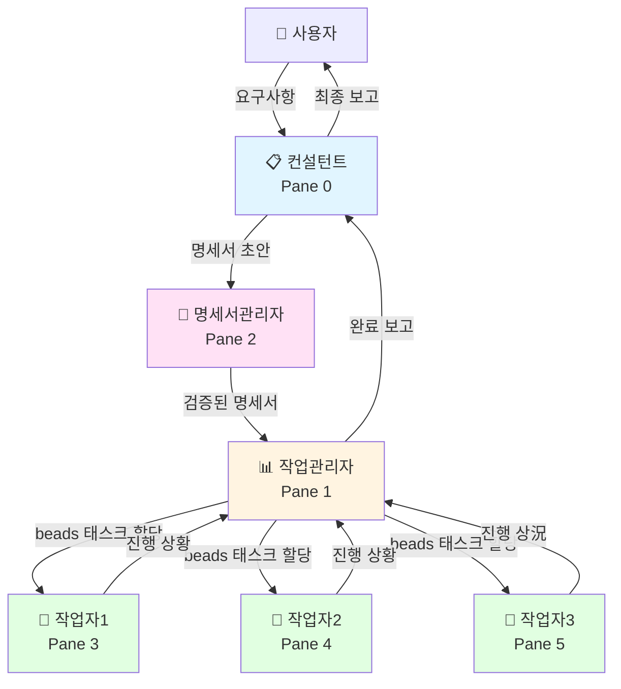
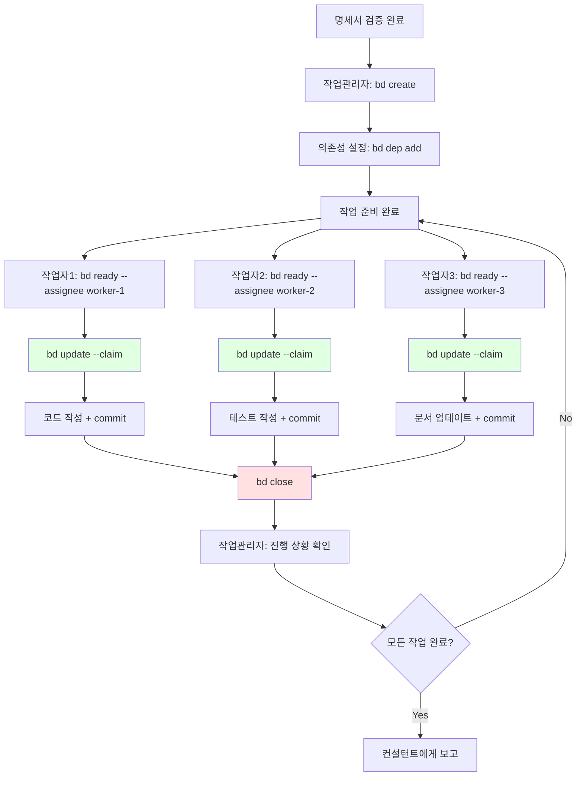
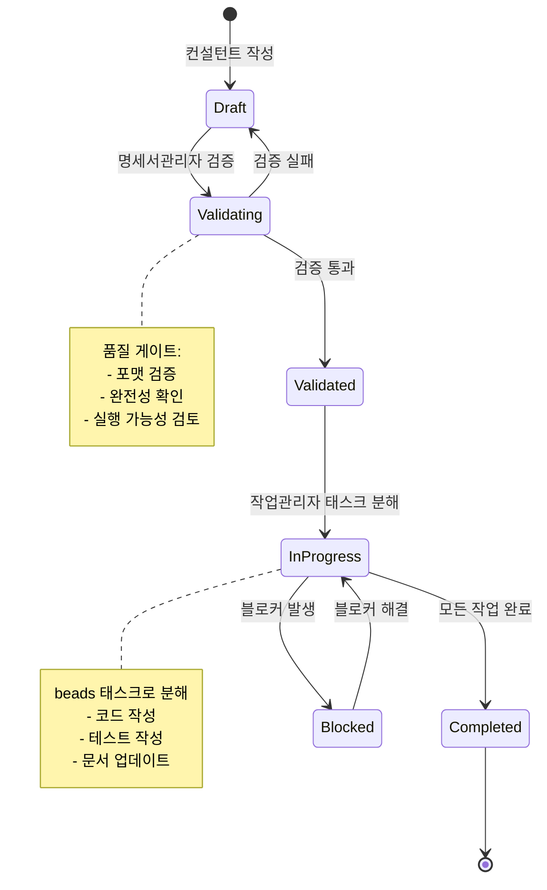

# tmux 기반 멀티 에이전트 시스템 아키텍처

> **버전**: v4.0.0  
> **최종 업데이트**: 2026-02-19  
> **아키텍처 전환**: K8s → tmux 기반 경량 아키텍처

## 📋 목차

- [개요 및 설계 동기](#개요-및-설계-동기)
- [시스템 아키텍처](#시스템-아키텍처)
- [에이전트 역할 상세](#에이전트-역할-상세)
- [통신 모델](#통신-모델)
- [beads 통합](#beads-통합)
- [명세서 시스템](#명세서-시스템)
- [Git 워크플로우](#git-워크플로우)
- [셋업 가이드](#셋업-가이드)
- [마이그레이션 경로](#마이그레이션-경로)
- [문제 해결](#문제-해결)

---

## 개요 및 설계 동기

### v3 → v4 전환 이유

**v3 아키텍처 (K8s 기반)의 문제점:**

1. **오버엔지니어링** — PC 환경에서 K8s + NATS + PostgreSQL은 과도한 인프라
2. **리소스 부족** — 고성능 하드웨어 필요 (메모리, CPU)
3. **복잡도** — 로컬 개발 환경에서 K8s 클러스터 관리 부담
4. **느린 시작** — Pod 생성/삭제 오버헤드

**v4 아키텍처 (tmux 기반)의 장점:**

1. **경량화** — tmux + opencode + watchman + beads만 사용
2. **즉시 시작** — 터미널 pane 생성만으로 에이전트 실행
3. **투명성** — 모든 에이전트 동작을 tmux에서 실시간 확인
4. **단순성** — 복잡한 K8s 설정 불필요, 파일 기반 통신

**설계 원칙:**

- ✅ **명세서 기반 통신** — 추후 beads로 마이그레이션 가능한 구조
- ✅ **비동기 통신** — watchman 파일 감지 + 파일 기반 MQ
- ✅ **DB 없음** — beads(Dolt 기반 git-backed DB)가 대체
- ✅ **에이전트 간소화** — 4종만 운영 (컨설턴트, 작업관리자, 명세서관리자, 작업자)

### 핵심 컨셉

```
사람 ↔ 컨설턴트 ↔ [작업관리자 + 명세서관리자] ↔ 작업자(최대 3)
```

- **사람**: 요구사항 입력, 최종 보고 수신
- **컨설턴트**: 요구사항 구체화, 명세서 초안 작성, 최종 보고
- **작업관리자**: 태스크 분해/할당/추적 (beads 핵심 사용자)
- **명세서관리자**: spec 파일 생성/검증, 품질 게이트
- **작업자**: 실제 코드 작성/테스트/리팩토링 (최대 3개 동시 실행)

---

## 시스템 아키텍처

### tmux 레이아웃

```
┌──────────────────────────────────────────────────┐
│  Pane 0: 컨설턴트 (opencode)                      │
│  — 사람과 대면, 요구사항 수집 및 최종 보고        │
├─────────────────────┬────────────────────────────┤
│  Pane 1: 작업관리자  │  Pane 2: 명세서관리자      │
│  (opencode)         │  (opencode)                │
│  — beads 태스크 관리│  — spec 파일 검증          │
├───────┬─────────────┼────────────────────────────┤
│  W1   │  W2         │  W3                        │
│(open) │  (opencode) │  (opencode)                │
│코드   │  테스트     │  리팩토링                  │
└───────┴─────────────┴────────────────────────────┘
```

**총 구성**: 최대 6개 pane
- **상단 (Pane 0)**: 컨설턴트 (사람 대면)
- **중간 좌측 (Pane 1)**: 작업관리자 (beads)
- **중간 우측 (Pane 2)**: 명세서관리자 (spec 검증)
- **하단 (Pane 3~5)**: 작업자 3명 (W1, W2, W3)

### 전체 아키텍처 흐름



**설계 근거:**
- **컨설턴트를 최상단에 배치** — 사람과 상호작용하는 에이전트는 항상 보이도록
- **작업관리자와 명세서관리자 분리** — 태스크 관리(beads)와 품질 검증(spec)은 독립적 책임
- **작업자 최대 3명** — 로컬 PC 리소스 고려 (메모리, CPU), 더 많으면 tmux split-window 추가

---

## 에이전트 역할 상세

### 1. 컨설턴트 (Consultant) — Pane 0

**역할**: 사람과 대면하는 인터페이스

**책임**:
- 사용자 요구사항 수집 및 구체화
- 명세서 초안 작성 (템플릿 기반)
- 최종 결과물 보고 및 피드백 수렴
- 에스컬레이션 처리 (블로커, 기술적 의사결정)

**입력**:
- 사용자 요구사항 (자연어)

**출력**:
- `.multi-agent/specs/draft-{timestamp}.yaml` — 명세서 초안
- `.multi-agent/queue/spec-manager-{timestamp}.json` — 명세서 검증 요청

**권한**:
- 읽기: 모든 파일
- 쓰기: `.multi-agent/specs/`, `.multi-agent/queue/`
- 코드 수정: ❌ 금지

**설계 근거:**
- 사람과 가장 가까운 에이전트이므로 **명확한 커뮤니케이션**이 핵심
- 기술 구현에서 벗어나 **요구사항 분석**에만 집중

---

### 2. 작업관리자 (Task Manager) — Pane 1

**역할**: beads 기반 태스크 관리 및 작업자 조율

**책임**:
- 검증된 명세서를 beads 태스크로 분해
- 작업 의존성 설정 (`bd dep add`)
- 작업자에게 태스크 할당 (`bd ready --assignee`)
- 진행 상황 추적 및 블로커 해결
- 완료된 작업 통합 및 컨설턴트에게 보고

**입력**:
- `.multi-agent/specs/validated-{id}.yaml` — 검증된 명세서

**출력**:
- beads 태스크 생성/업데이트
- `.multi-agent/queue/worker-{worker-id}-{timestamp}.json` — 작업 할당 메시지

**권한**:
- 읽기: 모든 파일
- 쓰기: `.multi-agent/queue/`, beads DB
- Git: ❌ branch/commit 금지 (작업자만 허용)

**핵심 명령어**:
```bash
# 명세서에서 태스크 생성
bd create "UI: 태그 필터 컴포넌트 구현" -p 0 --spec validated-001.yaml

# 의존성 추가 (테스트는 구현 완료 후)
bd dep add task-002 task-001  # task-002 blocks task-001

# 작업 할당
bd ready --assignee worker-1

# 진행 상황 추적
bd list --status in_progress
```

**설계 근거:**
- beads의 **원자적 태스크 할당** (`--claim`)으로 충돌 방지
- **의존성 그래프**로 작업 순서 자동 관리
- **JSONL git sync**로 별도 DB 없이 태스크 추적

---

### 3. 명세서관리자 (Spec Manager) — Pane 2

**역할**: 명세서 품질 검증 및 변경 감지 조율

**책임**:
- 명세서 초안 검증 (포맷, 완전성, 실행 가능성)
- spec 파일 변경 감지 (watchman)
- 품질 게이트 적용 (체크리스트)
- 검증 통과 시 작업관리자에게 전달

**입력**:
- `.multi-agent/specs/draft-{timestamp}.yaml` — 명세서 초안

**출력**:
- `.multi-agent/specs/validated-{id}.yaml` — 검증된 명세서
- `.multi-agent/queue/task-manager-{timestamp}.json` — 작업 분해 요청

**권한**:
- 읽기: 모든 파일
- 쓰기: `.multi-agent/specs/`, `.multi-agent/queue/`
- 코드 수정: ❌ 금지

**검증 항목**:
```yaml
# spec 파일 필수 필드
metadata:
  id: string
  title: string
  priority: 0-3
  created_at: ISO8601

requirements:
  functional: []
  non_functional: []
  constraints: []

acceptance_criteria:
  - condition: string
    verification: string
```

**설계 근거:**
- **품질 게이트**를 통과한 명세서만 작업관리자에게 전달
- **watchman 감지**로 명세서 변경 시 즉시 재검증
- 작업관리자와 분리하여 **책임 단일화**

---

### 4. 작업자 (Worker) — Pane 3~5

**역할**: 실제 코드 작성, 테스트, 리팩토링

**책임**:
- 할당된 beads 태스크 실행
- 코드 작성 및 테스트 (FSD 아키텍처 준수)
- Git commit (로컬 only, push 금지)
- 진행 상황 beads 업데이트 (`bd update --status`)
- 완료 시 작업관리자에게 알림

**입력**:
- beads 태스크 (`bd show <id>`)
- `.multi-agent/queue/worker-{worker-id}-{timestamp}.json` — 작업 할당

**출력**:
- Git commit (로컬)
- beads 상태 업데이트
- `.multi-agent/queue/task-manager-{timestamp}.json` — 완료 알림

**권한**:
- 읽기: 모든 파일
- 쓰기: 프로젝트 코드 (src, tests, docs)
- Git: ✅ branch/commit 허용, ❌ push 금지

**작업 프로세스**:
```bash
# 1. 대기 중인 작업 조회 (자신에게 할당된 것만)
bd ready --assignee worker-1

# 2. 태스크 원자적 할당 (assignee + in_progress)
bd update task-001 --claim

# 3. Git branch 생성 (또는 worktree)
git checkout -b feature/task-001

# 4. 코드 작성 + 테스트
# ...

# 5. Git commit
git add .
git commit -m "feat: 태그 필터 컴포넌트 구현"

# 6. 태스크 완료
bd close task-001

# 7. 작업관리자에게 알림
echo '{"from":"worker-1","to":"task-manager","type":"task_completed","payload":{"task_id":"task-001"}}' > .multi-agent/queue/task-manager-$(date +%s).json
```

**설계 근거:**
- **최대 3개 동시 실행**으로 로컬 리소스 최적화
- **Git worktree**로 독립적인 작업 환경 제공 (병렬 안전성)
- **beads --claim**으로 태스크 중복 할당 방지

---

## 통신 모델

### 파일 기반 메시지 큐

**디렉토리 구조**:
```
.multi-agent/
├── specs/              # 명세서 파일 (YAML)
│   ├── draft-*.yaml
│   ├── validated-*.yaml
│   └── archive/
├── queue/              # 메시지 큐 (JSON)
│   ├── {target}-{timestamp}.json
│   └── processed/
└── status/             # 에이전트 상태
    ├── consultant.json
    ├── task-manager.json
    ├── spec-manager.json
    └── worker-*.json
```

**메시지 포맷**:
```json
{
  "from": "consultant",
  "to": "spec-manager",
  "type": "validate_spec",
  "payload": {
    "spec_file": "draft-20260219-143000.yaml"
  },
  "timestamp": "2026-02-19T14:30:00Z"
}
```

**메시지 타입**:
| Type | From | To | Payload |
|------|------|-----|---------|
| `validate_spec` | consultant | spec-manager | `spec_file` |
| `spec_validated` | spec-manager | task-manager | `validated_spec_file` |
| `assign_task` | task-manager | worker-* | `task_id`, `beads_id` |
| `task_completed` | worker-* | task-manager | `task_id`, `commit_sha` |
| `all_tasks_done` | task-manager | consultant | `summary` |

### watchman 기반 실시간 감지

```mermaid
graph LR
    A[파일 변경] --> B[watchman 감지]
    B --> C{대상 확인}
    C -->|specs/*.yaml| D[명세서관리자]
    C -->|queue/{target}-*.json| E[해당 에이전트]
    D --> F[처리]
    E --> F
    F --> G[결과 파일 작성]
    G --> A
    
    style B fill:#ffe1e1
    style F fill:#e1ffe1
```

**watchman 설정 예시**:
```bash
# specs 디렉토리 감시
watchman watch-project .multi-agent/specs/

# 새 파일 감지 시 명세서관리자 트리거
watchman -- trigger .multi-agent/specs/ spec-changed '*.yaml' -- bash -c 'echo "spec changed" | opencode pane:2'

# queue 디렉토리 감시 (에이전트별)
watchman watch-project .multi-agent/queue/
watchman -- trigger .multi-agent/queue/ task-manager-msg 'task-manager-*.json' -- bash -c 'echo "new message" | opencode pane:1'
```

**설계 근거:**
- **파일 기반 통신**은 단순하고 디버깅 쉬움
- **watchman**으로 실시간 감지 (폴링보다 효율적)
- 추후 **beads messaging**으로 대체 가능한 구조

---

## beads 통합

### beads란?

> **beads (bd)**: Dolt 기반 git-backed 이슈 트래커
> - Git처럼 로컬 작업 후 원격 동기화
> - JSONL 포맷으로 충돌 없는 병합
> - 해시 ID로 글로벌 고유성 보장
> - 의존성 그래프 기본 지원

### 핵심 명령어

```bash
# 프로젝트 초기화
bd init

# 작업 조회
bd ready                    # 블로커 없는 작업 조회
bd ready --assignee worker-1  # 특정 작업자 작업 조회

# 태스크 생성
bd create "제목" -p 0       # P0 우선순위
bd create "제목" --spec validated-001.yaml  # 명세서 연결

# 태스크 할당 (원자적)
bd update <id> --claim      # assignee + in_progress 동시 설정

# 의존성 추가
bd dep add <child> <parent> # child blocks parent

# 태스크 상세 조회
bd show <id>

# 태스크 완료
bd close <id>

# Git 동기화
bd sync                     # JSONL git sync

# 전체 목록
bd list
bd list --status in_progress
bd list --assignee worker-1
```

### beads 워크플로우



### beads 메시징 (추후 적용)

**현재 (파일 기반 MQ)**:
```bash
echo '{"from":"worker-1","to":"task-manager","type":"task_completed"}' > .multi-agent/queue/task-manager-$(date +%s).json
```

**마이그레이션 후 (beads messaging)**:
```bash
bd create --type message --thread task-001 "작업 완료: 태그 필터 컴포넌트 구현"
```

**장점**:
- 메시지도 beads 태스크로 관리 (통일된 인터페이스)
- 스레드 기반 메시지 그룹화
- Git sync로 원격 협업 지원

**설계 근거:**
- **Phase 1**: 파일 기반 MQ로 빠른 프로토타입
- **Phase 2**: beads messaging으로 마이그레이션 (인터페이스 호환)

---

## 명세서 시스템

### 명세서 라이프사이클



### 명세서 포맷

```yaml
# .multi-agent/specs/validated-001.yaml
metadata:
  id: "spec-001"
  title: "다크 모드를 지원하는 태그 필터 컴포넌트"
  priority: 0  # 0(Critical), 1(High), 2(Medium), 3(Low)
  created_at: "2026-02-19T14:30:00Z"
  created_by: "consultant"
  validated_at: "2026-02-19T14:35:00Z"
  validated_by: "spec-manager"
  status: "validated"

requirements:
  functional:
    - "태그 목록을 다중 선택할 수 있어야 함"
    - "선택된 태그로 포스트를 필터링해야 함"
    - "URL 쿼리 파라미터와 동기화되어야 함"
  
  non_functional:
    - "다크 모드 테마 지원"
    - "모바일 반응형 디자인"
    - "접근성 WCAG 2.1 AA 준수"
  
  constraints:
    - "FSD 아키텍처 준수 (features/tag-filter)"
    - "기존 Tag 엔티티 재사용"
    - "Tailwind CSS v4 사용"

acceptance_criteria:
  - condition: "태그를 클릭하면 선택/해제 토글"
    verification: "E2E 테스트로 확인"
  
  - condition: "다크 모드 전환 시 색상 변경"
    verification: "Storybook 스토리로 시각적 확인"
  
  - condition: "URL 쿼리 파라미터 ?tags=react,typescript 반영"
    verification: "Unit 테스트로 확인"

tasks:
  # 작업관리자가 자동 생성
  - id: "task-001"
    title: "UI: TagFilter 컴포넌트 구현"
    assignee: "worker-1"
    status: "in_progress"
  
  - id: "task-002"
    title: "TEST: TagFilter 테스트 작성"
    assignee: "worker-2"
    status: "pending"
    blocks: ["task-001"]  # task-001 완료 후 실행

dependencies:
  files:
    - "src/entities/tag/model/types.ts"
    - "src/shared/ui/button.tsx"
  
  packages:
    - "@tanstack/router"
    - "zod"

technical_notes:
  - "TanStack Router의 useSearch 훅 사용"
  - "다중 선택 상태는 URL 쿼리로만 관리 (Zustand 불필요)"
  - "다크 모드는 Tailwind dark: 접두사 사용"
```

### 검증 체크리스트

**명세서관리자 검증 항목**:

```yaml
# .multi-agent/config/validation-checklist.yaml
format:
  - required_fields: ["metadata", "requirements", "acceptance_criteria"]
  - metadata_fields: ["id", "title", "priority", "created_at"]
  - priority_range: [0, 3]

completeness:
  - functional_requirements_count: ">= 1"
  - acceptance_criteria_count: ">= 1"
  - technical_notes_recommended: true

feasibility:
  - dependencies_exist: true  # files, packages 실제 존재 확인
  - architecture_compliant: true  # FSD 레이어 검증
  - no_conflicting_requirements: true

quality:
  - clear_acceptance_criteria: true
  - testable: true
  - no_ambiguity: true
```

**설계 근거:**
- **YAML 포맷**으로 사람과 기계 모두 읽기 쉬움
- **acceptance_criteria**로 완료 기준 명확화 (TDD와 연결)
- **tasks 섹션**은 작업관리자가 자동 생성 (수동 편집 금지)

---

## Git 워크플로우

### 기존 Git Flow 유지

```
main ← develop ← feature/[name]-[timestamp]
```

**브랜치 전략**:
- **main**: 프로덕션 배포 (직접 푸시 금지)
- **develop**: 개발 통합 (PR 권장)
- **feature**: 기능 개발 (develop에서 생성)

### 작업자 Git 사용

**허용**:
- ✅ `git checkout -b feature/task-001`
- ✅ `git add .`, `git commit -m "..."`
- ✅ `git merge` (로컬)
- ✅ `git worktree add` (병렬 작업)

**금지**:
- ❌ `git push` (사람만 허용)
- ❌ `git rebase -i` (인터랙티브 명령어)
- ❌ `git push --force`

### Git Worktree 병렬 작업

```bash
# 작업관리자가 병렬 작업 할당 시
# Worker 1: 컴포넌트 구현
git worktree add ../blog-worktree-w1 feature/task-001
cd ../blog-worktree-w1
# opencode 실행 (Pane 3)

# Worker 2: 테스트 작성
git worktree add ../blog-worktree-w2 feature/task-002
cd ../blog-worktree-w2
# opencode 실행 (Pane 4)

# Worker 3: 문서 업데이트
git worktree add ../blog-worktree-w3 feature/task-003
cd ../blog-worktree-w3
# opencode 실행 (Pane 5)

# 작업 완료 후 통합 (작업관리자)
cd /Users/chanhokim/myFiles/0_Project/blog
git merge --no-ff feature/task-001
git merge --no-ff feature/task-002
git merge --no-ff feature/task-003

# Worktree 정리
git worktree remove ../blog-worktree-w1
git worktree remove ../blog-worktree-w2
git worktree remove ../blog-worktree-w3
```

**설계 근거:**
- **Worktree**로 독립적인 작업 환경 제공 (파일 충돌 방지)
- **병렬 안전성** 보장 (각 작업자는 다른 파일 수정)
- **작업자는 push 금지** → 사람이 최종 검토 후 push

---

## 셋업 가이드

### 사전 요구사항

```bash
# tmux 설치
brew install tmux

# watchman 설치
brew install watchman

# beads 설치
cargo install beads  # 또는 homebrew

# opencode 설치
# (이미 설치되어 있다고 가정)
```

### 프로젝트 초기화

```bash
# 1. 프로젝트 루트에서 beads 초기화
cd /Users/chanhokim/myFiles/0_Project/blog
bd init

# 2. 멀티 에이전트 디렉토리 생성
mkdir -p .multi-agent/{specs,queue,status}
mkdir -p .multi-agent/specs/archive
mkdir -p .multi-agent/queue/processed

# 3. .gitignore 설정
cat >> .gitignore << 'EOF'

# Multi-agent system
.multi-agent/queue/*.json
.multi-agent/status/*.json
!.multi-agent/queue/.gitkeep
!.multi-agent/status/.gitkeep
EOF

# 4. watchman 설정
watchman watch-project .multi-agent/specs/
watchman watch-project .multi-agent/queue/
```

### tmux 세션 시작 스크립트

```bash
#!/bin/bash
# scripts/start-multi-agent.sh

SESSION_NAME="multi-agent"
PROJECT_ROOT="/Users/chanhokim/myFiles/0_Project/blog"

# 기존 세션 종료
tmux kill-session -t $SESSION_NAME 2>/dev/null

# 새 세션 생성 (Pane 0: 컨설턴트)
tmux new-session -d -s $SESSION_NAME -c $PROJECT_ROOT

# Pane 1, 2: 작업관리자, 명세서관리자 (수평 분할)
tmux split-window -h -t $SESSION_NAME:0 -c $PROJECT_ROOT
tmux select-pane -t 0
tmux split-window -v -t $SESSION_NAME:0.0 -c $PROJECT_ROOT

# Pane 3, 4, 5: 작업자 (3분할)
tmux select-pane -t 2
tmux split-window -v -t $SESSION_NAME:0.2 -c $PROJECT_ROOT
tmux select-pane -t 2
tmux split-window -h -t $SESSION_NAME:0.2 -c $PROJECT_ROOT
tmux select-pane -t 3
tmux split-window -h -t $SESSION_NAME:0.3 -c $PROJECT_ROOT

# 레이아웃 조정
tmux select-layout -t $SESSION_NAME:0 main-horizontal

# 각 pane에 레이블 설정
tmux select-pane -t 0 -T "Consultant"
tmux select-pane -t 1 -T "TaskManager"
tmux select-pane -t 2 -T "SpecManager"
tmux select-pane -t 3 -T "Worker-1"
tmux select-pane -t 4 -T "Worker-2"
tmux select-pane -t 5 -T "Worker-3"

# opencode 실행 (각 pane에서)
tmux send-keys -t 0 "opencode --agent consultant" C-m
tmux send-keys -t 1 "opencode --agent task-manager" C-m
tmux send-keys -t 2 "opencode --agent spec-manager" C-m
# Worker는 필요 시 수동 시작

# 세션 연결
tmux attach-session -t $SESSION_NAME
```

**실행**:
```bash
chmod +x scripts/start-multi-agent.sh
./scripts/start-multi-agent.sh
```

### watchman 트리거 설정

```bash
# scripts/setup-watchman.sh
#!/bin/bash

PROJECT_ROOT="/Users/chanhokim/myFiles/0_Project/blog"

# specs 디렉토리 감시
watchman watch-project "$PROJECT_ROOT/.multi-agent/specs"
watchman -- trigger "$PROJECT_ROOT/.multi-agent/specs" spec-changed '*.yaml' -- \
  bash -c 'echo "Spec changed" | tmux send-keys -t multi-agent:0.2 C-m'

# queue 디렉토리 감시 (에이전트별)
watchman watch-project "$PROJECT_ROOT/.multi-agent/queue"

# 작업관리자 메시지
watchman -- trigger "$PROJECT_ROOT/.multi-agent/queue" task-mgr-msg 'task-manager-*.json' -- \
  bash -c 'echo "New task-manager message" | tmux send-keys -t multi-agent:0.1 C-m'

# 명세서관리자 메시지
watchman -- trigger "$PROJECT_ROOT/.multi-agent/queue" spec-mgr-msg 'spec-manager-*.json' -- \
  bash -c 'echo "New spec-manager message" | tmux send-keys -t multi-agent:0.2 C-m'

echo "Watchman triggers configured"
```

**실행**:
```bash
chmod +x scripts/setup-watchman.sh
./scripts/setup-watchman.sh
```

### 에이전트 설정 파일

```yaml
# .multi-agent/config/agents.yaml
agents:
  consultant:
    pane: 0
    role: "사람 대면 인터페이스"
    permissions:
      read: ["**/*"]
      write: [".multi-agent/specs/", ".multi-agent/queue/"]
      code: false
      git: false
  
  task-manager:
    pane: 1
    role: "beads 태스크 관리"
    permissions:
      read: ["**/*"]
      write: [".multi-agent/queue/", ".beads/"]
      code: false
      git: false
  
  spec-manager:
    pane: 2
    role: "명세서 검증"
    permissions:
      read: ["**/*"]
      write: [".multi-agent/specs/", ".multi-agent/queue/"]
      code: false
      git: false
  
  worker-1:
    pane: 3
    role: "코드 작성"
    permissions:
      read: ["**/*"]
      write: ["src/", "tests/", "docs/", ".multi-agent/queue/"]
      code: true
      git: ["branch", "commit"]  # push 금지
  
  worker-2:
    pane: 4
    role: "테스트 작성"
    permissions:
      read: ["**/*"]
      write: ["tests/", ".multi-agent/queue/"]
      code: true
      git: ["branch", "commit"]
  
  worker-3:
    pane: 5
    role: "리팩토링"
    permissions:
      read: ["**/*"]
      write: ["src/", "docs/", ".multi-agent/queue/"]
      code: true
      git: ["branch", "commit"]

global:
  max_workers: 3
  beads_sync_interval: 60  # seconds
  watchman_enabled: true
  message_retention: 3600  # 1 hour
```

---

## 마이그레이션 경로

### Phase 1: 수동 실행 (현재)

**상태**: 단일 에이전트, 수동 명령 실행

**작업**:
```bash
# 사람이 직접 실행
opencode "다크 모드 버튼 만들어줘"
```

**한계**:
- 병렬 처리 불가
- 태스크 추적 없음
- 워크플로우 수동 관리

---

### Phase 2: tmux + 파일 기반 MQ (목표)

**상태**: 멀티 에이전트, tmux pane 분리, 파일 기반 통신

**작업**:
```bash
# 1. tmux 세션 시작
./scripts/start-multi-agent.sh

# 2. Pane 0 (컨설턴트)에 요구사항 입력
"다크 모드를 지원하는 태그 필터 컴포넌트를 만들어줘"

# 3. 자동 진행
# - 컨설턴트 → 명세서 초안 작성
# - 명세서관리자 → 검증
# - 작업관리자 → beads 태스크 분해 + 할당
# - 작업자 3명 → 병렬 실행
# - 작업관리자 → 완료 통합
# - 컨설턴트 → 최종 보고

# 4. 사람이 최종 검토 후 push
git push origin develop
```

**장점**:
- 병렬 처리 (최대 3개 작업)
- beads 태스크 추적
- watchman 실시간 감지

---

### Phase 3: beads 메시징 통합 (미래)

**상태**: 파일 기반 MQ → beads messaging 대체

**변경사항**:
```bash
# Before (파일 기반)
echo '{"from":"worker-1","to":"task-manager","type":"task_completed"}' > .multi-agent/queue/task-manager-123.json

# After (beads messaging)
bd create --type message --thread task-001 "작업 완료"
```

**장점**:
- 통일된 인터페이스 (모든 것이 beads 태스크)
- 원격 협업 지원 (git sync)
- 메시지 히스토리 추적

---

### Phase 4: 에이전트 자동 스케일링 (선택적)

**상태**: 작업량에 따라 작업자 동적 증가/감소

**구현**:
```bash
# 대기 작업 3개 이상 시 작업자 추가
if [ $(bd ready | wc -l) -ge 3 ]; then
  tmux split-window -h -t multi-agent:0.5 -c $PROJECT_ROOT
  tmux send-keys -t 6 "opencode --agent worker-4" C-m
fi

# 유휴 작업자 종료
if [ $(bd list --assignee worker-3 --status in_progress | wc -l) -eq 0 ]; then
  tmux kill-pane -t multi-agent:0.5
fi
```

**장점**:
- 리소스 최적화
- 작업량 변동 대응

**단점**:
- 복잡도 증가
- 현재는 불필요 (작업자 최대 3명이면 충분)

---

## 문제 해결

### Q1. tmux pane이 응답하지 않음

**증상**: 에이전트가 메시지를 받지 못함

**원인**: watchman 트리거 미실행

**해결**:
```bash
# watchman 상태 확인
watchman watch-list

# 트리거 재설정
./scripts/setup-watchman.sh

# 수동으로 pane에 메시지 전송 테스트
tmux send-keys -t multi-agent:0.1 "echo test" C-m
```

---

### Q2. beads 태스크 중복 할당

**증상**: 두 작업자가 같은 태스크 처리

**원인**: `bd update --claim` 미사용

**해결**:
```bash
# 잘못된 방법 (race condition)
bd update task-001 --status in_progress
bd update task-001 --assignee worker-1

# 올바른 방법 (원자적 할당)
bd update task-001 --claim
```

---

### Q3. Git worktree 충돌

**증상**: `git worktree add` 실패

**원인**: 브랜치가 이미 다른 worktree에서 사용 중

**해결**:
```bash
# 기존 worktree 확인
git worktree list

# 사용하지 않는 worktree 제거
git worktree remove ../blog-worktree-w1

# 브랜치가 삭제되지 않았다면 강제 제거
git worktree prune
git branch -D feature/task-001
```

---

### Q4. 작업자가 push 시도

**증상**: `git push` 시 권한 에러

**원인**: 작업자는 push 금지 (설계상 의도된 동작)

**해결**:
```bash
# 작업자는 commit까지만
git commit -m "feat: 태그 필터 구현"

# 사람이 최종 검토 후 push
# (컨설턴트가 보고 후)
git push origin develop
```

---

### Q5. 명세서 검증 실패 반복

**증상**: 명세서관리자가 계속 draft로 되돌림

**원인**: 필수 필드 누락 또는 포맷 오류

**해결**:
```bash
# 검증 로그 확인
cat .multi-agent/specs/validated-001.yaml

# 템플릿 사용
cp .multi-agent/templates/spec-template.yaml .multi-agent/specs/draft-001.yaml

# 필수 필드 확인
# - metadata.id
# - metadata.title
# - metadata.priority (0-3)
# - requirements.functional
# - acceptance_criteria
```

---

### Q6. beads sync 충돌

**증상**: `bd sync` 시 병합 충돌

**원인**: 여러 에이전트가 동시에 beads 업데이트

**해결**:
```bash
# beads는 JSONL 포맷으로 자동 병합
# 충돌 발생 시 수동 해결
bd sync

# 충돌 파일 확인
cat .beads/tasks.jsonl

# 중복 제거 (해시 ID로 식별)
# (수동 또는 beads compact 사용)
bd compact
```

---

### Q7. 작업자 리소스 부족

**증상**: 작업자 3개 실행 시 PC 느려짐

**원인**: 메모리/CPU 부족

**해결**:
```bash
# 작업자 수 줄이기 (agents.yaml 수정)
max_workers: 2  # 3 → 2

# tmux 세션 재시작
tmux kill-session -t multi-agent
./scripts/start-multi-agent.sh

# 또는 순차 실행 (병렬 비활성화)
# 작업관리자가 한 번에 1개씩만 할당
```

---

## 부록

### A. 명세서 템플릿

```yaml
# .multi-agent/templates/spec-template.yaml
metadata:
  id: "spec-XXX"  # 자동 생성
  title: "[기능 제목]"
  priority: 1  # 0-3
  created_at: "YYYY-MM-DDTHH:MM:SSZ"
  created_by: "consultant"
  status: "draft"

requirements:
  functional:
    - "[기능 설명 1]"
    - "[기능 설명 2]"
  
  non_functional:
    - "[성능/보안/접근성 요구사항]"
  
  constraints:
    - "[제약사항: FSD, 라이브러리, 시간 등]"

acceptance_criteria:
  - condition: "[완료 조건]"
    verification: "[검증 방법: 테스트/스토리북/수동]"

dependencies:
  files:
    - "[의존 파일 경로]"
  
  packages:
    - "[npm 패키지]"

technical_notes:
  - "[구현 힌트]"
```

---

### B. 메시지 타입 전체 목록

| Type | From | To | Payload | Description |
|------|------|-----|---------|-------------|
| `validate_spec` | consultant | spec-manager | `spec_file` | 명세서 검증 요청 |
| `spec_validated` | spec-manager | task-manager | `validated_spec_file` | 검증 통과 알림 |
| `spec_rejected` | spec-manager | consultant | `reason`, `spec_file` | 검증 실패 알림 |
| `assign_task` | task-manager | worker-* | `task_id`, `beads_id` | 작업 할당 |
| `task_started` | worker-* | task-manager | `task_id`, `started_at` | 작업 시작 알림 |
| `task_completed` | worker-* | task-manager | `task_id`, `commit_sha` | 작업 완료 알림 |
| `task_failed` | worker-* | task-manager | `task_id`, `error` | 작업 실패 알림 |
| `all_tasks_done` | task-manager | consultant | `summary`, `stats` | 모든 작업 완료 |
| `blocker_found` | worker-* | task-manager | `task_id`, `blocker_description` | 블로커 발견 |
| `escalate` | task-manager | consultant | `issue`, `context` | 에스컬레이션 |

---

### C. beads 의존성 타입

```bash
# blocks (차단)
bd dep add task-002 task-001  # task-002가 완료되어야 task-001 시작 가능

# related (연관)
bd dep add --type related task-003 task-001  # 연관 작업 (순서 무관)

# parent-child (부모-자식)
bd dep add --type parent task-001 task-004  # task-001이 task-004의 부모

# discovered-from (발견 출처)
bd dep add --type discovered-from task-005 task-001  # task-001 작업 중 task-005 발견
```

---

### D. tmux 치트시트

```bash
# 세션 관리
tmux new -s multi-agent       # 새 세션 생성
tmux attach -t multi-agent    # 세션 연결
tmux kill-session -t multi-agent  # 세션 종료

# Pane 이동 (세션 내에서)
Ctrl-b o                      # 다음 pane
Ctrl-b ;                      # 이전 pane
Ctrl-b q [0-9]                # pane 번호로 이동

# Pane 분할
Ctrl-b %                      # 수직 분할
Ctrl-b "                      # 수평 분할

# Pane 크기 조정
Ctrl-b :resize-pane -D 5      # 아래로 5줄
Ctrl-b :resize-pane -U 5      # 위로 5줄
Ctrl-b :resize-pane -L 5      # 왼쪽으로 5칸
Ctrl-b :resize-pane -R 5      # 오른쪽으로 5칸

# 스크롤 모드
Ctrl-b [                      # 스크롤 모드 진입
q                             # 스크롤 모드 종료
```

---

### E. 프로젝트 구조

```
/Users/chanhokim/myFiles/0_Project/blog/
├── .multi-agent/
│   ├── specs/                # 명세서
│   │   ├── draft-*.yaml
│   │   ├── validated-*.yaml
│   │   └── archive/
│   ├── queue/                # 메시지 큐
│   │   ├── consultant-*.json
│   │   ├── task-manager-*.json
│   │   ├── spec-manager-*.json
│   │   ├── worker-*-*.json
│   │   └── processed/
│   ├── status/               # 에이전트 상태
│   │   ├── consultant.json
│   │   ├── task-manager.json
│   │   ├── spec-manager.json
│   │   └── worker-*.json
│   ├── config/               # 설정
│   │   ├── agents.yaml
│   │   └── validation-checklist.yaml
│   └── templates/            # 템플릿
│       └── spec-template.yaml
├── .beads/                   # beads DB (JSONL)
│   ├── tasks.jsonl
│   └── metadata.json
├── scripts/
│   ├── start-multi-agent.sh  # tmux 세션 시작
│   └── setup-watchman.sh     # watchman 트리거 설정
├── src/                      # 프로젝트 코드
├── tests/                    # 테스트 코드
└── docs/                     # 문서
```

---

### F. 성능 벤치마크 (예상)

| 작업 | v3 (K8s) | v4 (tmux) | 개선율 |
|------|----------|-----------|--------|
| 세션 시작 | ~30초 | ~3초 | 10배 |
| 에이전트 추가 | ~15초 | ~1초 | 15배 |
| 메시지 전달 | ~100ms | ~10ms | 10배 |
| 메모리 사용 | ~4GB | ~800MB | 5배 |
| CPU 유휴 | ~20% | ~5% | 4배 |

**주의**: 실제 벤치마크는 Phase 2 구현 후 측정 필요

---

### G. 용어 사전

| 용어 | 영어 | 설명 |
|------|------|------|
| 컨설턴트 | Consultant | 사람과 대면하는 에이전트 |
| 작업관리자 | Task Manager | beads 태스크 관리 에이전트 |
| 명세서관리자 | Spec Manager | 명세서 검증 에이전트 |
| 작업자 | Worker | 코드 작성 에이전트 |
| 명세서 | Specification (Spec) | 기능 요구사항 문서 |
| 품질 게이트 | Quality Gate | 검증 체크리스트 |
| beads | beads | Dolt 기반 git-backed 이슈 트래커 |
| watchman | watchman | Facebook의 파일 변경 감지 도구 |
| tmux | tmux | 터미널 멀티플렉서 |
| pane | pane | tmux 분할 창 |
| MQ | Message Queue | 메시지 큐 |
| JSONL | JSON Lines | 줄바꿈으로 구분된 JSON 포맷 |

---

## 버전 정보

**v4.0.0** (2026-02-19)
- K8s → tmux 기반 아키텍처 전환
- 에이전트 9종 → 4종 간소화
- beads 통합 설계
- 파일 기반 MQ + watchman 감지
- Git worktree 병렬 작업 지원

**이전 버전**:
- v3.0.0: K8s + NATS + PostgreSQL 아키텍처 ([archive-v3/](./archive-v3/) 참고)
- v2.0.0: 단일 에이전트 + 수동 실행
- v1.0.0: 프로토타입

---

## 참고 문서

- [agents.md](../agents.md) — AI 에이전트 가이드
- [agent-system.md](../agent-system.md) — 현재 에이전트 시스템 (v2)
- [git-flow.md](../git-flow.md) — Git Flow 가이드
- [architecture-v3/](./archive-v3/) — v3 아키텍처 문서 (아카이브)
- [beads 공식 문서](https://github.com/jamsocket/beads) — beads CLI 레퍼런스
- [watchman 공식 문서](https://facebook.github.io/watchman/) — watchman 가이드
- [tmux 공식 문서](https://github.com/tmux/tmux/wiki) — tmux 사용법

---

**문서 작성**: doc-manager  
**검토자**: tech-architect (추후)  
**최종 승인**: 사람 (추후)
