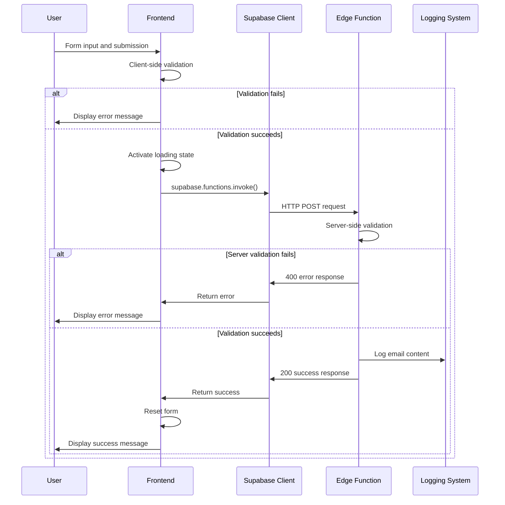
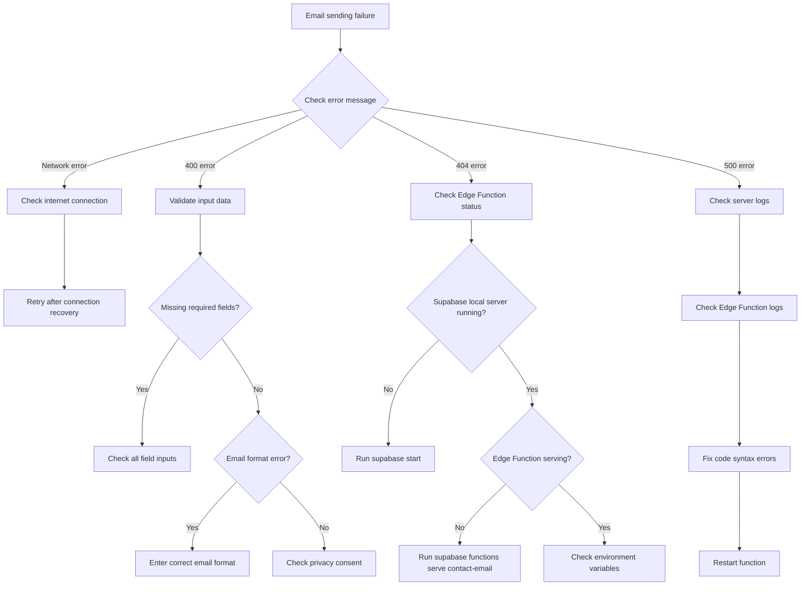

# Email System Architecture Document

## Overview

The email sending functionality for the contact page is implemented using React frontend and Supabase Edge Functions. This system allows users to send messages through a contact form and is designed with security and scalability in mind.

## 🏗️ Architecture Overview

```
[Frontend] → [Supabase Client] → [Edge Function] → [Logging/Notification]
```

### Key Components

1. **Frontend Contact Component** (`src/pages/contact.tsx`)
   - User interface and form management
   - Client-side validation
   - State management (loading, success, error)

2. **Supabase Edge Function** (`supabase/functions/contact-email/index.ts`)
   - Serverless backend logic
   - Data validation and processing
   - Email content generation

3. **CORS Configuration** (`supabase/functions/_shared/cors.ts`)
   - Allow cross-origin requests

## 📊 Sequence Diagram



## 🔒 Security Considerations

### 1. Input Validation
- **Client-side**: Immediate user feedback
- **Server-side**: Reliable final validation

```typescript
// Email format validation
const emailPattern = /^[^\s@]+@[^\s@]+\.[^\s@]+$/
if (!emailPattern.test(requestData.email)) {
  return new Response(JSON.stringify({ error: 'Please enter a valid email format.' }), {
    status: 400
  })
}
```

### 2. CORS Security
```typescript
export const corsHeaders = {
  'Access-Control-Allow-Origin': '*',
  'Access-Control-Allow-Headers': 'authorization, x-client-info, apikey, content-type',
}
```

### 3. Privacy Protection
- Mandatory user consent verification
- Data minimization principle
- Console logging only in local development environment

## 💾 Data Flow

### Request Data Structure
```typescript
interface ContactRequest {
  name: string      // User name
  email: string     // User email
  subject: string   // Inquiry subject
  message: string   // Inquiry content
}
```

### Response Data Structure
```typescript
// Success response
{
  success: true,
  message: 'Message sent successfully.'
}

// Error response
{
  error: string,
  details?: string
}
```

## ⚠️ Potential Failure Point Analysis

### 1. Frontend Failure Points
- **Network connection errors**: No retry logic
- **JavaScript disabled**: Form submission impossible
- **Browser compatibility**: Modern browser required

### 2. Supabase Connection Failure Points
- **Missing API key**: Need to check environment variables
- **URL error**: Check `.env.local` configuration
- **Function not deployed**: Need local server running

### 3. Edge Function Failure Points
- **Runtime errors**: TypeScript compilation errors
- **Memory limits**: When processing large messages
- **Cold start**: Delay on first request

## 🌐 Integration with Overall Application

### Routing Integration
```typescript
// TanStack Router integration
export const Route = createFileRoute("/contact")({
  component: Contact,
});
```

### State Management Integration
- Uses React's `useState`
- Compatible with TanStack Query structure
- Component-isolated state management

### UI Integration
- Applied Tailwind CSS styling
- Utilized shadcn/ui components (`LoadingSpinner`)
- Responsive design support

## 🔧 Troubleshooting Decision Tree



## 📈 Performance Considerations

### Frontend Optimization
- Form validation debouncing applicable
- Component memoization (React.memo)
- Image lazy loading

### Backend Optimization
- Minimize Edge Function cold start
- Adjust logging level (production vs development)
- Set request size limits

## 🚀 Deployment Considerations

### Local Development
```bash
# Start Supabase local environment
supabase start

# Serve Edge Function locally
supabase functions serve contact-email --env-file .env.local

# Start development server
pnpm dev
```

### Production Deployment
```bash
# Deploy Edge Function
supabase functions deploy contact-email

# Set environment variables
# VITE_SUPABASE_URL: Production Supabase URL
# VITE_SUPABASE_ANON_KEY: Production API key
```

## 🧪 Testing Strategy

### Unit Tests
- Contact component rendering tests
- Form input and validation tests
- Supabase function call mocking tests

### Integration Tests
- End-to-end form submission tests
- Edge Function API tests
- Error scenario tests

### Monitoring
- Edge Function execution logs
- Client error tracking
- Success rate and response time monitoring

## 📋 Maintenance Guide

### Regular Inspection Items
1. **Supabase version updates**: New features and security patches
2. **Dependency updates**: React, TypeScript, Tailwind CSS
3. **Log analysis**: Error patterns and usage trends

### Feature Expansion Plans
1. **Actual email sending**: SMTP service integration
2. **Spam prevention**: Add reCAPTCHA
3. **Notification system**: Real-time admin notifications
4. **Database storage**: Inquiry record keeping

## 📚 References

- [Supabase Edge Functions Documentation](https://supabase.com/docs/guides/functions)
- [TanStack Router Guide](https://tanstack.com/router/latest)
- [React Hook Form Documentation](https://react-hook-form.com/)
- [Tailwind CSS Guide](https://tailwindcss.com/docs)