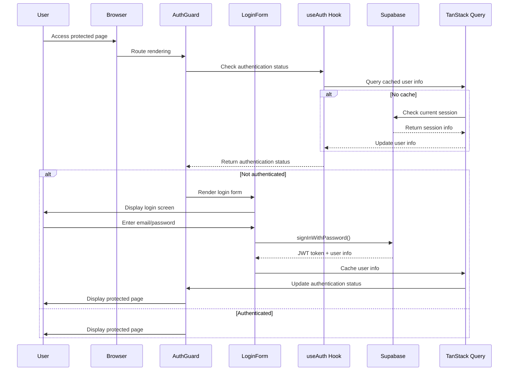
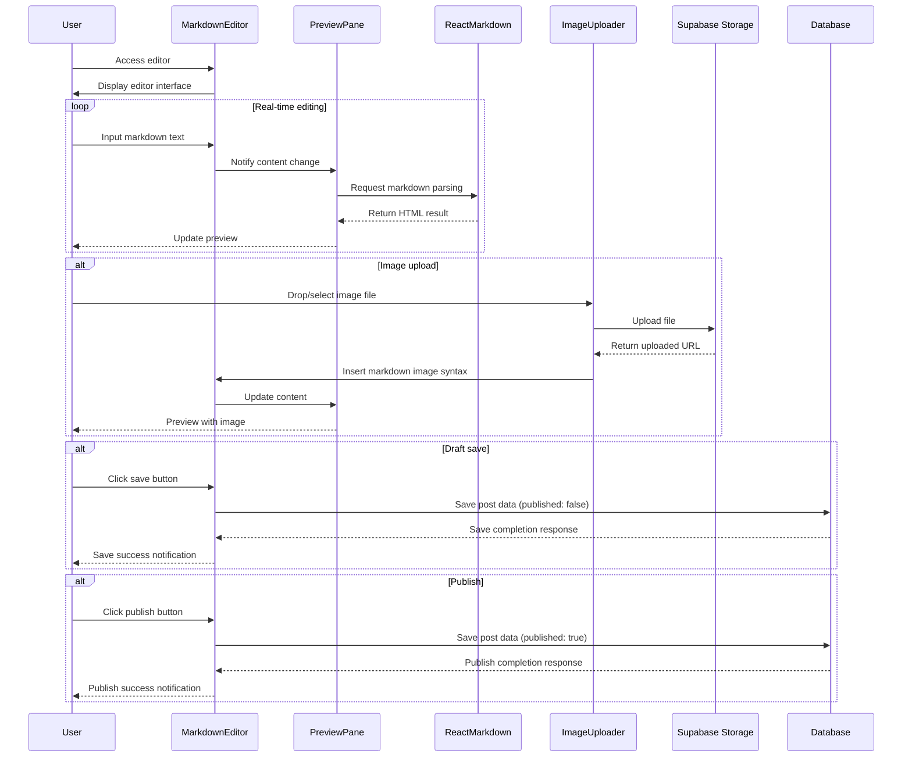
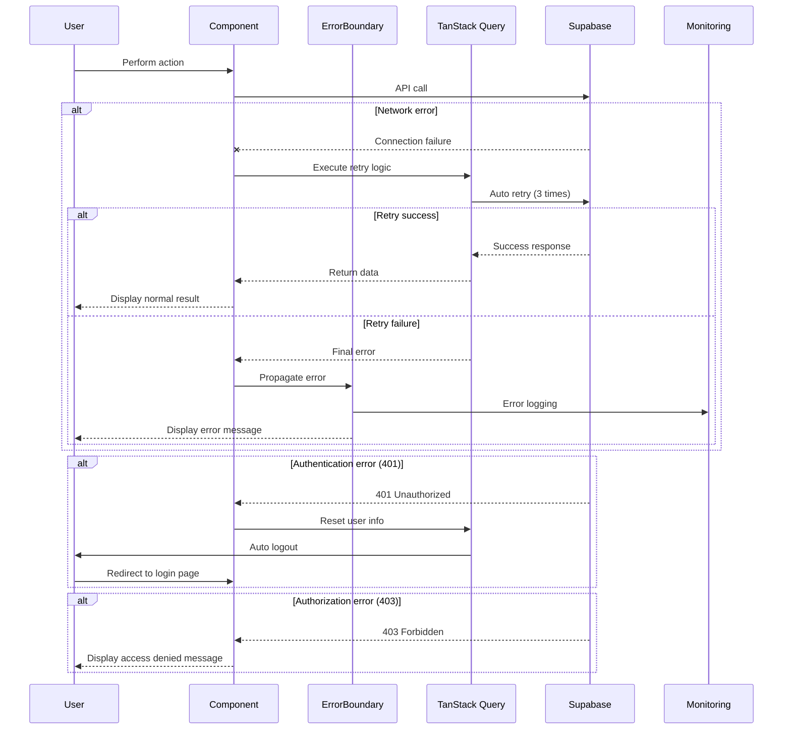
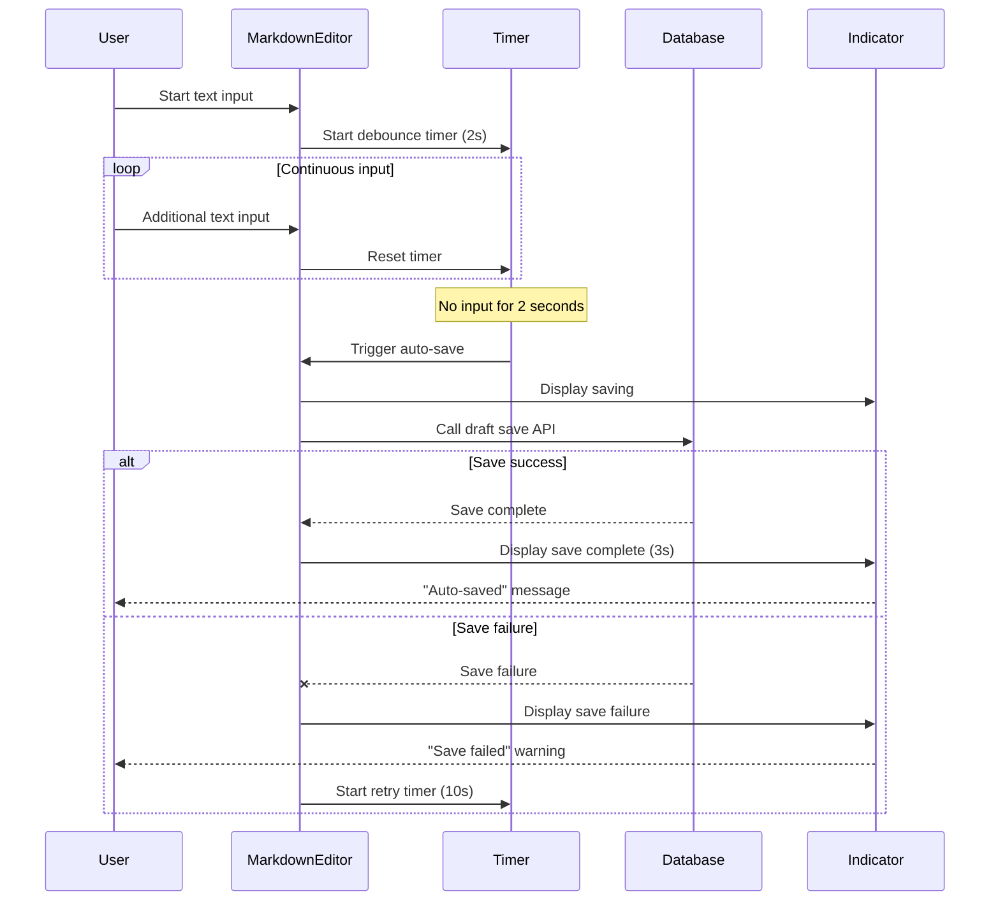
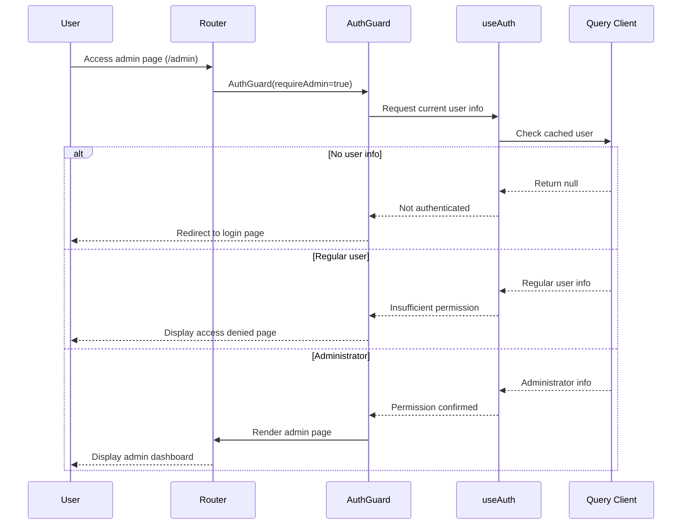
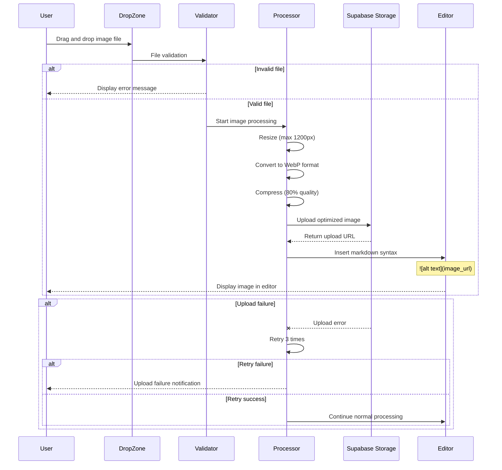
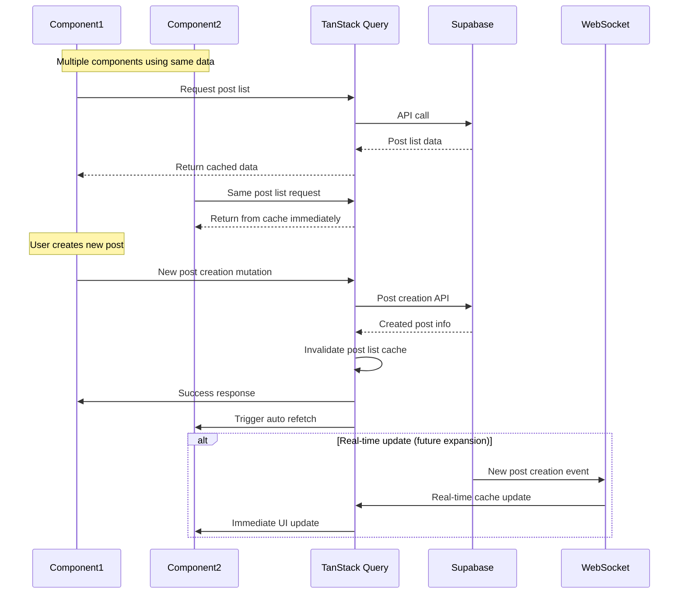
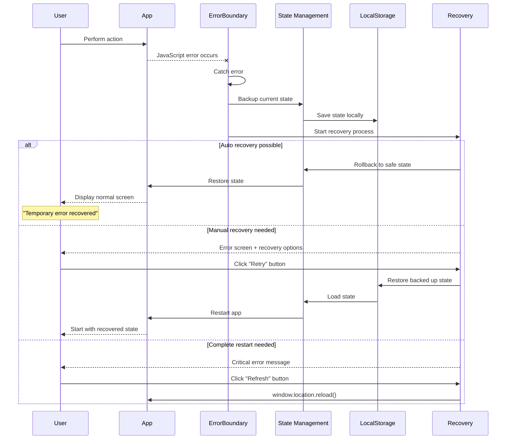

# Sequence Diagrams

## 📊 Overall Application Flow

### 1. User Authentication Flow

### 2. Markdown Editor Flow

### 3. Error Handling Flow

### 4. Auto-save Flow

### 5. Permission-based Routing Flow

### 6. Image Upload Flow

### 7. State Synchronization Flow

### 8. Error Recovery Flow

