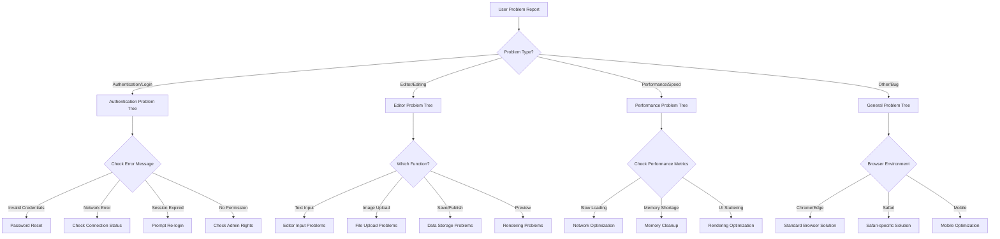
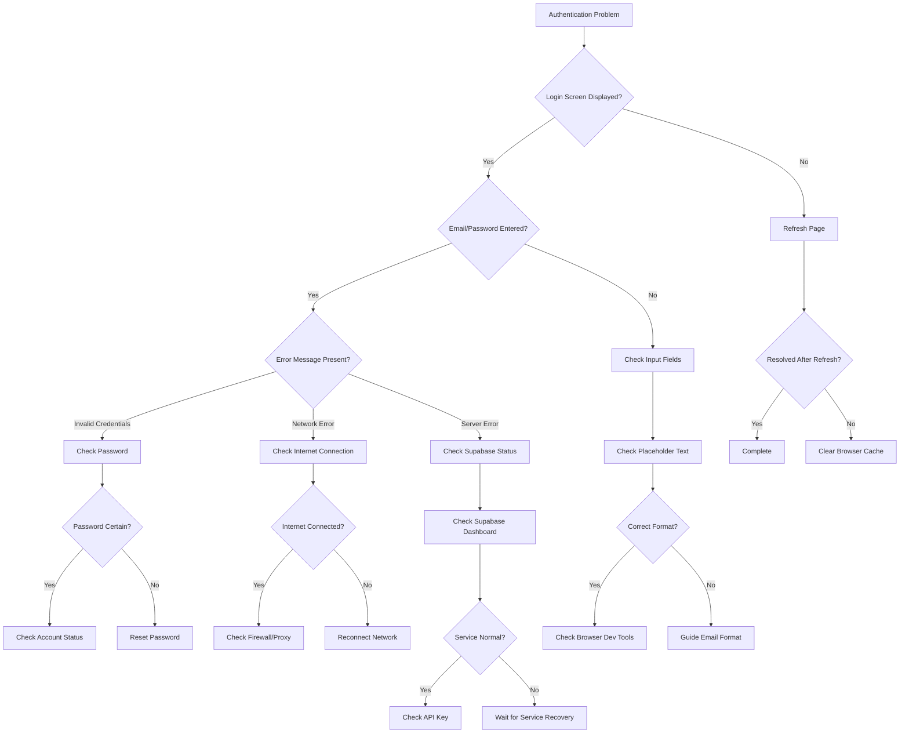
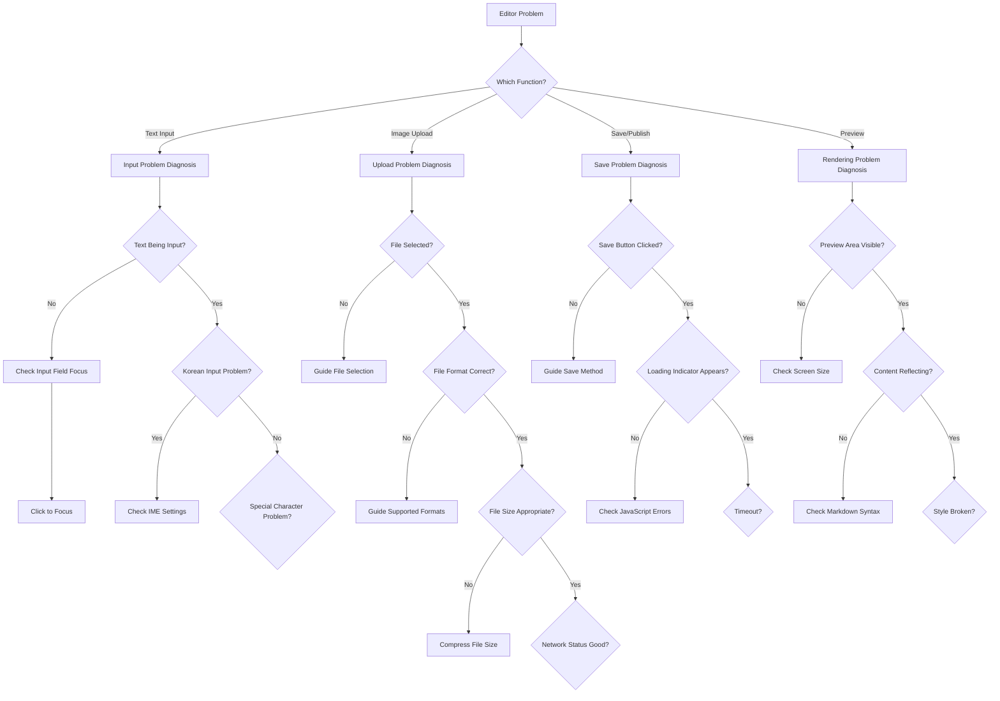
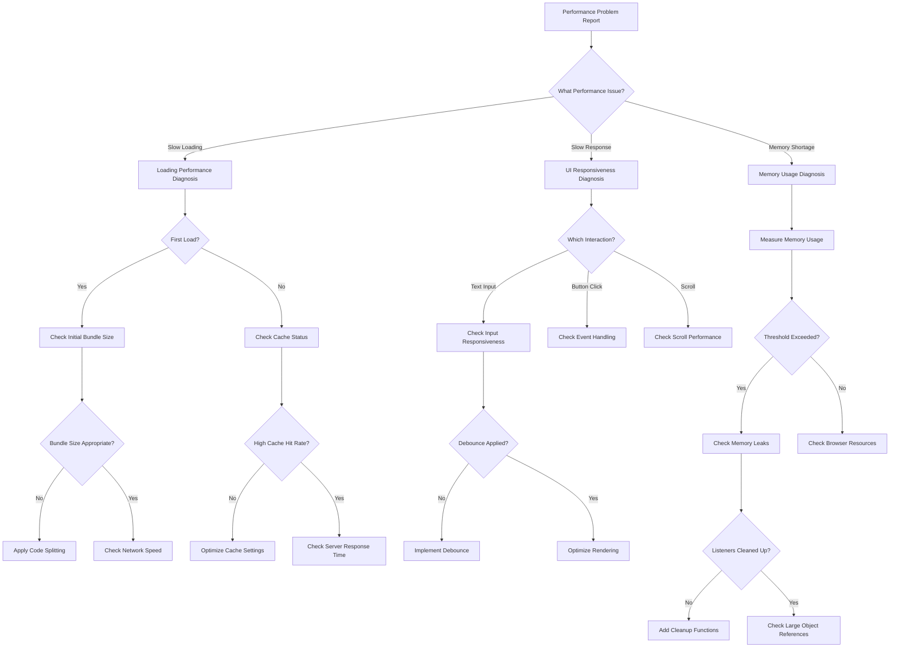

# Troubleshooting Guide

## 🧭 Decision Trees

### Main Problem Classification Tree



### Authentication Problem Resolution Tree



### Editor Problem Resolution Tree



### Performance Problem Resolution Tree



## 🔧 Step-by-Step Resolution Guide

### Step 1: Basic Diagnosis

#### Environment Check Checklist
```bash
# Browser information
console.log('User Agent:', navigator.userAgent);
console.log('Online:', navigator.onLine);
console.log('Language:', navigator.language);

# Local storage status
console.log('LocalStorage items:', Object.keys(localStorage));
console.log('SessionStorage items:', Object.keys(sessionStorage));

# Supabase connection status
const { data } = await supabase.auth.getSession();
console.log('Supabase session:', data.session ? 'Active' : 'Inactive');
```

#### Network Diagnosis
```javascript
// Check network status
const networkDiagnosis = async () => {
  try {
    const response = await fetch('https://api.github.com/zen', {
      method: 'GET',
      mode: 'cors'
    });
    console.log('Network status:', response.ok ? 'Normal' : 'Unstable');
  } catch (error) {
    console.error('Network connection failed:', error.message);
  }
};
```

### Step 2: Component-Specific Diagnosis

#### Authentication Component Diagnosis
```typescript
const authDiagnosticTool = {
  checkCurrentState: () => {
    const { currentUser, isLoading, isAuthenticated } = useAuth();
    console.table({ hasUser: !!currentUser, isLoading, isAuthenticated });
  },

  checkSession: async () => {
    const { data, error } = await supabase.auth.getSession();
    console.log('Session data:', data);
    console.log('Session error:', error);
  },

  checkToken: async () => {
    const { data } = await supabase.auth.getUser();
    console.log('Token validity:', data.user ? 'Valid' : 'Invalid');
  }
};
```

#### Editor Component Diagnosis
```typescript
const editorDiagnosticTool = {
  checkState: (editorState) => {
    console.table({
      contentLength: editorState.markdownContent.length,
      hasChanges: editorState.hasChanges,
      autoSaving: editorState.autoSaving,
      lastSaved: editorState.lastSavedTime
    });
  },

  testMarkdownParsing: (content) => {
    try {
      // ReactMarkdown rendering test
      const div = document.createElement('div');
      ReactDOM.render(<ReactMarkdown>{content}</ReactMarkdown>, div);
      console.log('Markdown parsing: Success');
    } catch (error) {
      console.error('Markdown parsing failed:', error);
    }
  },

  testImageUpload: async (file) => {
    try {
      const result = await supabase.storage
        .from('blog-images')
        .upload(`test-${Date.now()}.jpg`, file);
      console.log('Image upload:', result.error ? 'Failed' : 'Success');
    } catch (error) {
      console.error('Upload error:', error);
    }
  }
};
```

### Step 3: Automatic Recovery Attempts

#### Cache Cleanup
```typescript
const cacheCleanup = () => {
  // TanStack Query cache cleanup
  queryClient.clear();

  // Browser cache cleanup
  if ('caches' in window) {
    caches.keys().then(names => {
      names.forEach(name => caches.delete(name));
    });
  }

  // Local storage cleanup (non-sensitive data only)
  const preserveList = ['supabase.auth.token'];
  Object.keys(localStorage).forEach(key => {
    if (!preserveList.some(item => key.includes(item))) {
      localStorage.removeItem(key);
    }
  });
};
```

#### State Reinitialization
```typescript
const stateReinitialization = async () => {
  // Re-check authentication status
  const { data } = await supabase.auth.refreshSession();
  if (data.session) {
    queryClient.setQueryData(['currentUser'], data.user);
  }

  // Reset editor state
  setEditorState({
    currentPost: null,
    markdownContent: '',
    hasChanges: false,
    autoSaving: false,
  });

  // Force component re-render
  window.location.reload();
};
```

### Step 4: Advanced Diagnosis

#### Performance Profiling
```typescript
const performanceProfiling = {
  memoryUsage: () => {
    if ('memory' in performance) {
      const memory = (performance as any).memory;
      return {
        used: `${(memory.usedJSHeapSize / 1048576).toFixed(2)}MB`,
        total: `${(memory.totalJSHeapSize / 1048576).toFixed(2)}MB`,
        limit: `${(memory.jsHeapSizeLimit / 1048576).toFixed(2)}MB`,
        usagePercent: `${((memory.usedJSHeapSize / memory.jsHeapSizeLimit) * 100).toFixed(1)}%`
      };
    }
    return null;
  },

  renderingPerformance: () => {
    let frameCount = 0;
    const startTime = performance.now();

    const measure = () => {
      frameCount++;
      const elapsedTime = performance.now() - startTime;

      if (elapsedTime >= 1000) {
        const fps = Math.round((frameCount * 1000) / elapsedTime);
        console.log(`FPS: ${fps}`);
        return fps;
      }

      requestAnimationFrame(measure);
    };

    requestAnimationFrame(measure);
  },

  bundleSizeAnalysis: () => {
    const scripts = Array.from(document.querySelectorAll('script[src]'));
    scripts.forEach(script => {
      fetch(script.src, { method: 'HEAD' })
        .then(response => {
          const size = response.headers.get('content-length');
          console.log(`${script.src}: ${size ? `${(parseInt(size) / 1024).toFixed(1)}KB` : 'Unknown'}`);
        });
    });
  }
};
```

#### Error Logging System
```typescript
const errorLoggingSystem = {
  config: {
    maxLogs: 100,
    logLevels: ['error', 'warn', 'info'],
    autoSend: true
  },

  logStorage: [] as Array<{
    timestamp: string;
    level: string;
    message: string;
    stack: string;
    browserInfo: string;
  }>,

  addLog: function(level: string, message: string, error?: Error) {
    const logEntry = {
      timestamp: new Date().toISOString(),
      level,
      message,
      stack: error?.stack || '',
      browserInfo: navigator.userAgent
    };

    this.logStorage.push(logEntry);

    // Remove old logs when exceeding max count
    if (this.logStorage.length > this.config.maxLogs) {
      this.logStorage.shift();
    }

    // Auto send (to external service in real implementation)
    if (this.config.autoSend && level === 'error') {
      this.sendError(logEntry);
    }
  },

  sendError: async function(logEntry: any) {
    try {
      // In real implementation, send to Sentry, LogRocket, etc.
      console.log('Error sent:', logEntry);
    } catch (error) {
      console.error('Error sending failed:', error);
    }
  },

  exportLogs: function() {
    const data = JSON.stringify(this.logStorage, null, 2);
    const blob = new Blob([data], { type: 'application/json' });
    const url = URL.createObjectURL(blob);

    const a = document.createElement('a');
    a.href = url;
    a.download = `error-logs-${new Date().toISOString().split('T')[0]}.json`;
    document.body.appendChild(a);
    a.click();
    document.body.removeChild(a);
    URL.revokeObjectURL(url);
  }
};

// Register global error handlers
window.addEventListener('error', (event) => {
  errorLoggingSystem.addLog('error', event.message, event.error);
});

window.addEventListener('unhandledrejection', (event) => {
  errorLoggingSystem.addLog('error', `Promise rejection: ${event.reason}`);
});
```

## 📞 Escalation Guide

### Problem Severity Classification

#### P0: Critical (Immediate Response)
- Complete application down
- Data loss occurring
- Security vulnerability discovered

**Response Procedure:**
1. Immediately stop service (if necessary)
2. Emergency technical team assembly
3. Apply temporary solution
4. User notification

#### P1: Important (Response within 2 hours)
- Major functionality not working
- Multiple users affected
- Severe performance degradation

**Response Procedure:**
1. Assess problem scope
2. Provide temporary workaround
3. Establish fix plan
4. Provide regular updates

#### P2: Normal (Response within 24 hours)
- Some functionality issues
- Few users affected
- Usability inconvenience

**Response Procedure:**
1. Reproduce and analyze problem
2. Decide fix priority
3. Include in next release

#### P3: Low (Weekly Response)
- Improvement requests
- Minor bugs
- Documentation errors

### Contacts and Tools

```typescript
const supportTools = {
  browserConsole: {
    description: 'Execute diagnostic commands in developer tools console',
    shortcut: 'F12 or Ctrl+Shift+I',
    commands: [
      'authDiagnosticTool.checkCurrentState()',
      'editorDiagnosticTool.checkState(editorState)',
      'performanceProfiling.memoryUsage()',
      'errorLoggingSystem.exportLogs()'
    ]
  },

  remoteDiagnosis: {
    description: 'Diagnose user environment remotely',
    accessMethod: 'Chrome DevTools Protocol',
    requiredPermission: 'Temporary access after user consent'
  },

  logCollection: {
    description: 'Automatic error log collection system',
    storageLocation: 'Supabase log table',
    retentionPeriod: '30 days'
  }
};
```

## 📚 FAQ

### Q: Immediately logged out after login
**A:** This is likely a session cookie configuration issue.

```javascript
// Solution
1. Check browser cookie settings
2. Delete site data and retry
3. Test in incognito mode
4. Check browser updates
```

### Q: Image upload not working
**A:** Check file size, format, and network status in order.

```javascript
// Diagnostic commands
console.log('File size:', file.size, '(max: 5MB)');
console.log('File format:', file.type, '(allowed: image/*)');
navigator.onLine && console.log('Network connected');
```

### Q: Preview not updating
**A:** This could be a React state update issue.

```javascript
// Force re-render
setMarkdownContent(prev => prev + ' ');
setTimeout(() => setMarkdownContent(prev => prev.slice(0, -1)), 0);
```

### Q: Auto-save not working
**A:** Check the debounce timer and network status.

```javascript
// Manual save test
handleSave(); // Attempt immediate save
console.log('Last auto-save:', lastSavedTime);
```

This guide allows systematic resolution of most problems, and complex issues can be quickly resolved through step-by-step escalation.