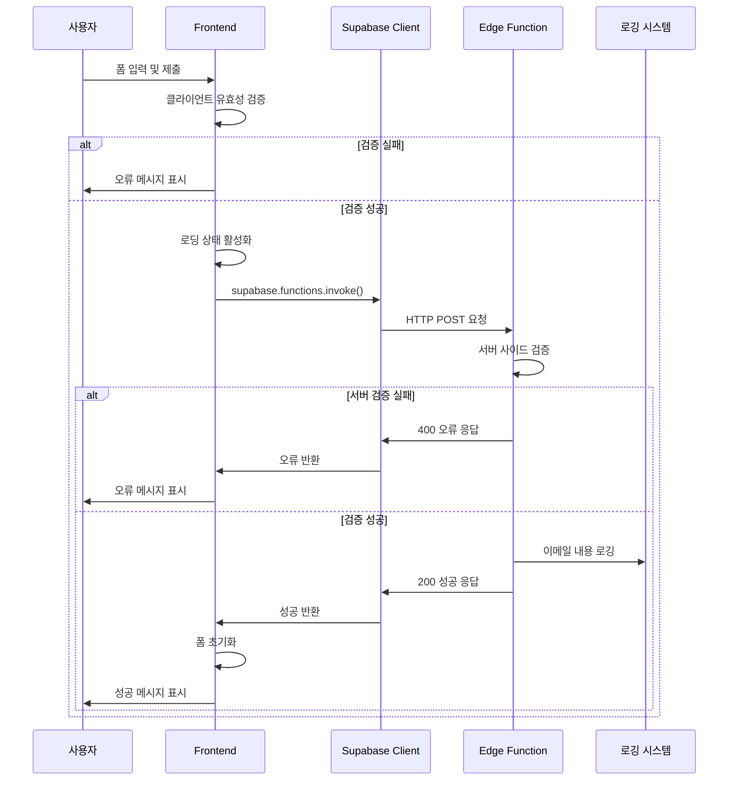
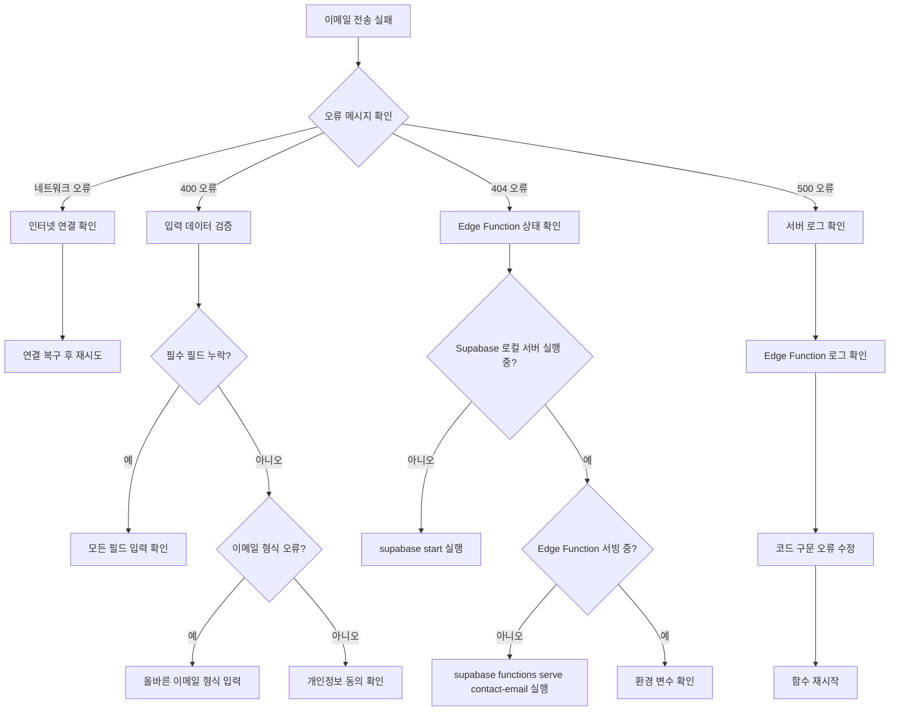

# 이메일 시스템 아키텍처 문서

## 개요

연락처 페이지의 이메일 전송 기능은 React 프론트엔드와 Supabase Edge Functions을 사용하여 구현되었습니다. 이 시스템은 사용자가 연락 폼을 통해 메시지를 전송할 수 있도록 하며, 보안성과 확장성을 고려하여 설계되었습니다.

## 🏗️ 아키텍처 개요

```
[Frontend] → [Supabase Client] → [Edge Function] → [로깅/알림]
```

### 주요 컴포넌트

1. **Frontend Contact Component** (`src/pages/contact.tsx`)
   - 사용자 인터페이스 및 폼 관리
   - 클라이언트 사이드 유효성 검증
   - 상태 관리 (로딩, 성공, 오류)

2. **Supabase Edge Function** (`supabase/functions/contact-email/index.ts`)
   - 서버리스 백엔드 로직
   - 데이터 검증 및 처리
   - 이메일 내용 생성

3. **CORS 설정** (`supabase/functions/_shared/cors.ts`)
   - 크로스 오리진 요청 허용

## 📊 시퀀스 다이어그램



## 🔒 보안 고려사항

### 1. 입력 검증
- **클라이언트 사이드**: 즉각적인 사용자 피드백
- **서버 사이드**: 신뢰할 수 있는 최종 검증

```typescript
// 이메일 형식 검증
const emailPattern = /^[^\s@]+@[^\s@]+\.[^\s@]+$/
if (!emailPattern.test(requestData.email)) {
  return new Response(JSON.stringify({ error: '올바른 이메일 형식을 입력해주세요.' }), {
    status: 400
  })
}
```

### 2. CORS 보안
```typescript
export const corsHeaders = {
  'Access-Control-Allow-Origin': '*',
  'Access-Control-Allow-Headers': 'authorization, x-client-info, apikey, content-type',
}
```

### 3. 개인정보 보호
- 사용자 동의 필수 확인
- 데이터 최소화 원칙
- 로컬 개발 환경에서는 콘솔 로깅만 수행

## 💾 데이터 플로우

### 요청 데이터 구조
```typescript
interface ContactRequest {
  name: string      // 사용자 이름
  email: string     // 사용자 이메일
  subject: string   // 문의 제목
  message: string   // 문의 내용
}
```

### 응답 데이터 구조
```typescript
// 성공 응답
{
  success: true,
  message: '메시지가 성공적으로 전송되었습니다.'
}

// 오류 응답
{
  error: string,
  details?: string
}
```

## ⚠️ 잠재적 실패 지점 분석

### 1. 프론트엔드 실패점
- **네트워크 연결 오류**: 재시도 로직 없음
- **JavaScript 비활성화**: 폼 제출 불가
- **브라우저 호환성**: 모던 브라우저 필요

### 2. Supabase 연결 실패점
- **API 키 누락**: 환경 변수 확인 필요
- **URL 오류**: `.env.local` 설정 확인
- **함수 미배포**: 로컬 서버 실행 필요

### 3. Edge Function 실패점
- **런타임 오류**: TypeScript 컴파일 오류
- **메모리 제한**: 대용량 메시지 처리 시
- **콜드 스타트**: 첫 요청 시 지연

## 🌐 전체 애플리케이션과의 통합

### 라우팅 통합
```typescript
// TanStack Router 통합
export const Route = createFileRoute("/contact")({
  component: Contact,
});
```

### 상태 관리 통합
- React의 `useState` 사용
- TanStack Query와 호환 가능한 구조
- 컴포넌트 격리된 상태 관리

### UI 통합
- Tailwind CSS 스타일링 적용
- shadcn/ui 컴포넌트 활용 (`LoadingSpinner`)
- 반응형 디자인 지원

## 🔧 문제 해결 의사결정 트리



## 📈 성능 고려사항

### 프론트엔드 최적화
- 폼 검증 debouncing 적용 가능
- 컴포넌트 메모이제이션 (React.memo)
- 이미지 lazy loading

### 백엔드 최적화
- Edge Function 콜드 스타트 최소화
- 로깅 레벨 조정 (프로덕션 vs 개발)
- 요청 크기 제한 설정

## 🚀 배포 고려사항

### 로컬 개발
```bash
# Supabase 로컬 환경 시작
supabase start

# Edge Function 로컬 서빙
supabase functions serve contact-email --env-file .env.local

# 개발 서버 시작
pnpm dev
```

### 프로덕션 배포
```bash
# Edge Function 배포
supabase functions deploy contact-email

# 환경 변수 설정
# VITE_SUPABASE_URL: 프로덕션 Supabase URL
# VITE_SUPABASE_ANON_KEY: 프로덕션 API 키
```

## 🧪 테스트 전략

### 단위 테스트
- Contact 컴포넌트 렌더링 테스트
- 폼 입력 및 검증 테스트
- Supabase 함수 호출 모킹 테스트

### 통합 테스트
- End-to-end 폼 제출 테스트
- Edge Function API 테스트
- 오류 시나리오 테스트

### 모니터링
- Edge Function 실행 로그
- 클라이언트 오류 추적
- 성공률 및 응답 시간 모니터링

## 📋 유지보수 가이드

### 정기 점검 항목
1. **Supabase 버전 업데이트**: 새로운 기능 및 보안 패치
2. **의존성 업데이트**: React, TypeScript, Tailwind CSS
3. **로그 분석**: 오류 패턴 및 사용량 추이

### 기능 확장 계획
1. **실제 이메일 전송**: SMTP 서비스 통합
2. **스팸 방지**: reCAPTCHA 추가
3. **알림 시스템**: 관리자 실시간 알림
4. **데이터베이스 저장**: 문의 기록 보관

## 📚 참고 자료

- [Supabase Edge Functions 문서](https://supabase.com/docs/guides/functions)
- [TanStack Router 가이드](https://tanstack.com/router/latest)
- [React Hook Form 문서](https://react-hook-form.com/)
- [Tailwind CSS 가이드](https://tailwindcss.com/docs)