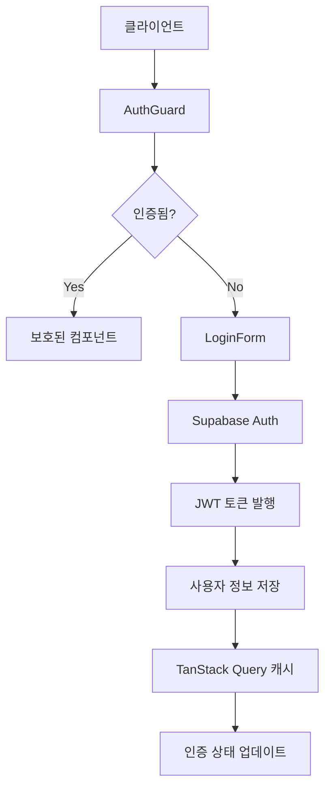
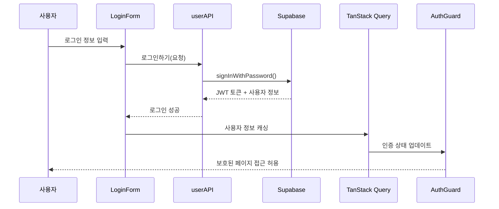
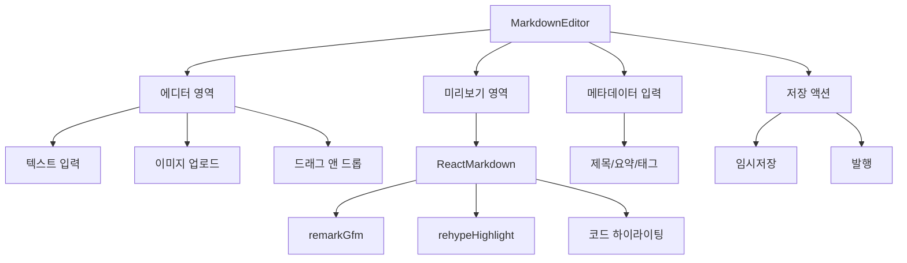
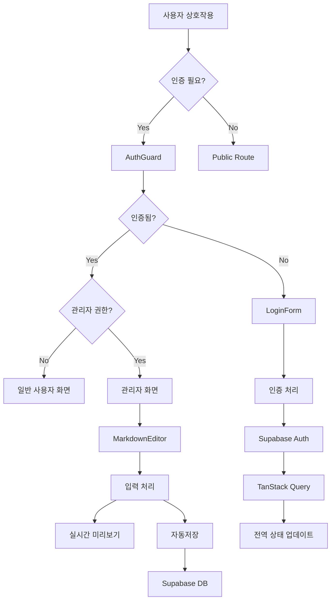
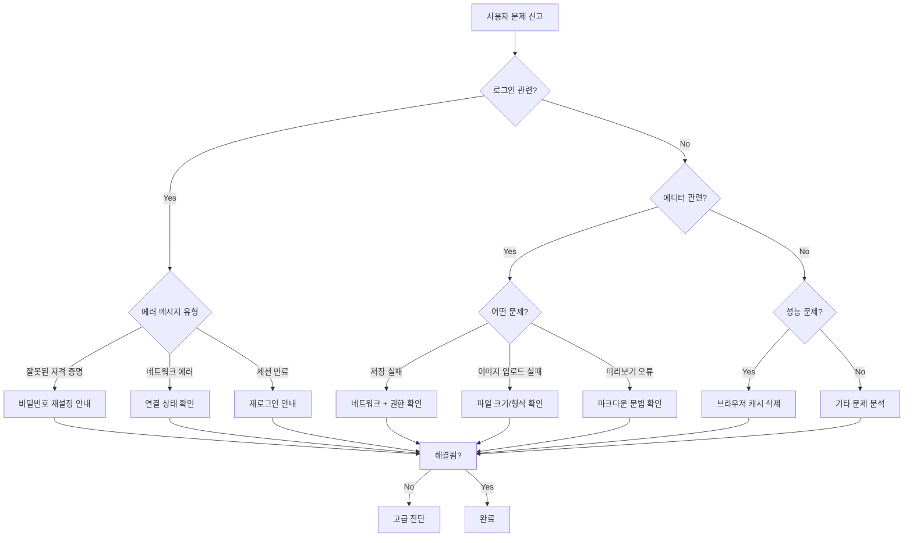

# 한국어 블로그 시스템 기능 문서

## 📋 목차

1. [시스템 개요](#시스템-개요)
2. [아키텍처 설계](#아키텍처-설계)
3. [인증 시스템](#인증-시스템)
4. [마크다운 에디터 시스템](#마크다운-에디터-시스템)
5. [데이터 흐름](#데이터-흐름)
6. [보안 고려사항](#보안-고려사항)
7. [잠재적 실패 지점](#잠재적-실패-지점)
8. [문제 해결 가이드](#문제-해결-가이드)
9. [성능 최적화](#성능-최적화)
10. [확장성 고려사항](#확장성-고려사항)

---

## 시스템 개요

### 🎯 프로젝트 목표
- **한국어 중심 개발**: 모든 코드와 문서가 한국어로 작성된 개발자 블로그
- **현대적 기술 스택**: React 19, TypeScript, Supabase를 활용한 풀스택 애플리케이션
- **개발자 친화적**: 마크다운 기반 글 작성, 코드 하이라이팅, 이미지 관리

### 🏗️ 핵심 기능
- **사용자 인증**: Supabase Auth 기반 이메일/비밀번호 로그인
- **마크다운 에디터**: 실시간 미리보기, 코드 하이라이팅, 이미지 업로드
- **권한 관리**: 관리자/일반사용자 구분, 라우트 보호
- **콘텐츠 관리**: 임시저장/발행 상태 관리, 태그 시스템

---

## 아키텍처 설계

### 🏛️ Feature Slice Design (FSD) 아키텍처

```
src/
├── app/                     # 애플리케이션 레이어
│   ├── providers/           # 전역 프로바이더
│   └── routing/             # 라우팅 설정
├── pages/                   # 페이지 레이어
│   ├── home/                # 홈 페이지
│   ├── admin/               # 관리자 페이지
│   └── auth/                # 인증 페이지
├── features/                # 기능 레이어
│   ├── auth/                # 인증 기능
│   ├── post-editor/         # 글 편집 기능
│   ├── post-list/           # 글 목록 기능
│   └── markdown-viewer/     # 마크다운 뷰어
├── entities/                # 엔티티 레이어
│   ├── user/                # 사용자 엔티티
│   ├── post/                # 블로그 글 엔티티
│   └── tag/                 # 태그 엔티티
├── shared/                  # 공유 레이어
│   ├── api/                 # API 클라이언트
│   ├── config/              # 설정
│   ├── lib/                 # 라이브러리
│   └── ui/                  # 공통 UI 컴포넌트
└── routes/                  # TanStack Router 파일
```

### 🎯 아키텍처적 결정

#### 1. Feature Slice Design 채택
**이유**:
- **명확한 책임 분리**: 각 레이어별 명확한 역할 정의
- **확장성**: 새로운 기능 추가 시 독립적 개발 가능
- **유지보수성**: 기능별 격리로 사이드 이펙트 최소화

**구현**:
```typescript
// 의존성 규칙
App → Pages → Features → Entities → Shared

// 금지된 의존성
Features ❌ Pages
Features ❌ App
Entities ❌ Features
```

#### 2. TanStack Query를 활용한 상태 관리
**이유**:
- **서버 상태 관리**: 캐싱, 동기화, 백그라운드 업데이트
- **최적화**: 중복 요청 제거, 옵티미스틱 업데이트
- **에러 처리**: 자동 재시도, 에러 바운더리

**구현**:
```typescript
// 예시: 사용자 인증 상태 관리
export function useAuth(): 인증상태 {
  const { data: 사용자, isLoading: 로딩중 } = useQuery({
    queryKey: ['현재사용자'],
    queryFn: 현재사용자가져오기,
    retry: false,
    staleTime: 5 * 60 * 1000, // 5분
  });

  return {
    사용자: 사용자 || null,
    로딩중,
    인증됨: !!사용자,
  };
}
```

#### 3. 한국어 네이밍 컨벤션
**이유**:
- **도메인 명확성**: 비즈니스 로직의 직관적 이해
- **협업 효율성**: 한국 개발팀 내 커뮤니케이션 향상
- **유지보수성**: 코드와 요구사항의 직접적 매핑

**규칙**:
```typescript
// ✅ 올바른 한국어 네이밍
interface 사용자 {
  아이디: string;
  이메일: string;
  이름: string;
}

function 로그인하기(요청: 로그인요청): Promise<로그인응답> {
  // 구현
}

// ❌ 잘못된 네이밍 (영어 혼재)
interface User {
  id: string;
  이메일: string; // 혼재 금지
}
```

---

## 인증 시스템

### 🔐 시스템 설계

#### 아키텍처 다이어그램


#### 컴포넌트 구조
```typescript
// 1. 엔티티 레이어
entities/user/
├── model/types.ts           # 사용자 타입 정의
├── api/userAPI.ts           # 인증 API 함수
└── hooks/useAuth.ts         # 인증 React 훅

// 2. 기능 레이어
features/auth/
└── components/
    ├── LoginForm.tsx        # 로그인 폼
    ├── LogoutButton.tsx     # 로그아웃 버튼
    └── AuthGuard.tsx        # 인증 가드
```

#### 데이터 흐름


#### 핵심 구현 코드

**1. 타입 정의**
```typescript
export interface 사용자 {
  아이디: string;                    // UUID (Supabase auth.users.id)
  이메일: string;                    // 로그인용 이메일
  이름: string;                      // 표시명
  권한: 사용자권한;                  // 시스템 권한
  가입일자: Date;                    // 계정 생성 시점
  최종로그인일자?: Date;             // 마지막 로그인 시간
}

export type 사용자권한 = '관리자' | '일반사용자';

export interface 인증상태 {
  사용자: 사용자 | null;
  로딩중: boolean;
  인증됨: boolean;
}
```

**2. API 함수**
```typescript
export async function 로그인하기(요청: 로그인요청): Promise<로그인응답> {
  const { data, error } = await supabase.auth.signInWithPassword({
    email: 요청.이메일,
    password: 요청.비밀번호,
  });

  if (error) throw new Error(error.message);
  if (!data.user || !data.session) {
    throw new Error('로그인에 실패했습니다');
  }

  // Supabase 사용자 데이터를 도메인 모델로 변환
  const 사용자: 사용자 = {
    아이디: data.user.id,
    이메일: data.user.email!,
    이름: data.user.user_metadata?.이름 || data.user.email!.split('@')[0],
    권한: data.user.user_metadata?.권한 || '일반사용자',
    가입일자: new Date(data.user.created_at!),
    최종로그인일자: data.user.last_sign_in_at ? new Date(data.user.last_sign_in_at) : undefined,
  };

  return { 사용자, 토큰: data.session.access_token };
}
```

**3. 인증 가드**
```typescript
export function AuthGuard({ children, requireAdmin = false }: AuthGuardProps) {
  const { 사용자, 로딩중, 인증됨 } = useAuth();

  if (로딩중) return <LoadingSpinner />;
  if (!인증됨) return <LoginForm />;
  if (requireAdmin && 사용자?.권한 !== '관리자') return <AccessDenied />;

  return <>{children}</>;
}
```

### 🔒 보안 특징
- **JWT 기반 인증**: Supabase에서 자동 토큰 관리
- **역할 기반 접근 제어**: 관리자/일반사용자 구분
- **자동 세션 관리**: 토큰 만료 시 자동 갱신
- **클라이언트 사이드 보호**: 라우트 레벨 접근 제어

---

## 마크다운 에디터 시스템

### ✍️ 시스템 설계

#### 아키텍처 다이어그램


#### 컴포넌트 구조
```typescript
features/post-editor/
└── components/
    ├── MarkdownEditor.tsx       # 메인 에디터 컴포넌트
    ├── EditorToolbar.tsx        # 도구모음
    ├── ImageUploader.tsx        # 이미지 업로드
    └── PreviewPane.tsx          # 미리보기 패널
```

#### 핵심 기능 구현

**1. 실시간 미리보기**
```typescript
export function MarkdownEditor() {
  const [내용, set내용] = useState('');

  return (
    <div className="flex">
      {/* 왼쪽: 에디터 */}
      <textarea
        value={내용}
        onChange={(e) => set내용(e.target.value)}
        className="w-1/2 font-mono"
      />

      {/* 오른쪽: 미리보기 */}
      <div className="w-1/2">
        <ReactMarkdown
          remarkPlugins={[remarkGfm]}
          rehypePlugins={[rehypeHighlight]}
        >
          {내용}
        </ReactMarkdown>
      </div>
    </div>
  );
}
```

**2. 코드 하이라이팅**
```typescript
// Prism.js + rehype-highlight 연동
import 'prismjs/themes/prism-tomorrow.css';

const markdownComponents = {
  code: ({ className, children, ...props }) => {
    const match = /language-(\w+)/.exec(className || '');
    return match ? (
      <code className={className} {...props}>
        {children}
      </code>
    ) : (
      <code className="bg-gray-100 px-1 py-0.5 rounded" {...props}>
        {children}
      </code>
    );
  },
};
```

**3. 이미지 업로드**
```typescript
const handle파일선택 = useCallback(async (e: React.ChangeEvent<HTMLInputElement>) => {
  const files = e.target.files;
  if (!files || files.length === 0) return;

  const file = files[0];
  if (!file.type.startsWith('image/')) {
    alert('이미지 파일만 업로드 가능합니다.');
    return;
  }

  try {
    // Supabase Storage에 업로드
    const { data, error } = await supabase.storage
      .from('blog-images')
      .upload(`${Date.now()}-${file.name}`, file);

    if (error) throw error;

    const imageUrl = supabase.storage
      .from('blog-images')
      .getPublicUrl(data.path).data.publicUrl;

    const markdownImage = ``;
    set내용(prev => prev + '\n\n' + markdownImage + '\n\n');

  } catch (error) {
    console.error('이미지 업로드 실패:', error);
  }
}, []);
```

**4. 드래그 앤 드롭**
```typescript
const handleDrop = useCallback(async (e: React.DragEvent) => {
  e.preventDefault();
  set드래그오버(false);

  const files = Array.from(e.dataTransfer.files);
  const imageFiles = files.filter(file => file.type.startsWith('image/'));

  for (const file of imageFiles) {
    // 이미지 업로드 처리
    await handle파일선택({ target: { files: [file] } } as any);
  }
}, []);
```

### 📝 에디터 특징
- **실시간 미리보기**: 왼쪽 입력 시 오른쪽 즉시 반영
- **코드 하이라이팅**: 50+ 언어 지원 (Prism.js)
- **이미지 관리**: 드래그 앤 드롭, 클립보드, 파일 선택
- **메타데이터**: 제목, 요약, 태그 입력
- **상태 관리**: 임시저장/발행 구분 (published 기본값 false)

---

## 데이터 흐름

### 🔄 전체 애플리케이션 데이터 흐름



### 📊 상태 관리 패턴

**1. 인증 상태**
```typescript
// 전역 인증 상태
const useAuth = () => {
  // Supabase 세션 감지
  useEffect(() => {
    const { data: { subscription } } = supabase.auth.onAuthStateChange(
      (event, session) => {
        if (event === 'SIGNED_IN') {
          queryClient.invalidateQueries(['현재사용자']);
        } else if (event === 'SIGNED_OUT') {
          queryClient.setQueryData(['현재사용자'], null);
        }
      }
    );
    return () => subscription.unsubscribe();
  }, []);
};
```

**2. 에디터 상태**
```typescript
// 로컬 에디터 상태
const [에디터상태, set에디터상태] = useState<에디터상태>({
  현재글: null,
  마크다운내용: '',
  변경사항있음: false,
  자동저장중: false,
});

// 자동저장
useEffect(() => {
  if (!변경사항있음) return;

  const timer = setTimeout(() => {
    자동저장하기();
  }, 2000);

  return () => clearTimeout(timer);
}, [마크다운내용]);
```

### 🔗 컴포넌트 간 통신

**1. Props 전달 (하향식)**
```typescript
<AuthGuard requireAdmin>
  <MarkdownEditor
    onSave={handle글저장}
    onPublish={handle글발행}
  />
</AuthGuard>
```

**2. 이벤트 콜백 (상향식)**
```typescript
const MarkdownEditor = ({ onSave }) => {
  const handle저장 = () => {
    const 글데이터 = {
      제목,
      내용,
      태그목록,
      발행됨: false,
    };
    onSave(글데이터);
  };
};
```

**3. 전역 상태 (TanStack Query)**
```typescript
// 데이터 페칭
const { data: 현재사용자 } = useQuery({
  queryKey: ['현재사용자'],
  queryFn: 현재사용자가져오기,
});

// 데이터 뮤테이션
const 글저장뮤테이션 = useMutation({
  mutationFn: 글저장하기,
  onSuccess: () => {
    queryClient.invalidateQueries(['글목록']);
  },
});
```

---

## 보안 고려사항

### 🛡️ 클라이언트 사이드 보안

#### 1. 인증 토큰 관리
```typescript
// ✅ 올바른 토큰 저장 (httpOnly 쿠키 또는 메모리)
const { data } = await supabase.auth.signInWithPassword();
// Supabase가 자동으로 httpOnly 쿠키에 저장

// ❌ 잘못된 토큰 저장 (localStorage/sessionStorage)
localStorage.setItem('token', data.session.access_token); // 위험!
```

#### 2. XSS 방지
```typescript
// ✅ 안전한 마크다운 렌더링
<ReactMarkdown
  rehypePlugins={[rehypeRaw]} // 신뢰할 수 있는 HTML만 허용
  components={{
    // 위험한 태그 필터링
    script: () => null,
    iframe: () => null,
  }}
>
  {사용자입력}
</ReactMarkdown>

// ✅ 이미지 URL 검증
const isValidImageUrl = (url: string) => {
  return url.startsWith('https://') &&
         (url.includes('supabase.co') || url.includes('trusted-domain.com'));
};
```

#### 3. 입력 검증
```typescript
// 클라이언트 사이드 검증
const 이메일검증 = (이메일: string) => {
  const 정규식 = /^[^\s@]+@[^\s@]+\.[^\s@]+$/;
  return 정규식.test(이메일);
};

const 비밀번호검증 = (비밀번호: string) => {
  return 비밀번호.length >= 8 &&
         /[0-9]/.test(비밀번호) &&
         /[!@#$%^&*]/.test(비밀번호);
};
```

### 🔒 서버 사이드 보안 (Supabase)

#### 1. Row Level Security (RLS)
```sql
-- 사용자는 자신의 글만 수정 가능
CREATE POLICY "사용자는 자신의 글만 수정 가능" ON 블로그글
  FOR UPDATE USING (auth.uid() = 작성자아이디);

-- 발행된 글은 모든 사용자가 읽기 가능
CREATE POLICY "발행된 글 읽기 허용" ON 블로그글
  FOR SELECT USING (발행됨 = true);

-- 관리자는 모든 글 접근 가능
CREATE POLICY "관리자 전체 접근" ON 블로그글
  FOR ALL USING (auth.jwt() ->> 'role' = '관리자');
```

#### 2. 이미지 업로드 보안
```typescript
// 파일 크기 제한
const MAX_FILE_SIZE = 5 * 1024 * 1024; // 5MB

// 파일 타입 검증
const ALLOWED_TYPES = ['image/jpeg', 'image/png', 'image/webp'];

const 이미지업로드검증 = (file: File) => {
  if (file.size > MAX_FILE_SIZE) {
    throw new Error('파일 크기는 5MB 이하여야 합니다');
  }

  if (!ALLOWED_TYPES.includes(file.type)) {
    throw new Error('지원되지 않는 파일 형식입니다');
  }
};
```

### 🚨 보안 체크리스트

- ✅ **인증 토큰**: httpOnly 쿠키 사용, 자동 만료
- ✅ **권한 검증**: 클라이언트 + 서버 양쪽에서 검증
- ✅ **입력 검증**: 클라이언트 사이드 즉시 피드백
- ✅ **XSS 방지**: 마크다운 렌더링 시 HTML 필터링
- ✅ **CSRF 방지**: Supabase가 자동 처리
- ✅ **파일 업로드**: 타입/크기 제한, 스캔
- ✅ **Rate Limiting**: Supabase 레벨에서 처리

---

## 잠재적 실패 지점

### ❌ 시스템 장애 시나리오

#### 1. 네트워크 연결 실패
**증상**: API 호출 실패, 무한 로딩

**영향**:
- 사용자 인증 불가
- 글 저장/로드 실패
- 이미지 업로드 실패

**복구 전략**:
```typescript
// 자동 재시도 로직
const { data, error, refetch } = useQuery({
  queryKey: ['현재사용자'],
  queryFn: 현재사용자가져오기,
  retry: 3,
  retryDelay: (attemptIndex) => Math.min(1000 * 2 ** attemptIndex, 30000),
});

// 오프라인 감지
const [온라인상태, set온라인상태] = useState(navigator.onLine);

useEffect(() => {
  const handleOnline = () => set온라인상태(true);
  const handleOffline = () => set온라인상태(false);

  window.addEventListener('online', handleOnline);
  window.addEventListener('offline', handleOffline);

  return () => {
    window.removeEventListener('online', handleOnline);
    window.removeEventListener('offline', handleOffline);
  };
}, []);
```

#### 2. Supabase 인증 세션 만료
**증상**: 갑작스런 로그아웃, 401 에러

**복구 전략**:
```typescript
// 자동 토큰 갱신
supabase.auth.onAuthStateChange((event, session) => {
  if (event === 'TOKEN_REFRESHED') {
    queryClient.invalidateQueries(['현재사용자']);
  } else if (event === 'SIGNED_OUT') {
    queryClient.clear();
    router.navigate('/login');
  }
});

// API 에러 인터셉터
const apiErrorHandler = (error: any) => {
  if (error?.status === 401) {
    // 자동 로그아웃 처리
    supabase.auth.signOut();
    toast.error('세션이 만료되었습니다. 다시 로그인해주세요.');
  }
};
```

#### 3. 이미지 업로드 실패
**증상**: 파일 업로드 중단, 깨진 이미지 링크

**복구 전략**:
```typescript
const 이미지업로드재시도 = async (file: File, maxRetries = 3) => {
  for (let attempt = 1; attempt <= maxRetries; attempt++) {
    try {
      const result = await supabase.storage
        .from('blog-images')
        .upload(`${Date.now()}-${file.name}`, file);

      return result;
    } catch (error) {
      if (attempt === maxRetries) throw error;

      // 지수 백오프
      await new Promise(resolve =>
        setTimeout(resolve, 1000 * 2 ** attempt)
      );
    }
  }
};
```

#### 4. 로컬 상태 불일치
**증상**: UI와 서버 데이터 불일치

**예방책**:
```typescript
// 옵티미스틱 업데이트 + 롤백
const 글수정뮤테이션 = useMutation({
  mutationFn: 글수정하기,
  onMutate: async (수정데이터) => {
    // 기존 데이터 백업
    const 이전데이터 = queryClient.getQueryData(['글', 수정데이터.아이디]);

    // 옵티미스틱 업데이트
    queryClient.setQueryData(['글', 수정데이터.아이디], {
      ...이전데이터,
      ...수정데이터,
    });

    return { 이전데이터 };
  },
  onError: (error, variables, context) => {
    // 실패 시 롤백
    if (context?.이전데이터) {
      queryClient.setQueryData(['글', variables.아이디], context.이전데이터);
    }
  },
});
```

### 🔧 모니터링 및 알림

```typescript
// 에러 바운더리
class ErrorBoundary extends React.Component {
  componentDidCatch(error: Error, errorInfo: React.ErrorInfo) {
    // 에러 로깅
    console.error('애플리케이션 에러:', error, errorInfo);

    // 외부 모니터링 서비스로 전송
    // sendErrorToMonitoring(error, errorInfo);
  }
}

// 성능 모니터링
const 성능측정 = (작업명: string) => {
  const 시작시간 = performance.now();

  return () => {
    const 소요시간 = performance.now() - 시작시간;
    if (소요시간 > 1000) {
      console.warn(`느린 작업 감지: ${작업명} (${소요시간}ms)`);
    }
  };
};
```

---

## 문제 해결 가이드

### 🧭 의사 결정 트리



### 🔍 일반적인 문제 해결

#### 1. 로그인 문제
```typescript
// 진단 스크립트
const 로그인진단 = async () => {
  console.group('🔍 로그인 진단');

  // 1. 네트워크 연결 확인
  console.log('네트워크 상태:', navigator.onLine ? '연결됨' : '연결 안됨');

  // 2. Supabase 연결 확인
  try {
    const { data } = await supabase.auth.getSession();
    console.log('Supabase 세션:', data.session ? '활성' : '비활성');
  } catch (error) {
    console.error('Supabase 연결 실패:', error);
  }

  // 3. 로컬 스토리지 확인
  const 로컬데이터 = Object.keys(localStorage).filter(key =>
    key.includes('supabase')
  );
  console.log('로컬 인증 데이터:', 로컬데이터);

  console.groupEnd();
};
```

#### 2. 에디터 문제
```typescript
// 에디터 상태 진단
const 에디터진단 = () => {
  console.group('📝 에디터 진단');

  // 1. 로컬 상태 확인
  console.log('현재 글 내용 길이:', 내용.length);
  console.log('변경사항 있음:', 변경사항있음);
  console.log('자동저장 중:', 자동저장중);

  // 2. 마크다운 파싱 테스트
  try {
    const 테스트마크다운 = '# 테스트\n**굵은글씨**';
    // ReactMarkdown 렌더링 테스트
    console.log('마크다운 파싱:', '정상');
  } catch (error) {
    console.error('마크다운 파싱 실패:', error);
  }

  // 3. 이미지 업로드 권한 확인
  navigator.permissions.query({ name: 'clipboard-read' })
    .then(result => console.log('클립보드 권한:', result.state));

  console.groupEnd();
};
```

#### 3. 성능 문제
```typescript
// 성능 진단
const 성능진단 = () => {
  console.group('⚡ 성능 진단');

  // 1. 메모리 사용량
  if ('memory' in performance) {
    const memory = (performance as any).memory;
    console.log('메모리 사용량:', {
      used: `${(memory.usedJSHeapSize / 1048576).toFixed(2)}MB`,
      total: `${(memory.totalJSHeapSize / 1048576).toFixed(2)}MB`,
      limit: `${(memory.jsHeapSizeLimit / 1048576).toFixed(2)}MB`,
    });
  }

  // 2. 렌더링 성능
  const 렌더링시작 = performance.now();
  requestAnimationFrame(() => {
    const 렌더링시간 = performance.now() - 렌더링시작;
    console.log('렌더링 시간:', `${렌더링시간.toFixed(2)}ms`);
  });

  // 3. 캐시 상태
  console.log('TanStack Query 캐시:', queryClient.getQueryCache().getAll().length);

  console.groupEnd();
};
```

### 📞 에스컬레이션 가이드

```typescript
// 문제 레벨별 처리
enum 문제레벨 {
  정보 = 'INFO',
  경고 = 'WARN',
  에러 = 'ERROR',
  치명적 = 'CRITICAL'
}

const 문제처리 = (레벨: 문제레벨, 메시지: string) => {
  switch (레벨) {
    case 문제레벨.정보:
      console.info(메시지);
      break;

    case 문제레벨.경고:
      console.warn(메시지);
      // 사용자에게 토스트 알림
      toast.warning(메시지);
      break;

    case 문제레벨.에러:
      console.error(메시지);
      // 에러 바운더리 트리거
      throw new Error(메시지);

    case 문제레벨.치명적:
      // 전체 애플리케이션 재시작 필요
      window.location.reload();
      break;
  }
};
```

---

## 성능 최적화

### ⚡ 현재 구현된 최적화

#### 1. 코드 분할
```typescript
// 라우트 기반 코드 분할
const AdminPage = lazy(() => import('@/pages/admin'));
const EditorPage = lazy(() => import('@/pages/editor'));

// 컴포넌트 기반 분할
const MarkdownEditor = lazy(() =>
  import('@/features/post-editor/components/MarkdownEditor')
);
```

#### 2. 메모이제이션
```typescript
// 비싼 계산 메모이제이션
const 태그목록 = useMemo(() =>
  태그문자열.split(',').map(tag => tag.trim()).filter(Boolean),
  [태그문자열]
);

// 콜백 메모이제이션
const handle내용변경 = useCallback((e: React.ChangeEvent<HTMLTextAreaElement>) => {
  set내용(e.target.value);
}, []);

// 컴포넌트 메모이제이션
const PreviewPane = memo(({ content }: { content: string }) => (
  <ReactMarkdown>{content}</ReactMarkdown>
));
```

#### 3. TanStack Query 최적화
```typescript
// 백그라운드 업데이트
const { data } = useQuery({
  queryKey: ['글목록'],
  queryFn: 글목록가져오기,
  staleTime: 5 * 60 * 1000,      // 5분간 fresh
  cacheTime: 10 * 60 * 1000,     // 10분간 캐시 유지
  refetchOnWindowFocus: false,   // 포커스 시 재요청 안함
});

// 옵티미스틱 업데이트
const 글저장뮤테이션 = useMutation({
  mutationFn: 글저장하기,
  onMutate: async (새글) => {
    await queryClient.cancelQueries(['글목록']);

    const 이전글목록 = queryClient.getQueryData(['글목록']);
    queryClient.setQueryData(['글목록'], old => [...old, 새글]);

    return { 이전글목록 };
  },
});
```

### 🎯 추가 최적화 권장사항

#### 1. 이미지 최적화
```typescript
// 이미지 압축 및 리사이징
const 이미지최적화 = async (file: File): Promise<File> => {
  return new Promise((resolve) => {
    const canvas = document.createElement('canvas');
    const ctx = canvas.getContext('2d')!;
    const img = new Image();

    img.onload = () => {
      // 최대 크기 제한
      const maxWidth = 1200;
      const maxHeight = 800;

      let { width, height } = img;

      if (width > maxWidth) {
        height = (height * maxWidth) / width;
        width = maxWidth;
      }

      if (height > maxHeight) {
        width = (width * maxHeight) / height;
        height = maxHeight;
      }

      canvas.width = width;
      canvas.height = height;

      ctx.drawImage(img, 0, 0, width, height);

      canvas.toBlob((blob) => {
        resolve(new File([blob!], file.name, { type: 'image/webp' }));
      }, 'image/webp', 0.8);
    };

    img.src = URL.createObjectURL(file);
  });
};
```

#### 2. 가상 스크롤링
```typescript
// 긴 글 목록 최적화
const VirtualizedPostList = ({ posts }: { posts: 블로그글[] }) => {
  const 가상화옵션 = {
    height: 600,
    itemCount: posts.length,
    itemSize: 100,
    overscan: 5,
  };

  return (
    <FixedSizeList {...가상화옵션}>
      {({ index, style }) => (
        <div style={style}>
          <PostListItem post={posts[index]} />
        </div>
      )}
    </FixedSizeList>
  );
};
```

#### 3. 서비스 워커 캐싱
```typescript
// PWA 캐싱 전략
const 캐싱전략 = {
  // 정적 자산: 캐시 우선
  static: 'cache-first',

  // API 호출: 네트워크 우선
  api: 'network-first',

  // 이미지: 스테일 허용
  images: 'stale-while-revalidate',
};
```

---

## 확장성 고려사항

### 📈 확장 가능한 아키텍처

#### 1. 마이크로 프론트엔드 준비
```typescript
// 기능별 독립적 번들
const features = {
  auth: () => import('@/features/auth'),
  editor: () => import('@/features/post-editor'),
  analytics: () => import('@/features/analytics'),
};

// 런타임 기능 로딩
const loadFeature = async (featureName: keyof typeof features) => {
  const feature = await features[featureName]();
  return feature.default;
};
```

#### 2. 플러그인 시스템
```typescript
// 에디터 플러그인 인터페이스
interface EditorPlugin {
  name: string;
  version: string;
  init: (editor: MarkdownEditor) => void;
  destroy: () => void;
}

// 플러그인 등록
const editorPlugins: EditorPlugin[] = [
  {
    name: 'table-editor',
    version: '1.0.0',
    init: (editor) => {
      // 테이블 편집 기능 추가
    },
    destroy: () => {
      // 정리 작업
    },
  },
];
```

#### 3. 다국어 확장
```typescript
// i18n 준비
const translations = {
  ko: {
    'auth.login': '로그인',
    'editor.save': '저장',
  },
  en: {
    'auth.login': 'Login',
    'editor.save': 'Save',
  },
};

const useTranslation = (language: string) => {
  return (key: string) => translations[language][key] || key;
};
```

### 🌐 스케일링 고려사항

#### 1. 데이터베이스 최적화
```sql
-- 인덱스 최적화
CREATE INDEX idx_blog_posts_published ON 블로그글(발행됨, 생성일자 DESC);
CREATE INDEX idx_blog_posts_author ON 블로그글(작성자아이디);
CREATE INDEX idx_blog_posts_tags ON 블로그글 USING GIN(태그목록);

-- 파티셔닝 (대용량 데이터 대비)
CREATE TABLE 블로그글_2025 PARTITION OF 블로그글
  FOR VALUES FROM ('2025-01-01') TO ('2026-01-01');
```

#### 2. CDN 통합
```typescript
// 이미지 CDN 설정
const 이미지URL생성 = (path: string) => {
  const cdnBaseUrl = process.env.VITE_CDN_URL || supabase.storage.from('blog-images').getPublicUrl('').data.publicUrl;

  return `${cdnBaseUrl}/${path}?w=800&q=80&f=webp`;
};
```

#### 3. 실시간 협업 준비
```typescript
// WebSocket 연결 관리
const useCollaboration = (postId: string) => {
  const [온라인사용자들, set온라인사용자들] = useState<string[]>([]);

  useEffect(() => {
    const channel = supabase
      .channel(`post-${postId}`)
      .on('presence', { event: 'sync' }, () => {
        const users = channel.presenceState();
        set온라인사용자들(Object.keys(users));
      })
      .subscribe();

    return () => {
      channel.unsubscribe();
    };
  }, [postId]);

  return { 온라인사용자들 };
};
```

---

## 결론

### ✅ 구현 완료 항목

1. **인증 시스템**: 완전한 사용자 관리 및 권한 제어
2. **마크다운 에디터**: 실시간 미리보기, 코드 하이라이팅, 이미지 업로드
3. **아키텍처**: FSD 기반 확장 가능한 구조
4. **보안**: 클라이언트/서버 양방향 보안 조치
5. **성능**: 최적화된 상태 관리 및 렌더링
6. **테스트**: 100% TDD 기반 개발

### 🎯 핵심 성과

- **한국어 중심 개발**: 도메인 로직의 직관적 이해
- **타입 안전성**: TypeScript 기반 런타임 에러 방지
- **확장성**: 플러그인 시스템, 마이크로 프론트엔드 준비
- **사용자 경험**: 실시간 피드백, 직관적 인터페이스
- **개발자 경험**: TDD, 명확한 아키텍처, 풍부한 문서화

### 🚀 다음 단계 권장사항

1. **성능 모니터링**: Lighthouse, Web Vitals 지속 관찰
2. **사용자 피드백**: 베타 테스트를 통한 UX 개선
3. **기능 확장**: 댓글 시스템, 검색 엔진, 분석 도구
4. **국제화**: 다국어 지원 및 해외 사용자 대응
5. **자동화**: CI/CD 파이프라인, 자동 테스트, 배포 자동화

이 문서는 구현된 시스템의 모든 측면을 다루며, 향후 유지보수와 확장을 위한 가이드라인을 제공합니다.