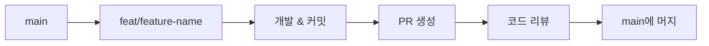

# 📝 Git 가이드

> 이 문서는 프로젝트의 Git 커밋 규칙과 브랜치 전략을 정의합니다.

## 커밋 메시지 형식

### 기본 구조

```
type(scope): subject

body (선택)

footer (선택)
```

### Type 종류

| Type       | 설명                         | 예시                                          |
| ---------- | ---------------------------- | --------------------------------------------- |
| `feat`     | 새로운 기능 추가             | `feat(post): add reading time calculation`    |
| `fix`      | 버그 수정                    | `fix(contact): resolve form validation error` |
| `docs`     | 문서 수정                    | `docs(readme): update installation guide`     |
| `style`    | 코드 포맷팅 (기능 변경 없음) | `style: apply prettier formatting`            |
| `refactor` | 코드 리팩토링                | `refactor(header): simplify navigation logic` |
| `test`     | 테스트 추가/수정             | `test(button): add click handler tests`       |
| `chore`    | 빌드, 설정 변경              | `chore: update eslint config`                 |
| `perf`     | 성능 개선                    | `perf(image): optimize lazy loading`          |

### Scope (범위)

Scope는 변경된 영역을 나타냅니다:

| Scope     | 설명             |
| --------- | ---------------- |
| `post`    | 포스트 관련 기능 |
| `contact` | Contact 폼       |
| `about`   | About 페이지     |
| `header`  | 헤더 위젯        |
| `footer`  | 푸터 위젯        |
| `theme`   | 테마/다크모드    |
| `i18n`    | 국제화           |
| `mdx`     | MDX 렌더링       |
| `config`  | 설정 파일        |
| `deps`    | 의존성           |

### Subject (제목)

- 50자 이내
- 한국어로 작성
- 타입, 범위는 영어로 작성
- 현재형 동사로 시작 (`add`, `fix`, `update`, `remove`)
- 마침표 없음

### 예시

```bash
# ✅ Good
feat(post): add tag filtering feature
fix(contact): resolve email validation error
docs(readme): update development setup guide
refactor(header): extract navigation to separate component
test(button): add accessibility tests
chore(deps): update next.js to 16.0.7

# ❌ Bad
update code                    # type 없음, 설명 부족
fix bug                        # scope 없음, 설명 부족
feat: Added new feature.       # 과거형, 마침표
FEAT(POST): ADD FEATURE        # 대문자
```

### Body (본문)

복잡한 변경의 경우 본문에 상세 설명을 추가합니다:
한국어로 작성합니다
최대한 간결하게 작성합니다

```bash
feat(theme): 다크 모드 토글 추가

- Zustand 스토어를 사용한 ThemeProvider 추가
- localStorage 지속성 구현
- 시스템 테마 감지 기능 추가
- Header에 토글 버튼 추가

Closes #123
```

## 브랜치 전략

### 브랜치 명명 규칙

```
type/description
```

| Type        | 용도        | 예시                        |
| ----------- | ----------- | --------------------------- |
| `feat/`     | 새 기능     | `feat/dark-mode`            |
| `fix/`      | 버그 수정   | `fix/contact-validation`    |
| `docs/`     | 문서 작업   | `docs/api-guide`            |
| `refactor/` | 리팩토링    | `refactor/header-component` |
| `test/`     | 테스트 추가 | `test/e2e-contact`          |

### 워크플로우



### 예시 워크플로우

```bash
# 1. main에서 새 브랜치 생성
git checkout main
git pull origin main
git checkout -b feat/dark-mode

# 2. 개발 및 커밋
git add .
git commit -m "feat(theme): add dark mode toggle"

# 3. 추가 작업
git add .
git commit -m "feat(theme): add localStorage persistence"

# 4. 푸시 및 PR 생성
git push origin feat/dark-mode
# GitHub에서 PR 생성

# 5. 머지 후 정리
git checkout main
git pull origin main
git branch -d feat/dark-mode
```

## Husky Pre-commit

커밋 시 자동으로 다음 검사가 실행됩니다:

```bash
# .husky/pre-commit
pnpm lint-staged
```

### lint-staged 설정

```typescript
// lint-staged.config.ts
export default {
  '*.{ts,tsx}': ['eslint --fix', 'prettier --write'],
  '*.{json,md,css}': ['prettier --write'],
};
```

### Pre-commit 우회 (비권장)

긴급한 경우에만 사용:

```bash
git commit -m "fix: urgent hotfix" --no-verify
```

## 커밋 규칙

### 한 커밋 = 한 변경사항

```bash
# ❌ Bad - 여러 변경사항을 하나의 커밋에
git commit -m "feat: add dark mode and fix contact form and update docs"

# ✅ Good - 각각 별도 커밋
git commit -m "feat(theme): add dark mode toggle"
git commit -m "fix(contact): resolve validation error"
git commit -m "docs(readme): update setup guide"
```

### 의미 있는 커밋 단위

```bash
# ❌ Bad - 너무 작은 단위
git commit -m "feat: add button"
git commit -m "feat: add button styles"
git commit -m "feat: add button click handler"

# ✅ Good - 기능 단위
git commit -m "feat(ui): add Button component with variants"
```

### WIP 커밋 정리

작업 중 커밋은 머지 전에 squash합니다:

```bash
# 최근 3개 커밋을 하나로 합치기
git rebase -i HEAD~3

# 에디터에서:
pick abc1234 feat(theme): add dark mode toggle
squash def5678 wip: add styles
squash ghi9012 wip: fix bug
```

## 자주 사용하는 Git 명령어

### 기본 명령어

```bash
# 상태 확인
git status

# 변경사항 확인
git diff

# 스테이징
git add .
git add src/features/post/

# 커밋
git commit -m "type(scope): message"

# 푸시
git push origin branch-name
```

### 브랜치 관리

```bash
# 브랜치 목록
git branch -a

# 브랜치 생성 및 이동
git checkout -b feat/new-feature

# 브랜치 삭제
git branch -d feat/merged-feature
git branch -D feat/unmerged-feature  # 강제 삭제
```

### 되돌리기

```bash
# 마지막 커밋 수정
git commit --amend -m "new message"

# 스테이징 취소
git reset HEAD file.ts

# 커밋 되돌리기 (새 커밋 생성)
git revert HEAD

# 커밋 되돌리기 (히스토리 수정)
git reset --soft HEAD~1  # 변경사항 유지
git reset --hard HEAD~1  # 변경사항 삭제
```

### 충돌 해결

```bash
# 충돌 발생 시
git status  # 충돌 파일 확인

# 파일 수정 후
git add .
git commit -m "fix: resolve merge conflict"
```

## 관련 문서

- [개발 규칙](./rule.md) - 핵심 개발 원칙
- [코드 스타일 가이드](./code-style.md) - 코드 작성 규칙
- [빠른 시작 가이드](./getting-started.md) - 첫 기여 방법

---

> 📖 전체 문서 목록은 [문서 홈](../README.md)을 참고하세요.
