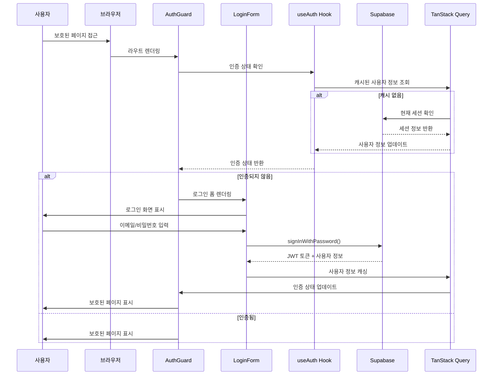
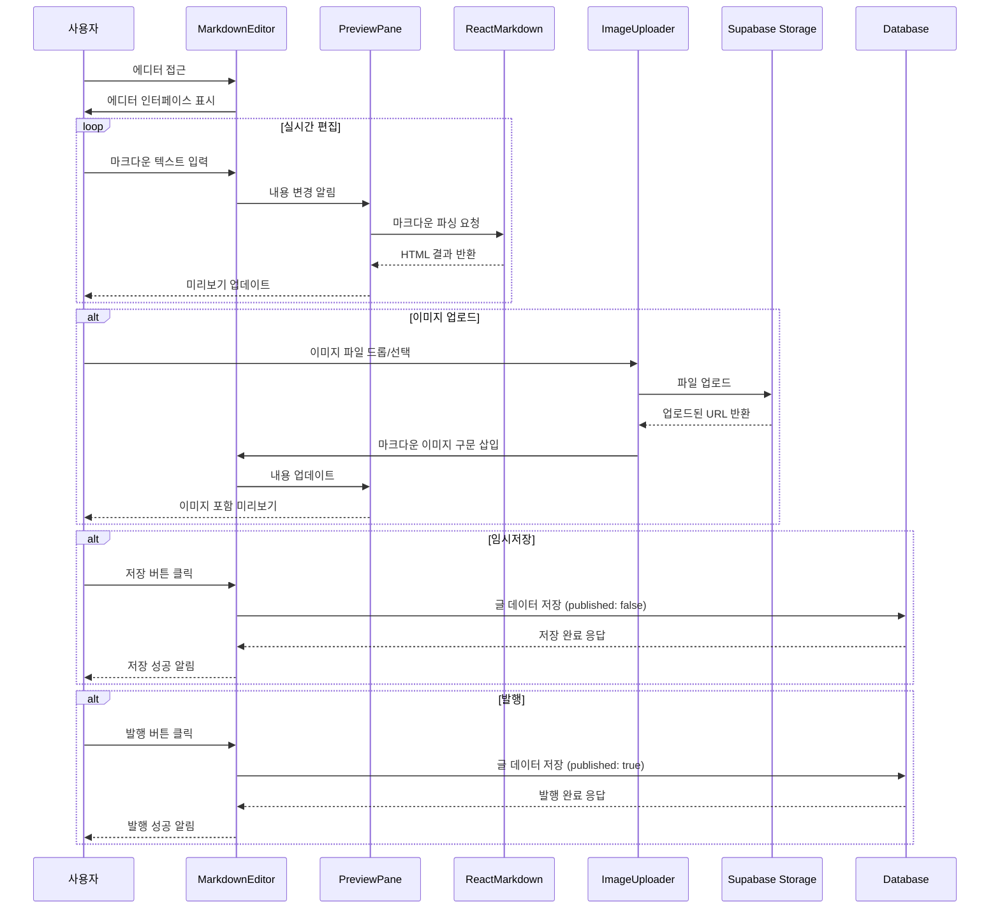
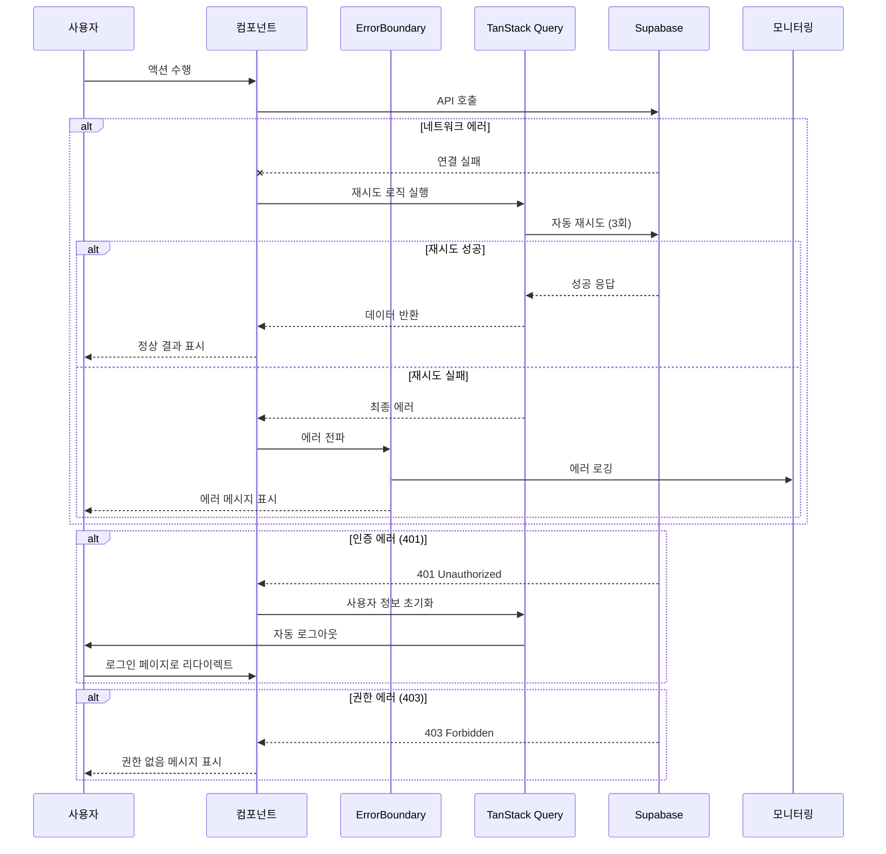
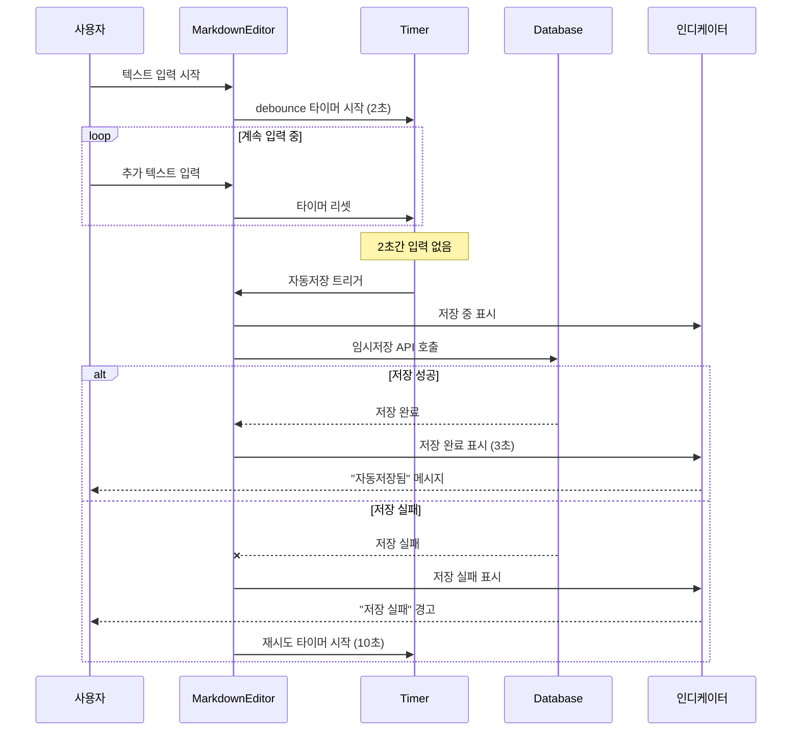
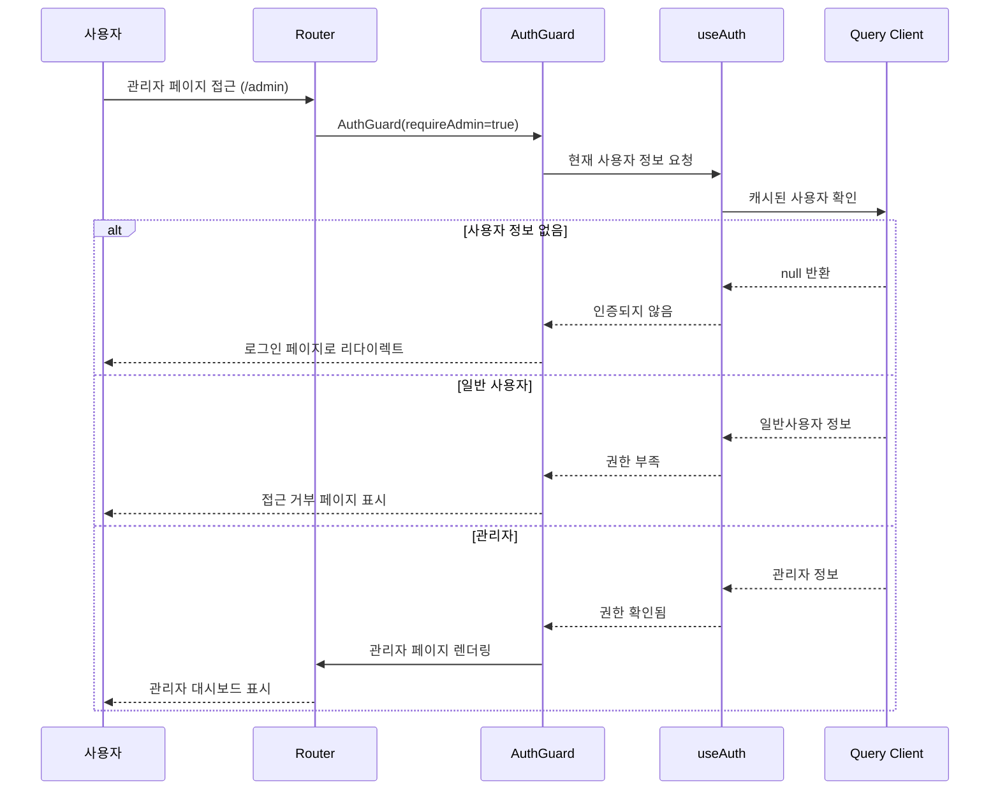
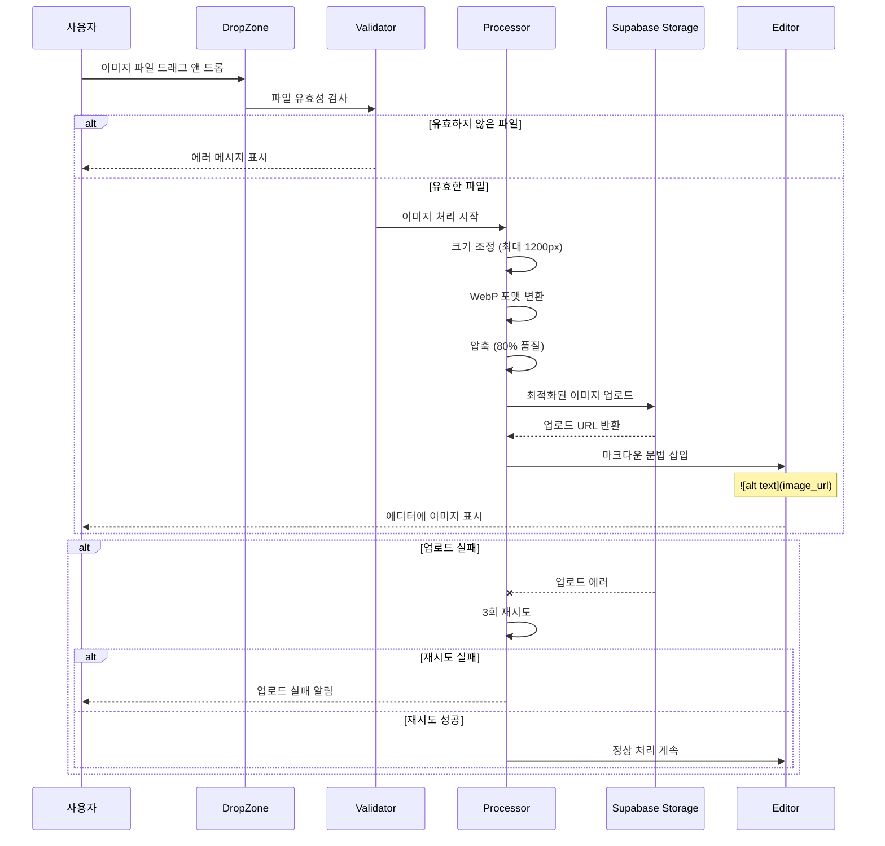
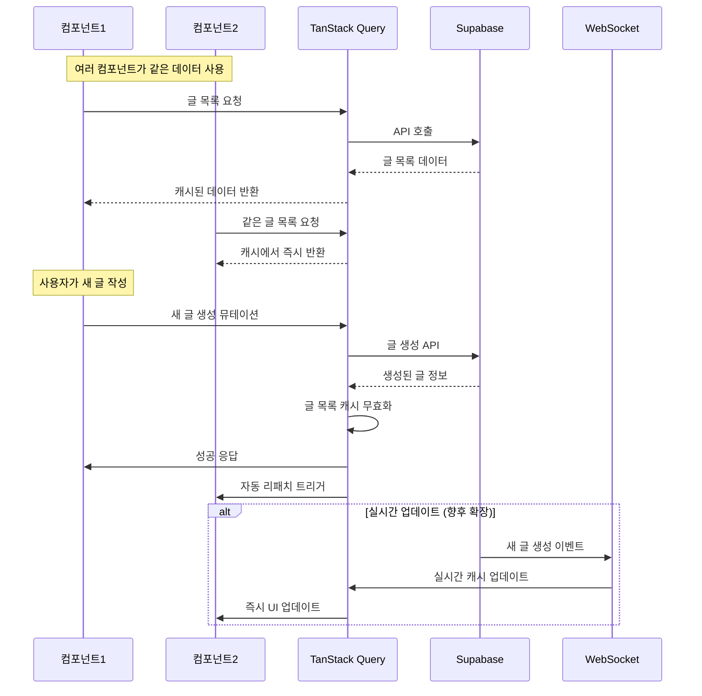
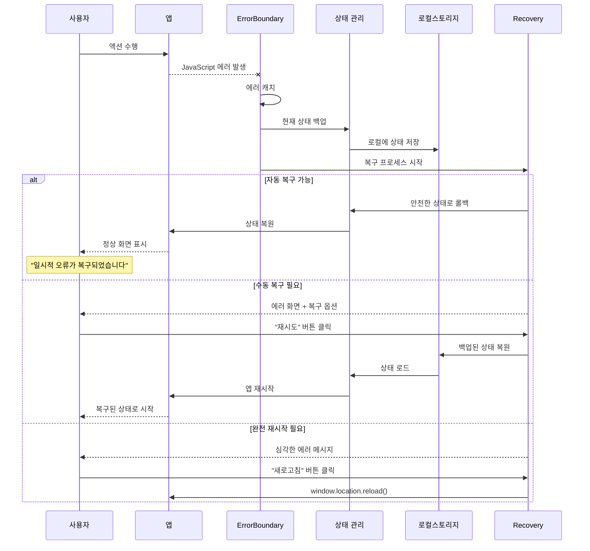

# 시퀀스 다이어그램

## 📊 전체 애플리케이션 플로우

### 1. 사용자 인증 플로우

```mermaid
sequenceDiagram
    participant U as 사용자
    participant B as 브라우저
    participant A as AuthGuard
    participant L as LoginForm
    participant H as useAuth Hook
    participant S as Supabase
    participant Q as TanStack Query

    U->>B: 보호된 페이지 접근
    B->>A: 라우트 렌더링
    A->>H: 인증 상태 확인
    H->>Q: 캐시된 사용자 정보 조회

    alt 캐시 없음
        Q->>S: 현재 세션 확인
        S-->>Q: 세션 정보 반환
        Q-->>H: 사용자 정보 업데이트
    end

    H-->>A: 인증 상태 반환

    alt 인증되지 않음
        A->>L: 로그인 폼 렌더링
        L->>U: 로그인 화면 표시
        U->>L: 이메일/비밀번호 입력
        L->>S: signInWithPassword()
        S-->>L: JWT 토큰 + 사용자 정보
        L->>Q: 사용자 정보 캐싱
        Q->>A: 인증 상태 업데이트
        A->>U: 보호된 페이지 표시
    else 인증됨
        A->>U: 보호된 페이지 표시
    end
```

### 2. 마크다운 에디터 플로우

```mermaid
sequenceDiagram
    participant U as 사용자
    participant E as MarkdownEditor
    participant P as PreviewPane
    participant R as ReactMarkdown
    participant I as ImageUploader
    participant S as Supabase Storage
    participant D as Database

    U->>E: 에디터 접근
    E->>U: 에디터 인터페이스 표시

    loop 실시간 편집
        U->>E: 마크다운 텍스트 입력
        E->>P: 내용 변경 알림
        P->>R: 마크다운 파싱 요청
        R-->>P: HTML 결과 반환
        P-->>U: 미리보기 업데이트
    end

    alt 이미지 업로드
        U->>I: 이미지 파일 드롭/선택
        I->>S: 파일 업로드
        S-->>I: 업로드된 URL 반환
        I->>E: 마크다운 이미지 구문 삽입
        E->>P: 내용 업데이트
        P-->>U: 이미지 포함 미리보기
    end

    alt 임시저장
        U->>E: 저장 버튼 클릭
        E->>D: 글 데이터 저장 (published: false)
        D-->>E: 저장 완료 응답
        E-->>U: 저장 성공 알림
    end

    alt 발행
        U->>E: 발행 버튼 클릭
        E->>D: 글 데이터 저장 (published: true)
        D-->>E: 발행 완료 응답
        E-->>U: 발행 성공 알림
    end
```

### 3. 에러 처리 플로우

```mermaid
sequenceDiagram
    participant U as 사용자
    participant C as 컴포넌트
    participant E as ErrorBoundary
    participant Q as TanStack Query
    participant S as Supabase
    participant M as 모니터링

    U->>C: 액션 수행
    C->>S: API 호출

    alt 네트워크 에러
        S--xC: 연결 실패
        C->>Q: 재시도 로직 실행
        Q->>S: 자동 재시도 (3회)

        alt 재시도 성공
            S-->>Q: 성공 응답
            Q-->>C: 데이터 반환
            C-->>U: 정상 결과 표시
        else 재시도 실패
            Q-->>C: 최종 에러
            C->>E: 에러 전파
            E->>M: 에러 로깅
            E-->>U: 에러 메시지 표시
        end
    end

    alt 인증 에러 (401)
        S-->>C: 401 Unauthorized
        C->>Q: 사용자 정보 초기화
        Q->>U: 자동 로그아웃
        U->>C: 로그인 페이지로 리다이렉트
    end

    alt 권한 에러 (403)
        S-->>C: 403 Forbidden
        C-->>U: 권한 없음 메시지 표시
    end
```

### 4. 자동저장 플로우

```mermaid
sequenceDiagram
    participant U as 사용자
    participant E as MarkdownEditor
    participant T as Timer
    participant D as Database
    participant I as 인디케이터

    U->>E: 텍스트 입력 시작
    E->>T: debounce 타이머 시작 (2초)

    loop 계속 입력 중
        U->>E: 추가 텍스트 입력
        E->>T: 타이머 리셋
    end

    Note over T: 2초간 입력 없음

    T->>E: 자동저장 트리거
    E->>I: 저장 중 표시
    E->>D: 임시저장 API 호출

    alt 저장 성공
        D-->>E: 저장 완료
        E->>I: 저장 완료 표시 (3초)
        I-->>U: "자동저장됨" 메시지
    else 저장 실패
        D--xE: 저장 실패
        E->>I: 저장 실패 표시
        I-->>U: "저장 실패" 경고
        E->>T: 재시도 타이머 시작 (10초)
    end
```

### 5. 권한 기반 라우팅 플로우

```mermaid
sequenceDiagram
    participant U as 사용자
    participant R as Router
    participant A as AuthGuard
    participant H as useAuth
    participant Q as Query Client

    U->>R: 관리자 페이지 접근 (/admin)
    R->>A: AuthGuard(requireAdmin=true)
    A->>H: 현재 사용자 정보 요청
    H->>Q: 캐시된 사용자 확인

    alt 사용자 정보 없음
        Q-->>H: null 반환
        H-->>A: 인증되지 않음
        A-->>U: 로그인 페이지로 리다이렉트
    else 일반 사용자
        Q-->>H: 일반사용자 정보
        H-->>A: 권한 부족
        A-->>U: 접근 거부 페이지 표시
    else 관리자
        Q-->>H: 관리자 정보
        H-->>A: 권한 확인됨
        A->>R: 관리자 페이지 렌더링
        R-->>U: 관리자 대시보드 표시
    end
```

### 6. 이미지 업로드 플로우

```mermaid
sequenceDiagram
    participant U as 사용자
    participant D as DropZone
    participant V as Validator
    participant P as Processor
    participant S as Supabase Storage
    participant E as Editor

    U->>D: 이미지 파일 드래그 앤 드롭
    D->>V: 파일 유효성 검사

    alt 유효하지 않은 파일
        V-->>U: 에러 메시지 표시
    else 유효한 파일
        V->>P: 이미지 처리 시작
        P->>P: 크기 조정 (최대 1200px)
        P->>P: WebP 포맷 변환
        P->>P: 압축 (80% 품질)

        P->>S: 최적화된 이미지 업로드
        S-->>P: 업로드 URL 반환

        P->>E: 마크다운 문법 삽입
        Note over E: ![alt text](image_url)

        E-->>U: 에디터에 이미지 표시
    end

    alt 업로드 실패
        S--xP: 업로드 에러
        P->>P: 3회 재시도

        alt 재시도 실패
            P-->>U: 업로드 실패 알림
        else 재시도 성공
            P->>E: 정상 처리 계속
        end
    end
```

### 7. 상태 동기화 플로우

```mermaid
sequenceDiagram
    participant C1 as 컴포넌트1
    participant C2 as 컴포넌트2
    participant Q as TanStack Query
    participant S as Supabase
    participant W as WebSocket

    Note over C1,C2: 여러 컴포넌트가 같은 데이터 사용

    C1->>Q: 글 목록 요청
    Q->>S: API 호출
    S-->>Q: 글 목록 데이터
    Q-->>C1: 캐시된 데이터 반환

    C2->>Q: 같은 글 목록 요청
    Q-->>C2: 캐시에서 즉시 반환

    Note over C1: 사용자가 새 글 작성

    C1->>Q: 새 글 생성 뮤테이션
    Q->>S: 글 생성 API
    S-->>Q: 생성된 글 정보

    Q->>Q: 글 목록 캐시 무효화
    Q->>C1: 성공 응답
    Q->>C2: 자동 리패치 트리거

    alt 실시간 업데이트 (향후 확장)
        S->>W: 새 글 생성 이벤트
        W->>Q: 실시간 캐시 업데이트
        Q->>C2: 즉시 UI 업데이트
    end
```

### 8. 에러 복구 플로우

```mermaid
sequenceDiagram
    participant U as 사용자
    participant A as 앱
    participant E as ErrorBoundary
    participant S as 상태 관리
    participant L as 로컬스토리지
    participant R as Recovery

    U->>A: 액션 수행
    A--xE: JavaScript 에러 발생
    E->>E: 에러 캐치
    E->>S: 현재 상태 백업
    S->>L: 로컬에 상태 저장

    E->>R: 복구 프로세스 시작

    alt 자동 복구 가능
        R->>S: 안전한 상태로 롤백
        S->>A: 상태 복원
        A-->>U: 정상 화면 표시
        Note over U: "일시적 오류가 복구되었습니다"
    else 수동 복구 필요
        R-->>U: 에러 화면 + 복구 옵션
        U->>R: "재시도" 버튼 클릭
        R->>L: 백업된 상태 복원
        L->>S: 상태 로드
        S->>A: 앱 재시작
        A-->>U: 복구된 상태로 시작
    else 완전 재시작 필요
        R-->>U: 심각한 에러 메시지
        U->>R: "새로고침" 버튼 클릭
        R->>A: window.location.reload()
    end
```