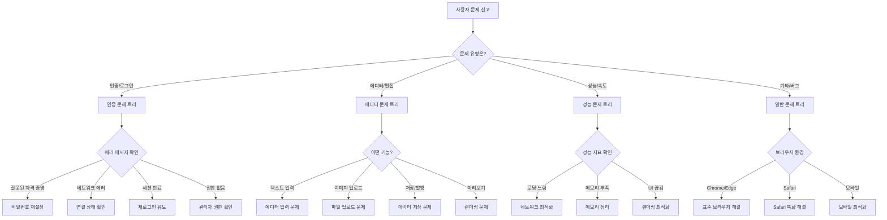
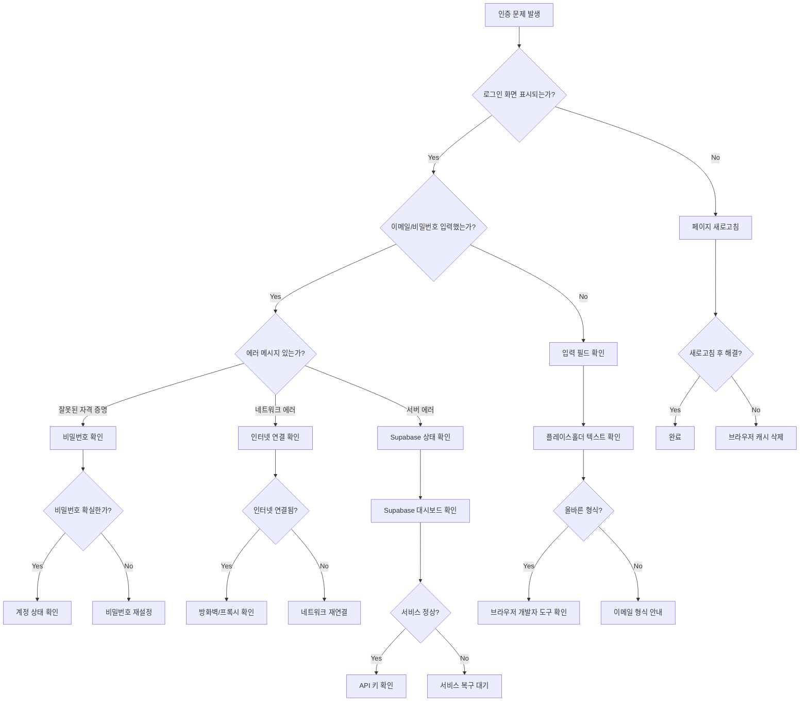
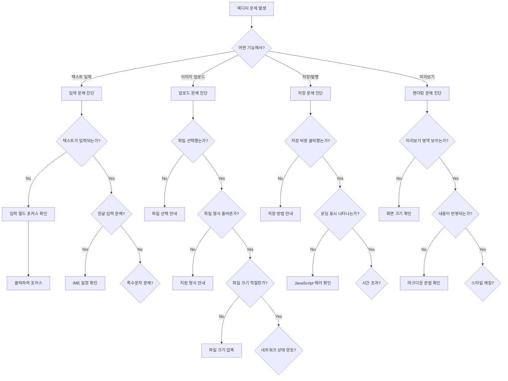
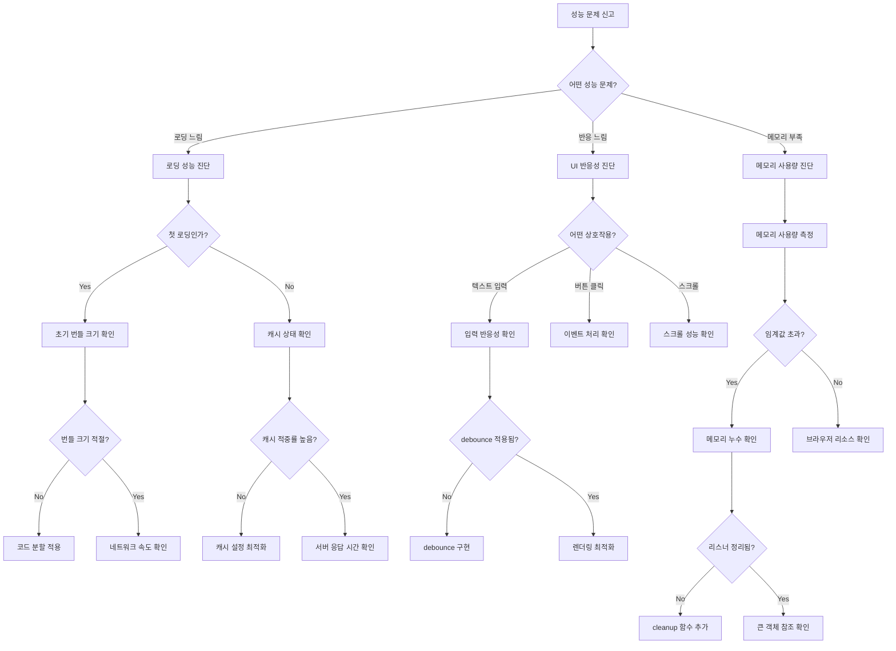

# 문제 해결 가이드

## 🧭 의사 결정 트리

### 메인 문제 분류 트리



### 인증 문제 해결 트리



### 에디터 문제 해결 트리



### 성능 문제 해결 트리



## 🔧 단계별 해결 가이드

### 1단계: 기본 진단

#### 환경 확인 체크리스트
```bash
# 브라우저 정보
console.log('User Agent:', navigator.userAgent);
console.log('Online:', navigator.onLine);
console.log('Language:', navigator.language);

# 로컬 스토리지 상태
console.log('LocalStorage 항목:', Object.keys(localStorage));
console.log('SessionStorage 항목:', Object.keys(sessionStorage));

# Supabase 연결 상태
const { data } = await supabase.auth.getSession();
console.log('Supabase 세션:', data.session ? '활성' : '비활성');
```

#### 네트워크 진단
```javascript
// 네트워크 상태 확인
const 네트워크진단 = async () => {
  try {
    const response = await fetch('https://api.github.com/zen', {
      method: 'GET',
      mode: 'cors'
    });
    console.log('네트워크 상태:', response.ok ? '정상' : '불안정');
  } catch (error) {
    console.error('네트워크 연결 실패:', error.message);
  }
};
```

### 2단계: 컴포넌트별 진단

#### 인증 컴포넌트 진단
```typescript
const 인증진단도구 = {
  현재상태확인: () => {
    const { 사용자, 로딩중, 인증됨 } = useAuth();
    console.table({ 사용자: !!사용자, 로딩중, 인증됨 });
  },

  세션확인: async () => {
    const { data, error } = await supabase.auth.getSession();
    console.log('세션 데이터:', data);
    console.log('세션 에러:', error);
  },

  토큰확인: async () => {
    const { data } = await supabase.auth.getUser();
    console.log('토큰 유효성:', data.user ? '유효' : '무효');
  }
};
```

#### 에디터 컴포넌트 진단
```typescript
const 에디터진단도구 = {
  상태확인: (에디터상태) => {
    console.table({
      내용길이: 에디터상태.마크다운내용.length,
      변경사항: 에디터상태.변경사항있음,
      자동저장중: 에디터상태.자동저장중,
      마지막저장: 에디터상태.마지막저장시간
    });
  },

  마크다운파싱테스트: (내용) => {
    try {
      // ReactMarkdown 렌더링 테스트
      const div = document.createElement('div');
      ReactDOM.render(<ReactMarkdown>{내용}</ReactMarkdown>, div);
      console.log('마크다운 파싱: 성공');
    } catch (error) {
      console.error('마크다운 파싱 실패:', error);
    }
  },

  이미지업로드테스트: async (file) => {
    try {
      const result = await supabase.storage
        .from('blog-images')
        .upload(`test-${Date.now()}.jpg`, file);
      console.log('이미지 업로드:', result.error ? '실패' : '성공');
    } catch (error) {
      console.error('업로드 에러:', error);
    }
  }
};
```

### 3단계: 자동 복구 시도

#### 캐시 정리
```typescript
const 캐시정리 = () => {
  // TanStack Query 캐시 정리
  queryClient.clear();

  // 브라우저 캐시 정리
  if ('caches' in window) {
    caches.keys().then(names => {
      names.forEach(name => caches.delete(name));
    });
  }

  // 로컬 스토리지 정리 (민감하지 않은 데이터만)
  const 보존목록 = ['supabase.auth.token'];
  Object.keys(localStorage).forEach(key => {
    if (!보존목록.some(item => key.includes(item))) {
      localStorage.removeItem(key);
    }
  });
};
```

#### 상태 재초기화
```typescript
const 상태재초기화 = async () => {
  // 인증 상태 재확인
  const { data } = await supabase.auth.refreshSession();
  if (data.session) {
    queryClient.setQueryData(['현재사용자'], data.user);
  }

  // 에디터 상태 초기화
  set에디터상태({
    현재글: null,
    마크다운내용: '',
    변경사항있음: false,
    자동저장중: false,
  });

  // 컴포넌트 강제 리렌더링
  window.location.reload();
};
```

### 4단계: 고급 진단

#### 성능 프로파일링
```typescript
const 성능프로파일링 = {
  메모리사용량: () => {
    if ('memory' in performance) {
      const memory = (performance as any).memory;
      return {
        사용중: `${(memory.usedJSHeapSize / 1048576).toFixed(2)}MB`,
        전체: `${(memory.totalJSHeapSize / 1048576).toFixed(2)}MB`,
        한계: `${(memory.jsHeapSizeLimit / 1048576).toFixed(2)}MB`,
        사용률: `${((memory.usedJSHeapSize / memory.jsHeapSizeLimit) * 100).toFixed(1)}%`
      };
    }
    return null;
  },

  렌더링성능: () => {
    let 프레임카운트 = 0;
    const 시작시간 = performance.now();

    const 측정 = () => {
      프레임카운트++;
      const 경과시간 = performance.now() - 시작시간;

      if (경과시간 >= 1000) {
        const fps = Math.round((프레임카운트 * 1000) / 경과시간);
        console.log(`FPS: ${fps}`);
        return fps;
      }

      requestAnimationFrame(측정);
    };

    requestAnimationFrame(측정);
  },

  번들크기분석: () => {
    const 스크립트들 = Array.from(document.querySelectorAll('script[src]'));
    스크립트들.forEach(script => {
      fetch(script.src, { method: 'HEAD' })
        .then(response => {
          const 크기 = response.headers.get('content-length');
          console.log(`${script.src}: ${크기 ? `${(parseInt(크기) / 1024).toFixed(1)}KB` : '알 수 없음'}`);
        });
    });
  }
};
```

#### 에러 로깅 시스템
```typescript
const 에러로깅시스템 = {
  설정: {
    최대로그수: 100,
    로그레벨: ['error', 'warn', 'info'],
    자동전송: true
  },

  로그저장소: [] as Array<{
    시간: string;
    레벨: string;
    메시지: string;
    스택: string;
    브라우저정보: string;
  }>,

  로그추가: function(레벨: string, 메시지: string, 에러?: Error) {
    const 로그항목 = {
      시간: new Date().toISOString(),
      레벨,
      메시지,
      스택: 에러?.stack || '',
      브라우저정보: navigator.userAgent
    };

    this.로그저장소.push(로그항목);

    // 최대 개수 초과 시 오래된 로그 제거
    if (this.로그저장소.length > this.설정.최대로그수) {
      this.로그저장소.shift();
    }

    // 자동 전송 (실제 구현에서는 외부 서비스로)
    if (this.설정.자동전송 && 레벨 === 'error') {
      this.에러전송(로그항목);
    }
  },

  에러전송: async function(로그항목: any) {
    try {
      // 실제 구현에서는 Sentry, LogRocket 등으로 전송
      console.log('에러 전송:', 로그항목);
    } catch (error) {
      console.error('에러 전송 실패:', error);
    }
  },

  로그내보내기: function() {
    const 데이터 = JSON.stringify(this.로그저장소, null, 2);
    const blob = new Blob([데이터], { type: 'application/json' });
    const url = URL.createObjectURL(blob);

    const a = document.createElement('a');
    a.href = url;
    a.download = `error-logs-${new Date().toISOString().split('T')[0]}.json`;
    document.body.appendChild(a);
    a.click();
    document.body.removeChild(a);
    URL.revokeObjectURL(url);
  }
};

// 전역 에러 핸들러 등록
window.addEventListener('error', (event) => {
  에러로깅시스템.로그추가('error', event.message, event.error);
});

window.addEventListener('unhandledrejection', (event) => {
  에러로깅시스템.로그추가('error', `Promise 거부: ${event.reason}`);
});
```

## 📞 에스컬레이션 가이드

### 문제 심각도 분류

#### P0: 치명적 (즉시 대응)
- 애플리케이션 전체 다운
- 데이터 손실 발생
- 보안 취약점 발견

**대응 절차:**
1. 즉시 서비스 중단 (필요시)
2. 기술팀 긴급 소집
3. 임시 해결책 적용
4. 사용자 공지

#### P1: 중요 (2시간 내 대응)
- 주요 기능 작동 불가
- 다수 사용자 영향
- 성능 심각한 저하

**대응 절차:**
1. 문제 범위 파악
2. 임시 우회 방법 제공
3. 수정 계획 수립
4. 정기 업데이트 제공

#### P2: 보통 (24시간 내 대응)
- 일부 기능 문제
- 소수 사용자 영향
- 사용성 불편

**대응 절차:**
1. 문제 재현 및 분석
2. 해결 우선순위 결정
3. 다음 릴리스에 포함

#### P3: 낮음 (주간 대응)
- 개선 요청
- 마이너 버그
- 문서 오류

### 연락처 및 도구

```typescript
const 지원도구 = {
  브라우저콘솔: {
    설명: '개발자 도구 콘솔에서 진단 명령 실행',
    단축키: 'F12 또는 Ctrl+Shift+I',
    명령어: [
      '인증진단도구.현재상태확인()',
      '에디터진단도구.상태확인(에디터상태)',
      '성능프로파일링.메모리사용량()',
      '에러로깅시스템.로그내보내기()'
    ]
  },

  원격진단: {
    설명: '원격으로 사용자 환경 진단',
    접근방법: 'Chrome DevTools Protocol',
    필요권한: '사용자 동의 후 임시 접근'
  },

  로그수집: {
    설명: '자동 에러 로그 수집 시스템',
    저장위치: 'Supabase 로그 테이블',
    보관기간: '30일'
  }
};
```

## 📚 FAQ

### Q: 로그인 후 바로 로그아웃되는 경우
**A:** 세션 쿠키 설정 문제일 가능성이 높습니다.

```javascript
// 해결 방법
1. 브라우저 쿠키 설정 확인
2. 사이트 데이터 삭제 후 재시도
3. 시크릿 모드에서 테스트
4. 브라우저 업데이트 확인
```

### Q: 이미지 업로드가 안 되는 경우
**A:** 파일 크기, 형식, 네트워크 상태를 순서대로 확인하세요.

```javascript
// 진단 명령
console.log('파일 크기:', file.size, '(최대: 5MB)');
console.log('파일 형식:', file.type, '(허용: image/*)');
navigator.onLine && console.log('네트워크 연결됨');
```

### Q: 미리보기가 업데이트되지 않는 경우
**A:** React 상태 업데이트 문제일 수 있습니다.

```javascript
// 강제 리렌더링
setMarkdownContent(prev => prev + ' ');
setTimeout(() => setMarkdownContent(prev => prev.slice(0, -1)), 0);
```

### Q: 자동저장이 작동하지 않는 경우
**A:** debounce 타이머와 네트워크 상태를 확인하세요.

```javascript
// 수동 저장 테스트
handle저장(); // 즉시 저장 시도
console.log('마지막 자동저장:', 마지막저장시간);
```

이 가이드를 통해 대부분의 문제를 체계적으로 해결할 수 있으며, 복잡한 문제의 경우 단계별 에스컬레이션을 통해 신속한 해결이 가능합니다.