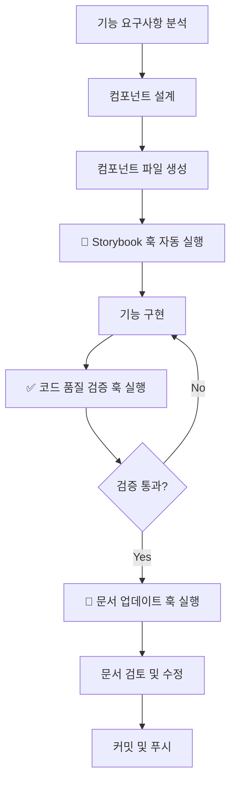

# Agent Hooks 사용 가이드

이 문서는 프로젝트에 설정된 Kiro Agent Hooks의 사용 방법을 설명합니다.

## 개요

Agent Hooks는 개발 워크플로우를 자동화하여 생산성을 높이고 코드 품질을 유지하는 도구입니다.

## 설치된 훅

### 1. 🎨 Auto Storybook Story Generator

**목적**: 컴포넌트 문서화 자동화

**작동 방식**:

- 새 컴포넌트 파일 생성 감지
- Props 인터페이스 자동 분석
- Storybook 스토리 파일 자동 생성
- FSD 레이어에 맞는 경로 설정

**사용 예시**:

```typescript
// 1. 새 컴포넌트 생성
// src/shared/ui/badge.tsx

interface BadgeProps {
  variant?: 'default' | 'success' | 'warning' | 'error';
  children: React.ReactNode;
}

export function Badge({ variant = 'default', children }: BadgeProps) {
  return <span className={`badge badge-${variant}`}>{children}</span>;
}
```

```typescript
// 2. 자동 생성되는 스토리 파일
// src/shared/ui/badge.stories.tsx

import type { Meta, StoryObj } from '@storybook/react';
import { Badge } from './badge';

const meta = {
  title: 'UI/Badge',
  component: Badge,
  tags: ['autodocs'],
  argTypes: {
    variant: {
      control: 'select',
      options: ['default', 'success', 'warning', 'error'],
    },
  },
} satisfies Meta<typeof Badge>;

export default meta;
type Story = StoryObj<typeof meta>;

export const Default: Story = {
  args: {
    children: 'Default Badge',
    variant: 'default',
  },
};

export const Success: Story = {
  args: {
    children: 'Success Badge',
    variant: 'success',
  },
};

// ... 추가 스토리
```

**장점**:

- 컴포넌트 문서화 누락 방지
- 일관된 스토리 구조
- 개발 시간 단축

---

### 2. ✅ Code Quality Check Hook

**목적**: 커밋 전 코드 품질 보장

**실행 단계**:

1. **Prettier 포맷팅**

   ```bash
   pnpm fmt
   ```

   - 코드 스타일 통일
   - 자동 포맷팅 적용

2. **ESLint 검증**

   ```bash
   pnpm lint
   ```

   - 코드 품질 규칙 검증
   - 잠재적 버그 탐지
   - 베스트 프랙티스 준수 확인

3. **TypeScript 타입 체크**

   ```bash
   pnpm tsc --noEmit
   ```

   - 타입 안정성 검증
   - 타입 에러 탐지

4. **테스트 실행** (선택적)

   ```bash
   pnpm test:run
   ```

   - 유닛 테스트 실행
   - 회귀 버그 방지

**출력 예시**:

```
✅ 코드 품질 검증 완료

📊 검증 결과:
  ✅ Prettier: 통과 (3개 파일 포맷팅됨)
  ✅ ESLint: 통과 (0 에러, 2 경고)
  ✅ TypeScript: 통과 (0 에러)
  ✅ Tests: 통과 (24/24 테스트)

🎉 모든 검증을 통과했습니다! 커밋 준비가 완료되었습니다.
```

**권장 사용 시점**:

- 커밋 전 (필수)
- Pull Request 생성 전
- 코드 리뷰 요청 전
- 배포 전

---

### 3. 📝 Auto Documentation Update Hook

**목적**: 문서 일관성 유지 및 자동화

**분석 대상**:

- 최근 5개 커밋의 변경사항
- 추가/수정/삭제된 파일
- 변경 유형 (기능 추가, 버그 수정, 리팩토링 등)

**업데이트 문서**:

#### changelog.md

```markdown
## [2025-12-09]

### 추가

- 다크 모드 토글 버튼 UI 구현
- Zustand 기반 테마 상태 관리

### 수정

- Header 컴포넌트 반응형 디자인 개선
- 언어 전환 버튼 스타일 업데이트

### 버그 수정

- 다크 모드 전환 시 깜빡임 현상 수정
```

#### todo.md

```markdown
변경 전:

- [ ] 다크 모드 토글 버튼 UI
- [ ] Zustand로 상태 관리

변경 후:

- [x] 다크 모드 토글 버튼 UI (2025-12-09 완료)
- [x] Zustand로 상태 관리 (2025-12-09 완료)
```

#### architecture.md

```markdown
### 주요 기술 결정

#### 5. 다크 모드 구현

**결정**: Zustand + Tailwind dark: 클래스 조합

**이유**:

- 경량 상태 관리
- LocalStorage 영속성
- 시스템 설정 자동 감지
- SSR 호환성
```

**사용 워크플로우**:

```bash
# 1. 기능 구현
git add .
git commit -m "feat(theme): add dark mode toggle"

# 2. 문서 업데이트 훅 실행
# Kiro → Agent Hooks → Auto Documentation Update

# 3. 업데이트된 문서 검토
git diff docs/

# 4. 문서와 함께 커밋
git add docs/
git commit -m "docs: update documentation for dark mode"
```

---

## 통합 워크플로우

### 새 기능 개발 전체 프로세스



### 단계별 상세 가이드

#### Step 1: 컴포넌트 생성

```bash
# 새 컴포넌트 파일 생성
touch src/features/search/ui/search-input.tsx
```

#### Step 2: Storybook 자동 생성

- Kiro가 자동으로 감지하여 스토리 생성 프롬프트 표시
- 또는 수동 실행: Agent Hooks → Auto Storybook

#### Step 3: 기능 구현

```typescript
// src/features/search/ui/search-input.tsx
export function SearchInput({ onSearch }: SearchInputProps) {
  // 구현...
}
```

#### Step 4: 코드 품질 검증

```bash
# Kiro Agent Hooks → Code Quality Check
# 또는 수동 실행:
pnpm fmt
pnpm lint
pnpm tsc --noEmit
pnpm test:run
```

#### Step 5: 문서 업데이트

```bash
# Kiro Agent Hooks → Auto Documentation Update
# 자동으로 다음 문서 업데이트:
# - docs/changelog.md
# - docs/todo.md
# - docs/architecture.md
```

#### Step 6: 커밋

```bash
git add .
git commit -m "feat(search): add search input component"
git push
```

---

## 베스트 프랙티스

### 1. 컴포넌트 생성 시

✅ **DO**:

- Props 인터페이스를 명확하게 정의
- 컴포넌트 이름을 명확하게 작성
- Export 방식 일관성 유지 (named export 권장)

❌ **DON'T**:

- Props 없이 컴포넌트 생성 (스토리 생성 어려움)
- 너무 복잡한 컴포넌트 (분리 권장)
- page.tsx, layout.tsx에 훅 사용

### 2. 코드 품질 검증 시

✅ **DO**:

- 커밋 전 항상 실행
- 모든 에러 해결 후 커밋
- 경고도 가능한 해결

❌ **DON'T**:

- 검증 실패 상태로 커밋
- 에러를 무시하고 진행
- 테스트 건너뛰기

### 3. 문서 업데이트 시

✅ **DO**:

- 기능 완성 후 즉시 실행
- 자동 생성된 내용 검토
- 필요시 수동으로 보완

❌ **DON'T**:

- 여러 기능 완성 후 한 번에 실행
- 자동 생성 내용 무조건 신뢰
- 문서 업데이트 미루기

---

## 트러블슈팅

### 문제: Storybook 훅이 실행되지 않음

**원인**:

- 파일 패턴 불일치
- 제외 조건에 해당
- Kiro 설정 문제

**해결**:

1. 파일 경로 확인: `src/**/*.tsx`
2. 파일명 확인: `*.test.tsx`, `*.stories.tsx` 제외
3. Kiro 재시작

### 문제: 코드 품질 검증 실패

**원인**:

- ESLint 에러
- TypeScript 타입 에러
- 테스트 실패

**해결**:

1. 에러 메시지 확인
2. 해당 파일 수정
3. 재검증 실행

```bash
# 자동 수정 시도
pnpm lint --fix

# 타입 에러 확인
pnpm tsc --noEmit

# 특정 테스트 실행
pnpm test src/path/to/test.test.tsx
```

### 문제: 문서 업데이트가 부정확함

**원인**:

- Git 히스토리 부족
- 변경사항 분석 오류
- 문서 형식 불일치

**해결**:

1. 커밋 메시지 명확하게 작성
2. 자동 생성 내용 검토 후 수정
3. 필요시 수동으로 문서 업데이트

---

## 고급 사용법

### 훅 커스터마이징

각 훅은 `.kiro/hooks/` 디렉토리의 마크다운 파일로 관리됩니다.

```bash
# 훅 파일 위치
blog/.kiro/hooks/
├── auto-storybook.md
├── code-quality-check.md
├── auto-doc-update.md
└── README.md
```

**수정 방법**:

1. 해당 `.md` 파일 열기
2. 프롬프트 내용 수정
3. 저장 후 Kiro 재시작 (또는 훅 새로고침)

### 새 훅 추가

```markdown
# My Custom Hook

설명

## 트리거 조건

- 이벤트: 파일 저장 시
- 파일 패턴: `src/**/*.ts`

## 실행 프롬프트

실행할 작업...
```

---

## 성능 최적화

### 훅 실행 시간 단축

1. **선택적 테스트 실행**
   - 변경된 파일만 테스트
   - 빠른 테스트 우선 실행

2. **병렬 실행**
   - Lint와 타입 체크 동시 실행
   - 독립적인 검증 병렬화

3. **캐싱 활용**
   - ESLint 캐시 활성화
   - TypeScript 증분 빌드

---

## 참고 자료

- [Kiro Hooks 공식 문서](https://docs.kiro.ai/hooks)
- [개발 규칙](./rule.md)
- [아키텍처](./architecture.md)
- [테스팅 가이드](./testing.md)
- [배포 가이드](./deployment.md)
- [AI 검증 체크리스트](./ai-checklist.md)

---

## 피드백

훅 사용 중 개선 아이디어나 문제점을 발견하면:

1. `.kiro/hooks/` 디렉토리의 해당 파일 수정
2. 팀과 공유하여 워크플로우 개선
3. 문서 업데이트

---

> 📖 전체 문서 목록은 [문서 홈](../README.md)을 참고하세요.
