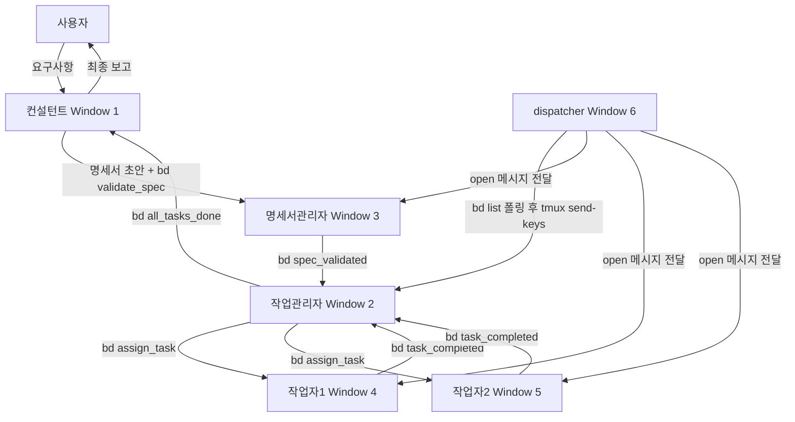
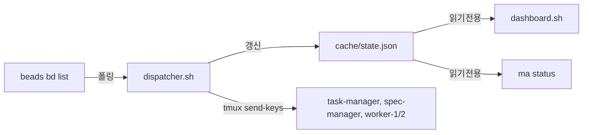
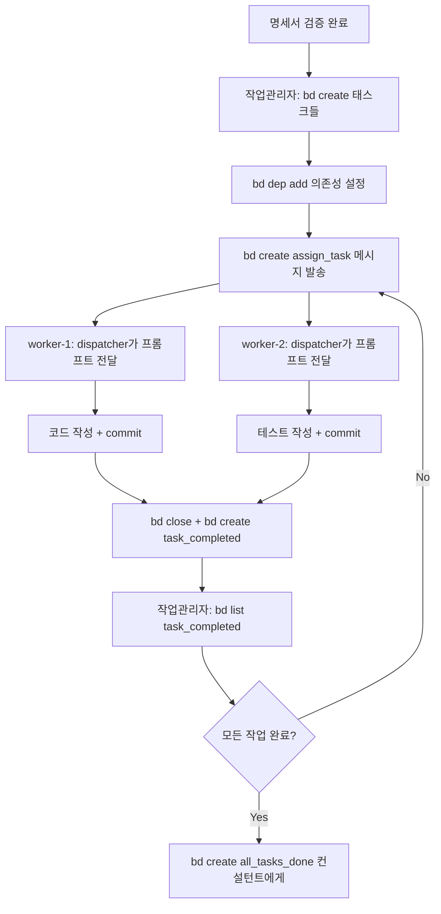
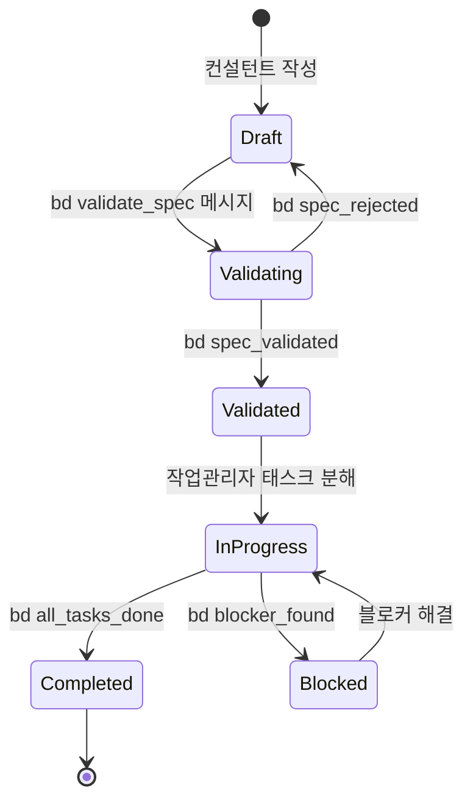

# tmux 기반 멀티 에이전트 시스템 아키텍처

> **버전**: v4.9.0  
> **최종 업데이트**: 2026-03-02  
> **아키텍처 전환**: K8s → tmux 기반 경량 아키텍처  
> **현재 구현**: dispatcher 기반 beads 직접 폴링 + state.json 캐시 (watchman 미사용)

## 📋 목차

- [개요 및 설계 동기](#개요-및-설계-동기)
- [시스템 아키텍처](#시스템-아키텍처)
- [에이전트 역할 상세](#에이전트-역할-상세)
- [통신 모델](#통신-모델)
- [beads 통합](#beads-통합)
- [명세서 시스템](#명세서-시스템)
- [Git 워크플로우](#git-워크플로우)
- [셋업 가이드](#셋업-가이드)
- [마이그레이션 경로](#마이그레이션-경로)
- [문제 해결](#문제-해결)

---

## 개요 및 설계 동기

### v3 → v4 전환 이유

**v3 아키텍처 (K8s 기반)의 문제점:**

1. **오버엔지니어링** — PC 환경에서 K8s + NATS + PostgreSQL은 과도한 인프라
2. **리소스 부족** — 고성능 하드웨어 필요 (메모리, CPU)
3. **복잡도** — 로컬 개발 환경에서 K8s 클러스터 관리 부담
4. **느린 시작** — Pod 생성/삭제 오버헤드

**v4 아키텍처 (tmux 기반)의 장점:**

1. **경량화** — tmux + opencode + beads만 사용
2. **즉시 시작** — 터미널 pane 생성만으로 에이전트 실행
3. **투명성** — 모든 에이전트 동작을 tmux에서 실시간 확인
4. **단순성** — 복잡한 K8s 설정 불필요, beads 메시지 기반 통신

**dispatcher 기반 폴링 (v4.0.0+):**

1. **통일된 인터페이스** — 태스크와 메시지 모두 beads로 관리
2. **파일 시스템 오염 없음** — `.multi-agent/queue/` JSON 파일 제거, `cache/state.json`만 사용
3. **beads LOCK 회피** — dispatcher가 `bd list` 1회 호출 후 state.json 갱신, dashboard/ma status는 state.json만 읽음
4. **중앙 집중형 폴링** — dispatcher.sh가 beads 직접 폴링 → tmux send-keys로 에이전트 pane에 프롬프트 전달

**설계 원칙:**

- ✅ **beads 기반 통신** — 태스크 + 메시지 모두 beads 이슈로 관리
- ✅ **dispatcher 폴링** — 중앙 dispatcher가 bd list로 open 메시지 조회 후 에이전트에 전달
- ✅ **DB 없음** — beads(Dolt 기반 git-backed DB)가 대체
- ✅ **에이전트 간소화** — 4종만 운영 (컨설턴트, 작업관리자, 명세서관리자, 작업자 2명)

### 핵심 컨셉

```
사람 ↔ 컨설턴트 ↔ [작업관리자 + 명세서관리자] ↔ 작업자(2명)
```

- **사람**: 요구사항 입력, 최종 보고 수신
- **컨설턴트**: 요구사항 구체화, 명세서 초안 작성, 최종 보고
- **작업관리자**: 태스크 분해/할당/추적 (beads 핵심 사용자)
- **명세서관리자**: spec 파일 생성/검증, 품질 게이트
- **작업자**: 실제 코드 작성/테스트/리팩토링 (2명 동시 실행)

---

## 시스템 아키텍처

### 진입점

**`ma start`** (또는 `.multi-agent/scripts/ma.sh start`)가 메인 진입점입니다.
`ma start`는 `start.sh`를 호출하여 tmux 세션을 생성합니다.

### tmux Window 구조 (7개)

| Window | 이름 | 내용 |
|--------|------|------|
| 0 | monitor | 5-pane 대시보드 (좌: Overview 60%, 우: Task-Mgr / Spec-Mgr / Worker-1 / Worker-2) |
| 1 | consultant | opencode TUI — 사람과 직접 대화 |
| 2 | task-manager | bash 대기 — dispatcher가 opencode run 트리거 |
| 3 | spec-manager | bash 대기 — dispatcher가 opencode run 트리거 |
| 4 | worker-1 | bash 대기 — dispatcher가 opencode run 트리거 |
| 5 | worker-2 | bash 대기 — dispatcher가 opencode run 트리거 |
| 6 | dispatcher | 중앙 beads 폴러 — open 메시지 조회 후 에이전트 pane에 프롬프트 전달 |

### monitor 레이아웃 (Window 0)

```
┌────────────────────────────────┬─────────────────────┐
│                                │  pane1 Task-Mgr     │
│   pane0 Overview (좌 60%)       ├─────────────────────┤
│   - Specs, 통계, Todos          │  pane2 Spec-Mgr     │
│   - Agents, Activity           ├─────────────────────┤
│                                │  pane3 Worker-1    │
│                                ├─────────────────────┤
│                                │  pane4 Worker-2    │
└────────────────────────────────┴─────────────────────┘
```

**총 구성**: 5개 pane (monitor)
- **좌측 (pane0)**: Overview — Specs 진행률, 통계, Todos, Agents 상태, Activity 타임라인
- **우측 (pane1~4)**: task-manager, spec-manager, worker-1, worker-2 각각 역할별 상태

### dashboard Overview 구성 (pane0)

1. **헤더** — git 브랜치, 세션 경과시간, [s: spec선택] 힌트, 캐시 시각
2. **선택 spec** — s 키로 spec 필터 선택 시, 제목 + functional 요구사항 표시
3. **Specs** — spec별 진행률 바 (beads_id closed 수 / total)
4. **통계** — 진행/대기/블록/완료 수
5. **Agents** — 에이전트별 in_progress/blocked 요약
6. **Todos** — in_progress + open (선택 spec 필터 적용 가능)
7. **BLOCKED** — 블로커 태스크 강조
8. **Activity** — 최근 closed 태스크 타임라인

### 전체 아키텍처 흐름



### 데이터 흐름 (state.json 캐시)



**설계 근거:**
- **dispatcher 단일 폴링** — beads 직접 호출은 dispatcher만 수행, dashboard/ma status는 state.json만 읽어 beads LOCK 충돌 방지
- **컨설턴트 별도 Window** — 사람과 상호작용, dispatcher 트리거 대상 아님
- **작업자 2명** — 맥북 등 로컬 PC 리소스 고려

---

## 에이전트 역할 상세

### 1. 컨설턴트 (Consultant) — Pane 0

**역할**: 사람과 대면하는 인터페이스

**책임**:
- 사용자 요구사항 수집 및 구체화
- 명세서 초안 작성 (템플릿 기반)
- 최종 결과물 보고 및 피드백 수렴
- 에스컬레이션 처리 (블로커, 기술적 의사결정)

**입력**:
- 사용자 요구사항 (자연어)
- beads 메시지: `bd list --tag all_tasks_done --assign consultant`
- beads 메시지: `bd list --tag escalate --assign consultant`
- beads 메시지: `bd list --tag spec_rejected --assign consultant`

**출력**:
- `.multi-agent/specs/draft-{timestamp}.yaml` — 명세서 초안
- beads 메시지: `bd create --type message --tag validate_spec --assign spec-manager`

**권한**:
- 읽기: 모든 파일
- 쓰기: `.multi-agent/specs/`, `docs/`, `scripts/`
- 코드 수정: ❌ 금지

---

### 2. 작업관리자 (Task Manager) — Pane 1

**역할**: beads 기반 태스크 관리 및 작업자 조율

**책임**:
- 검증된 명세서를 beads 태스크로 분해
- 작업 의존성 설정 (`bd dep add`)
- 작업자에게 beads 메시지로 태스크 할당
- 진행 상황 추적 및 블로커 해결
- 완료된 작업 통합 및 컨설턴트에게 보고

**입력**:
- `.multi-agent/specs/validated-{id}.yaml` — 검증된 명세서
- beads 메시지: `bd list --tag spec_validated --assign task-manager`
- beads 메시지: `bd list --tag task_completed --assign task-manager`
- beads 메시지: `bd list --tag blocker_found --assign task-manager`

**출력**:
- beads 태스크 생성/업데이트
- beads 메시지: `bd create --type message --tag assign_task --assign worker-N`
- beads 메시지: `bd create --type message --tag all_tasks_done --assign consultant`
- beads 메시지: `bd create --type message --tag escalate --assign consultant`

**핵심 명령어**:
```bash
# 명세서에서 태스크 생성
bd create "UI: 태그 필터 컴포넌트 구현" -p 0

# 의존성 추가 (테스트는 구현 완료 후)
bd dep add task-002 task-001

# 작업 할당 메시지
bd create "task-001 할당" --type message --tag assign_task --assign worker-1 \
  --description '{"task_id":"task-001"}'

# 진행 상황 추적
bd list --status in_progress

# 완료 보고
bd create "모든 작업 완료" --type message --tag all_tasks_done --assign consultant \
  --description '{"summary":"태그 필터 컴포넌트 구현 완료"}'
```

**권한**:
- 읽기: 모든 파일
- 쓰기: `.beads/`
- Git: ❌ branch/commit 금지

---

### 3. 명세서관리자 (Spec Manager) — Window 3

**역할**: 명세서 품질 검증

**책임**:
- 명세서 초안 검증 (포맷, 완전성, 실행 가능성)
- 품질 게이트 적용 (체크리스트)
- 검증 통과 시 작업관리자에게 전달 (dispatcher가 validate_spec 메시지 전달)

**입력**:
- `.multi-agent/specs/draft-{timestamp}.yaml` — 명세서 초안
- beads 메시지: `bd list --tag validate_spec --assign spec-manager`

**출력**:
- `.multi-agent/specs/validated-{id}.yaml` — 검증된 명세서
- beads 메시지: `bd create --type message --tag spec_validated --assign task-manager`
- beads 메시지: `bd create --type message --tag spec_rejected --assign consultant`

**권한**:
- 읽기: 모든 파일
- 쓰기: `.multi-agent/specs/`
- 코드 수정: ❌ 금지

---

### 4. 작업자 (Worker) — Window 4, 5

**역할**: 실제 코드 작성, 테스트, 리팩토링

**책임**:
- 할당된 beads 태스크 실행
- 코드 작성 및 테스트 (FSD 아키텍처 준수)
- Git commit (로컬 only, push 금지)
- 진행 상황 beads 업데이트
- 완료 시 작업관리자에게 beads 메시지 알림

**입력**:
- beads 메시지: `bd list --tag assign_task --assign worker-N`
- beads 태스크: `bd show <id>`

**출력**:
- Git commit (로컬)
- beads 상태 업데이트
- beads 메시지: `bd create --type message --tag task_completed --assign task-manager`

**작업 프로세스**:
```bash
# 1. 자신에게 할당된 메시지 확인
bd list --tag assign_task --assign worker-1

# 2. 태스크 원자적 할당
bd show <task-id>
bd update <task-id> --claim

# 3. Git branch 생성
git checkout -b feature/task-001

# 4. 코드 작성 + 테스트

# 5. Git commit
git add .
git commit -m "feat: 태그 필터 컴포넌트 구현"

# 6. 태스크 완료 + 메시지 알림
bd close <task-id>
bd create "task-001 완료" --type message --tag task_completed --assign task-manager \
  --description '{"task_id":"task-001","commit_sha":"abc123"}'

# 7. assign_task 메시지 닫기
bd close <assign-message-id>
```

**권한**:
- 읽기: 모든 파일
- 쓰기: `src/`, `tests/`, `docs/`, `.beads/`
- Git: ✅ branch/commit 허용, ❌ push 금지

---

## 통신 모델

### beads 메시지 기반 통신 (v4.1.0)

**v4.1.0부터 모든 에이전트 간 통신은 beads 이슈(`--type message`)로 처리됩니다.**

**메시지 생성**:
```bash
bd create "메시지 제목" --type message --tag <tag> --assign <target> \
  --description '<JSON payload>'
```

**메시지 읽기**:
```bash
bd list --tag <tag> --assign <agent>
bd show <id>
```

**메시지 처리 완료**:
```bash
bd close <id>
```

### 메시지 타입 전체 목록

| Tag | From | To | Description |
|-----|------|----|-------------|
| `validate_spec` | consultant | spec-manager | 명세서 검증 요청 |
| `spec_validated` | spec-manager | task-manager | 검증 통과 알림 |
| `spec_rejected` | spec-manager | consultant | 검증 실패 알림 |
| `assign_task` | task-manager | worker-* | 작업 할당 |
| `task_completed` | worker-* | task-manager | 작업 완료 알림 |
| `task_failed` | worker-* | task-manager | 작업 실패 알림 |
| `blocker_found` | worker-* | task-manager | 블로커 발견 |
| `all_tasks_done` | task-manager | consultant | 모든 작업 완료 |
| `escalate` | task-manager | consultant | 에스컬레이션 |

### dispatcher 기반 폴링 (현재 구현)

**dispatcher.sh**가 `bd list --json`로 open 메시지를 주기적으로 폴링(config.json의 `dispatcher_poll_interval`초 간격)합니다.

**동작 순서:**
1. `bd list --json` 1회 호출 → `cache/state.json` 갱신 (dashboard/ma status가 읽음)
2. task-manager, spec-manager, worker-1, worker-2 순으로 각 에이전트의 open 메시지 조회
3. 전송 전 `bd update <id> --status in_progress`로 중복 전송 방지
4. label별 `make_prompt`로 자연어 지시 생성 → `tmux send-keys`로 해당 pane에 전달

**지원 label** (dispatcher.sh make_prompt):

`assign_task`, `task_completed`, `blocker_found`, `validate_spec`, `spec_validated`, `spec_rejected`, `escalate`, `all_tasks_done`, `permission_needed`, `request_spec`, `update_spec`, `spec_ready`

**설계 근거:**
- **단일 beads 호출자** — dispatcher만 bd 호출, dashboard는 state.json만 읽어 beads LOCK 방지
- **watchman 미사용** — 파일 기반 트리거 제거, beads 폴링으로 통일

---

## beads 통합

### beads란?

> **beads (bd)**: Dolt 기반 git-backed 이슈 트래커
> - Git처럼 로컬 작업 후 원격 동기화
> - JSONL 포맷으로 충돌 없는 병합
> - 해시 ID로 글로벌 고유성 보장
> - 의존성 그래프 기본 지원
> - `--type message`로 에이전트 간 메시지 지원

### 핵심 명령어

```bash
# 태스크 조회
bd ready                          # 블로커 없는 작업
bd ready --assignee worker-1      # 특정 작업자 작업

# 태스크 생성
bd create "제목" -p 0             # P0 우선순위

# 메시지 생성 (에이전트 간 통신)
bd create "제목" --type message --tag <tag> --assign <agent> \
  --description '{"key":"value"}'

# 메시지 읽기
bd list --tag <tag> --assign <agent>

# 태스크 원자적 할당
bd update <id> --claim

# 의존성
bd dep add <child> <parent>

# 완료
bd close <id>

# Git 동기화
bd sync
```

### beads 워크플로우



---

## 명세서 시스템

### 명세서 라이프사이클



### 명세서 포맷

```yaml
# .multi-agent/specs/validated-001.yaml
metadata:
  id: "spec-001"
  title: "다크 모드를 지원하는 태그 필터 컴포넌트"
  priority: 0  # 0(Critical), 1(High), 2(Medium), 3(Low)
  created_at: "2026-02-19T14:30:00Z"
  created_by: "consultant"
  validated_at: "2026-02-19T14:35:00Z"
  validated_by: "spec-manager"
  status: "validated"

requirements:
  functional:
    - "태그 목록을 다중 선택할 수 있어야 함"
    - "선택된 태그로 포스트를 필터링해야 함"
    - "URL 쿼리 파라미터와 동기화되어야 함"
  non_functional:
    - "다크 모드 테마 지원"
    - "모바일 반응형 디자인"
    - "접근성 WCAG 2.1 AA 준수"
  constraints:
    - "FSD 아키텍처 준수 (features/tag-filter)"
    - "기존 Tag 엔티티 재사용"
    - "Tailwind CSS v4 사용"

acceptance_criteria:
  - condition: "태그를 클릭하면 선택/해제 토글"
    verification: "E2E 테스트로 확인"
  - condition: "다크 모드 전환 시 색상 변경"
    verification: "Storybook 스토리로 시각적 확인"
  - condition: "URL 쿼리 파라미터 ?tags=react,typescript 반영"
    verification: "Unit 테스트로 확인"

dependencies:
  files:
    - "src/entities/tag/model/types.ts"
    - "src/shared/ui/button.tsx"
  packages:
    - "@tanstack/router"
    - "zod"

technical_notes:
  - "TanStack Router의 useSearch 훅 사용"
  - "다중 선택 상태는 URL 쿼리로만 관리 (Zustand 불필요)"
  - "다크 모드는 Tailwind dark: 접두사 사용"
```

### spec과 beads 매핑 (spec-blog-*.yaml)

실제 spec 파일(`spec-blog-49a.yaml` 등)은 `tasks` 배열에 `beads_id`로 beads 이슈와 1:1 매핑합니다:

```yaml
tasks:
  - beads_id: 'blog-kib'
    title: 'DOCS: docs/agents.md 에이전트 섹션 삭제'
    status: 'completed'
    description: |
      구체적인 작업 지시...
  - beads_id: 'blog-wfd'
    title: 'DOCS: README.md 에이전트 섹션 삭제'
    status: 'blocked'
```

dashboard Overview의 Specs 섹션은 `closed_ids`와 spec 내 `beads_id` 교집합으로 진행률을 계산합니다.

### 검증 체크리스트

```yaml
format:
  - required_fields: ["metadata", "requirements", "acceptance_criteria"]
  - metadata_fields: ["id", "title", "priority", "created_at"]
  - priority_range: [0, 3]

completeness:
  - functional_requirements_count: ">= 1"
  - acceptance_criteria_count: ">= 1"

feasibility:
  - dependencies_exist: true
  - architecture_compliant: true

quality:
  - clear_acceptance_criteria: true
  - testable: true
```

---

## Git 워크플로우

### 기존 Git Flow 유지

```
main ← develop ← feature/[name]-[timestamp]
```

### Git Worktree 병렬 작업

```bash
# 작업자별 독립 환경
git worktree add ../blog-worktree-w1 feature/task-001
git worktree add ../blog-worktree-w2 feature/task-002
git worktree add ../blog-worktree-w3 feature/task-003

# 완료 후 통합 (작업관리자)
git merge --no-ff feature/task-001
git merge --no-ff feature/task-002
git merge --no-ff feature/task-003

# Worktree 정리
git worktree remove ../blog-worktree-w1
git worktree remove ../blog-worktree-w2
git worktree remove ../blog-worktree-w3
```

**허용/금지**:
- ✅ `git checkout -b`, `git add`, `git commit`, `git worktree add`
- ❌ `git push` (사람만 허용)
- ❌ `git rebase -i`, `git push --force`

---

## 셋업 가이드

### 사전 요구사항

```bash
brew install tmux jq
# beads, opencode는 이미 설치되어 있다고 가정
```

- **tmux** — pane/window 관리
- **jq** — state.json 파싱 (없으면 대시보드 일부 기능 제한)
- **beads (bd)** — 이슈 트래커
- **opencode** — 에이전트 TUI

### 프로젝트 초기화

```bash
bd init

# 멀티 에이전트 디렉토리
mkdir -p .multi-agent/specs/archive
mkdir -p .multi-agent/config
mkdir -p .multi-agent/templates
mkdir -p .multi-agent/cache
```

### tmux 세션 시작

```bash
# ma 명령어 등록 후 (ma install)
ma start

# 또는 직접 실행
./.multi-agent/scripts/ma.sh start
```

`ma start`는 `start.sh`를 호출하여 7개 window(tmux 세션 `multi-agent`)를 생성합니다.
진입: `ma attach` 또는 `tmux attach -t multi-agent`.

---

## 마이그레이션 경로

### Phase 1: 수동 실행 (완료)
단일 에이전트, 수동 명령 실행.

### Phase 2: tmux + 파일 기반 MQ (완료 → v4.0.0)
멀티 에이전트, `.multi-agent/queue/` JSON 파일 통신, watchman 트리거 7개.

### Phase 3: beads 메시징 + dispatcher 폴링 (현재) ✅

**달성한 개선**:
- `.multi-agent/queue/` 디렉토리 제거
- dispatcher가 beads 직접 폴링, state.json 캐시로 dashboard LOCK 회피
- 모든 통신이 beads 하나로 통일

### Phase 4: 에이전트 자동 스케일링 (선택적)
작업량에 따라 작업자 동적 증가/감소. 현재는 불필요.

---

## 문제 해결

### Q1. 에이전트가 메시지를 받지 못함

```bash
# dispatcher가 실행 중인지 확인 (Window 6)
tmux attach -t multi-agent
# Ctrl-b 6 으로 dispatcher window로 이동

# state.json 갱신 여부 확인
ls -la .multi-agent/cache/state.json
# dispatcher가 갱신함. 수동으로 bd 호출은 LOCK 충돌 유발

# 수동으로 메시지 확인 (세션 밖에서)
bd list --tag assign_task --assign worker-1
```

### Q2. beads 태스크 중복 할당

```bash
# 잘못된 방법
bd update task-001 --status in_progress

# 올바른 방법 (원자적)
bd update task-001 --claim
```

### Q3. Git worktree 충돌

```bash
git worktree list
git worktree remove ../blog-worktree-w1
git worktree prune
```

### Q4. 명세서 검증 실패 반복

```bash
# spec_rejected 메시지에서 이유 확인
bd list --tag spec_rejected --assign consultant
bd show <id>

# 템플릿 활용
cp .multi-agent/templates/spec-template.yaml .multi-agent/specs/draft-new.yaml
```

### Q5. beads 처리되지 않은 메시지 누적

```bash
bd list --tag assign_task --assign worker-1
bd show <id>
bd close <id>
```

### Q6. beads sync 충돌

```bash
bd sync
bd compact
```

### Q7. beads LOCK / panic: nil pointer dereference

beads는 Dolt DB를 사용하며 동시 접근 시 LOCK 충돌이 발생할 수 있습니다.

**해결**: dispatcher가 `bd list`를 유일하게 호출하고, dashboard/ma status는 `cache/state.json`만 읽습니다. `bd` 명령을 여러 터미널에서 동시에 실행하지 마세요. AGENTS.md의 LOCK 재시도 규칙을 따르세요.

### Q8. state.json이 비어있음

dispatcher가 아직 한 번도 폴링하지 않았거나, jq가 없을 수 있습니다. dispatcher window(6)를 확인하고 `config.json`의 `dispatcher_poll_interval`(기본 10초) 후 재확인하세요.

### Q9. dispatcher가 멈춤

`ma pause`로 일시중단했을 수 있습니다. `ma resume`으로 재개하세요.

---

## 부록

### A. 프로젝트 구조 (v4.9.0)

```
프로젝트 루트/
├── .multi-agent/
│   ├── config.json           # dispatcher_poll_interval, agent_gap 등
│   ├── config/
│   │   ├── agents.yaml
│   │   └── validation-checklist.yaml
│   ├── specs/                # spec-blog-*.yaml (tasks.beads_id ↔ beads 매핑)
│   │   ├── spec-blog-*.yaml
│   │   └── archive/
│   ├── templates/spec-template.yaml
│   ├── scripts/
│   │   ├── ma.sh             # 메인 CLI (start, stop, pause, resume 등)
│   │   ├── start.sh          # tmux 7윈도우 생성
│   │   ├── dispatcher.sh     # beads 폴링 → state.json → tmux send-keys
│   │   ├── dashboard.sh      # 5-pane 모니터
│   │   ├── pause.sh, resume.sh, stop.sh
│   │   ├── export.sh, cleanup.sh, archive-spec.sh
│   └── cache/
│       └── state.json        # dispatcher 갱신, dashboard/ma status 읽기 전용
├── .beads/                   # beads DB — 태스크 + 메시지
│   ├── issues.jsonl
│   └── metadata.json
└── src/ tests/ docs/
```

> **제거됨**: `.multi-agent/queue/`, `scripts/start-multi-agent.sh`, `scripts/setup-watchman.sh`

### B. beads 의존성 타입

```bash
bd dep add task-002 task-001                           # blocks
bd dep add --type related task-003 task-001            # 연관
bd dep add --type parent task-001 task-004             # 부모-자식
bd dep add --type discovered-from task-005 task-001    # 발견 출처
```

### C. tmux 치트시트

```bash
tmux new -s multi-agent
tmux attach -t multi-agent
tmux kill-session -t multi-agent

Ctrl-b o    # 다음 pane
Ctrl-b q    # pane 번호 표시
Ctrl-b %    # 수직 분할
Ctrl-b "    # 수평 분할
Ctrl-b [    # 스크롤 모드
```

### D. 용어 사전

| 용어 | 설명 |
|------|------|
| 컨설턴트 | 사람과 대면하는 에이전트 |
| 작업관리자 | beads 태스크 관리 에이전트 |
| 명세서관리자 | 명세서 검증 에이전트 |
| 작업자 | 코드 작성 에이전트 |
| beads 메시지 | `--type message`로 생성하는 에이전트 간 통신 단위 |
| dispatcher | beads 폴링 후 에이전트 pane에 프롬프트 전달하는 중앙 프로세스 |
| pane | tmux 분할 창 |

---

## 버전 정보

**v4.9.0** (2026-03)
- dispatcher 단일 프로세스로 beads 직접 폴링
- state.json 캐시 — dashboard/ma status는 bd 직접 호출 없음 (beads LOCK 해소)
- `ma.sh` 메인 CLI, `start.sh` 7윈도우 생성

**v4.0.0** (2026-02)
- 파일 기반 MQ 제거, beads 직접 폴링
- 에이전트 4종 (작업자 2명)

**이전 버전**: v3.0.0 K8s+NATS+PostgreSQL, v2.0.0 단일 에이전트

---

## 참고 문서

- [.multi-agent/README.md](../.multi-agent/README.md) — 퀵스타트 및 ma 명령어
- [multi-agent-changelog.md](./multi-agent-changelog.md) — 구축 이력 (git 기반)
- [AGENTS.md](../AGENTS.md) — beads 사용 규칙, LOCK 재시도
- [beads 공식 문서](https://github.com/jamsocket/beads)
