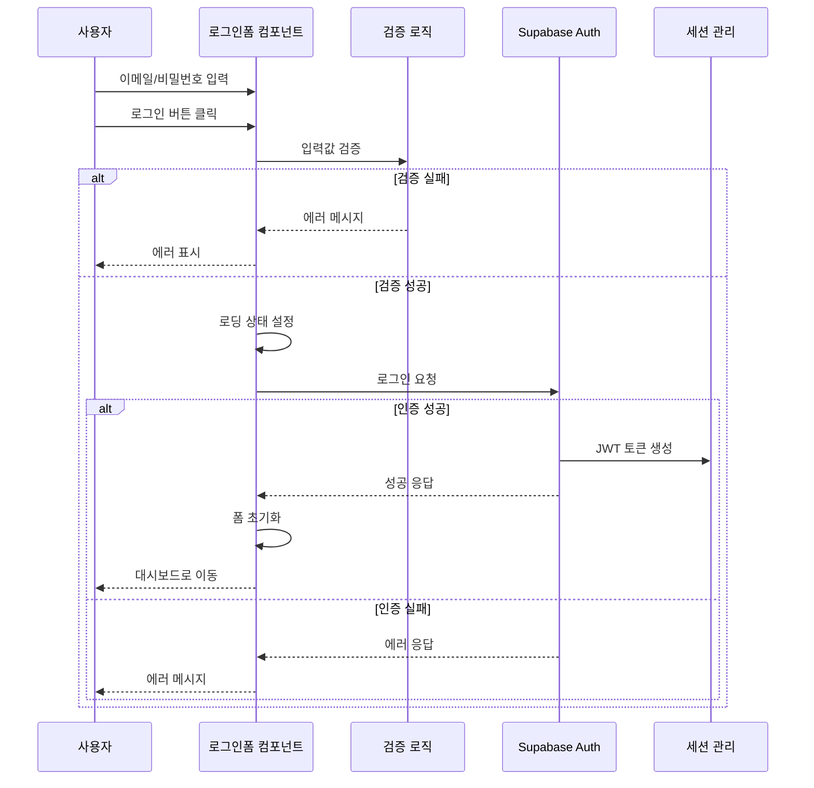

# 인증 기능 가이드

사용자 로그인, 로그아웃, 회원가입 기능을 담당합니다.

## 🎯 주요 기능

### 구현 예정 기능
- 이메일/비밀번호 로그인
- 관리자 회원가입 (초기 설정)
- 자동 로그인 유지
- 로그아웃
- 인증 가드 (관리자 전용 페이지 보호)

## 📁 컴포넌트 구조

```
src/features/인증/
├── components/
│   ├── 로그인폼.tsx         # 로그인 폼 컴포넌트
│   ├── 회원가입폼.tsx       # 회원가입 폼 (관리자용)
│   └── 사용자메뉴.tsx       # 헤더의 사용자 드롭다운
├── hooks/
│   ├── use로그인폼.ts       # 로그인 폼 로직
│   └── use회원가입폼.ts     # 회원가입 폼 로직
├── utils/
│   └── 인증가드.tsx         # 라우트 보호 컴포넌트
└── context/
    └── 인증컨텍스트.tsx     # 인증 상태 전역 관리
```

## 🔧 사용 예시

### 로그인 폼
```typescript
// components/로그인폼.tsx
import { use로그인폼 } from '../hooks/use로그인폼';

export function 로그인폼() {
  const {
    폼데이터,
    에러상태,
    로딩중,
    필드업데이트,
    제출하기,
  } = use로그인폼();

  return (
    <form onSubmit={제출하기}>
      <input
        type="email"
        placeholder="이메일"
        value={폼데이터.이메일}
        onChange={(e) => 필드업데이트('이메일', e.target.value)}
      />
      {에러상태.이메일 && <div className="error">{에러상태.이메일}</div>}

      <input
        type="password"
        placeholder="비밀번호"
        value={폼데이터.비밀번호}
        onChange={(e) => 필드업데이트('비밀번호', e.target.value)}
      />
      {에러상태.비밀번호 && <div className="error">{에러상태.비밀번호}</div>}

      <button type="submit" disabled={로딩중}>
        {로딩중 ? '로그인 중...' : '로그인'}
      </button>
    </form>
  );
}
```

### 인증 가드
```typescript
// utils/인증가드.tsx
import { use인증 } from '../context/인증컨텍스트';

interface 인증가드Props {
  children: React.ReactNode;
  관리자전용?: boolean;
  대체UI?: React.ReactNode;
}

export function 인증가드({ children, 관리자전용 = false, 대체UI }: 인증가드Props) {
  const { 현재사용자, 로그인중, 관리자여부 } = use인증();

  if (로그인중) {
    return <div>인증 확인 중...</div>;
  }

  if (!현재사용자) {
    return 대체UI || <div>로그인이 필요합니다</div>;
  }

  if (관리자전용 && !관리자여부) {
    return 대체UI || <div>관리자 권한이 필요합니다</div>;
  }

  return <>{children}</>;
}
```

## 📋 개발 우선순위

1. **필수 기능**
   - [ ] 로그인 폼 구현
   - [ ] 인증 상태 관리
   - [ ] 인증 가드 구현
   - [ ] 로그아웃 기능

2. **부가 기능**
   - [ ] 회원가입 폼 (관리자용)
   - [ ] 로그인 상태 유지
   - [ ] 비밀번호 찾기

## 🔐 보안 고려사항

### 1. 입력 검증 및 보안
```typescript
// 클라이언트 사이드 검증
const handleFormSubmit = async (e: React.FormEvent) => {
  e.preventDefault();

  // 필수 필드 검증
  if (!formData.name.trim() || !formData.email.trim()) {
    setErrorMessage('모든 필수 항목을 입력해주세요.');
    return;
  }

  // 이메일 형식 검증 (HTML5 input type="email" + 추가 검증)
  const emailRegex = /^[^\s@]+@[^\s@]+\.[^\s@]+$/;
  if (!emailRegex.test(formData.email)) {
    setErrorMessage('올바른 이메일 형식을 입력해주세요.');
    return;
  }
};
```

### 2. 개인정보 보호
```typescript
interface LoginFormData {
  email: string;
  password: string;
  rememberMe: boolean;
}

// 폼 제출 후 즉시 민감 정보 초기화
setSendingStatus('success');
setFormData({
  email: '',
  password: '', // 비밀번호 즉시 초기화
  rememberMe: false,
});
```

### 3. API 보안
- Supabase Auth 사용으로 보안 위임
- JWT 토큰 자동 관리
- RLS (Row Level Security) 정책 활용
- XSS/CSRF 방지 기본 제공
- 서버사이드 추가 검증 (Supabase Edge Functions)

### 4. 에러 처리 아키텍처
```typescript
// 계층화된 에러 처리
try {
  const { error } = await supabase.auth.signInWithPassword({
    email: formData.email,
    password: formData.password,
  });
  if (error) throw error;
} catch (error) {
  // 사용자 피드백 레벨
  if (error instanceof Error) {
    setErrorMessage(error.message.includes('network') ?
      '네트워크 연결을 확인해주세요.' :
      '로그인에 실패했습니다.');
  }
}
```

## 🔄 데이터 플로우

### 로그인 프로세스


## ⚠️ 잠재적 실패 지점 및 대응

### 1. 네트워크 관련 실패
**실패 시나리오:**
- 인터넷 연결 끊김
- Supabase 서비스 다운
- API 응답 지연

**대응 방안:**
```typescript
try {
  const { error } = await supabase.auth.signInWithPassword({
    email: formData.email,
    password: formData.password,
  });
} catch (error) {
  if (error instanceof Error) {
    // 네트워크 에러 감지
    setErrorMessage(error.message.includes('network') ?
      '네트워크 연결을 확인해주세요.' :
      '로그인 서비스에 일시적인 문제가 발생했습니다.');
  }
}
```

### 2. 상태 관리 실패
**실패 시나리오:**
- 비동기 상태 업데이트 충돌
- 컴포넌트 언마운트 후 상태 업데이트
- 메모리 누수

**대응 방안:**
```typescript
useEffect(() => {
  let isMounted = true;

  const handleAuth = async () => {
    try {
      const result = await authOperation();
      if (isMounted) {
        setAuthStatus('success');
      }
    } catch (error) {
      if (isMounted) {
        setAuthStatus('error');
      }
    }
  };

  return () => {
    isMounted = false;
  };
}, []);
```

### 3. 사용자 입력 관련 실패
**실패 시나리오:**
- 특수 문자나 스크립트 입력
- 과도하게 긴 텍스트
- 잘못된 이메일 형식

**대응 방안:**
```typescript
// 입력값 사전 검증 및 정제
const sanitizeInput = (input: string) => {
  return input
    .trim()
    .slice(0, 100) // 최대 길이 제한
    .replace(/<script\b[^<]*(?:(?!<\/script>)<[^<]*)*<\/script>/gi, ''); // 스크립트 제거
};
```

상세한 구현은 `/docs/data-flow.md`의 인증 시스템 섹션을 참조하세요.