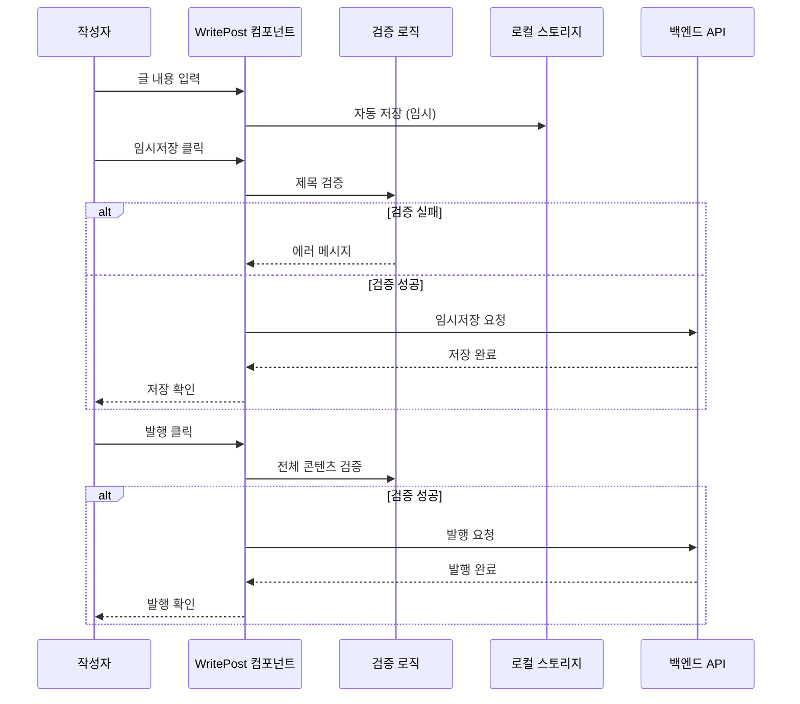

# 글작성 기능 가이드

블로그 글 작성, 편집, 미리보기 기능을 담당합니다.

## 🎯 주요 기능

### 구현 예정 기능
- 마크다운 에디터
- 실시간 미리보기
- 자동 저장 (임시저장)
- 태그 입력 및 자동완성
- 이미지 업로드
- 발행/비공개 상태 관리
- SEO 메타데이터 입력

## 📁 컴포넌트 구조

```
src/features/글작성/
├── components/
│   ├── 글작성폼.tsx         # 메인 작성 폼
│   ├── 마크다운에디터.tsx   # 마크다운 입력 에디터
│   ├── 미리보기.tsx         # 실시간 미리보기
│   ├── 태그입력.tsx         # 태그 입력 컴포넌트
│   └── 이미지업로드.tsx     # 이미지 업로드
├── hooks/
│   ├── use글작성.ts         # 글 작성 로직
│   ├── use자동저장.ts       # 자동 저장 기능
│   └── use태그자동완성.ts   # 태그 자동완성
└── utils/
    ├── 마크다운변환.ts      # 마크다운 처리
    └── 이미지처리.ts        # 이미지 최적화
```

## 🔧 사용 예시

### 글작성 폼
```typescript
// components/글작성폼.tsx
import { use글작성 } from '../hooks/use글작성';
import { 마크다운에디터 } from './마크다운에디터';
import { 미리보기 } from './미리보기';
import { 태그입력 } from './태그입력';

interface 글작성폼Props {
  초기글?: 블로그글;
  편집모드?: boolean;
}

export function 글작성폼({ 초기글, 편집모드 = false }: 글작성폼Props) {
  const {
    폼데이터,
    에러상태,
    로딩중,
    필드업데이트,
    임시저장하기,
    발행하기,
  } = use글작성({ 초기글 });

  return (
    <div className="글작성-폼">
      <div className="폼-헤더">
        <input
          type="text"
          placeholder="글 제목을 입력하세요"
          value={폼데이터.제목}
          onChange={(e) => 필드업데이트('제목', e.target.value)}
          className="제목-입력"
        />
        {에러상태.제목 && <div className="error">{에러상태.제목}</div>}
      </div>

      <div className="에디터-영역">
        <div className="에디터-패널">
          <마크다운에디터
            내용={폼데이터.내용}
            변경시={(내용) => 필드업데이트('내용', 내용)}
          />
        </div>

        <div className="미리보기-패널">
          <미리보기 마크다운내용={폼데이터.내용} />
        </div>
      </div>

      <div className="메타데이터-영역">
        <태그입력
          선택된태그={폼데이터.태그목록}
          변경시={(태그목록) => 필드업데이트('태그목록', 태그목록)}
        />

        <input
          type="text"
          placeholder="URL 슬러그 (선택사항)"
          value={폼데이터.슬러그 || ''}
          onChange={(e) => 필드업데이트('슬러그', e.target.value)}
        />
      </div>

      <div className="액션-버튼들">
        <button
          type="button"
          onClick={임시저장하기}
          disabled={로딩중}
        >
          임시저장
        </button>

        <button
          type="button"
          onClick={발행하기}
          disabled={로딩중}
          className="primary"
        >
          {편집모드 ? '수정 완료' : '발행하기'}
        </button>
      </div>
    </div>
  );
}
```

### 마크다운 에디터
```typescript
// components/마크다운에디터.tsx
import { useCallback } from 'react';

interface 마크다운에디터Props {
  내용: string;
  변경시: (내용: string) => void;
  placeholder?: string;
}

export function 마크다운에디터({ 내용, 변경시, placeholder }: 마크다운에디터Props) {
  const 내용변경처리 = useCallback((e: React.ChangeEvent<HTMLTextAreaElement>) => {
    변경시(e.target.value);
  }, [변경시]);

  const 툴바버튼클릭 = (마크다운문법: string) => {
    // 선택된 텍스트에 마크다운 문법 적용
    // 구현 예정
  };

  return (
    <div className="마크다운-에디터">
      <div className="에디터-툴바">
        <button onClick={() => 툴바버튼클릭('**')}>굵게</button>
        <button onClick={() => 툴바버튼클릭('*')}>기울임</button>
        <button onClick={() => 툴바버튼클릭('`')}>코드</button>
        <button onClick={() => 툴바버튼클릭('## ')}>제목</button>
        <button onClick={() => 툴바버튼클릭('- ')}>목록</button>
        <button onClick={() => 툴바버튼클릭('[]()')}>링크</button>
      </div>

      <textarea
        value={내용}
        onChange={내용변경처리}
        placeholder={placeholder || '마크다운으로 글을 작성하세요...'}
        className="에디터-텍스트영역"
        spellCheck={false}
      />
    </div>
  );
}
```

### 자동 저장 훅
```typescript
// hooks/use자동저장.ts
import { useEffect, useRef } from 'react';
import { useDebounce } from '@/shared/hooks/useDebounce';

interface use자동저장옵션 {
  데이터: any;
  저장함수: (데이터: any) => Promise<void>;
  지연시간?: number;
  활성화?: boolean;
}

export function use자동저장({
  데이터,
  저장함수,
  지연시간 = 3000,
  활성화 = true,
}: use자동저장옵션) {
  const 디바운스된데이터 = useDebounce(데이터, 지연시간);
  const 초기저장완료 = useRef(false);

  useEffect(() => {
    if (!활성화) return;

    // 첫 번째 실행 스킵 (초기 데이터)
    if (!초기저장완료.current) {
      초기저장완료.current = true;
      return;
    }

    // 데이터가 비어있으면 저장하지 않음
    if (!디바운스된데이터.제목 && !디바운스된데이터.내용) {
      return;
    }

    저장함수({
      ...디바운스된데이터,
      발행상태: '임시저장',
    }).catch(console.error);
  }, [디바운스된데이터, 저장함수, 활성화]);
}
```

## 📋 개발 우선순위

1. **핵심 기능**
   - [ ] 기본 마크다운 에디터
   - [ ] 실시간 미리보기
   - [ ] 글 저장/발행 기능
   - [ ] 제목/내용 유효성 검증

2. **고급 기능**
   - [ ] 자동 저장
   - [ ] 태그 시스템
   - [ ] 이미지 업로드
   - [ ] 에디터 툴바
   - [ ] 키보드 단축키

3. **부가 기능**
   - [ ] 드래그 앤 드롭 업로드
   - [ ] 글 템플릿
   - [ ] 버전 히스토리
   - [ ] 협업 편집

## 🎨 UX 고려사항

- **분할 뷰**: 에디터와 미리보기 나란히 배치
- **키보드 친화적**: Tab, Ctrl+S 등 단축키 지원
- **자동 저장**: 사용자가 신경쓰지 않도록 백그라운드 저장
- **즉시 피드백**: 문법 오류나 유효성 검증 실시간 표시
- **반응형**: 모바일에서도 편리한 편집 경험

## 🔄 데이터 플로우

### 글 작성 프로세스


## ⚠️ 잠재적 실패 지점 및 대응

### 1. 자동 저장 실패
**실패 시나리오:**
- 네트워크 연결 불안정
- 서버 용량 부족
- 동시 편집 충돌

**대응 방안:**
```typescript
// 로컬 스토리지 백업
const useAutoSave = (content: string) => {
  useEffect(() => {
    // 로컬 스토리지에 백업
    localStorage.setItem('draft-content', content);

    // 서버 저장 시도
    const saveToServer = async () => {
      try {
        await saveDraft(content);
        // 성공 시 로컬 백업 제거
        localStorage.removeItem('draft-content');
      } catch (error) {
        console.warn('자동 저장 실패, 로컬 백업 유지:', error);
      }
    };

    const timeoutId = setTimeout(saveToServer, 3000);
    return () => clearTimeout(timeoutId);
  }, [content]);
};
```

### 2. 이미지 업로드 실패
**실패 시나리오:**
- 파일 크기 초과
- 지원하지 않는 형식
- 업로드 서버 오류

**대응 방안:**
```typescript
const handleImageUpload = async (file: File) => {
  // 파일 크기 검증
  if (file.size > 5 * 1024 * 1024) { // 5MB
    throw new Error('이미지 크기는 5MB를 초과할 수 없습니다.');
  }

  // 파일 형식 검증
  const allowedTypes = ['image/jpeg', 'image/png', 'image/gif', 'image/webp'];
  if (!allowedTypes.includes(file.type)) {
    throw new Error('지원하지 않는 이미지 형식입니다.');
  }

  // 압축 후 업로드
  const compressedFile = await compressImage(file);
  return uploadToSupabase(compressedFile);
};
```

### 3. 마크다운 렌더링 오류
**실패 시나리오:**
- 잘못된 마크다운 문법
- XSS 공격 시도
- 과도한 중첩 구조

**대응 방안:**
```typescript
import DOMPurify from 'dompurify';
import { marked } from 'marked';

const safeMarkdownRender = (markdown: string): string => {
  try {
    // 마크다운을 HTML로 변환
    const rawHtml = marked(markdown);

    // XSS 방지를 위한 sanitize
    const cleanHtml = DOMPurify.sanitize(rawHtml, {
      ALLOWED_TAGS: [
        'h1', 'h2', 'h3', 'h4', 'h5', 'h6',
        'p', 'br', 'strong', 'em', 'u', 's',
        'ul', 'ol', 'li',
        'blockquote', 'pre', 'code',
        'a', 'img',
        'table', 'thead', 'tbody', 'tr', 'th', 'td',
      ],
      ALLOWED_ATTR: ['href', 'src', 'alt', 'class', 'id'],
    });

    return cleanHtml;
  } catch (error) {
    console.error('마크다운 렌더링 오류:', error);
    return '<p>마크다운 렌더링 중 오류가 발생했습니다.</p>';
  }
};
```

## 📊 성능 최적화

### 1. 에디터 최적화
```typescript
// 대용량 텍스트 처리를 위한 가상화
import { FixedSizeList as List } from 'react-window';

const VirtualizedEditor = ({ content, onChange }: EditorProps) => {
  const lines = content.split('\n');

  const renderLine = ({ index, style }: any) => (
    <div style={style}>
      <input
        value={lines[index]}
        onChange={(e) => {
          const newLines = [...lines];
          newLines[index] = e.target.value;
          onChange(newLines.join('\n'));
        }}
      />
    </div>
  );

  return (
    <List
      height={600}
      itemCount={lines.length}
      itemSize={25}
      itemData={lines}
    >
      {renderLine}
    </List>
  );
};
```

### 2. 미리보기 최적화
```typescript
// 디바운스된 미리보기 렌더링
import { useMemo } from 'react';
import { useDebounce } from '@/shared/hooks/useDebounce';

const OptimizedPreview = ({ content }: { content: string }) => {
  const debouncedContent = useDebounce(content, 300);

  const renderedHtml = useMemo(() => {
    return safeMarkdownRender(debouncedContent);
  }, [debouncedContent]);

  return (
    <div
      className="markdown-preview"
      dangerouslySetInnerHTML={{ __html: renderedHtml }}
    />
  );
};
```

상세한 마크다운 처리와 에디터 구현은 `/features/마크다운뷰어/CLAUDE.md`를 참조하세요.