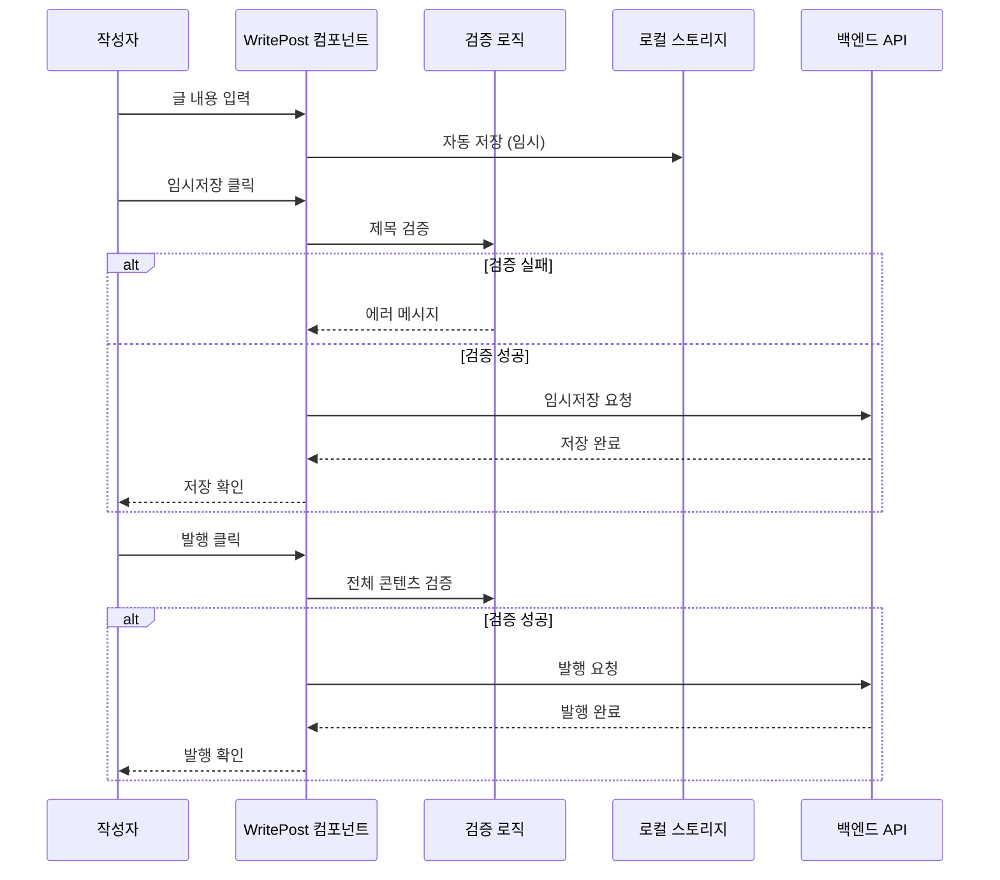

# Post Editor Feature Guide

블로그 글 작성, 편집, 미리보기 기능을 담당합니다.

## 🎯 주요 기능

### ✅ 구현 완료된 기능
- **마크다운 에디터**: 실시간 마크다운 편집 지원
- **실시간 미리보기**: 모든 마크다운 요소 정상 렌더링
  - 제목 (H1~H6) - 적절한 크기와 폰트 두께
  - 목록 (순서 있는/없는, 중첩 목록 포함)
  - 인용구 - 파란색 테두리와 배경색
  - 코드 블록 - 문법 하이라이팅 (highlight.js)
  - 텍스트 스타일링 (굵게, 기울임)
  - 링크 - 새 탭에서 열기
- **이미지 업로드**: 드래그 앤 드롭 및 버튼 클릭 지원
  - 커서 위치에 정확한 삽입
  - 다중 이미지 업로드
  - 첫 번째 이미지 자동 썸네일 설정
- **태그 입력**: 쉼표로 구분된 태그 시스템
- **글 저장**: 임시저장 및 발행 기능
- **SEO 메타데이터**: 제목, 요약, 썸네일 이미지 지원

### 🚧 구현 예정 기능
- 자동 저장 (백그라운드)
- 태그 자동완성
- 이미지 최적화 및 압축
- 글 템플릿
- 키보드 단축키

## 📁 컴포넌트 구조

```
src/features/post/editor/
├── components/
│   ├── PostForm.tsx         # 메인 작성 폼
│   ├── MarkdownEditor.tsx   # 마크다운 입력 에디터
│   ├── Preview.tsx          # 실시간 미리보기
│   ├── TagInput.tsx         # 태그 입력 컴포넌트
│   └── ImageUpload.tsx      # 이미지 업로드
├── hooks/
│   ├── usePostEditor.ts     # 글 작성 로직
│   ├── useAutoSave.ts       # 자동 저장 기능
│   └── useTagAutocomplete.ts # 태그 자동완성
└── utils/
    ├── markdownTransform.ts # 마크다운 처리
    └── imageProcessing.ts   # 이미지 최적화
```

## 🔧 사용 예시

### 글작성 폼
```typescript
// components/PostForm.tsx
import { usePostEditor } from '../hooks/usePostEditor';
import { MarkdownEditor } from './MarkdownEditor';
import { Preview } from './Preview';
import { TagInput } from './TagInput';

interface PostFormProps {
  initialPost?: Post;
  editMode?: boolean;
}

export function PostForm({ initialPost, editMode = false }: PostFormProps) {
  const {
    formData,
    errors,
    loading,
    updateField,
    saveDraft,
    publish,
  } = usePostEditor({ initialPost });

  return (
    <div className="post-form">
      <div className="form-header">
        <input
          type="text"
          placeholder="글 제목을 입력하세요"
          value={formData.title}
          onChange={(e) => updateField('title', e.target.value)}
          className="title-input"
        />
        {errors.title && <div className="error">{errors.title}</div>}
      </div>

      <div className="editor-area">
        <div className="editor-panel">
          <MarkdownEditor
            content={formData.content}
            onChange={(content) => updateField('content', content)}
          />
        </div>

        <div className="preview-panel">
          <Preview markdownContent={formData.content} />
        </div>
      </div>

      <div className="metadata-area">
        <TagInput
          selectedTags={formData.tagList}
          onChange={(tagList) => updateField('tagList', tagList)}
        />

        <input
          type="text"
          placeholder="URL 슬러그 (선택사항)"
          value={formData.slug || ''}
          onChange={(e) => updateField('slug', e.target.value)}
        />
      </div>

      <div className="action-buttons">
        <button
          type="button"
          onClick={saveDraft}
          disabled={loading}
        >
          임시저장
        </button>

        <button
          type="button"
          onClick={publish}
          disabled={loading}
          className="primary"
        >
          {editMode ? '수정 완료' : '발행하기'}
        </button>
      </div>
    </div>
  );
}
```

### 마크다운 에디터
```typescript
// components/MarkdownEditor.tsx
import { useCallback } from 'react';

interface MarkdownEditorProps {
  content: string;
  onChange: (content: string) => void;
  placeholder?: string;
}

export function MarkdownEditor({ content, onChange, placeholder }: MarkdownEditorProps) {
  const handleContentChange = useCallback((e: React.ChangeEvent<HTMLTextAreaElement>) => {
    onChange(e.target.value);
  }, [onChange]);

  const handleToolbarClick = (markdownSyntax: string) => {
    // 선택된 텍스트에 마크다운 문법 적용
    // 구현 예정
  };

  return (
    <div className="markdown-editor">
      <div className="editor-toolbar">
        <button onClick={() => handleToolbarClick('**')}>굵게</button>
        <button onClick={() => handleToolbarClick('*')}>기울임</button>
        <button onClick={() => handleToolbarClick('`')}>코드</button>
        <button onClick={() => handleToolbarClick('## ')}>제목</button>
        <button onClick={() => handleToolbarClick('- ')}>목록</button>
        <button onClick={() => handleToolbarClick('[]()')}>링크</button>
      </div>

      <textarea
        value={content}
        onChange={handleContentChange}
        placeholder={placeholder || '마크다운으로 글을 작성하세요...'}
        className="editor-textarea"
        spellCheck={false}
      />
    </div>
  );
}
```

### 자동 저장 훅
```typescript
// hooks/useAutoSave.ts
import { useEffect, useRef } from 'react';
import { useDebounce } from '@/shared/hooks/useDebounce';

interface UseAutoSaveOptions {
  data: any;
  saveFunction: (data: any) => Promise<void>;
  delay?: number;
  enabled?: boolean;
}

export function useAutoSave({
  data,
  saveFunction,
  delay = 3000,
  enabled = true,
}: UseAutoSaveOptions) {
  const debouncedData = useDebounce(data, delay);
  const initialSaveCompleted = useRef(false);

  useEffect(() => {
    if (!enabled) return;

    // 첫 번째 실행 스킵 (초기 데이터)
    if (!initialSaveCompleted.current) {
      initialSaveCompleted.current = true;
      return;
    }

    // 데이터가 비어있으면 저장하지 않음
    if (!debouncedData.title && !debouncedData.content) {
      return;
    }

    saveFunction({
      ...debouncedData,
      status: 'draft',
    }).catch(console.error);
  }, [debouncedData, saveFunction, enabled]);
}
```

## 📋 개발 우선순위

1. **핵심 기능**
   - [ ] 기본 마크다운 에디터
   - [ ] 실시간 미리보기
   - [ ] 글 저장/발행 기능
   - [ ] 제목/내용 유효성 검증

2. **고급 기능**
   - [ ] 자동 저장
   - [ ] 태그 시스템
   - [ ] 이미지 업로드
   - [ ] 에디터 툴바
   - [ ] 키보드 단축키

3. **부가 기능**
   - [ ] 드래그 앤 드롭 업로드
   - [ ] 글 템플릿
   - [ ] 버전 히스토리
   - [ ] 협업 편집

## 🎨 UX 고려사항

- **분할 뷰**: 에디터와 미리보기 나란히 배치
- **키보드 친화적**: Tab, Ctrl+S 등 단축키 지원
- **자동 저장**: 사용자가 신경쓰지 않도록 백그라운드 저장
- **즉시 피드백**: 문법 오류나 유효성 검증 실시간 표시
- **반응형**: 모바일에서도 편리한 편집 경험

## 🔄 데이터 플로우

### 글 작성 프로세스


## ⚠️ 잠재적 실패 지점 및 대응

### 1. 자동 저장 실패
**실패 시나리오:**
- 네트워크 연결 불안정
- 서버 용량 부족
- 동시 편집 충돌

**대응 방안:**
```typescript
// 로컬 스토리지 백업
const useAutoSave = (content: string) => {
  useEffect(() => {
    // 로컬 스토리지에 백업
    localStorage.setItem('draft-content', content);

    // 서버 저장 시도
    const saveToServer = async () => {
      try {
        await saveDraft(content);
        // 성공 시 로컬 백업 제거
        localStorage.removeItem('draft-content');
      } catch (error) {
        console.warn('자동 저장 실패, 로컬 백업 유지:', error);
      }
    };

    const timeoutId = setTimeout(saveToServer, 3000);
    return () => clearTimeout(timeoutId);
  }, [content]);
};
```

### 2. 이미지 업로드 실패
**실패 시나리오:**
- 파일 크기 초과
- 지원하지 않는 형식
- 업로드 서버 오류

**대응 방안:**
```typescript
const handleImageUpload = async (file: File) => {
  // 파일 크기 검증
  if (file.size > 5 * 1024 * 1024) { // 5MB
    throw new Error('이미지 크기는 5MB를 초과할 수 없습니다.');
  }

  // 파일 형식 검증
  const allowedTypes = ['image/jpeg', 'image/png', 'image/gif', 'image/webp'];
  if (!allowedTypes.includes(file.type)) {
    throw new Error('지원하지 않는 이미지 형식입니다.');
  }

  // 압축 후 업로드
  const compressedFile = await compressImage(file);
  return uploadToSupabase(compressedFile);
};
```

### 3. 마크다운 렌더링 오류
**실패 시나리오:**
- 잘못된 마크다운 문법
- XSS 공격 시도
- 과도한 중첩 구조

**대응 방안:**
```typescript
import DOMPurify from 'dompurify';
import { marked } from 'marked';

const safeMarkdownRender = (markdown: string): string => {
  try {
    // 마크다운을 HTML로 변환
    const rawHtml = marked(markdown);

    // XSS 방지를 위한 sanitize
    const cleanHtml = DOMPurify.sanitize(rawHtml, {
      ALLOWED_TAGS: [
        'h1', 'h2', 'h3', 'h4', 'h5', 'h6',
        'p', 'br', 'strong', 'em', 'u', 's',
        'ul', 'ol', 'li',
        'blockquote', 'pre', 'code',
        'a', 'img',
        'table', 'thead', 'tbody', 'tr', 'th', 'td',
      ],
      ALLOWED_ATTR: ['href', 'src', 'alt', 'class', 'id'],
    });

    return cleanHtml;
  } catch (error) {
    console.error('마크다운 렌더링 오류:', error);
    return '<p>마크다운 렌더링 중 오류가 발생했습니다.</p>';
  }
};
```

## 📊 성능 최적화

### 1. 에디터 최적화
```typescript
// 대용량 텍스트 처리를 위한 가상화
import { FixedSizeList as List } from 'react-window';

const VirtualizedEditor = ({ content, onChange }: EditorProps) => {
  const lines = content.split('\n');

  const renderLine = ({ index, style }: any) => (
    <div style={style}>
      <input
        value={lines[index]}
        onChange={(e) => {
          const newLines = [...lines];
          newLines[index] = e.target.value;
          onChange(newLines.join('\n'));
        }}
      />
    </div>
  );

  return (
    <List
      height={600}
      itemCount={lines.length}
      itemSize={25}
      itemData={lines}
    >
      {renderLine}
    </List>
  );
};
```

### 2. 미리보기 최적화
```typescript
// 디바운스된 미리보기 렌더링
import { useMemo } from 'react';
import { useDebounce } from '@/shared/hooks/useDebounce';

const OptimizedPreview = ({ content }: { content: string }) => {
  const debouncedContent = useDebounce(content, 300);

  const renderedHtml = useMemo(() => {
    return safeMarkdownRender(debouncedContent);
  }, [debouncedContent]);

  return (
    <div
      className="markdown-preview"
      dangerouslySetInnerHTML={{ __html: renderedHtml }}
    />
  );
};
```

상세한 마크다운 처리와 에디터 구현은 `/features/마크다운뷰어/CLAUDE.md`를 참조하세요.

## 🔧 최신 구현 세부사항 (2025-09-15)

### MarkdownEditor 컴포넌트 주요 개선사항

#### 1. 미리보기 렌더링 완전 재구현
```typescript
// ReactMarkdown components에서 직접 스타일링 적용
components={{
  h1: ({ children, ...props }) => (
    <h1 className="text-3xl font-bold text-gray-900 mt-8 mb-4 leading-tight" {...props}>
      {children}
    </h1>
  ),
  // ... H2~H6까지 모든 제목 레벨 구현
  ul: ({ children, ...props }) => (
    <ul className="list-disc list-outside ml-6 mb-4 space-y-1" {...props}>
      {children}
    </ul>
  ),
  blockquote: ({ children, ...props }) => (
    <blockquote className="border-l-4 border-blue-500 bg-blue-50 pl-4 py-2 my-4 italic text-gray-800" {...props}>
      {children}
    </blockquote>
  ),
}}
```

#### 2. 이미지 드래그 앤 드롭 고도화
```typescript
// 커서 위치 정확한 삽입 구현
const insertAtCursor = (text: string) => {
  const textarea = 에디터Ref.current;
  if (!textarea) return;

  const start = textarea.selectionStart;
  const end = textarea.selectionEnd;
  const currentValue = textarea.value;

  const newValue = currentValue.substring(0, start) + text + currentValue.substring(end);
  set내용(newValue);

  // 커서 위치를 삽입된 텍스트 뒤로 이동
  setTimeout(() => {
    textarea.focus();
    textarea.setSelectionRange(start + text.length, start + text.length);
  }, 0);
};
```

#### 3. 썸네일 자동 설정 로직
```typescript
// 첫 번째 이미지를 자동으로 썸네일로 설정
const processImage = (file: File): Promise<string> => {
  return new Promise((resolve) => {
    const imageUrl = URL.createObjectURL(file);

    // 첫 번째 이미지를 썸네일로 설정
    if (!썸네일URL) {
      set썸네일URL(imageUrl);
    }

    resolve(imageUrl);
  });
};
```

### 해결된 문제들

1. **제목이 렌더링되지 않던 문제**
   - Tailwind prose 클래스 대신 ReactMarkdown components에서 직접 스타일링
   - 모든 제목 레벨(H1~H6)에 적절한 크기와 여백 적용

2. **목록이 표시되지 않던 문제**
   - `list-disc`, `list-decimal` 클래스와 적절한 패딩 적용
   - 중첩 목록 들여쓰기 정상화

3. **인용구 스타일링 문제**
   - 파란색 왼쪽 테두리와 배경색 적용
   - 적절한 패딩과 이탤릭 스타일 추가

### 의존성 추가
- `highlight.js`: 코드 블록 문법 하이라이팅
- `@tailwindcss/typography`: Tailwind Typography 플러그인 (기존)

### 브라우저 테스트 결과
✅ 모든 마크다운 요소가 정상적으로 렌더링됨
✅ 이미지 드래그 앤 드롭이 커서 위치에 정확히 삽입됨
✅ 첫 번째 이미지가 썸네일로 자동 설정됨